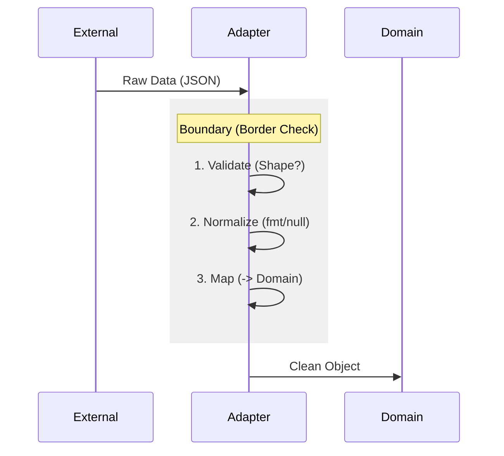

# 第38章：Adapter ③ まとめ：境界を守ると設計が汚れない🧼

## ねらい🎯

* Adapterを「境界のおそうじ係🧹」として使いこなせるようになる
* 外部APIの“クセ”（命名・型・単位・欠損）を、アプリ内部に持ち込まない🧊
* 「変換しながら業務判断しない🙅‍♀️」を守って、設計がスッキリする✨

---

## まず復習🍡（第36〜37章の要点）

* Adapterは「外の形」と「中の形」が合わないときに、**変換を1か所に集める**やつ🔌
* TypeScriptでは王道として、**マッピング関数＋型ガード**で十分戦える🧩

---

## “境界”ってどこ？🚧

だいたいここ👇

* 外部APIレスポンス（DTO）を受け取った瞬間📩
* DB行やCSV、Webhook、フォーム入力など「外から来た値」全部🧺


境界でやることはシンプルに3つだけ🧼✨

1. **検証（Validation）**：形が期待どおり？欠けてない？🤔
2. **正規化（Normalization）**：表記ゆれ・単位・nullを整える🧽
3. **変換（Mapping）**：内部のドメイン型へ変換する🏠

---

## ありがちな“汚れ方”あるある😵‍💫

* 外部の命名をそのまま内部へ（`created_at` が内部にも残る）🫠
* 金額が `"1,200"` みたいな文字列のまま、あちこちで `Number(...)` する💥
* `null` / `undefined` が内部に侵入して、後で謎の例外🧨
* 外部の enum 文字列が増えたのに気づかず、内部の `switch` が漏れる😇

---

## 境界の“掃除チェックリスト”🧹✅

Adapterに入れたい観点を、コピペで使える形にするね📌

### 1) 命名📝

* `snake_case` → `camelCase` に統一（境界でだけ変換）
* 外部の都合の略語（`amt`とか）を内部に持ち込まない

### 2) 型・欠損🧩

* `unknown` で受けて → 型ガードで判定 → DTO型へ
* 必須フィールドが欠けてたら **「正しく失敗」**させる🚫

### 3) 単位・表記ゆれ💴📏

* `"1,200"` / `"1200"` / `1200` を **同じ形**に揃える
* 金額はできれば **整数（最小単位）** で扱う（小数は事故りやすい🧊）

### 4) 列挙値（enumっぽい文字列）🧠

* 外部文字列 → 内部Unionへ **マップで変換**
* `satisfies` で「マップの漏れ」をコンパイル時に検出できる✨ ([TypeScript][1])

### 5) 変換しないこと🙅‍♀️

* Adapterで「割引計算」「在庫引当」みたいな業務判断をやらない
  👉 Adapterは **掃除**、業務は **別の層**へ🧼➡️🏠



---

## ハンズオン🛠️：外部の金額（文字列）→内部の数値へ正規化💴✨

### ゴール🎯

* 外部DTOのクセ（カンマ入り文字列、数値/文字列混在、欠損）を境界で吸収して
* 内部（ドメイン）では「きれいな型」だけを見る😌✨

---

## 最小コード例（クラス増やさず、関数＋型で）🧁

### 1) DTO（外部から来る形）📦

```ts
// 外部APIのレスポンスっぽいDTO
export type OrderDto = {
  id: string;
  total: string; // 例: "1,200" / "1200"
  currency: "JPY" | "USD";
  items?: Array<{
    sku: string;
    price: string;      // 例: "300"
    qty: number | string; // 例: 2 / "2"
  }>;
  created_at: string; // ISO文字列
};
```

### 2) ドメイン（内部の形）🏠

```ts
export type Money = {
  amount: number; // ここでは分かりやすく「整数」で統一（JPYならそのまま円）
  currency: "JPY" | "USD";
};

export type OrderItem = {
  sku: string;
  price: Money;
  qty: number;
};

export type Order = {
  id: string;
  total: Money;
  items: OrderItem[];
  createdAt: Date;
};
```

### 3) Result（失敗を“正しく返す”）🧯

```ts
export type Result<T, E> =
  | { ok: true; value: T }
  | { ok: false; error: E };

export type AdapterError =
  | { kind: "MissingField"; field: string }
  | { kind: "InvalidNumber"; field: string; raw: unknown }
  | { kind: "InvalidDate"; field: string; raw: unknown };

const ok = <T>(value: T): Result<T, never> => ({ ok: true, value });
const err = <E>(error: E): Result<never, E> => ({ ok: false, error });
```

### 4) Adapter本体（検証→正規化→変換）🧼✨

```ts
import type { OrderDto, Order, Money, Result, AdapterError } from "./types";

export function toDomainOrder(dto: OrderDto): Result<Order, AdapterError> {
  // items は欠けやすいので、ここで安全なデフォルトへ🧽
  const itemsDto = dto.items ?? [];

  const totalAmount = parseIntLike("total", dto.total);
  if (!totalAmount.ok) return totalAmount;

  const createdAt = parseIsoDate("created_at", dto.created_at);
  if (!createdAt.ok) return createdAt;

  const items: Order["items"] = [];
  for (const [i, item] of itemsDto.entries()) {
    const priceAmount = parseIntLike(`items[${i}].price`, item.price);
    if (!priceAmount.ok) return priceAmount;

    const qty = parseIntLike(`items[${i}].qty`, item.qty);
    if (!qty.ok) return qty;

    items.push({
      sku: item.sku,
      price: { amount: priceAmount.value, currency: dto.currency },
      qty: qty.value,
    });
  }

  const total: Money = { amount: totalAmount.value, currency: dto.currency };

  return ok({
    id: dto.id,
    total,
    items,
    createdAt: createdAt.value,
  });
}

// "1,200" / "1200" / 1200 / "2" を全部「整数number」へ寄せる🧽
function parseIntLike(field: string, raw: unknown): Result<number, AdapterError> {
  if (raw === null || raw === undefined || raw === "") {
    return err({ kind: "MissingField", field });
  }

  if (typeof raw === "number") {
    if (!Number.isFinite(raw) || !Number.isInteger(raw)) {
      return err({ kind: "InvalidNumber", field, raw });
    }
    return ok(raw);
  }

  if (typeof raw === "string") {
    // カンマや空白を吸収（"1,200" -> "1200"）🧽
    const normalized = raw.replace(/[\s,]/g, "");
    if (!/^-?\d+$/.test(normalized)) {
      return err({ kind: "InvalidNumber", field, raw });
    }
    const n = Number(normalized);
    if (!Number.isSafeInteger(n)) {
      return err({ kind: "InvalidNumber", field, raw });
    }
    return ok(n);
  }

  return err({ kind: "InvalidNumber", field, raw });
}

function parseIsoDate(field: string, raw: unknown): Result<Date, AdapterError> {
  if (typeof raw !== "string" || raw.trim() === "") {
    return err({ kind: "MissingField", field });
  }
  const d = new Date(raw);
  if (Number.isNaN(d.getTime())) {
    return err({ kind: "InvalidDate", field, raw });
  }
  return ok(d);
}
```

---

## 追加の武器：`satisfies` で“変換マップの漏れ”を防ぐ🛡️✨

外部のステータス文字列を内部Unionに変換するとき、これがめちゃ便利👇
（「マップにキーが足りない」事故を防げるよ〜！） ([TypeScript][1])

```ts
type ExternalStatus = "NEW" | "PAID" | "CANCELED";
type DomainStatus = "draft" | "paid" | "canceled";

export const statusMap = {
  NEW: "draft",
  PAID: "paid",
  CANCELED: "canceled",
} as const satisfies Record<ExternalStatus, DomainStatus>;

// 使う側は「変換後の型」を安心して使える😊
export function toDomainStatus(s: ExternalStatus): DomainStatus {
  return statusMap[s];
}
```

---

## テスト（短くてOK）🧪✨

最近は TypeScript 学習でも **Vitest** がよく使われる流れが強いよ〜（導入が軽いのが人気）🧁 ([typescriptbook.jp][2])

```ts
import { describe, it, expect } from "vitest";
import { toDomainOrder } from "./orderAdapter";

describe("toDomainOrder", () => {
  it("金額のカンマを吸収して数値化できる💴", () => {
    const dto = {
      id: "o1",
      total: "1,200",
      currency: "JPY",
      items: [{ sku: "COFFEE", price: "300", qty: "2" }],
      created_at: "2026-02-01T10:00:00.000Z",
    };

    const r = toDomainOrder(dto);
    expect(r.ok).toBe(true);

    if (r.ok) {
      expect(r.value.total.amount).toBe(1200);
      expect(r.value.items[0].qty).toBe(2);
    }
  });

  it("変な数値は正しく失敗する🧯", () => {
    const dto = {
      id: "o2",
      total: "12oo", // o が混ざってる🙅‍♀️
      currency: "JPY",
      items: [],
      created_at: "2026-02-01T10:00:00.000Z",
    };

    const r = toDomainOrder(dto as any);
    expect(r.ok).toBe(false);
    if (!r.ok) expect(r.error.kind).toBe("InvalidNumber");
  });
});
```

---

## レビュー観点👀✨（“境界が守れてる？”チェック）

* Adapterの外にDTO型が漏れてない？（内部がDTOを知らない？）🕵️‍♀️
* 変換処理が散らばってない？（`toDomainOrder` に集まってる？）🧼
* 失敗のしかたが一貫してる？（曖昧に `undefined` 返してない？）🧯
* 金額・日付・enumの正規化が境界で終わってる？💴📅
* Adapterが業務判断（割引・在庫など）をしてない？🙅‍♀️

---

## AIプロンプト例🤖💬

```text
次のTypeScriptコードは「外部DTO→内部ドメイン」変換（Adapter）です。
1) 境界でやるべき検証/正規化/変換が漏れていないかチェックリストでレビューして
2) "変換しながら業務判断してしまっている箇所"があれば指摘して
3) satisfies演算子で安全性が上がるポイントがあれば提案して
```

---

## つまずき回避💡🌸

* `parseInt("1,200")` は **1** になって事故るよ😇（カンマで止まる）
* `Number("1,200")` は **NaN** で事故るよ😵（カンマを許さない）
* 日付は `new Date(...)` したあと **Invalid Date** チェック必須📅🧯
* Adapterが巨大化しそうなら「検証」「正規化」「変換」を小関数に分けよ🧁✨

[1]: https://www.typescriptlang.org/docs/handbook/release-notes/typescript-4-9.html?utm_source=chatgpt.com "Documentation - TypeScript 4.9"
[2]: https://typescriptbook.jp/releasenotes/2026-01-13?utm_source=chatgpt.com "2026-01-13 チュートリアル大幅刷新など"
