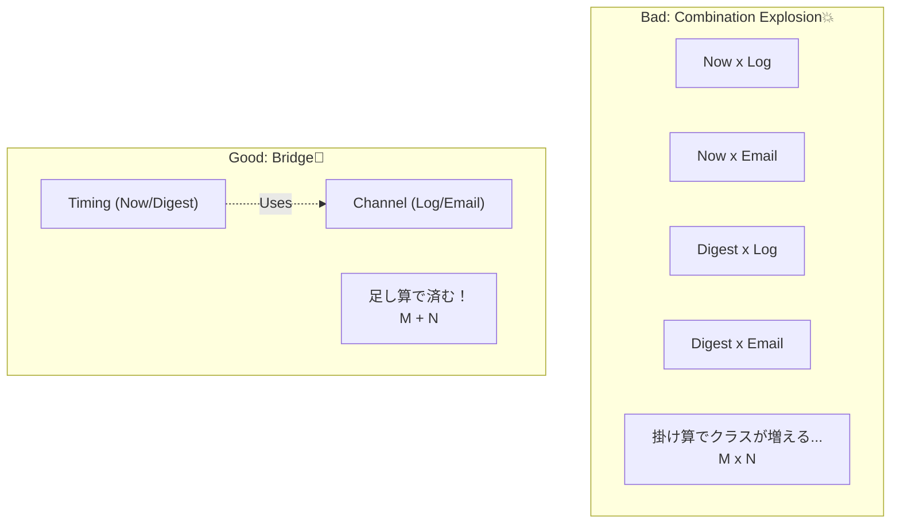

# 第39章：Bridge ① 2軸が増えて爆発する問題（機能×実装）💥

## ねらい🎯

* 「組合せ爆発💣」が起きてるコードを見て、「あ、Bridgeの出番かも👀」と気づけるようになる
* 「やりたいこと（機能）」と「どうやるか（実装）」が **別々に増えていく** ときの整理の仕方をつかむ🧠✨

---

## 今日のキーワード📌

* **2軸（2つの増え方）**：

  * 軸A：やりたいこと（例：通知のタイミング：即時/まとめて）
  * 軸B：どうやるか（例：通知手段：メール/アプリ内/ログ）
* **組合せ爆発**：A×Bでクラス/分岐が増え続けて、変更が地獄になる😵‍💫
* **Bridgeの発想**：AとBを「別パーツ」にして、**好きに組み合わせられる** ようにする🌉

---

## 困りごとストーリー☕📣（カフェ注文ミニアプリ風）

注文が確定したら通知したいよね💡
最初は「ログに出すだけ」だったのに…

* 通知手段が増える📮：ログ → アプリ内 → メール →（将来）SMS
* 通知タイミングも増える⏰：即時 → まとめて送る（1時間ごと） → 夜に一括

…って増えていくと、**組合せ（掛け算）** になるのがポイント💥
「即時メール」「即時アプリ内」「夜まとめメール」「夜まとめアプリ内」…って、どんどん増殖🧟‍♀️🧟‍♂️


---

## ありがちな“爆発”コード例😇➡️😇😇😇（分岐地獄）

最初はこういう感じで書いちゃう👇（気持ちはわかる！）

```ts
type Channel = "log" | "inApp" | "email";
type Timing = "immediate" | "digest";

type Order = { id: string; total: number };

export async function notify(order: Order, channel: Channel, timing: Timing) {
  if (timing === "immediate") {
    if (channel === "log") {
      console.log(`[ORDER] ${order.id} total=${order.total}`);
      return;
    }
    if (channel === "inApp") {
      // アプリ内通知APIを叩く（仮）
      await fakeInAppSend(`注文 ${order.id} が確定しました`);
      return;
    }
    if (channel === "email") {
      await fakeEmailSend(`注文 ${order.id} が確定しました`);
      return;
    }
  }

  if (timing === "digest") {
    if (channel === "log") {
      await enqueueDigest(`[ORDER] ${order.id} total=${order.total}`);
      return;
    }
    if (channel === "inApp") {
      await enqueueDigest(`注文 ${order.id} が確定しました（アプリ内）`);
      return;
    }
    if (channel === "email") {
      await enqueueDigest(`注文 ${order.id} が確定しました（メール）`);
      return;
    }
  }

  // 追加されるたびにここが伸びる…😇
}

async function fakeInAppSend(_msg: string) {}
async function fakeEmailSend(_msg: string) {}
async function enqueueDigest(_msg: string) {}
```

### このコード、何がつらいの？😵‍💫

* 新しい通知手段（例：SMS）を増やすたびに、**即時×まとめ** の両方を触ることになる💥
* 新しいタイミング（例：夜一括）を増やすたびに、**ログ×アプリ内×メール** を全部触ることになる💥
* つまり、変更が「1箇所」じゃなくて「掛け算」で増える🧨

---

## 「これ、Bridgeかも！」の見分け方👀✨

次の質問に **2つとも**「うん…」ってなったら、Bridge候補🌉

1. 変更の増え方が **2種類** ある？（しかも独立してる）🧩
2. それぞれが今後も増えそう？（片方だけじゃない）📈

例：

* 「通知タイミング」が増えそう（即時/まとめ/夜/週次…）
* 「通知手段」も増えそう（ログ/アプリ/メール/…）

この2つは別方向の増え方だから、混ぜると爆発💥



---

## Bridgeの発想🌉（超ざっくり）

**「やりたいこと（機能）」はA側に置く**
**「どうやるか（実装）」はB側に置く**
そして、AはBを **差し替え可能** にして使う💉✨

イメージ図（超重要）👇

* A：Notifier（通知の“方針”）… 即時/まとめて
* B：Sender（通知の“手段”）… ログ/アプリ内/メール

AはBを受け取って動く。だから **A×Bを自由に組める** 🎮✨

---

## ハンズオン🛠️：爆発コードを「2軸」に分ける練習🌸

### Step 1️⃣：まず「2軸」を言葉にする🗣️

上のコードから軸を抜き出してメモ📝

* 軸A：Timing（immediate / digest）
* 軸B：Channel（log / inApp / email）

これができたら勝ち🎉（Bridgeの入口に立った！）

### Step 2️⃣：「実装っぽい方」を先に外に出す（Bを分離）📦

通知手段（B）を **関数** にして外へ出す（TypeScript的に自然🍰）

```ts
type Sender = (message: string) => Promise<void>;

const sendToLog: Sender = async (message) => {
  console.log(message);
};

const sendToInApp: Sender = async (message) => {
  await fakeInAppSend(message);
};

const sendToEmail: Sender = async (message) => {
  await fakeEmailSend(message);
};

async function fakeInAppSend(_msg: string) {}
async function fakeEmailSend(_msg: string) {}
```

### Step 3️⃣：「やりたいこと側」を作る（Aを分離）🧠

通知タイミング（A）を「Senderを受け取る関数」にする💡
これで “橋（Bridge）” がかかる🌉✨

```ts
type Order = { id: string; total: number };

// A側：即時通知（Senderを受け取る）
const createImmediateNotifier = (send: Sender) => {
  return async (order: Order) => {
    await send(`注文 ${order.id} が確定しました ✅ 合計=${order.total}`);
  };
};

// A側：まとめ通知（Senderを受け取る）
const createDigestNotifier = (send: Sender) => {
  const queue: string[] = [];

  return {
    notify: async (order: Order) => {
      queue.push(`注文 ${order.id} ✅ 合計=${order.total}`);
    },
    flush: async () => {
      if (queue.length === 0) return;
      const batch = queue.splice(0, queue.length).join("\n");
      await send(`🧾 まとめ通知\n${batch}`);
    },
  };
};
```

### Step 4️⃣：組み合わせる🎮（ここが気持ちいい✨）

```ts
// 即時 × ログ
const notifyNowToLog = createImmediateNotifier(sendToLog);

// 即時 × メール
const notifyNowToEmail = createImmediateNotifier(sendToEmail);

// まとめ × アプリ内
const digestToInApp = createDigestNotifier(sendToInApp);

// 使う
await notifyNowToLog({ id: "A001", total: 1200 });
await notifyNowToEmail({ id: "A002", total: 900 });

await digestToInApp.notify({ id: "A003", total: 500 });
await digestToInApp.notify({ id: "A004", total: 1500 });
await digestToInApp.flush();
```

✅ ここがポイント：

* 「通知手段を増やす」＝Senderを1個追加するだけ📮
* 「通知タイミングを増やす」＝Notifierを1個追加するだけ⏰
* **掛け算じゃなくて足し算で増やせる** ➕✨

---

## Strategyと何が違うの？🤔（初心者が混ざりやすい所）

* **Strategy**：だいたい「1軸の差し替え」に強い（例：割引ルールだけ増える）
* **Bridge**：**2軸が独立して増える** ときに強い（例：通知タイミングも通知手段も増える）

もちろん実装の形は似てる（どっちも注入する）けど、
**悩みの根っこが“2軸かどうか”** が判断ポイントだよ🌸

---

## ミニ理解チェック✅🎀

次のうち「Bridgeっぽい」のはどれ？（正解は1つ）

A) 割引ルールが増える（学生割・会員割・期間限定…）
B) 通知の「タイミング」と「手段」が両方増える（即時/夜 + メール/アプリ内）
C) 例外処理をResultで統一したい

👉 正解：**B** 🎉（2軸の掛け算が発生してる！）

---

## AIプロンプト例🤖💬（“2軸発見”がうまくなるやつ）

```text
次のコードが「組合せ爆発」を起こしているか診断して。
1) 増えている軸を列挙（最大3つ）
2) 2軸ならBridge候補として、A側/B側の責務を提案
3) TypeScriptで、独自クラスを増やしすぎず（関数型優先）に最小リファクタ案を出して
コード: <ここに貼る>
```

---

## つまずき回避💡（Bridgeをやりすぎないために⚠️）

* ✅ **本当に2軸？**：片方しか増えないならBridgeは重いかも
* ✅ **“共通の橋”が薄いか？**：A側が巨大だと、ただの神関数👼になりがち
* ✅ **まずは関数で分離**：いきなり抽象クラスまみれにしない🍰
* ✅ **命名が命**：Sender/Notifierみたいに「役割が一言で言える名前」にする🧠✨

---

## 最新TSまわり小ネタ🆕（分離設計と相性がいい話）

* 近年のTypeScriptは、モジュール境界（import/export）をきれいに保つ流れが強く、Node.js側でもESMが標準のモジュール形式として扱われています。([nodejs.org][1])
* TypeScript 5.9 では `import defer`（モジュール評価を遅らせる提案）や `--module node20` など、実行環境のモジュール挙動を意識したオプションも増えています。([TypeScript][2])
* TypeScript 5.8 でも Node 実行を意識したオプション（例：`--module node18`、`--erasableSyntaxOnly`）が触れられていて、「実装差し替え」を安全に扱う設計と噛み合います。([TypeScript][3])

（Bridgeで実装側を差し替えると、モジュール分割もしやすくなるよ📦✨）

---

## この章のまとめ🎁✨

* 「2軸（機能×実装）が独立に増える」＝組合せ爆発のサイン💥
* Bridgeは、**A（やりたいこと）** と **B（どうやるか）** を分けて、**自由に組める** ようにする🌉
* TypeScriptでは「interface」や「関数型」で軽く書けるのが強み🍰💪

[1]: https://nodejs.org/api/esm.html "Modules: ECMAScript modules | Node.js v25.6.0 Documentation"
[2]: https://www.typescriptlang.org/docs/handbook/release-notes/typescript-5-9.html "TypeScript: Documentation - TypeScript 5.9"
[3]: https://www.typescriptlang.org/docs/handbook/release-notes/typescript-5-8.html "TypeScript: Documentation - TypeScript 5.8"
