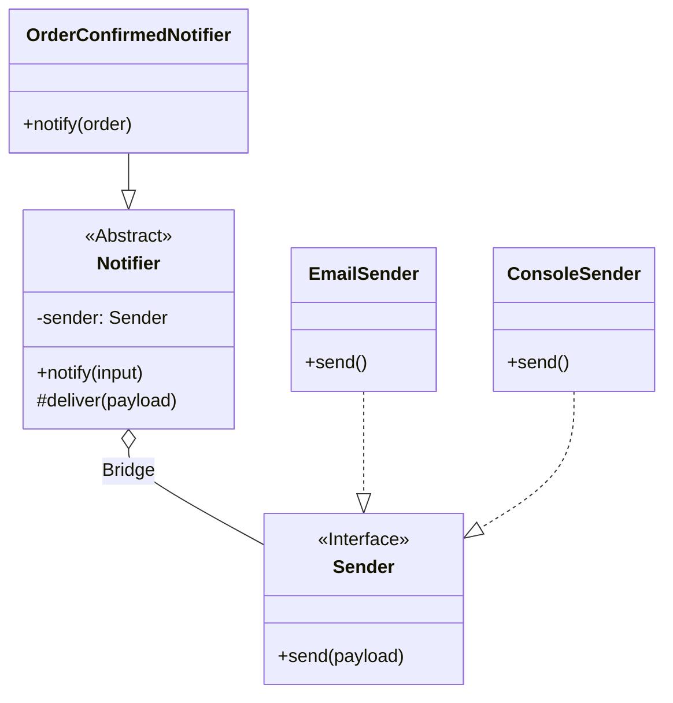

# 第40章：Bridge ② TypeScript定番：interface実装を注入（DIっぽく）💉

## ねらい🎯

* 「やりたいこと（抽象）」と「どうやって送るか（実装）」を分けて、**組合せ爆発💥**を止める
* **interface（または type）を“注入”**して、差し替えを自然にできるようになる
* **テストがラク🧪**（送信部分をスタブに差し替えられる）

---

## まず困りごと😵：2軸が増えるとクラス地獄


たとえば通知で…

* 軸A：何を通知？（注文確定 / キャンペーン / エラーなど）
* 軸B：どう送る？（メール / アプリ内 / SMS / Slackなど）

これを「継承だけ」でやると、**A×B の数だけクラス**が増えがち…😇
Bridge は、ここをスッキリ分けます✨

> Bridge は「抽象（abstraction）と実装（implementation）を分離して、両方を独立に変えられる」ようにする構造パターンです。([リファクタリング Guru][1])

---

## Bridgeの考え方🧠✨（図でイメージ）

* **抽象側（Abstraction）**：通知の“意味”を知ってる（例：注文確定を通知する）
* **実装側（Implementor）**：送信の“やり方”を知ってる（例：メールで送る）

つまり…

* 抽象は「通知したい内容」を作る📝
* 実装は「それをどう送るか」を担当📮
* 抽象は実装を **コンストラクタで受け取る（注入）** 💉





---

## 1) 最小の完成形🧁（interface注入でBridge）


ポイントはこれ👇

* `Sender`（実装側）を **interface** にする
* `Notifier`（抽象側）が **Senderを受け取って使う**

```ts
// sender.ts（実装側の“共通口”）
export type SendPayload = {
  to: string;
  subject: string;
  body: string;
};

export interface Sender {
  send(payload: SendPayload): Promise<void>;
}
```

```ts
// notifier.ts（抽象側）
import type { Sender, SendPayload } from "./sender.js";

export abstract class Notifier {
  constructor(protected readonly sender: Sender) {}

  // 抽象側は「何を通知するか」を決める
  abstract notify(input: unknown): Promise<void>;

  protected async deliver(payload: SendPayload) {
    await this.sender.send(payload);
  }
}
```

```ts
// order-notifier.ts（抽象側の具体例：注文確定通知）
import { Notifier } from "./notifier.js";

type Order = {
  id: string;
  customerEmail: string;
  totalYen: number;
};

export class OrderConfirmedNotifier extends Notifier {
  async notify(input: unknown): Promise<void> {
    const order = input as Order; // 学習用にシンプル化（実務は型ガード推奨）
    await this.deliver({
      to: order.customerEmail,
      subject: `ご注文ありがとうございます（注文ID: ${order.id}）`,
      body: `合計: ${order.totalYen}円です☕️ またのご利用お待ちしてます！`,
    });
  }
}
```

```ts
// senders.ts（実装側の具体例：2種類だけ用意）
import type { Sender, SendPayload } from "./sender.js";

export class ConsoleSender implements Sender {
  async send(payload: SendPayload): Promise<void> {
    console.log("📮 ConsoleSender send:", payload);
  }
}

export class FakeMailSender implements Sender {
  async send(payload: SendPayload): Promise<void> {
    // ここでは“メール送信したフリ”だけ（学習用）
    console.log("✉️ FakeMailSender send:", payload.to, payload.subject);
  }
}
```

```ts
// demo.ts（組み合わせ自由！）
import { OrderConfirmedNotifier } from "./order-notifier.js";
import { ConsoleSender, FakeMailSender } from "./senders.js";

const order = { id: "A-100", customerEmail: "alice@example.com", totalYen: 1280 };

// 同じ通知（抽象）を、送信手段（実装）だけ差し替え✨
await new OrderConfirmedNotifier(new ConsoleSender()).notify(order);
await new OrderConfirmedNotifier(new FakeMailSender()).notify(order);
```

✅ これで「通知の種類（抽象）」を増やしても、送信手段（実装）に引っ張られない
✅ 送信手段（実装）を増やしても、通知（抽象）側は変えずに済む
→ **組合せ爆発が止まる🎉**

---

## 2) TypeScriptらしさ🧡：クラスを増やさず“オブジェクト注入”でもOK


`Sender` は class じゃなくて **オブジェクト1個**でも実装できます（TSの構造的型付けが効く✨）

```ts
import type { Sender } from "./sender.js";
import { OrderConfirmedNotifier } from "./order-notifier.js";

// satisfies：型に合ってるかだけチェックして、推論は保つ✨
const spySender = {
  sent: [] as any[],
  async send(payload: any) {
    this.sent.push(payload);
  },
} satisfies Sender;
```

`satisfies` は「型に合うか検査しつつ、値の具体的な型情報は保つ」ための演算子です。([TypeScript][2])

---

## 3) テストがラクになる🧪（送信だけ差し替える）


ここでは **標準のテストランナー（`node:test`）** を使う例にします✨（追加ライブラリなし）
Nodeには組み込みのテストランナーがあります。([Node.js][3])

```ts
// order-notifier.test.ts
import test from "node:test";
import assert from "node:assert/strict";
import type { Sender, SendPayload } from "./sender.js";
import { OrderConfirmedNotifier } from "./order-notifier.js";

test("OrderConfirmedNotifier: 注文確定の文面が作れる", async () => {
  const sent: SendPayload[] = [];

  const sender: Sender = {
    async send(payload) {
      sent.push(payload);
    },
  };

  const notifier = new OrderConfirmedNotifier(sender);

  await notifier.notify({ id: "A-100", customerEmail: "alice@example.com", totalYen: 1280 });

  assert.equal(sent.length, 1);
  assert.equal(sent[0].to, "alice@example.com");
  assert.match(sent[0].subject, /A-100/);
  assert.match(sent[0].body, /1280円/);
});
```

💡ここが気持ちいい所

* テストでは「送信」そのものは不要🙅‍♀️
* `sender` を差し替えるだけで、**通知ロジックだけ**を確認できる✅

---

## 4) ハンズオン🛠️（今日の課題）


## 課題A：送信手段を1個増やす📮➕

* `InAppSender` を追加してみよう（例：consoleに `📱` をつけて出すだけでOK）
* `OrderConfirmedNotifier` をそのまま使って動く？（動いたら勝ち🎉）

## 課題B：通知の種類を1個増やす📝➕

* `PromoNotifier`（キャンペーン通知）を追加
* 送信は既存の `ConsoleSender` を使い回しでOK✨

## 課題C：小さく設計を良くする💄

* `notify(input: unknown)` の `as` をやめて、簡単な型ガードにしてみる（Adapter章の復習にもなるよ🧼）

---

## 5) ありがちなミス＆回避💡


* **「抽象が分厚すぎ」問題**：`Notifier` に業務判断を詰め込みすぎると逆に読みにくい😵‍💫
  → 抽象は“薄く”、差分がある所だけ持つのがコツ✨
* **「BridgeじゃなくStrategyでよくない？」問題**：

  * 1軸だけ差し替えたい → Strategy寄り
  * **2軸が増えて組合せ爆発** → Bridgeが刺さる🎯
* **「抽象と実装の境界が曖昧」問題**：
  → “通知文を作る”は抽象、 “送る”は実装、と線引きを固定しよう🧠

---

## 6) AIプロンプト例🤖💬（コピペOK）

```text
BridgeパターンをTypeScriptで学習中です。
「通知の種類（注文確定/キャンペーン）」と「送信手段（メール/アプリ内）」の2軸が増えて組合せ爆発しそうです。

制約：
- 余計な独自クラスを増やさず、interface注入（DIっぽく）で最小構成
- Senderはinterface（またはtype）で、Notifierが受け取る形
- 1) 最小実装 2) テスト（node:test） 3) よくある失敗 を出して

題材：カフェ注文
```

---

## 7) ミニ最新メモ🗞️✨（2026目線）

* TypeScriptは **npm の latest が 5.9系**（例：5.9.3）になっています。([npmjs.com][4])
* Node.jsには **組み込みテストランナー**があります（`node:test`）。([Node.js][3])

（ちょい安全🍀）npmは“似た名前”の悪意パッケージもたまにあるので、入れる時はパッケージ名をよく見るクセが安心です🧯([TechRadar][5])

[1]: https://refactoring.guru/design-patterns/bridge?utm_source=chatgpt.com "Bridge"
[2]: https://www.typescriptlang.org/docs/handbook/release-notes/typescript-4-9.html?utm_source=chatgpt.com "Documentation - TypeScript 4.9"
[3]: https://nodejs.org/en/learn/test-runner/using-test-runner?utm_source=chatgpt.com "Using Node.js's test runner"
[4]: https://www.npmjs.com/package/typescript?utm_source=chatgpt.com "typescript"
[5]: https://www.techradar.com/pro/security/dangerous-npm-packages-are-targeting-developer-credentials-on-windows-linux-and-mac-heres-what-we-know?utm_source=chatgpt.com "Dangerous npm packages are targeting developer credentials on Windows, Linux and Mac - here's what we know"
