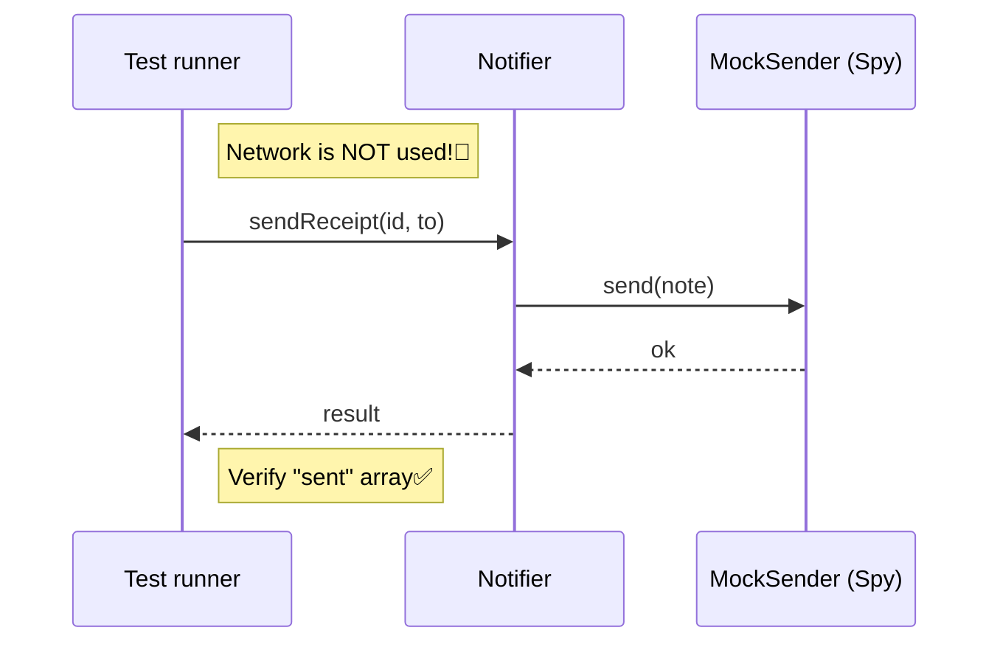

# 第41章：Bridge ③ まとめ：差し替えテストで“価値”を確認🧪

## ねらい🎯

* Bridgeのいちばん美味しいところ（＝**差し替えがラク**）を、**テストで体感**するよ〜😆🧡
* 「本番の実装」と「テスト用の実装（テストダブル）」を、スッと入れ替えられるようになる✨

---

## 1) Bridgeのおさらい（超ざっくり）🍡

Bridgeはね、

* **やりたいこと（抽象）** … 例：通知する、レシート送る、遅延通知する
* **どうやるか（実装）** … 例：メールで送る、コンソールに出す、Slackに送る

この2つを**別々に育てられる**ようにする考え方だよ〜🌱

ポイントはこれ👇

* 抽象側が「実装の具体クラス」を `new` しない
* 抽象側は **interface（型）** にだけ依存する
* 実装は **外から渡す（注入）** だけでOK💉✨

---

## 2) Bridgeがないとテストが地獄になる話😵‍💫


ありがちなダメ例👇（イメージ）

* 通知クラスの中で `new EmailSender()` しちゃう
* テストするときも**本物のメール送信**が動きそうになる📨💥
* すると…

  * ネットワークが絡む
  * テストが遅い
  * 失敗が不安定
  * モックしにくい
    っていう「いや〜〜😭」が発生するの

つまり：**依存が隠れてる設計はテストしんどい**ってこと💡




---

## 3) 今日のゴール：Senderを差し替えて“秒速でテスト”する⚡🧪


今回の題材は「注文レシート通知」☕🧾

* 抽象（Abstraction）側：`ReceiptNotifier`（レシート通知する）
* 実装（Implementor）側：`Sender`（送る手段：メール/コンソール/…）

---

## 4) ハンズオン🛠️：差し替えできるBridge構成を作ろう✨

## Step A：型（= 契約）を作る🧩


「送る」の最小契約だけ作るよ（余計に盛らない！）🙂

```ts
// types.ts
export type Notification = {
  to: string;
  subject: string;
  body: string;
};

export type SendError =
  | { kind: "InvalidAddress"; message: string }
  | { kind: "Network"; message: string };

export type Result<T, E> =
  | { ok: true; value: T }
  | { ok: false; error: E };

export interface Sender {
  send(note: Notification): Promise<Result<void, SendError>>;
}
```

---

## Step B：本番用のSenderを1個だけ用意（例：ConsoleSender）🖥️

まずは安全な「コンソールに出す」実装にしちゃおう（学習に最高！）😆

```ts
// consoleSender.ts
import type { Sender, Notification, Result, SendError } from "./types";

export class ConsoleSender implements Sender {
  async send(note: Notification): Promise<Result<void, SendError>> {
    console.log("[send]", note.to, note.subject);
    return { ok: true, value: undefined };
  }
}
```

---

## Step C：抽象側（Notifier）は Sender を受け取るだけ💉✨


`new ConsoleSender()` しないのが大事！ここがBridgeのコア🔥

```ts
// receiptNotifier.ts
import type { Sender, Result, SendError } from "./types";

export class ReceiptNotifier {
  constructor(private readonly sender: Sender) {}

  async sendReceipt(
    orderId: string,
    to: string
  ): Promise<Result<void, SendError>> {
    const note = {
      to,
      subject: `ご注文レシート（注文ID: ${orderId}）`,
      body: `ご利用ありがとうございます☕\n注文ID: ${orderId}\nまた来てね〜✨`,
    };

    return this.sender.send(note);
  }
}
```

ここまでで、**「送る実装」は外から差し替え可能**になったよ🎉

---

## 5) いよいよ差し替えテスト🧪✨（Vitest版）

テストでは「本物Sender」じゃなくて、**テスト用Sender**に差し替えるよ〜😎

## パターン①：いちばん素朴で強い「手作りSpy」🕵️（おすすめ）


「送られた内容を配列に入れておく」だけ。これ超わかりやすい💕

```ts
// receiptNotifier.test.ts
import { describe, it, expect } from "vitest";
import { ReceiptNotifier } from "./receiptNotifier";
import type { Sender, Notification, Result, SendError } from "./types";

describe("ReceiptNotifier", () => {
  it("senderに正しい通知を渡す", async () => {
    const sent: Notification[] = [];

    const sender: Sender = {
      send: async (note) => {
        sent.push(note);
        return { ok: true, value: undefined };
      },
    };

    const notifier = new ReceiptNotifier(sender);

    const r = await notifier.sendReceipt("o-123", "a@example.com");

    expect(r.ok).toBe(true);
    expect(sent).toHaveLength(1);
    expect(sent[0].to).toBe("a@example.com");
    expect(sent[0].subject).toContain("o-123");
    expect(sent[0].body).toContain("注文ID");
  });

  it("senderが失敗したら、その失敗を呼び出し元へ返す", async () => {
    const sender: Sender = {
      send: async () => ({
        ok: false,
        error: { kind: "Network", message: "timeout" },
      }),
    };

    const notifier = new ReceiptNotifier(sender);

    const r = await notifier.sendReceipt("o-999", "a@example.com");

    expect(r.ok).toBe(false);
    if (!r.ok) {
      expect(r.error.kind).toBe("Network");
    }
  });
});
```

✅ これだけで「ネットワーク無し」「速い」「安定」のテスト完成〜🎉

---

## パターン②：`vi.fn()`で“呼ばれたか”を確認（ちょい便利）📞


「何回呼ばれた？」「どんな引数だった？」が簡単になるよ✨

```ts
import { describe, it, expect, vi } from "vitest";
import { ReceiptNotifier } from "./receiptNotifier";
import type { Sender } from "./types";

describe("ReceiptNotifier (with vi.fn)", () => {
  it("sendが1回呼ばれる＆宛先が合ってる", async () => {
    const send = vi.fn<Sender["send"]>(async () => ({ ok: true, value: undefined }));
    const sender: Sender = { send };

    const notifier = new ReceiptNotifier(sender);
    await notifier.sendReceipt("o-123", "a@example.com");

    expect(send).toHaveBeenCalledOnce();
    expect(send).toHaveBeenCalledWith(
      expect.objectContaining({ to: "a@example.com" })
    );
  });
});
```

---

## 6) “Bridgeの価値”が見えるチェックポイント✅👀


テストを書きながら、ここを見てね👇

* ✅ `ReceiptNotifier` のテストで、**送信手段を自由に差し替え**できた？
* ✅ テストに **ネットワーク / 時間 / 外部環境** が混ざってない？
* ✅ 「送る」の仕様（`Sender`）が小さく保ててる？
* ✅ `ReceiptNotifier` が sender の種類（Email/Slack…）を知らない？

これ全部OKなら、Bridgeがうまく効いてる〜😆🎉

---

## 7) よくあるつまずき＆回避💡😺

* **「Notifierの中でnewしちゃった…」**
  → それ、差し替え不能のサイン⚠️ 依存は外から渡す💉
* **「Senderのinterfaceがデカくなってきた…」**
  → 送り方の都合を詰め込みすぎかも！「通知に必要な最小」だけに戻す🧹
* **「テストで失敗系が書きにくい…」**
  → `Result` があるとめちゃ書きやすい（成功/失敗を戻り値で表現）🧯

---

## 8) ミニ演習🎯（答えはテストで確認できるよ🧪）

## 演習A：Senderをもう1個増やす📨

* `EmailSender`（中身はダミーでOK）を追加してみよう
* `ReceiptNotifier` は1行も変えずに動くのが正解✨

## 演習B：Notifier側（抽象）をもう1個増やす🧾➡️📣

* `PromotionNotifier`（キャンペーン通知）を追加
* Senderは同じ `Sender` を使い回す
* テストも同じ差し替えで書けるはず💕

---

## 9) AIプロンプト例🤖💬（コピペOK）

```text
Bridgeパターンの「差し替えテスト」を書きたいです。
TypeScriptで、Sender(interface)を注入するNotifierの例を作ってください。

制約：
- 余計な独自クラスを増やしすぎない
- Result型（ok/falseのunion）で成功/失敗を返す
- テストはVitestで、手作りSpy版とvi.fn版の2種類
- 失敗系テストも1本入れる
出力：
1) 最小実装 2) テスト 3) よくある落とし穴
```

---

## 10) アップデートメモ（2026-02-04時点）🆕📌

* TypeScriptは **5.9系**が安定版として広く使われていて、`import defer` などが話題になったよ。([Microsoft for Developers][1])
* テストランナーは **Vitest 4** が出ていて、TS/ESMの現代環境と相性が良いよ。([Vitest][2])
* Node.jsは **24がLTS**（安定運用向き）、25はCurrent（新しめ）として案内されてるよ。([endoflife.date][3])

[1]: https://devblogs.microsoft.com/typescript/announcing-typescript-5-9/?utm_source=chatgpt.com "Announcing TypeScript 5.9"
[2]: https://vitest.dev/blog/vitest-4?utm_source=chatgpt.com "Vitest 4.0 is out!"
[3]: https://endoflife.date/nodejs?utm_source=chatgpt.com "Node.js"
