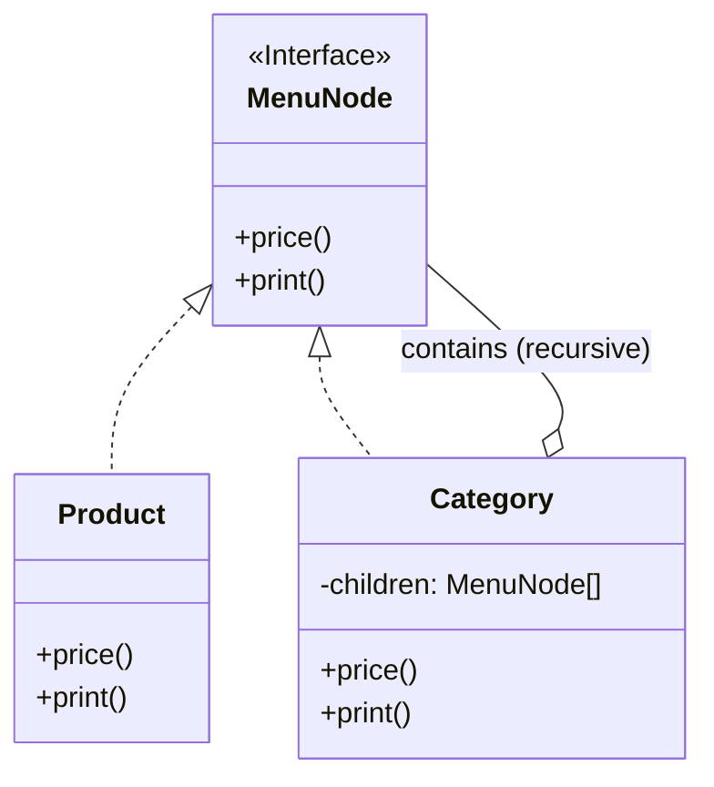

# 第42章：Composite ① 木構造を同じ操作で扱いたい🌳

## ねらい🎯

* **「葉（Leaf）と枝（Composite）を同じ扱いにする」**って感覚をつかむ🌿🌿
* 木構造（ツリー）を **同じ操作で集計・表示**できるようになる🧮🖨️
* TypeScriptで **余計な“パターン専用クラス”を増やさず**に書けるようになる✍️💕

---

## 今日のゴールイメージ🧠💡

たとえば「メニュー」がこういう形だったとするよね👇

* 🥤 ドリンクカテゴリ

  * ☕ コーヒー 450円
  * 🧋 カフェラテ 520円
* 🍰 スイーツカテゴリ

  * 🍮 プリン 380円
  * 🧁 マフィン 420円

これを **「どれでも同じ `price()` で値段が取れる」**ようにしたい！
「カテゴリ（枝）」でも「商品（葉）」でも、呼び出し側が悩まない設計にするのがCompositeだよ🌳✨


---

## ありがちな困りごと😵‍💫💥

木構造を扱うと、ついこうなりがち👇

* 価格計算のとき
  「カテゴリなら子を全部足す」「商品ならそのまま」って **分岐が増える**🌀
* 表示のとき
  「カテゴリなら見出し表示」「商品なら1行表示」って **分岐が散らばる**🌀
* あちこちで同じ再帰ロジックを書き始めて **コピペ地獄**😇

Compositeはこれを **“呼び出し側から分岐を消す”**のが強み💪✨

---

## Compositeの超ざっくり定義🍡

* **Leaf（葉）**：子を持たない（例：商品）🍮
* **Composite（枝）**：子を持つ（例：カテゴリ）📁
* **共通の型（interface）**を持たせて、**同じ操作**ができるようにする🎁

ポイントはここ👇
✅ 呼び出し側は **「それが葉か枝か」を意識しない**
✅ “木”の中のどのノードにも **同じメソッド（または同じ関数呼び出し）**を使える



---

## TypeScriptでの王道（最低限のinterface）🧩✨

### 設計の形（めっちゃシンプル版）🌿

* `MenuNode`：どのノードも `price()` と `print()` を持つ
* 商品ノード（Leaf）：自分の値段を返す
* カテゴリノード（Composite）：子の `price()` を合計する（再帰）

---

## ハンズオン🛠️：メニュー木構造を作って合計を出す☕🧾

### 1) 型（interface）を作る🧩

```ts
type Yen = number;

export interface MenuNode {
  price(): Yen;                 // 値段を返す（葉も枝も同じ！）
  print(indent?: number): string; // 表示用（デバッグにも便利✨）
}
```

### 2) Leaf（商品）を“オブジェクトリテラル”で作る🍮

「クラスを増やす前に、まずは素直に！」でOKだよ😊

```ts
export function createProduct(name: string, unitPrice: number): MenuNode {
  return {
    price: () => unitPrice,
    print: (indent = 0) => `${" ".repeat(indent)}- ${name} ¥${unitPrice}`,
  };
}
```

### 3) Composite（カテゴリ）を作る📁

ここがCompositeのキモ🌳✨
カテゴリ自身は価格を持たず、**子の合計**を返すよ！

```ts
export function createCategory(name: string, children: MenuNode[]): MenuNode {
  return {
    price: () => children.reduce((sum, child) => sum + child.price(), 0),
    print: (indent = 0) => {
      const header = `${" ".repeat(indent)}* ${name}`;
      const body = children.map((c) => c.print(indent + 2)).join("\n");
      return `${header}\n${body}`;
    },
  };
}
```

### 4) 木を組み立てて使う🌳✨

呼び出し側は **同じ `price()`** を呼ぶだけ！超気持ちいいやつ😆🎉

```ts
import { createCategory, createProduct, type MenuNode } from "./menu";

const menu: MenuNode = createCategory("メニュー", [
  createCategory("ドリンク🥤", [
    createProduct("コーヒー☕", 450),
    createProduct("カフェラテ🧋", 520),
  ]),
  createCategory("スイーツ🍰", [
    createProduct("プリン🍮", 380),
    createProduct("マフィン🧁", 420),
  ]),
]);

console.log(menu.print());
console.log("合計:", menu.price(), "円");
```

出力イメージ👇（だいたいこんな感じ）

* *メニュー

  * *ドリンク🥤

    * コーヒー☕ ¥450
    * カフェラテ🧋 ¥520
  * *スイーツ🍰

    * プリン🍮 ¥380
    * マフィン🧁 ¥420
* 合計: 1770 円

---

## テスト🧪：Compositeの価値は「テストが書きやすい」でも体感できる✨

ここではシンプルに **「合計が正しい」**だけテストするよ✅
（テストフレームワークは何でもOK。例としてVitestっぽく書くね🧁）

```ts
import { describe, it, expect } from "vitest";
import { createCategory, createProduct } from "./menu";

describe("Composite menu", () => {
  it("カテゴリは子のprice合計になる", () => {
    const drinks = createCategory("ドリンク", [
      createProduct("コーヒー", 450),
      createProduct("ラテ", 520),
    ]);

    expect(drinks.price()).toBe(970);
  });

  it("入れ子でも合計できる（再帰）", () => {
    const root = createCategory("root", [
      createCategory("A", [createProduct("a1", 100), createProduct("a2", 200)]),
      createCategory("B", [createProduct("b1", 300)]),
    ]);

    expect(root.price()).toBe(600);
  });
});
```

---

## どんな時にCompositeが効く？🔍✨

### ✅ めっちゃ効くケース

* フォルダ・ファイル📁📄（サイズ計算、一覧表示）
* UIのコンポーネントツリー🧩（描画、イベント伝播）
* 組織図・カテゴリ階層🏢
* 料理のセット（セットの値段＝中身の合計）🍱

### ❌ 使わない方がいいかも

* 木構造じゃない（ただの配列でOK）🧺
* 深さがほぼ固定で、分岐が増えない（KISSでOK）🧸

---

## つまずきポイント回避💡（ここ大事！）🧯

### 1) 再帰が深すぎるとデバッグしんどい😵

* 学習用は浅い木でOK！
* 深い木になりそうなら、`print()`みたいな可視化関数を最初から入れると救われる🛟✨

### 2) Compositeが「何でも屋」になりやすい🧟‍♀️

* `createCategory` の中に「割引ルール」みたいな業務判断を混ぜないでね🙅‍♀️
  Compositeの責務は **“木構造をまとめて扱う”** だけ🌳

### 3) 子の配列を外からいじられると事故る🧨

学習ではOKだけど、実務だと

* 追加は関数経由にする
* 参照は読み取り専用にする
  みたいなガードを考えることが多いよ🧤✨

---

## “Compositeっぽい匂い”チェック👃🌳

こんなのが出てきたら採用候補！

* `if (node.type === "category") { ... } else { ... }` がいろんな所に散ってる🌀
* 「集計」「表示」「検索」など同じ木の走査が何回も出てくる🔁
* 呼び出し側が “葉か枝か” を毎回気にしている🤯

---

## AIに投げるプロンプト例🤖💬（コピペOK✨）

```text
Compositeパターンの題材として、メニュー（カテゴリ→商品）の木構造があります。
次の制約で改善案をください。

- TypeScriptで、余計な独自クラスを増やさない（interface + 関数中心）
- 葉（商品）と枝（カテゴリ）を同じ操作で扱えるようにしたい
- 操作は price() と print() の2つ
- ありがちな落とし穴（再帰・責務肥大）も注意点に入れて

出力：
1) ねらい
2) 設計（型と責務）
3) 最小コード
4) テスト観点
5) よくあるミス
```

---

## 最新事情メモ🗞️✨（TypeScriptまわり）

最近のTypeScriptは **コンパイラやツールが“ネイティブ化”方向**で、巨大プロジェクトのビルド体験が良くなる流れが話題だよ（プレビューやロードマップ含む）🚀
たとえば Microsoft の発表として、Visual Studio向けに TypeScript “native preview” が出ていて、ビルド時間改善（大規模向け）をうたってるよ。([Microsoft Developer][1])
また、TypeScript 6.0が“最後のJavaScript実装”で、7.0が“ネイティブ移行”の節目になる見立ても報じられてるよ。([InfoWorld][2])

（Composite自体は言語機能より “設計の考え方” が主役だけど、こういう流れで型チェックやビルド体験がどんどん良くなってるのは嬉しいね😊✨）

---

## ミニ演習🌸（5〜10分）🧠📝

1. `countLeaves()` を追加してみよう🍃

   * 商品の数だけ数える（カテゴリは子の合計）
2. `findByName(keyword)` を作ってみよう🔍

   * `print()`で見える名前にキーワードが含まれてたら集める
3. わざと木を深くして、`print()`で見える化してみよう🌳👀

---

## まとめ🎉

Compositeは「木構造」を **葉も枝もまとめて同じ操作で扱える**ようにするパターン🌳✨
TypeScriptなら **interface + 関数 + 再帰**で、スッキリ気持ちよく書けるよ🧁💖

（次の章では、さらに **判別Unionでクラスを増やさず表現する方法**にもつながっていくよ🧠🧩）

[1]: https://developer.microsoft.com/blog/typescript-7-native-preview-in-visual-studio-2026?utm_source=chatgpt.com "TypeScript 7 native preview in Visual Studio 2026"
[2]: https://www.infoworld.com/article/4100582/microsoft-steers-native-port-of-typescript-to-early-2026-release.html?utm_source=chatgpt.com "Microsoft steers native port of TypeScript to early 2026 ..."
