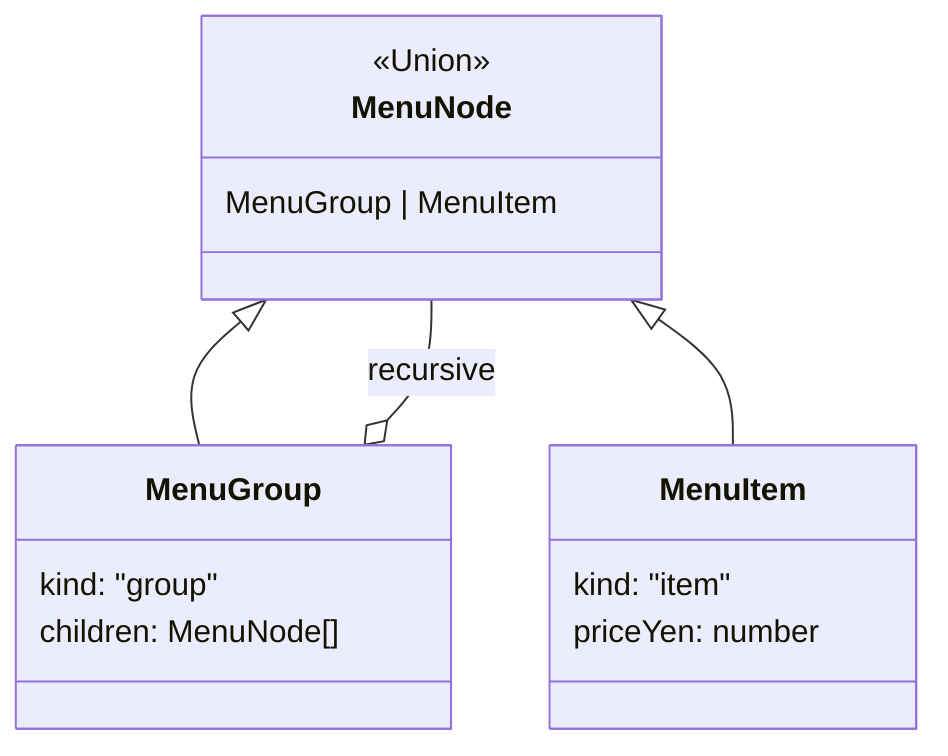

# 第43章：Composite ② TypeScript流：Unionでも表現できる（クラスを増やさない）🧩

* ねらい🎯：Composite（木構造）を「判別Union＋関数」でスッキリ書けるようになる✨
* 学ぶこと📌：判別Union（discriminated union）／再帰型／網羅チェック（never）／再帰とループの使い分け🧠
* ハンズオン🛠️：メニュー（カテゴリ→商品）の木を作り、合計金額・検索・一覧化を実装する☕🌳
* AIプロンプト例🤖：『判別Unionで木構造を表現して、合計/検索/一覧化を関数で実装して。switchの網羅チェックも入れて』
* つまずき回避💡：Unionの分岐（switch）が増えすぎたら「関数を分ける」「Visitor/Iterator（後の章）を検討」🧯

---

## 1. Compositeを「クラス」じゃなく「型」でやると何が嬉しいの？😊


Compositeの本質はこれ👇
**「葉（item）と枝（group）を同じ“ノード”として扱って、同じ操作（合計・検索・列挙）をかけられる」** こと🌳✨

TypeScriptだと、クラスで頑張るよりも
✅ **判別Union（kindで分ける）**
✅ **関数で操作を書く（データ指向）**
が、めちゃ自然です🧁

判別Unionで分岐すると、TypeScriptが賢く「この分岐の中ではこの型！」って絞ってくれます（型のnarrowing）🔍✨ ([TypeScript][1])
さらに、**neverで網羅チェック**を入れると「分岐漏れ」をコンパイル時に気づけて安心です✅ ([TypeScript][2])


---

## 2. まずは最小のデータ構造（判別Union）を作ろう🧩

今回は「メニュー」を木構造にします🍰

* group：カテゴリ（子を持つ）
* item：商品（葉っぱ）

```ts
// menu.ts
export type MenuNode = MenuGroup | MenuItem;

export type MenuGroup = {
  kind: "group";
  id: string;
  name: string;
  children: readonly MenuNode[];
};

export type MenuItem = {
  kind: "item";
  id: string;
  name: string;
  priceYen: number;
  tags?: readonly string[];
};
```

ポイント🌟

* **kind** を「固定文字列（"group" / "item"）」にするのがコツ✨（これが判別キー）
* children を **readonly** にしておくと、うっかり破壊的変更しにくくて事故りにくいよ🧯



---

## 3. 例データを作る（satisfiesで型チェック強め）✅🍓


「見た目のリテラルを保ちつつ、型チェックだけ強くしたい」時に **satisfies** が便利✨
（TypeScriptの機能として定着してます）([TypeScript][3])

```ts
// sampleMenu.ts
import type { MenuNode } from "./menu";

export const menu = {
  kind: "group",
  id: "root",
  name: "カフェメニュー",
  children: [
    {
      kind: "group",
      id: "coffee",
      name: "コーヒー",
      children: [
        { kind: "item", id: "blend", name: "ブレンド", priceYen: 480, tags: ["hot"] },
        { kind: "item", id: "latte", name: "カフェラテ", priceYen: 560, tags: ["hot", "milk"] },
      ],
    },
    {
      kind: "group",
      id: "sweets",
      name: "スイーツ",
      children: [
        { kind: "item", id: "cake", name: "チーズケーキ", priceYen: 620, tags: ["sweet"] },
      ],
    },
  ],
} satisfies MenuNode;
```

---

## 4. 操作①：合計金額を出す（Compositeの王道）💰✨


```ts
// ops.ts
import type { MenuNode } from "./menu";

function assertNever(x: never): never {
  throw new Error("Unexpected node: " + JSON.stringify(x));
}

export function totalPriceYen(node: MenuNode): number {
  switch (node.kind) {
    case "item":
      return node.priceYen;

    case "group":
      return node.children.reduce((sum, child) => sum + totalPriceYen(child), 0);

    default:
      // kindを増やしたのにswitchを更新し忘れると、ここで型エラーになって気づける✅
      return assertNever(node);
  }
}
```

ここがCompositeの気持ちよさポイント🥰

* 呼び出し側は **totalPriceYen(menu)** みたいに「どっち（葉/枝）か」を気にしないでOK🎉
* never網羅チェックで、拡張時に事故りにくい✅ ([TypeScript][2])

---

## 5. 操作②：商品（item）だけ一覧にする🍰📦


「木を平らにする（flatten）」は超よく使うよ〜✨

```ts
import type { MenuItem, MenuNode } from "./menu";

export function collectItems(node: MenuNode): MenuItem[] {
  if (node.kind === "item") return [node];

  // groupなら子を全部たどって平らに
  return node.children.flatMap(collectItems);
}
```

---

## 6. 操作③：idで検索する🔎✨


```ts
import type { MenuNode } from "./menu";

export function findById(node: MenuNode, id: string): MenuNode | undefined {
  if (node.id === id) return node;

  if (node.kind === "group") {
    for (const child of node.children) {
      const found = findById(child, id);
      if (found) return found;
    }
  }
  return undefined;
}
```

---

## 7. 再帰が怖い人へ：ループ（スタック）版もあるよ🧠🧯


木がめちゃ深いと、環境によっては再帰が不利になることもあるので、**配列スタック**で回す版も覚えておくと安心〜✨

```ts
import type { MenuNode } from "./menu";

export function totalPriceYenIterative(root: MenuNode): number {
  const stack: MenuNode[] = [root];
  let sum = 0;

  while (stack.length) {
    const node = stack.pop()!;
    if (node.kind === "item") {
      sum += node.priceYen;
    } else {
      for (let i = node.children.length - 1; i >= 0; i--) {
        stack.push(node.children[i]);
      }
    }
  }
  return sum;
}
```

---

## 8. テストで安心する（標準のnode:testでOK）🧪✨

標準の **node:test** は安定（Stable）扱いなので、学習用にもすごく便利だよ✅ ([Node.js][4])
コマンドも **node --test** でシンプル🎉 ([Node.js][5])

```ts
// ops.test.ts
import test from "node:test";
import assert from "node:assert/strict";

import { menu } from "./sampleMenu";
import { collectItems, findById, totalPriceYen } from "./ops";

test("totalPriceYen: 木全体の合計を計算できる", () => {
  assert.equal(totalPriceYen(menu), 480 + 560 + 620);
});

test("collectItems: itemだけ集められる", () => {
  const items = collectItems(menu);
  assert.equal(items.length, 3);
  assert.deepEqual(items.map(x => x.id).sort(), ["blend", "cake", "latte"].sort());
});

test("findById: idでノードを検索できる", () => {
  const found = findById(menu, "coffee");
  assert.equal(found?.kind, "group");

  const latte = findById(menu, "latte");
  assert.equal(latte?.kind, "item");
});
```

---

## 9. つまずきポイント集（ここでハマりがち！）😵‍💫🧯

## 9-1. kind（判別キー）がブレる🤯


* "type" と "kind" が混ざる
* "Group" と "group" が混ざる
  👉 判別キーは **短く固定**が最強✨（例：kind / type / status）

## 9-2. Unionが増えてswitchが長くなる📚

* node.kind が3種類、4種類…になってくると、操作関数のswitchが肥大化💦
  👉 対策はこの順でOK🙆‍♀️

1. 操作を小さい関数に分割する✂️
2. 「検索系」「集計系」などモジュールを分ける📦
3. それでも増えるなら、後の章の発想（Visitor/Iterator）を検討👀

## 9-3. “変換”と“業務判断”を混ぜる😵

木の探索中に、割引ルールや在庫判定まで全部やり始めるとカオス…
👉 探索（collect/find/iterate）と、業務（割引/在庫）を分けるとスッキリ✨

---

## 10. ちょい最新メモ📝✨

* TypeScriptは継続的に更新されていて、現行の最新版は **5.9 系**として案内されています。([TypeScript][2])
* 判別Unionのnarrowingや網羅チェック（never）は、こういう「データを型で守る」設計の中心テクです💎 ([TypeScript][1])

---

## 付録：AIに投げる“いい感じプロンプト”🤖💬

```text
次のComposite（木構造）をTypeScriptで実装したいです。
- クラスを増やさず、判別Union（kind）＋関数で書く
- 操作は「合計」「id検索」「item一覧化」
- switchの網羅チェック（never）を必ず入れる
- できればテスト（node:test）も付ける
題材: カフェのメニュー（カテゴリ→商品）
```

[1]: https://www.typescriptlang.org/docs/handbook/2/narrowing.html?utm_source=chatgpt.com "Documentation - Narrowing"
[2]: https://www.typescriptlang.org/docs/handbook/unions-and-intersections.html?utm_source=chatgpt.com "Handbook - Unions and Intersection Types"
[3]: https://www.typescriptlang.org/docs/handbook/release-notes/typescript-4-9.html?utm_source=chatgpt.com "Documentation - TypeScript 4.9"
[4]: https://nodejs.org/api/test.html?utm_source=chatgpt.com "Test runner | Node.js v25.6.0 Documentation"
[5]: https://nodejs.org/api/cli.html?utm_source=chatgpt.com "Command-line API | Node.js v25.6.0 Documentation"
