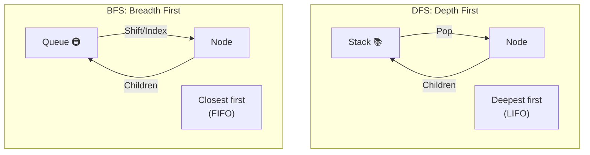

# 第44章：Composite ③ まとめ：探索（検索/集計）のパターン化🔍

## ねらい🎯

* 木構造（Composite）を **「検索」「抽出」「集計」** できるようになる🌳✨
* 走査ロジックが散らばってグチャるのを防ぐ（DRY🧼）
* DFS/BFSの雰囲気をつかんで、次の Iterator 章につなげる🔁

---

## 今日の超ざっくり結論📌

木構造の探索は、だいたいこの3点セットで勝てます💪✨

1. **走査（巡回）を1か所にまとめる**（DFS or BFS）🧭
2. **条件は predicate（関数）で渡す**（差し替えやすい）🧩
3. **結果は collect / find / reduce（集計）に寄せる**📦

---

## アップデートメモ（2026/02時点）🗞️✨

* Node.js は **v24 が Active LTS**、**v25 が Current** という並び（「安定運用は偶数LTS」って感じ）です。([Node.js][1])
* Node には組み込みのテストランナー `node:test` があり、**Node 20 で stable** 扱いです。([Node.js][2])
* TypeScript は `Symbol.iterator` / ジェネレータなど **標準のイテレーション** を普通に扱えます。([TypeScript][3])
* ちなみに TypeScript まわりは「ネイティブ化（TypeScript 7系の流れ）」も話題になってます（プレビュー/進捗）。([Microsoft Developer][4])

---

## 1) 題材：カフェメニューを木で表す☕🌳

「カテゴリ（グループ）」の中に「商品（アイテム）」が入ってる、よくある構造👇

* Drinks

  * Coffee ☕
  * Latte 🥛
* Foods

  * Sandwich 🥪
  * Cake 🍰

この **「入れ子」** が増えると、検索や集計が急に面倒になります😵‍💫
そこで「探索の型」を作っておくのが今回のゴール💡

---

## 2) DFS と BFS のイメージ🧠✨

## DFS（Depth First Search：深さ優先）🕳️

* “奥まで潜ってから戻る” 探し方
* **実装がシンプル**（スタック or 再帰）
* 「だいたいの探索」はDFSで困らないことが多い👍

## BFS（Breadth First Search：幅優先）🪜

* “近い階層から順に” 探す
* 「最短距離っぽいもの（近いものから見つけたい）」に強い✨
* 「最短距離っぽいもの（近いものから見つけたい）」に強い✨
* キュー（待ち行列）で実装するよ📬




---

## 3) まず「走査」を1か所にまとめよう🧰✨

ここが超重要ポイント💖
探索・集計・抽出の人たち（呼び出し側）が、木の形を意識しなくて済むようにするよ😊

```ts
// menu.ts
export type MenuNode = MenuGroup | MenuItem;

export type MenuItem = {
  kind: "item";
  id: string;
  name: string;
  priceYen: number;
  tags: readonly string[]; // 例: ["discount"]
};

export type MenuGroup = {
  kind: "group";
  id: string;
  name: string;
  children: readonly MenuNode[];
};

/**
 * DFS（深さ優先）: スタックで回す（再帰なし）
 * - 深い木でもコールスタックを使わないので安心寄り✨
 */
export function* dfs(root: MenuNode): IterableIterator<MenuNode> {
  const stack: MenuNode[] = [root];

  while (stack.length > 0) {
    const node = stack.pop()!;
    yield node;

    if (node.kind === "group") {
      // 左→右の順を保ちたいので reverse push
      for (let i = node.children.length - 1; i >= 0; i--) {
        stack.push(node.children[i]!);
      }
    }
  }
}

/**
 * BFS（幅優先）: キューで回す（shiftは遅くなりやすいので index 方式）
 */
export function* bfs(root: MenuNode): IterableIterator<MenuNode> {
  const queue: MenuNode[] = [root];

  for (let i = 0; i < queue.length; i++) {
    const node = queue[i]!;
    yield node;

    if (node.kind === "group") {
      queue.push(...node.children);
    }
  }
}
```

---

## 4) 「検索」「抽出」「集計」をテンプレ化しよう🔍📦🧮

## 4-1) find：条件に合う最初の1個を探す🕵️‍♀️

```ts
// search.ts
import { bfs, dfs, MenuItem, MenuNode } from "./menu";

type WalkOrder = "dfs" | "bfs";

export function findFirst(
  root: MenuNode,
  predicate: (node: MenuNode) => boolean,
  order: WalkOrder = "dfs",
): MenuNode | undefined {
  const walker = order === "bfs" ? bfs(root) : dfs(root);

  for (const node of walker) {
    if (predicate(node)) return node;
  }
  return undefined;
}
```

---

## 4-2) collect：条件に合う商品だけ集める🧺✨

```ts
// collect.ts
import { dfs, MenuItem, MenuNode } from "./menu";

export function collectItems(
  root: MenuNode,
  predicate: (item: MenuItem) => boolean,
): MenuItem[] {
  const out: MenuItem[] = [];

  for (const node of dfs(root)) {
    if (node.kind === "item" && predicate(node)) {
      out.push(node);
    }
  }
  return out;
}
```

---

## 4-3) reduce（集計）：割引対象だけ合計したい💰✨

```ts
// aggregate.ts
import { dfs, MenuItem, MenuNode } from "./menu";

export function sumPrice(
  root: MenuNode,
  predicate: (item: MenuItem) => boolean,
): number {
  let sum = 0;

  for (const node of dfs(root)) {
    if (node.kind === "item" && predicate(node)) {
      sum += node.priceYen;
    }
  }
  return sum;
}
```

---

## 4-4) ちょい発展：見つかった「場所（パス）」も欲しい🧭✨

「Cake を見つけた！…で、どのカテゴリの中？」みたいなやつ🍰
UIでパンくず（Foods > Sweets > Cake）を出すとき便利💡

```ts
// path.ts
import { MenuNode } from "./menu";

export function findPathById(root: MenuNode, targetId: string): MenuNode[] | undefined {
  // DFS（スタック）で「今ここまで来た道」を一緒に持つ
  const stack: Array<{ node: MenuNode; path: MenuNode[] }> = [{ node: root, path: [root] }];

  while (stack.length > 0) {
    const { node, path } = stack.pop()!;

    if (node.id === targetId) return path;

    if (node.kind === "group") {
      for (let i = node.children.length - 1; i >= 0; i--) {
        const child = node.children[i]!;
        stack.push({ node: child, path: [...path, child] });
      }
    }
  }
  return undefined;
}
```

---

## 5) ハンズオン🛠️：木から「割引対象の商品だけ集計」してみよう🎯✨

## Step 1：サンプルの木を作る🌳

```ts
// sample.ts
import { MenuNode } from "./menu";

export const menu: MenuNode = {
  kind: "group",
  id: "root",
  name: "Menu",
  children: [
    {
      kind: "group",
      id: "drinks",
      name: "Drinks",
      children: [
        { kind: "item", id: "coffee", name: "Coffee", priceYen: 450, tags: [] },
        { kind: "item", id: "latte", name: "Latte", priceYen: 520, tags: ["discount"] },
      ],
    },
    {
      kind: "group",
      id: "foods",
      name: "Foods",
      children: [
        { kind: "item", id: "sandwich", name: "Sandwich", priceYen: 680, tags: [] },
        { kind: "item", id: "cake", name: "Cake", priceYen: 550, tags: ["discount"] },
      ],
    },
  ],
};
```

## Step 2：割引タグの商品だけ集める🧁🎁

```ts
import { collectItems } from "./collect";
import { menu } from "./sample";

const discounted = collectItems(menu, (item) => item.tags.includes("discount"));
console.log(discounted.map((x) => x.name)); // ["Latte", "Cake"] のはず✨
```

## Step 3：割引タグだけ合計する💰

```ts
import { sumPrice } from "./aggregate";
import { menu } from "./sample";

const total = sumPrice(menu, (item) => item.tags.includes("discount"));
console.log(total); // 520 + 550 = 1070 のはず🎉
```

---

## 6) テストで「探索の安心感」を作る🧪✨（Node標準）

`node:test` は Node に入ってるテスト機能だよ✅（Node 20 で stable）。([Node.js][2])

```ts
// menu.test.ts
import test from "node:test";
import assert from "node:assert/strict";

import { menu } from "./sample";
import { collectItems } from "./collect";
import { sumPrice } from "./aggregate";
import { findFirst } from "./search";
import { findPathById } from "./path";

test("discount items are collected", () => {
  const items = collectItems(menu, (i) => i.tags.includes("discount"));
  assert.deepEqual(items.map((x) => x.id), ["latte", "cake"]);
});

test("discount total is summed", () => {
  const total = sumPrice(menu, (i) => i.tags.includes("discount"));
  assert.equal(total, 1070);
});

test("findFirst finds Latte (DFS)", () => {
  const found = findFirst(menu, (n) => n.kind === "item" && n.id === "latte", "dfs");
  assert.ok(found);
  assert.equal(found.kind, "item");
  assert.equal(found.id, "latte");
});

test("findPathById returns breadcrumb", () => {
  const path = findPathById(menu, "cake");
  assert.ok(path);
  assert.deepEqual(path.map((n) => n.id), ["root", "foods", "cake"]);
});
```

---

## 7) よくあるつまずきポイント集💡😵‍💫

## ① 走査があちこちに散らばる🧨

* 「この画面はDFS」「こっちはchildren直回し」みたいになると、後で地獄😇
  ➡️ **dfs/bfs を1か所に固定**して、みんなそこを使うのがコツ✨

## ② BFSで `shift()` を使って遅くなる🐢

* `shift()` は配列の先頭を抜くので、中身の詰め直しが発生しがち
  ➡️ **index方式キュー**（今回の `for (let i=0...)`）がラクだよ📬

## ③ 「木のはず」が、実は循環してた♻️

API由来のデータとかで、事故ることあるある😇
➡️ 不安なら `visited: Set<string>` を入れて防止してOK🛡️（学習ではまず不要）

---

## 8) ここが“設計”の気持ちいい所✨🥰

* 検索条件を変えたい → predicate差し替えでOK🧩
* 集計したい → `sumPrice` の中身は変えず、条件だけ変える🧮
* 走査順を変えたい → DFS/BFS を差し替えるだけ🔁
* 木の形が変わっても → 呼び出し側が壊れにくい🧼

---

## 9) AIプロンプト例🤖💬（探索・集計の相談用）

```text
次のComposite(木構造)の探索を改善したいです。
- 目的: 「条件に合う要素の検索」「抽出」「集計」を共通化
- 方針: 走査(DFS/BFS)を1か所にまとめ、条件はpredicateで渡す
- 余計な独自クラスは増やさない（Union+関数中心）
出力してほしいもの:
1) dfs/bfs の実装（再帰なしも）
2) find/collect/reduce のテンプレ関数
3) node:test での最小テスト
4) よくある落とし穴（shift、順序、深い木）
題材: カフェメニューの木構造
```

---

## 10) まとめ🎉✨

* Composite の次に困るのは **「木の探索をどう書く？」** だよね🔍
* 解決の鍵は **走査を1か所にまとめる** こと🌟
* その上で、検索・抽出・集計をテンプレ化すると、コードがめっちゃスッキリするよ🧼✨
* 次章（Iterator）では、この走査を **「for..of できるAPI」** としてもっと気持ちよくしていくよ〜🔁🎁

[1]: https://nodejs.org/en/about/previous-releases?utm_source=chatgpt.com "Node.js Releases"
[2]: https://nodejs.org/api/test.html?utm_source=chatgpt.com "Test runner | Node.js v25.6.0 Documentation"
[3]: https://www.typescriptlang.org/docs/handbook/iterators-and-generators.html?utm_source=chatgpt.com "Iterators and Generators"
[4]: https://developer.microsoft.com/blog/typescript-7-native-preview-in-visual-studio-2026?utm_source=chatgpt.com "TypeScript 7 native preview in Visual Studio 2026"
