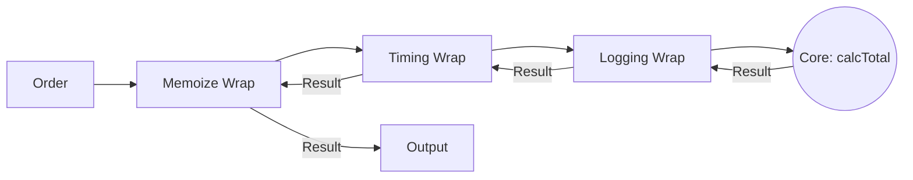

# 第45章：Decorator ① 機能を“あと付け”で重ねたい🎁

## ねらい🎯

* 「あとから機能を足したい（ログ・計測・キャッシュ等）」を、**本体ロジックを汚さず**に実現できるようになる✨
* 継承じゃなくて **合成（ラップ）** で増やす感覚をつかむ🧩
* **重ねる順番が意味を持つ**ことを体験する🔁

---

## まず困りごと😵‍💫：「本体に横から入れたい処理」が増えていく

たとえば「合計金額を計算する」だけの関数があるとして…☕🧾

```ts
type OrderItem = { name: string; unitPrice: number; qty: number };
type Order = { id: string; items: OrderItem[] };

export function calcTotal(order: Order): number {
  return order.items.reduce((sum, item) => sum + item.unitPrice * item.qty, 0);
}
```

ここに、こんなのが“あとから”増えがち👇😇

* 🪵 ログを入れたい（デバッグ、監査）
* ⏱️ 何msかかったか知りたい（パフォーマンス）
* 🧠 同じ注文は再計算したくない（キャッシュ）

### ダメになりやすい例💥（本体がゴチャゴチャ）

「計算」以外が混ざって、読みづらくなるし、テストもしんどい…🥲

```ts
// ※悪い方向の例：やりたいことが全部混ざる
export function calcTotal_messy(order: Order): number {
  console.log("[calcTotal] start", order.id);

  const t0 = performance.now?.() ?? Date.now();

  // キャッシュ…？
  // （ここにMapとか出てきて…本体が肥大化しがち）

  const result = order.items.reduce((sum, item) => sum + item.unitPrice * item.qty, 0);

  const t1 = performance.now?.() ?? Date.now();
  console.log("[calcTotal] end", order.id, "ms=", (t1 - t0).toFixed(2), "result=", result);

  return result;
}
```

---

## Decoratorの考え方🍰：「同じ形のまま包んで、機能を足す」

Decorator（GoFのやつ）は超ざっくり言うと👇💡

* ✅ 本体（計算）はそのまま
* ✅ 外側で包んで「前後に処理」を差し込む
* ✅ 包んだ後も “同じように呼べる”

つまりこういうイメージ🎁🎀


```ts
// もともと
calcTotal(order)

// あと付け（ラップ）
withLogging(calcTotal)(order)
withTiming(calcTotal)(order)
withMemoize(calcTotal)(order)

// 重ねがけ（Decoratorの醍醐味）
withMemoize(withTiming(withLogging(calcTotal)))(order)

```



---

## ハンズオン🛠️：ログ・計測・キャッシュを“あと付け”する

ここでは「引数1個の関数」から始めるよ😊（複数引数の型安全は次章で強化する✨）

### 1) ログDecorator：withLogging 🪵

```ts
export function withLogging<A, R>(
  fn: (arg: A) => R,
  label = fn.name || "fn",
): (arg: A) => R {
  return (arg: A) => {
    console.log(`🪵[${label}] called`, arg);
    const result = fn(arg);
    console.log(`🪵[${label}] result`, result);
    return result;
  };
}
```

### 2) 計測Decorator：withTiming ⏱️

`performance.now()` は高精度タイマーの定番だよ⏱️✨（ブラウザで広く使える）([MDN Web Docs][1])
Nodeでもパフォーマンス計測APIが用意されてるよ🧠([Node.js][2])

```ts
function nowMs(): number {
  // performance.now があるなら優先（なければ Date.now）
  return typeof performance !== "undefined" && typeof performance.now === "function"
    ? performance.now()
    : Date.now();
}

export function withTiming<A, R>(
  fn: (arg: A) => R,
  label = fn.name || "fn",
): (arg: A) => R {
  return (arg: A) => {
    const t0 = nowMs();
    try {
      return fn(arg);
    } finally {
      const t1 = nowMs();
      console.log(`⏱️[${label}] ${(t1 - t0).toFixed(2)}ms`);
    }
  };
}
```

### 3) キャッシュDecorator：withMemoize 🧠🗃️

キャッシュは `Map` がど定番🗃️（キー設計が命！）

```ts
export function withMemoize<A, R>(
  fn: (arg: A) => R,
  keyOf: (arg: A) => string,
  label = fn.name || "fn",
): (arg: A) => R {
  const cache = new Map<string, R>();

  return (arg: A) => {
    const key = keyOf(arg);
    if (cache.has(key)) {
      console.log(`🧠[${label}] cache hit`, key);
      return cache.get(key)!;
    }

    const result = fn(arg);
    cache.set(key, result);
    console.log(`🧠[${label}] cache set`, key);
    return result;
  };
}
```

---

## 4) いよいよ重ねがけ🎀（順番で結果・ログが変わる！）

```ts
import { calcTotal } from "./calcTotal";
import { withLogging, withTiming, withMemoize } from "./decorators";

const orderKey = (o: { id: string }) => o.id; // まずはシンプルに「id」をキーにする😊

export const calcTotalEnhanced =
  withMemoize(
    withTiming(
      withLogging(calcTotal, "calcTotal"),
      "calcTotal",
    ),
    orderKey,
    "calcTotal",
  );
```

使ってみる🎉

```ts
const order = {
  id: "A001",
  items: [
    { name: "Latte", unitPrice: 520, qty: 1 },
    { name: "Cookie", unitPrice: 280, qty: 2 },
  ],
};

console.log("💰total=", calcTotalEnhanced(order));
console.log("💰total=", calcTotalEnhanced(order)); // 2回目はキャッシュが効くはず🧠✨
```

---

## つまずき回避💡（Decoratorあるある）

* 🧩 **本体の責務を守る**：Decoratorに「業務ルール」を入れ始めると崩れる😵‍💫
  → ログ/計測/キャッシュ/リトライ…みたいな“横断関心”に絞る✨
* 🧠 **キャッシュキーが雑だと事故る**：同じもの扱いしちゃう／逆にヒットしない
  → まずは `id` みたいな **安定キー** で始めるのが安全😊
* 🪵 **ログに何でも出さない**：個人情報・巨大オブジェクトで地獄🔥
  → `order.id` だけ出す、みたいにミニマムでOK👍
* 🎀 **重ねすぎると追いにくい**：ラップが深くなるとデバッグがしんどい
  → `label` を付ける／Decorator関数名を分かりやすくする📝✨

---

## ミニテスト🧪（Decoratorの“効き”を確認）

テスト環境は Vitest が定番で、Vitest 4.0 が 2025-10-22 にリリースされてるよ🧪✨([Vitest][3])

### 「キャッシュで本体が1回しか呼ばれない」テスト

```ts
import { describe, it, expect } from "vitest";
import { withMemoize } from "./decorators";

describe("withMemoize", () => {
  it("同じキーなら2回呼んでも本体は1回だけ🧠", () => {
    let called = 0;

    const base = (n: number) => {
      called++;
      return n * 2;
    };

    const memo = withMemoize(base, (n) => String(n), "double");

    expect(memo(10)).toBe(20);
    expect(memo(10)).toBe(20);
    expect(called).toBe(1);
  });
});
```

---

## コラム🌸：「@デコレータ」とGoF Decoratorは別モノだよ！

名前が同じで混乱しやすいけど…😵‍💫💦

* **GoF Decorator（この章）**：関数やオブジェクトを**ラップして機能追加**する設計パターン🎁
* **`@decorator`（TypeScript/ECMAScriptの言語機能）**：クラスやメンバーを**メタ的に拡張**する仕組み🏷️

ECMAScriptのDecorators提案は Stage 3 として公開されていて([GitHub][4])、TypeScriptは **5.0 から Stage 3 Decorators サポート**を案内してるよ🧠([TypeScript][5])
でも！この教材の第45章は **GoF Decorator（ラップ）** が主役だよ🎀✨

---

## AIプロンプト例🤖💬（そのままコピペOK）

```txt
次のTypeScript関数に「ログ」と「計測」と「キャッシュ」を後付けしたいです。
条件:
- 本体ロジックは変更しない
- GoF Decoratorとして“関数ラップ”で実装する
- Mapでメモ化するが、キャッシュキー設計の注意もコメントで入れる
- 最小コード + 簡単なテスト（Vitest）も出す

対象コード:
<ここに関数を貼る>
```

---

## 次章でやること🔜✨

* 引数が複数でも崩れない **型安全なDecorator（Parameters/ReturnType/this対応）** を作るよ⚙️🧠

[1]: https://developer.mozilla.org/ja/docs/Web/API/Performance/now?utm_source=chatgpt.com "Performance: now() メソッド - Web API - MDN Web Docs"
[2]: https://nodejs.org/api/perf_hooks.html?utm_source=chatgpt.com "Performance measurement APIs | Node.js v25.5.0 ..."
[3]: https://vitest.dev/blog/vitest-4?utm_source=chatgpt.com "Announcing Vitest 4.0"
[4]: https://github.com/tc39/proposal-decorators?utm_source=chatgpt.com "tc39/proposal-decorators: Decorators for ES6 classes"
[5]: https://www.typescriptlang.org/docs/handbook/decorators.html?utm_source=chatgpt.com "Documentation - Decorators"
