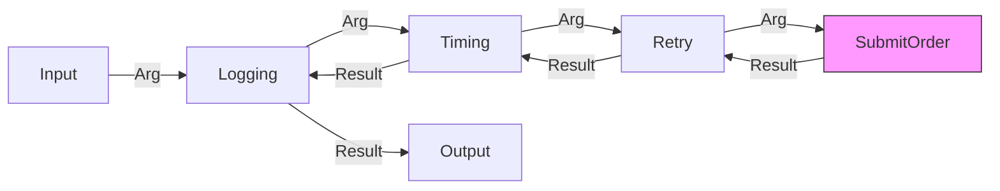

# 第46章：Decorator ② TypeScriptの定番：高階関数でサクッとラップ⚙️

## この章のゴール🎯✨

* 「本体の関数」は一切いじらずに、**ログ📝・計測⏱️・リトライ🔁**みたいな“横から効く機能”を後付けできる
* TypeScriptで **型が崩れない** Decorator（関数ラップ）を書ける
* ラップを**積み重ねても読みやすい**（順番も管理できる）ようになる

---

## 1) まず最重要：GoFのDecorator ≠ `@decorator` 構文😳💡

みんなが混乱しがちポイント👇

* GoFのDecorator：**「本体を包んで機能追加」**（合成で拡張）🎁
* TypeScriptの`@decorator`：**クラスやメソッドに注釈を付ける仕組み**（別の話）🧷

  * しかも今は **ECMAScriptのStage 3 Decorators** の流れがあり、TypeScriptもそれに合わせた説明が増えてるよ〜📚✨ ([GitHub][1])

この章は **GoFのDecoratorを“TypeScriptらしく”** やる回！
つまり **高階関数（関数を受け取って関数を返す）** が主役だよ⚙️💕

---

## 2) 今日の題材：注文を確定する関数を“強化”したい☕🧾✨

たとえば、注文確定って「やりたいこと」が増えがち👇

* 失敗したらリトライしたい🔁
* どれくらい時間かかったか知りたい⏱️
* 成功/失敗をログに残したい📝

でも……本体がこうなったら嫌だよね？😵‍💫
「本業ロジックの中にログと計測とリトライがベタ書き」＝地獄👹

そこで **Decorator（関数ラップ）** の出番！🎁✨


---

## 3) Decorator（関数ラップ）の基本形🧁

ざっくりこう👇

```ts
// fn を受け取って、強化した newFn を返す
const withSomething = (fn) => {
  return (...args) => {
    // 追加したい処理
    return fn(...args);
  };
};
```

TypeScriptではここに **型安全** を入れていくよ🛡️✨
関数の引数型・戻り値型がズレたら事故るからね💥

---

## 4) 型安全のカギ🔑：`Parameters` / `ReturnType`（ユーティリティ型）🧠✨

TypeScriptには「関数型から引数・戻り値を取り出す」仕組みがあるよ👇
`Parameters<F>` と `ReturnType<F>` が定番🎯 ([TypeScript][2])

今回は **リトライ** が自然に入るように、まず「async関数専用」で行くね（超実務的）🔁✨

```ts
type AsyncFn<Args extends unknown[] = unknown[], R = unknown> =
  (...args: Args) => Promise<R>;
```

この型を使うと、Decoratorがめちゃ書きやすくなるよ🧁

---

## 5) `withLogging`：成功/失敗をログに残す📝✨

```ts
type AsyncFn<Args extends unknown[] = unknown[], R = unknown> =
  (...args: Args) => Promise<R>;

export function withLogging<Args extends unknown[], R>(
  fn: AsyncFn<Args, R>,
  name = fn.name || "anonymous"
): AsyncFn<Args, R> {
  return async (...args: Args) => {
    console.log(`📝[${name}] start`, { args });

    try {
      const result = await fn(...args);
      console.log(`✅[${name}] success`, { result });
      return result;
    } catch (err) {
      console.error(`❌[${name}] failed`, { err });
      throw err;
    }
  };
}
```

ポイント💡

* 本体は触らない🙅‍♀️
* 「開始」「成功」「失敗」をテンプレ化できる🧾
* `name` を渡すとログが読みやすい✨

---

## 6) `withTiming`：処理時間を測る⏱️✨（標準の`performance.now()`）

時間計測は `performance.now()` が定番！
高精度タイマーで、Web APIとしても標準だよ📏✨ ([MDN Web Docs][3])

Node側でも `node:perf_hooks` で同じAPIが使える（公式）🧠 ([Node.js][4])

```ts
import { performance } from "node:perf_hooks";

type AsyncFn<Args extends unknown[] = unknown[], R = unknown> =
  (...args: Args) => Promise<R>;

export function withTiming<Args extends unknown[], R>(
  fn: AsyncFn<Args, R>,
  name = fn.name || "anonymous"
): AsyncFn<Args, R> {
  return async (...args: Args) => {
    const t0 = performance.now();
    try {
      return await fn(...args);
    } finally {
      const t1 = performance.now();
      console.log(`⏱️[${name}] ${(t1 - t0).toFixed(1)}ms`);
    }
  };
}
```

`finally` が大事💡
成功でも失敗でも「時間は出る」ようにするのが実務っぽい✨

---

## 7) `withRetry`：失敗したらリトライする🔁🔥（指数バックオフ付き）

リトライは「無限リトライ」しちゃうと事故るので、**回数と待ち時間**をちゃんと管理しよ🧯

```ts
type AsyncFn<Args extends unknown[] = unknown[], R = unknown> =
  (...args: Args) => Promise<R>;

export type RetryOptions = {
  retries: number;          // 何回リトライする？（例：3）
  baseDelayMs?: number;     // 初回待ち（例：200ms）
  factor?: number;          // 伸び率（例：2）
  maxDelayMs?: number;      // 上限（例：2000ms）
  jitter?: number;          // 揺らぎ（0〜1）例：0.2
  shouldRetry?: (err: unknown) => boolean; // リトライ判定
};

const sleep = (ms: number) =>
  new Promise<void>((resolve) => setTimeout(resolve, ms));

export function withRetry<Args extends unknown[], R>(
  fn: AsyncFn<Args, R>,
  options: RetryOptions
): AsyncFn<Args, R> {
  const {
    retries,
    baseDelayMs = 200,
    factor = 2,
    maxDelayMs = 2000,
    jitter = 0.2,
    shouldRetry = () => true,
  } = options;

  return async (...args: Args) => {
    let attempt = 0;
    let delay = baseDelayMs;

    while (true) {
      try {
        attempt++;
        return await fn(...args);
      } catch (err) {
        const canRetry = attempt <= retries && shouldRetry(err);

        if (!canRetry) {
          console.error(`🧯 retry stop (attempt=${attempt})`, { err });
          throw err;
        }

        // ジッター（ちょいランダム）で同時リトライ集中を避ける🌪️
        const rand = 1 + (Math.random() * 2 - 1) * jitter; // 1±jitter
        const waitMs = Math.min(maxDelayMs, Math.round(delay * rand));

        console.warn(`🔁 retry (attempt=${attempt}/${retries + 1}) wait=${waitMs}ms`);
        await sleep(waitMs);

        delay = Math.min(maxDelayMs, delay * factor);
      }
    }
  };
}
```

よくある実務ルール📌

* **ネットワーク系だけリトライ**（例：タイムアウト、503など）
* **バリデーションエラーはリトライしない**（やっても無駄😇）

`shouldRetry` に閉じ込めるとキレイ✨

---

## 8) “重ねがけ”する🧁✨：読みやすくするコツ（`pipe`）

Decoratorを何個も付けるとこうなりがち👇
`withRetry(withTiming(withLogging(fn)))` ← うっ…😵

なので **pipe（合成関数）** を使うとスッキリするよ💄✨

```ts
type AsyncFn<Args extends unknown[] = unknown[], R = unknown> =
  (...args: Args) => Promise<R>;

type Decorator<Args extends unknown[], R> =
  (fn: AsyncFn<Args, R>) => AsyncFn<Args, R>;

export const pipe =
  <Args extends unknown[], R>(...decorators: Decorator<Args, R>[]) =>
  (fn: AsyncFn<Args, R>) =>
    decorators.reduce((acc, d) => d(acc), fn);
```

使い方👇

```ts
// 本体（素の関数）
async function submitOrder(orderId: string): Promise<{ ok: true }> {
  // 例：たまに失敗する感じ（デモ）
  if (Math.random() < 0.5) throw new Error("temporary failure");
  return { ok: true };
}

// 強化！
const enhancedSubmitOrder = pipe<[string], { ok: true }>(
  (fn) => withLogging(fn, "submitOrder"),
  (fn) => withTiming(fn, "submitOrder"),
  (fn) => withRetry(fn, { retries: 3, baseDelayMs: 200 })
)(submitOrder);
```

この形だと「何を付けたか」が一瞬で読める👀✨



---

## 9) テストで安心する🧪✨（Node標準の`node:test`）

Nodeには標準テストランナー `node:test` があるよ〜！
追加ライブラリなしで始めやすいのが最高🎉（Node 20でStable扱い） ([Node.js][5])

## 9-1) まずは“本体”をスタブで作る🧸

```ts
import test from "node:test";
import assert from "node:assert/strict";

type AsyncFn<Args extends unknown[] = unknown[], R = unknown> =
  (...args: Args) => Promise<R>;

test("withRetry: 2回失敗して3回目で成功する", async () => {
  let calls = 0;

  const flaky: AsyncFn<[], string> = async () => {
    calls++;
    if (calls <= 2) throw new Error("fail");
    return "ok";
  };

  const wrapped = withRetry(flaky, { retries: 3, baseDelayMs: 1, jitter: 0 });

  const result = await wrapped();
  assert.equal(result, "ok");
  assert.equal(calls, 3);
});
```

テストのコツ💡

* `jitter: 0` にして **待ち時間を安定化** させる（テストがブレない）🎯
* `baseDelayMs: 1` にして **テストを速く** する🏃‍♀️💨

---

## 10) ありがち事故と回避😵‍💫🧯

## 事故①：Decoratorがエラーを握りつぶす🙅‍♀️

* `catch` したら基本は **throwで再送出**！
* 例外を飲むと、呼び出し側が「成功したと思って進む」事故が起きる💥

## 事故②：ログが多すぎて逆に見づらい😇

* `name` を短く統一（例：`order.submit`）
* 本番はログレベル制御（debug/info/warn）も検討🧠

## 事故③：Decoratorの順番で意味が変わる🔀

* `withTiming` を外側に置くと「リトライ含めた総時間」
* 内側に置くと「1回あたりの時間」
  順番＝仕様なので、意図をコメントで残すと優しい📝✨

---

## 11) ハンズオン🛠️✨（カフェ題材でやってみよ〜☕）

## ステップ1：注文確定関数を1個用意🧾

* `confirmOrder(orderId: string): Promise<Result>` みたいな形にする（まずはPromiseでもOK）

## ステップ2：Decoratorを3つ当てる🎁

* `withLogging`
* `withTiming`
* `withRetry`

## ステップ3：pipeで“装備一覧”を読みやすくする🧁

* 付けたDecoratorが見えるように書く✨

## ステップ4：テストを2本だけ書く🧪

* リトライ成功パターン✅
* リトライ上限で失敗するパターン❌

---

## 12) AIに投げるプロンプト例🤖💬✨

```text
TypeScriptでGoFのDecoratorを「高階関数」で実装したいです。
条件：
- async関数を対象にする（withRetryが欲しい）
- withLogging / withTiming(performance.now) / withRetry(指数バックオフ+ジッター) を作る
- 引数と戻り値の型が崩れないようにジェネリクスで書く
- node:test で最小のテストも2本作る
出力：
1) 設計の意図 2) 最小コード 3) テスト 4) 落とし穴
```

---

## まとめ🎉✨

Decorator（高階関数ラップ）は **「本体を汚さずに強化できる」** 最強の技🎁
TypeScriptでは `Parameters / ReturnType` みたいなユーティリティ型を使うと、**型安全のまま気持ちよく重ねがけ**できるよ🧠✨ ([TypeScript][2])

[1]: https://github.com/tc39/proposal-decorators?utm_source=chatgpt.com "tc39/proposal-decorators: Decorators for ES6 classes"
[2]: https://www.typescriptlang.org/docs/handbook/utility-types.html?utm_source=chatgpt.com "Documentation - Utility Types"
[3]: https://developer.mozilla.org/en-US/docs/Web/API/Performance/now?utm_source=chatgpt.com "Performance: now() method - Web APIs - MDN Web Docs"
[4]: https://nodejs.org/api/perf_hooks.html?utm_source=chatgpt.com "Performance measurement APIs | Node.js v25.5.0 ..."
[5]: https://nodejs.org/api/test.html?utm_source=chatgpt.com "Test runner | Node.js v25.6.0 Documentation"
