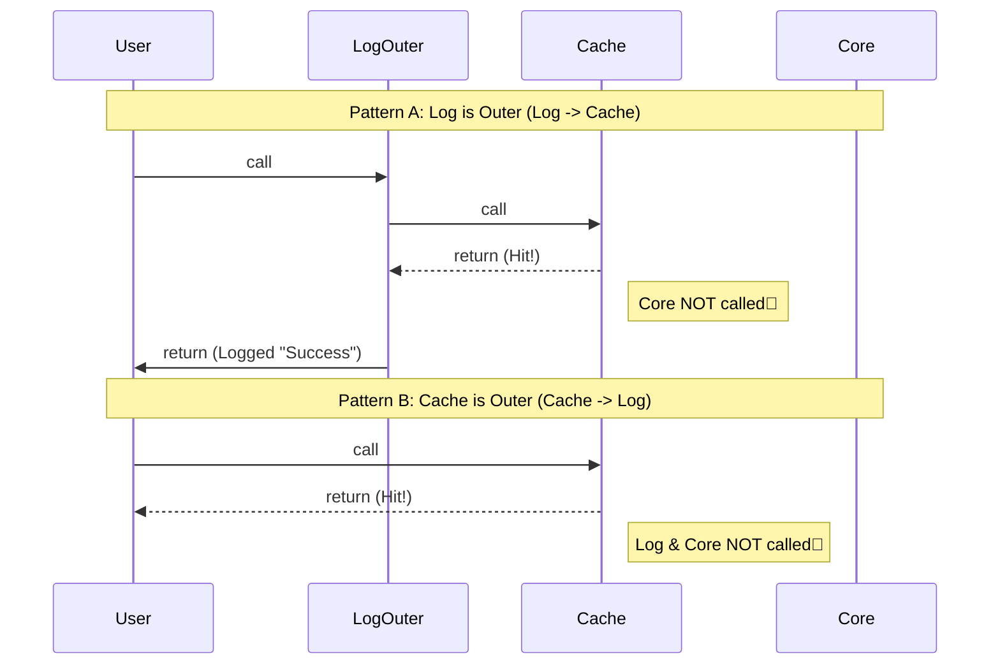

# 第47章：Decorator ③ まとめ：責務の分解と再利用の気持ちよさ✨

## ねらい🎯

* 「ログ📒」「計測⏱️」「キャッシュ🗃️」「リトライ🔁」みたいな**横断関心（どこでも出てくる共通の面倒ごと）**を、本体ロジックから引きはがせるようになる✨
* Decorator（ラップ）を**重ねる順番**で、挙動が変わる理由が説明できるようになる🔁

---

## 今日のキーワード🧩

* **本体ロジック**：アプリの“ほんとの仕事”☕🧾
* **横断関心**：ログ/計測/監視/キャッシュ/再試行/権限チェックなど、いろんな所に出るやつ📦
* **Decorator（ラッパー）**：本体を包んで機能を足す🎁
* **順番（order）**：重ね方で結果が変わる（大事！）🧅

---

## 1) Decoratorが「気持ちいい〜✨」ってなる瞬間🎁


たとえば「メニューの価格を取得する」関数があるとして…

* たまに失敗するから **リトライしたい** 🔁
* 遅いから **時間を測りたい** ⏱️
* 同じIDを何度も取るから **キャッシュしたい** 🗃️
* 何が起きたか追いたいから **ログを出したい** 📒

…って要望が後から後から増えるよね😵‍💫
ここで本体に全部書き足すと、**本体がぐちゃぐちゃ**になる💥

Decoratorはこうする👇

* 本体：価格を取る（それだけ）☕
* 本体：価格を取る（それだけ）☕
* おまけ：ログ/計測/キャッシュ/リトライ（外側で足す）🎁


---

## 2) 強いDecoratorの“3原則”💪✨


## 原則①：Decoratorは「1つの責務」だけ🧼

* `withLogging` はログだけ📒
* `withTiming` は計測だけ⏱️
* `withCache` はキャッシュだけ🗃️

## 原則②：入出力の形はなるべく変えない🧩

「同じ引数を受けて、同じ型を返す」だと重ねやすい✨
（“差し替え可能”ってことね！）

## 原則③：失敗の扱いを揃える🧯

* 例外で統一するなら例外
* Result型で統一するならResult
  途中で混ぜると地獄😇

※ ちなみに「@デコレータ構文（TypeScriptのdecorators）」は別の話（メタプログラミング寄り）で、GoFのDecoratorとは目的が違うよ〜🧠 ([JavaScript in Plain English][1])
（でも“包んで差し替える”という発想は近い✨） ([TypeScript][2])

---

## 3) ハンズオン🛠️：価格取得関数を、外側から強化しよう🎁

題材：`fetchPrice(itemId)`（価格を取る）
→ これに **キャッシュ🗃️** と **ログ📒** と **計測⏱️** と **リトライ🔁** を足す！

---

## Step 0：まず“本体”を用意☕

（わざと失敗しやすいデモ）

```ts
type MenuDb = Record<string, number>;

const db: MenuDb = {
  latte: 480,
  mocha: 520,
};

const sleep = (ms: number) => new Promise<void>((r) => setTimeout(r, ms));

export async function fetchPrice(itemId: string): Promise<number> {
  await sleep(50);

  // たまに失敗する（デモ）
  if (Math.random() < 0.3) throw new Error("network error");

  const price = db[itemId];
  if (price == null) throw new Error("not found");
  return price;
}
```

---

## Step 1：ログDecorator 📒 `withLogging`


同期/非同期どっちでも動くようにしておくと便利✨

```ts
type AnyFn = (...args: any[]) => any;

export const withLogging =
  (name: string) =>
  <F extends AnyFn>(fn: F): F =>
    ((...args: Parameters<F>): ReturnType<F> => {
      console.log(`📒 [${name}] args:`, args);

      const out = fn(...args);

      if (out instanceof Promise) {
        return out
          .then((v) => {
            console.log(`✅ [${name}] ok`);
            return v;
          })
          .catch((e) => {
            console.log(`❌ [${name}] err:`, e);
            throw e;
          }) as ReturnType<F>;
      }

      console.log(`✅ [${name}] ok`);
      return out;
    }) as F;
```

---

## Step 2：計測Decorator ⏱️ `withTiming`

`performance.now()` は高精度タイマーだよ⏱️ ([MDN Web Docs][3])
環境差を避けるために `globalThis` 経由にしておくと安心✨ ([MDN Web Docs][4])

```ts
type AnyFn = (...args: any[]) => any;

const nowMs = () => globalThis.performance?.now?.() ?? Date.now();

export const withTiming =
  (name: string) =>
  <F extends AnyFn>(fn: F): F =>
    ((...args: Parameters<F>): ReturnType<F> => {
      const start = nowMs();
      const out = fn(...args);

      const endLog = () => {
        const ms = nowMs() - start;
        console.log(`⏱️ [${name}] ${ms.toFixed(1)}ms`);
      };

      if (out instanceof Promise) {
        return out.finally(endLog) as ReturnType<F>;
      }

      endLog();
      return out;
    }) as F;
```

---

## Step 3：キャッシュDecorator 🗃️ `withCache`

ここは “標準の`Map`” で王道実装✨
**失敗はキャッシュしない**ようにしておくと扱いやすいことが多いよ🧯

```ts
export const withCache =
  <K, V>(getKey: (...args: any[]) => K) =>
  <F extends (...args: any[]) => Promise<V>>(fn: F): F => {
    const cache = new Map<K, Promise<V>>();

    return (async (...args: Parameters<F>): Promise<V> => {
      const key = getKey(...args);

      const hit = cache.get(key);
      if (hit) return hit;

      const p = fn(...args);
      cache.set(key, p);

      try {
        return await p;
      } catch (e) {
        cache.delete(key); // 失敗は残さない
        throw e;
      }
    }) as F;
  };
```

---

## Step 4：リトライDecorator 🔁 `withRetry`

「非同期で失敗するかも」な関数にだけ付けるのが自然✨

```ts
const sleep = (ms: number) => new Promise<void>((r) => setTimeout(r, ms));

export const withRetry =
  (opts: { retries: number; delayMs?: number }) =>
  <F extends (...args: any[]) => Promise<any>>(fn: F): F =>
    (async (...args: Parameters<F>) => {
      let lastErr: unknown;

      for (let i = 0; i <= opts.retries; i++) {
        try {
          return await fn(...args);
        } catch (e) {
          lastErr = e;
          if (i === opts.retries) break;
          if (opts.delayMs) await sleep(opts.delayMs);
        }
      }

      throw lastErr;
    }) as F;
```

---

## Step 5：重ねる（decorate）🧅✨

ネストが読みにくくなるから、軽いヘルパーがあると見やすいよ👀

```ts
type AnyFn = (...args: any[]) => any;

export function decorate<F extends AnyFn>(
  fn: F,
  ...decorators: Array<(f: any) => any>
): F {
  // 左から順に “包む”
  // decorate(fn, A, B) === B(A(fn))
  return decorators.reduce((acc, d) => d(acc), fn) as F;
}
```

合体版👇

```ts
const fetchPriceSafe = decorate(
  fetchPrice,
  withCache<string, number>((id: string) => id),
  withRetry({ retries: 2, delayMs: 10 }),
  withTiming("fetchPrice"),
  withLogging("fetchPrice"),
);
```

---

## 4) いちばん大事：Decoratorは“順番で意味が変わる”🔁🧅


## ルール感覚🧠

* **後ろに書いたDecoratorほど外側**（= 先に動く）
* `decorate(fn, A, B)` は **Bが一番外側** だよ🧅

---

## 実験①：ログ📒 と キャッシュ🗃️ の順番


**A：ログが外側** → キャッシュヒットでもログが出る📒✨
**B：キャッシュが外側** → キャッシュヒットだと本体（＋ログ）が呼ばれず、ログが出ない🗃️😶

```ts
const A = decorate(
  fetchPrice,
  withCache<string, number>((id: string) => id),
  withLogging("A"),
);

const B = decorate(
  fetchPrice,
  withLogging("B"),
  withCache<string, number>((id: string) => id),
);

async function demo() {
  console.log("---- A ----");
  await A("latte");
  await A("latte"); // 2回目（キャッシュ）でもログ出る

  console.log("---- B ----");
  await B("latte");
  await B("latte"); // 2回目（キャッシュ）だとログ出ない
}
```

**どっちが正解？**

* “キャッシュでも呼ばれた記録が欲しい” → ログ外側📒
* “本体が動いた時だけログが欲しい” → ログ内側📒（キャッシュ外側）

用途で決めよう〜✨



---

## 実験②：計測⏱️ と リトライ🔁 の順番

* **計測が外側**：リトライを含めた“総時間”を測る⏱️
* **計測が内側**：1回ぶんの“本体時間”を測る⏱️

「何を測りたいか」で順番が変わるよ🎯

---

## 5) つまずきポイント集💡（ここハマりやすい！）


## 🌀 Decoratorを盛りすぎる

* `withA(withB(withC(withD(fn))))` みたいになると、追うのが大変😵‍💫
  → **3つ超えたら**「本当に必要？」って一回立ち止まろう🧯

## 🧨 “副作用”が二重に走る

* リトライの外側に「課金」みたいな処理があると…💸💥
  → リトライするなら **再実行しても安全（冪等）** な範囲だけに！

## 🧩 エラーの形が揺れる

* あるDecoratorは例外、別のDecoratorは `null` 返す…は地獄😇
  → 失敗の表現は統一🧯

---

## 6) ミニテスト🧪：「順番が違うと呼ばれ方が変わる」を確認✨

ログを本当に読む代わりに、配列に記録して順番をチェックするよ👀

```ts
import { describe, it, expect } from "vitest";

type AnyFn = (...args: any[]) => any;

const trace =
  (label: string, calls: string[]) =>
  <F extends AnyFn>(fn: F): F =>
    ((...args: Parameters<F>): ReturnType<F> => {
      calls.push(`in:${label}`);
      const out = fn(...args);
      calls.push(`out:${label}`);
      return out;
    }) as F;

function decorate<F extends AnyFn>(fn: F, ...ds: Array<(f: any) => any>): F {
  return ds.reduce((acc, d) => d(acc), fn) as F;
}

describe("decorator order", () => {
  it("decorate(fn, A, B) means B is outer", () => {
    const calls: string[] = [];
    const core = () => calls.push("core");

    const fn = decorate(core, trace("A", calls), trace("B", calls));
    fn();

    expect(calls).toEqual([
      "in:B",
      "in:A",
      "core",
      "out:A",
      "out:B",
    ]);
  });
});
```

これが分かると、Decoratorの“重ね方”が一気に上手くなるよ〜🧠✨

---

## 7) AIプロンプト例🤖💬（コピペOK）

```txt
次の関数に GoF Decorator（高階関数）で横断関心を追加したいです。
条件：
- 本体ロジックは変更しない（外側から包む）
- 余計な独自クラスは作らない
- 型は Parameters/ReturnType でなるべく崩さない
やりたいDecorator：
1) withLogging 2) withTiming 3) withCache(Map) 4) withRetry
さらに「順番で挙動が変わる例」を2つ示して、どっちが嬉しいか判断基準もください。
```

---

## 8) 🆕 2026メモ（最新事情をちょこっと）✨

* TypeScript は npm の `typescript` パッケージとして配布されていて、最新版は npm 側の “latest” で確認できるよ📦
* “decorators” は TC39 の提案（ステージ制）として進んでいて、TypeScript側のドキュメントも「標準デコレータ」と「従来のexperimental」などが整理されてるよ🧠 ([TypeScript][2])

（この章のDecoratorは **GoFの発想**として「関数で包む」を中心にやったよ🎁）

---

[1]: https://javascript.plainenglish.io/typescript-decorators-legacy-vs-new-in-everyday-use-b08175c7a4a6?utm_source=chatgpt.com "TypeScript Decorators: Legacy vs. New in Everyday Use"
[2]: https://www.typescriptlang.org/docs/handbook/release-notes/typescript-5-8.html?utm_source=chatgpt.com "Documentation - TypeScript 5.8"
[3]: https://developer.mozilla.org/en-US/docs/Web/API/Performance/now?utm_source=chatgpt.com "Performance: now() method - Web APIs - MDN Web Docs"
[4]: https://developer.mozilla.org/en-US/docs/Web/JavaScript/Reference/Global_Objects/globalThis?utm_source=chatgpt.com "globalThis - JavaScript - MDN Web Docs"
