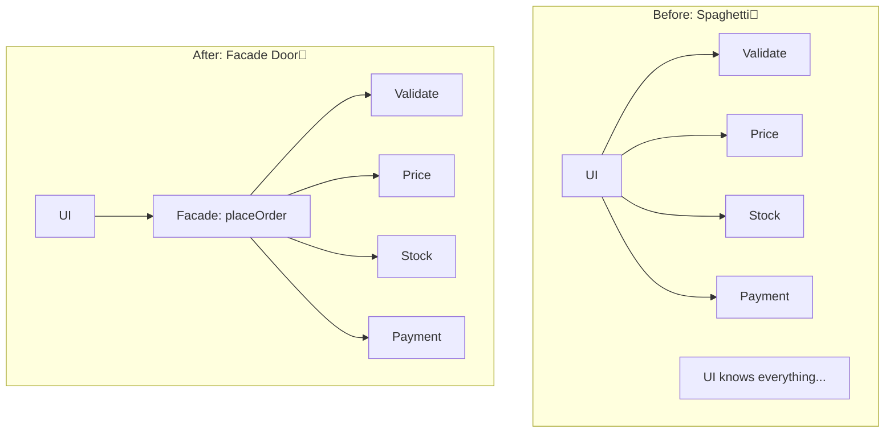

# 第48章：Facade ① 複雑すぎる機能に“入口”を作る🚪

## ねらい🎯

* 「注文確定」みたいに手順が多い処理を、**1つの“入口API”**にまとめられるようになる😊
* 呼び出し側（UI/CLI/APIルート）のコードが **短く・読みやすく** なる✨
* 入口を作りつつ、**中身が“神”にならない**コツも知る🧠

---

## 1) Facadeってなに？🧁

Facade（ファサード）は、**複雑なサブシステムに対して、使う側がラクになる“シンプルな窓口（入口）”を用意する**パターンだよ🚪✨
「中で何が起きてるか」は隠してOK。でも「どう使うか」は分かりやすくする感じ！📦
([ウィキペディア][1])


---

## 2) あるある：入口が無いとこうなる😵‍💫

たとえば「注文確定」って、やることが多いよね👇

* 入力チェック✅
* 割引・クーポン適用🏷️
* 在庫確保📦
* 決済💳
* 通知📣
* エラー処理・後始末🧯

入口が無いと、呼び出し側（クリックイベントやAPIルート）に全部並んで、**巨大な“手順の塊”**になりがち…😇


```ts
// ❌ 入口が無い例：UIやAPIルートに手順が全部ベタ書き
async function onClickConfirm() {
  validateDraft(draft);
  const priced = applyDiscounts(draft);
  await reserveStock(priced.items);
  const payment = await charge(priced.total);
  await sendNotification(payment.orderId);
  // 失敗時の後始末もここに増えていく…
}
```

これ、つらいポイントが多いよ〜😭

* 1箇所が長くて読めない📜
* 途中の失敗で片付けが地獄🧯
* UIでもAPIでも同じ手順を使いたいのにコピペが増える📎



---

## 3) Facadeでこうする🚪✨（“入口API”を1個作る）

やりたいのはこれ👇

* 呼び出し側は **1つの関数**を呼ぶだけ🎉
* 中で必要な手順をまとめて実行🧩


```ts
// ✅ Facade（入口）
const result = await placeOrder(draft, deps);
```

呼び出し側が急にスッキリするよね😊✨
さらに、同じ `placeOrder` を **UI / CLI / API** で共有できるのが超強い💪

---

## 4) TypeScriptでFacadeを“気持ちよく”作るコツ🧠✨

## コツA：Facadeの「公開API」を小さくする🧁


* 外に見せる関数は **少なめ**（1〜3個くらいが気持ちいい）😊
* 引数は「ドメイン的に自然な塊」にする（`draft` とか `user` とか）📦

## コツB：外部依存は“引数で渡す”💉


決済・在庫・通知みたいな外の世界は、Facadeに直接べったりくっつけない！
**依存を引数（deps）で受け取る**と、テストが超ラクになる🧪✨

## コツC：Facadeは“まとめ役”。判断を全部抱えない⚠️


* Facadeは **手順のオーケストラ指揮者**🎻
* ルール（割引計算とか）は **小関数に分けて**置くとキレイ✨

---

## 5) ハンズオン🛠️：注文確定 `placeOrder` Facadeを作ろう☕🧾

## 5-1) 型を用意する📌

まずは題材を最小にするよ🧁

```ts
export type OrderItem = {
  sku: string;
  qty: number;
  unitPrice: number;
};

export type OrderDraft = {
  customerId: string;
  items: OrderItem[];
  couponCode?: string;
};

export type OrderReceipt = {
  orderId: string;
  total: number;
};

export type PlaceOrderError =
  | { type: "VALIDATION"; message: string }
  | { type: "OUT_OF_STOCK"; message: string }
  | { type: "PAYMENT_FAILED"; message: string };
```

## 5-2) “外の世界”はインターフェースで受ける🌍

ここが大事ポイント✨（テストしやすくなるよ🧪）

```ts
export type Deps = {
  inventory: {
    reserve: (items: { sku: string; qty: number }[]) => Promise<
      | { ok: true }
      | { ok: false; reason: "OUT_OF_STOCK"; message: string }
    >;
  };
  payment: {
    charge: (params: { customerId: string; amount: number }) => Promise<
      | { ok: true; orderId: string }
      | { ok: false; message: string }
    >;
  };
  notifier: {
    sendOrderConfirmed: (orderId: string) => Promise<void>;
  };
};
```

## 5-3) 小関数に分ける（Facadeの中身を整理✨）

ここで“神Facade”化を防ぐよ🧠

```ts
function validateDraft(draft: OrderDraft): { ok: true } | { ok: false; message: string } {
  if (!draft.customerId) return { ok: false, message: "customerId が空だよ🥺" };
  if (draft.items.length === 0) return { ok: false, message: "商品が1つもないよ🥺" };
  for (const it of draft.items) {
    if (it.qty <= 0) return { ok: false, message: "qty は1以上にしてね🥺" };
    if (it.unitPrice < 0) return { ok: false, message: "unitPrice が変だよ🥺" };
  }
  return { ok: true };
}

function calcSubtotal(items: OrderItem[]): number {
  return items.reduce((sum, it) => sum + it.qty * it.unitPrice, 0);
}

function applyCoupon(subtotal: number, couponCode?: string): number {
  if (!couponCode) return subtotal;

  // 例：WELCOME10 は 10%OFF（超簡易）
  if (couponCode === "WELCOME10") return Math.floor(subtotal * 0.9);

  // 未知クーポンは「無視」じゃなく、仕様次第でエラーでもOK👌
  return subtotal;
}

function toReserveItems(items: OrderItem[]) {
  return items.map((it) => ({ sku: it.sku, qty: it.qty }));
}
```

## 5-4) Facade本体：`placeOrder` 🚪✨

入口はこれ1個！🎉
「成功 or 失敗」を分かりやすく返すよ（Resultっぽく）🧁

```ts
export type Result<T, E> = { ok: true; value: T } | { ok: false; error: E };

export async function placeOrder(
  draft: OrderDraft,
  deps: Deps,
): Promise<Result<OrderReceipt, PlaceOrderError>> {
  // 1) validate ✅
  const v = validateDraft(draft);
  if (!v.ok) return { ok: false, error: { type: "VALIDATION", message: v.message } };

  // 2) pricing 🧮
  const subtotal = calcSubtotal(draft.items);
  const total = applyCoupon(subtotal, draft.couponCode);

  // 3) reserve stock 📦
  const r = await deps.inventory.reserve(toReserveItems(draft.items));
  if (!r.ok) return { ok: false, error: { type: "OUT_OF_STOCK", message: r.message } };

  // 4) charge payment 💳
  const p = await deps.payment.charge({ customerId: draft.customerId, amount: total });
  if (!p.ok) {
    // ※現実は「在庫確保を戻す（解除する）」等が必要になることがあるよ🧯
    return { ok: false, error: { type: "PAYMENT_FAILED", message: p.message } };
  }

  // 5) notify 📣
  await deps.notifier.sendOrderConfirmed(p.orderId);

  // done 🎉
  return { ok: true, value: { orderId: p.orderId, total } };
}
```

---

## 6) テスト🧪：Facadeを“依存差し替え”でラクに試す✨

## 6-1) 2026時点のテスト小ネタ📌

最近のNodeは **組み込みのテストランナー**が使えるよ🧪（`node:test` / `node --test`）。公式ドキュメント＆ガイドもある🙌
([nodejs.org][2])

## 6-2) 依存をスタブしてテストする💡

```ts
// placeOrder.test.ts
import test from "node:test";
import assert from "node:assert/strict";
import { placeOrder, type Deps, type OrderDraft } from "./placeOrder";

function makeDeps(overrides?: Partial<Deps>): Deps {
  const base: Deps = {
    inventory: {
      reserve: async () => ({ ok: true }),
    },
    payment: {
      charge: async () => ({ ok: true, orderId: "ORDER-001" }),
    },
    notifier: {
      sendOrderConfirmed: async () => {},
    },
  };
  return { ...base, ...overrides };
}

test("成功：注文が確定できる🎉", async () => {
  const draft: OrderDraft = {
    customerId: "C-1",
    items: [{ sku: "coffee", qty: 2, unitPrice: 300 }],
    couponCode: "WELCOME10",
  };

  const res = await placeOrder(draft, makeDeps());
  assert.equal(res.ok, true);
  if (res.ok) {
    assert.equal(res.value.orderId, "ORDER-001");
    assert.equal(res.value.total, 540); // 600の10%OFF
  }
});

test("失敗：在庫切れならOUT_OF_STOCK😢", async () => {
  const draft: OrderDraft = {
    customerId: "C-1",
    items: [{ sku: "cake", qty: 1, unitPrice: 500 }],
  };

  const deps = makeDeps({
    inventory: {
      reserve: async () => ({ ok: false, reason: "OUT_OF_STOCK", message: "在庫が足りないよ" }),
    },
  });

  const res = await placeOrder(draft, deps);
  assert.equal(res.ok, false);
  if (!res.ok) {
    assert.equal(res.error.type, "OUT_OF_STOCK");
  }
});
```

---

## 7) Facadeの“使いどころ”チェック✅✨

## Facadeが向くとき🙆‍♀️

* 手順が多くて、呼び出し側がごちゃごちゃしてきた😵‍💫
* UI/CLI/APIなど、**複数の入口**から同じ手順を使いたい🔁
* 「誤用」を防ぎたい（正しい順番を守らせたい）🚧

## Facadeが微妙なとき🙅‍♀️

* 手順が1〜2ステップしかない（ただの関数呼び出し）🧁
* 入口を作っても、隠す価値がない（むしろ分かりにくい）🤔

---

## 8) Facadeが“巨大化”しがちな罠と対策🧯

## 罠①：Facadeが神になる😇

* 条件分岐が増えすぎ
* 引数が増えすぎ
* 何でもFacadeに追加しちゃう

✅ 対策：

* **公開APIを増やさない**（入口の数は増やしにくくする）🚪
* 中身は **小関数へ分割**（`validate / pricing / reserve / pay / notify`）🧩
* 仕様が増えたら「分岐」じゃなく「手順の部品」を増やす意識✨

## 罠②：エラーが“よく分からない”😵


✅ 対策：

* 失敗理由は **型で分ける**（`type: "OUT_OF_STOCK"` みたいに）📦
* 「握りつぶして成功扱い」はしない🙅‍♀️

---

## 9) AIプロンプト例🤖💬（そのままコピペOK✨）

```text
次の placeOrder の Facade が巨大化しないように、
(1) 公開APIの責務、(2) 内部の小関数分割案、(3) エラー型の設計
をレビューして。TypeScript標準の書き方中心で、独自クラス乱立は避けて。
```

```text
placeOrder の単体テストを node:test で書きたい。
依存（inventory/payment/notifier）をスタブして、
代表ケースと境界ケースを合わせて6本だけ提案して。
```

```text
「在庫確保後に決済失敗したら、在庫を解除する」みたいな後始末を入れたい。
過剰に難しくせず、最小の補償処理（compensation）案を教えて。
```

---

## 10) 2026時点の“最新”メモ📌✨（軽く）

* TypeScriptは **5.9** が提供されていて、ツールや初期化周りの改善も続いてるよ🧁
  ([はてなブックマーク][3])
* さらにコンパイラのネイティブ化に向けた **TypeScript Native Previews** も進んでる（速度がテーマ）🚀
  ([Microsoft for Developers][4])
* Nodeは **v24系がLTS（24.13.0）**、v25系がCurrent、みたいにリリースが進んでるよ📦
  ([nodejs.org][5])

（この章のコードは「Facadeの考え方」中心なので、バージョンが変わっても崩れにくいよ👌）

---

## つまずき回避💡

* Facadeの中身が長くなったら、**“名前が付く単位”**で小関数に切る✂️✨
  例：`applyCoupon` / `toReserveItems` みたいに
* Facadeは「入口」なので、**呼び出し側に分岐や手順が戻ってきたら負け**🥺
  → 入口に寄せ直す🚪

---

## ミニ演習🎓✨

1. `couponCode` が未知なら **VALIDATIONエラーにする**仕様に変えてみよう🏷️
2. `inventory.reserve` が成功した後、`payment.charge` が失敗したら
   　**`inventory.release(...)` を呼ぶ**ように拡張してみよう🧯（※Depsに追加）
3. UI側のコードを、`placeOrder()` 呼ぶだけにして「短くなった！」を体感しよう🎉

[1]: https://en.wikipedia.org/wiki/Facade_pattern?utm_source=chatgpt.com "Facade pattern"
[2]: https://nodejs.org/api/test.html?utm_source=chatgpt.com "Test runner | Node.js v25.6.0 Documentation"
[3]: https://b.hatena.ne.jp/entry/s/devblogs.microsoft.com/typescript/announcing-typescript-5-9/?utm_source=chatgpt.com "Announcing TypeScript 5.9"
[4]: https://devblogs.microsoft.com/typescript/?utm_source=chatgpt.com "TypeScript"
[5]: https://nodejs.org/en/blog/release/v24.13.0?utm_source=chatgpt.com "Node.js 24.13.0 (LTS)"
