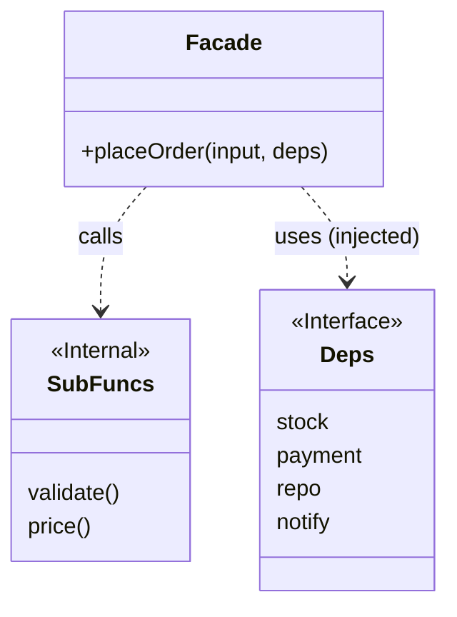

# 第49章：Facade ② TypeScriptの定番：サービス関数/クラス1枚でOK🧁

## ねらい🎯

* 「複雑な処理の入口」を **1つのAPI** にまとめて、呼び出し側（UI/CLI/API）をスッキリさせる✨
* Facade（入口役）が **巨大な神クラス/神関数にならない** 分割のコツを覚える🧼
* TypeScriptらしく **関数＋型＋依存を引数で渡す** だけで成立させる💉

---

## まずイメージ：Facadeってなに？🤔🚪

Facadeは「中で何ステップあるか」を呼び出し側に見せずに、**やりたいことを1回で頼める入口**を作るパターンだよ😊

たとえば「注文確定」って、だいたいこう👇

* 入力チェック✅
* 金額計算🧮
* 在庫確保📦
* 決済💳
* 保存🗃️
* 通知📣

これを画面側が全部やり始めると、画面コードが一気に“業務ロジックの巣”になる…😵‍💫
これを画面側が全部やり始めると、画面コードが一気に“業務ロジックの巣”になる…😵‍💫
→ そこで Facade の出番！


---

## ありがちな失敗例：呼び出し側が“全部知ってる”😇💥

```ts
// UIのクリックイベント内で、全部やっちゃう例（つらい）
async function onClickConfirm(input: any) {
  // 1) validate
  // 2) price
  // 3) reserve stock
  // 4) charge
  // 5) save
  // 6) notify
  // ...エラー処理もここに散らばる😵
}
```

この形のつらさ👇

* 手順の順番が散る（誰かが入れ替える）🔀
* エラー時の戻し（在庫戻す等）を忘れる😇
* 同じ「注文確定」が別画面・別APIでもコピペ増殖📄📄📄

---

## Facadeを“サービス関数1枚”で作るコツ🧁✨

### ルール1：Facadeの公開APIは少なくする🧼

* 公開するのは「注文確定する」みたいな **目的のAPIだけ**
* 中の細かい手順は「内部関数」に逃がす

### ルール2：Facadeは“司会者”に徹する🎤

* Facadeは **手順を呼ぶだけ**（オーケストレーション）
* 計算ロジックや判定ロジックは **小関数側** に寄せる

### ルール3：外部依存は引数で渡す（DIっぽく）💉

* 在庫・決済・保存・通知は、Facadeが直接newしない
* `deps`（依存まとめ）を引数で受け取るとテストが爆ラク🧪🎉



---

## ハンズオン🛠️：`placeOrder(...)` を Facade にする☕🧾

### 1) Result型（第15章の復習）🧯

例外で吹っ飛ばすより、まずは「成功/失敗」を戻り値で揃えると Facade が安定するよ😊

```ts
export type Result<T, E> =
  | { ok: true; value: T }
  | { ok: false; error: E };

export const ok = <T>(value: T): Result<T, never> => ({ ok: true, value });
export const err = <E>(error: E): Result<never, E> => ({ ok: false, error });
```

---

### 2) 入出力の型を作る（Facadeの“契約”）📦

「入口に渡すもの」「入口から返るもの」を先に決めるとブレにくいよ✨

```ts
export type Money = number; // 学習用なので number でOK（本番は型や通貨単位に注意）

export type OrderItem = {
  sku: string;
  qty: number;
  unitPrice: Money;
};

export type PlaceOrderInput = {
  customerId: string;
  items: OrderItem[];
  couponCode?: string;
};

export type PricedOrder = {
  customerId: string;
  items: OrderItem[];
  subtotal: Money;
  discount: Money;
  total: Money;
};

export type PlacedOrder = PricedOrder & {
  orderId: string;
};

export type PlaceOrderError =
  | { type: "INVALID_INPUT"; message: string }
  | { type: "OUT_OF_STOCK"; sku: string }
  | { type: "PAYMENT_FAILED"; message: string }
  | { type: "UNKNOWN"; message: string };
```

---

### 3) 依存（外部サービス）を“型”で定義する🧩

ここが「差し替えポイント」になるよ💉✨（テストで偽実装にできる）

```ts
export type StockService = {
  reserve(items: OrderItem[]): Promise<Result<void, { type: "OUT_OF_STOCK"; sku: string }>>;
};

export type PaymentService = {
  charge(params: { customerId: string; amount: Money }): Promise<Result<{ chargeId: string }, { type: "PAYMENT_FAILED"; message: string }>>;
};

export type OrderRepository = {
  save(order: PlacedOrder, chargeId: string): Promise<void>;
};

export type Notifier = {
  orderPlaced(order: PlacedOrder): Promise<void>;
};

export type Deps = {
  stock: StockService;
  payment: PaymentService;
  repo: OrderRepository;
  notify: Notifier;

  // テストで固定したいものは注入できるようにすると超便利🧪
  id?: () => string;
};
```

---

### 4) 中身は“小関数”に分割する（意味のある単位で）🧠✨

#### ✅ 入力チェック

```ts
import { Result, ok, err } from "./result";
import { PlaceOrderInput, PlaceOrderError } from "./types";

export function validateInput(input: PlaceOrderInput): Result<PlaceOrderInput, PlaceOrderError> {
  if (!input.customerId.trim()) return err({ type: "INVALID_INPUT", message: "customerId が空だよ🥺" });
  if (input.items.length === 0) return err({ type: "INVALID_INPUT", message: "商品が1つもないよ🥺" });
  if (input.items.some(x => x.qty <= 0)) return err({ type: "INVALID_INPUT", message: "数量は1以上にしてね🥺" });
  if (input.items.some(x => x.unitPrice < 0)) return err({ type: "INVALID_INPUT", message: "金額がマイナスは変だよ🥺" });
  return ok(input);
}
```

#### ✅ 金額計算（まずはベタでOK）

```ts
import { PlaceOrderInput, PricedOrder } from "./types";

export function priceOrder(input: PlaceOrderInput): PricedOrder {
  const subtotal = input.items.reduce((sum, x) => sum + x.unitPrice * x.qty, 0);

  // 学習用：クーポン "OFF10" なら10%引き、くらいでOK🧁
  const discount =
    input.couponCode === "OFF10" ? Math.floor(subtotal * 0.1) : 0;

  const total = Math.max(0, subtotal - discount);

  return {
    customerId: input.customerId,
    items: input.items,
    subtotal,
    discount,
    total,
  };
}
```

---

### 5) Facade本体：`placeOrder(...)`（司会者）🎤🚪

```ts
import { ok, err, Result } from "./result";
import { Deps } from "./deps";
import { PlaceOrderError, PlaceOrderInput, PlacedOrder } from "./types";
import { validateInput } from "./validate";
import { priceOrder } from "./price";

export async function placeOrder(
  input: PlaceOrderInput,
  deps: Deps
): Promise<Result<PlacedOrder, PlaceOrderError>> {
  // ① validate（ここで落ちたら外部呼び出ししないのが大事✅）
  const validated = validateInput(input);
  if (!validated.ok) return validated;

  // ② price（純粋関数に寄せるとテストしやすい🧪）
  const priced = priceOrder(validated.value);

  // ③ stock reserve
  const reserved = await deps.stock.reserve(priced.items);
  if (!reserved.ok) {
    return err({ type: "OUT_OF_STOCK", sku: reserved.error.sku });
  }

  // ④ payment
  const charged = await deps.payment.charge({
    customerId: priced.customerId,
    amount: priced.total,
  });
  if (!charged.ok) {
    return err({ type: "PAYMENT_FAILED", message: charged.error.message });
  }

  // ⑤ compose final order
  const orderId = deps.id?.() ?? `order_${Date.now()}`;
  const order: PlacedOrder = { orderId, ...priced };

  // ⑥ persist + notify（副作用はこの辺に寄せると見通し良い✨）
  await deps.repo.save(order, charged.value.chargeId);
  await deps.notify.orderPlaced(order);

  return ok(order);
}
```

ポイント🎯

* Facadeは「順番を保証」する役✨
* でも **重いロジックは小関数へ**（Facadeが太ると破滅）😇

---

## 呼び出し側がこう変わる🎉（Facadeのご褒美）

```ts
import { placeOrder } from "./placeOrder";

const result = await placeOrder(input, deps);

if (!result.ok) {
  // UIは「何が起きたか」だけ見ればOK😊
  showError(result.error);
} else {
  showSuccess(result.value.orderId);
}
```

「画面は画面の責務だけ」になって、めっちゃ読みやすくなるよ〜🥰✨

---

## テスト🧪：Facadeは“依存を差し替えられる”から超テスト向き🎉

### Vitestで最小テスト例🧁

Vitestは Node 20+ を要件にしているよ（Viteも要件あり）。([vitest.dev][1])

```ts
import { describe, it, expect, vi } from "vitest";
import { placeOrder } from "./placeOrder";
import { ok, err } from "./result";
import type { Deps } from "./deps";

function makeDeps(): Deps & { calls: any } {
  const calls = { save: 0, notify: 0, charge: 0, reserve: 0 };

  return {
    calls,
    id: () => "order_test_1",
    stock: {
      reserve: vi.fn(async () => {
        calls.reserve++;
        return ok(undefined);
      }),
    },
    payment: {
      charge: vi.fn(async () => {
        calls.charge++;
        return ok({ chargeId: "ch_1" });
      }),
    },
    repo: {
      save: vi.fn(async () => {
        calls.save++;
      }),
    },
    notify: {
      orderPlaced: vi.fn(async () => {
        calls.notify++;
      }),
    },
  };
}

describe("placeOrder (Facade)", () => {
  it("成功すると orderId を返して保存・通知まで走る🎉", async () => {
    const deps = makeDeps();
    const res = await placeOrder(
      {
        customerId: "c1",
        items: [{ sku: "coffee", qty: 2, unitPrice: 400 }],
        couponCode: "OFF10",
      },
      deps
    );

    expect(res.ok).toBe(true);
    if (res.ok) {
      expect(res.value.orderId).toBe("order_test_1");
      expect(res.value.subtotal).toBe(800);
      expect(res.value.discount).toBe(80);
      expect(res.value.total).toBe(720);
    }

    expect(deps.calls.reserve).toBe(1);
    expect(deps.calls.charge).toBe(1);
    expect(deps.calls.save).toBe(1);
    expect(deps.calls.notify).toBe(1);
  });

  it("在庫NGなら決済しない🧊", async () => {
    const deps = makeDeps();
    (deps.stock.reserve as any).mockImplementationOnce(async () => {
      deps.calls.reserve++;
      return err({ type: "OUT_OF_STOCK", sku: "coffee" });
    });

    const res = await placeOrder(
      {
        customerId: "c1",
        items: [{ sku: "coffee", qty: 1, unitPrice: 400 }],
      },
      deps
    );

    expect(res.ok).toBe(false);
    if (!res.ok) expect(res.error.type).toBe("OUT_OF_STOCK");

    expect(deps.calls.reserve).toBe(1);
    expect(deps.calls.charge).toBe(0); // ここ大事！
    expect(deps.calls.save).toBe(0);
    expect(deps.calls.notify).toBe(0);
  });

  it("入力NGなら外部呼び出しゼロ✅", async () => {
    const deps = makeDeps();
    const res = await placeOrder(
      {
        customerId: "",
        items: [],
      },
      deps
    );

    expect(res.ok).toBe(false);
    if (!res.ok) expect(res.error.type).toBe("INVALID_INPUT");

    expect(deps.calls.reserve).toBe(0);
    expect(deps.calls.charge).toBe(0);
  });
});
```

---

## “Facadeが太り始めた”サインと、痩せ方ダイエット🧘‍♀️✨

### 太り始めサイン🐷💦

* Facadeの中で `if/switch` が増殖してる
* 「割引の種類」みたいな **業務ルール** を Facade が持ち始めた
* Facadeのテストが「重い依存」だらけになってきた

### 痩せ方✨

* 業務判断は `priceOrder()` みたいな純粋関数へ🧼
* 依存は `deps` に寄せて、Facadeでnewしない💉
* “手順の列”が長くなったら、手順を **意味のある塊** にまとめる

  * 例：`prepareOrder()`（validate+price） / `commitOrder()`（save+notify）みたいに分ける📦

---

## AI活用プロンプト例🤖💬（Copilot/Codex向け）

### 1) 長い関数をFacadeに分割したい🪓

```text
この関数は注文確定の手順が混ざっていて長いです。
Facade（入口）として placeOrder(input, deps) に整理し、
中身を「意味のある小関数」に分割してください。
条件:
- TypeScript
- 依存は deps で注入（newしない）
- 例外より Result 型で返す
- Facadeは司会者（手順の呼び出し）に徹する
出力: 分割後のコード一式 + 分割理由
```

### 2) Facadeのテストケースが欲しい🧪

```text
placeOrder(input, deps) のテストケースを10個提案してください。
成功/失敗（入力NG・在庫NG・決済NG）を含め、
「決済が呼ばれない」「保存が呼ばれない」など副作用の有無も検証したいです。
Vitest + vi.fn 前提で、代表3本はコード例もください。
```

---

## つまずき回避💡（ここで転ばないで〜！🫶）

* 「Facade＝何でも詰め込む箱」じゃないよ📦❌
  → **入口は薄く、中身を小関数へ** が正解🙆‍♀️
* “小関数”は **意味で切る**（行数で切らない）✂️
  → validate / price / reserve / charge / persist みたいに目的で✨
* 依存を直接importして固定するとテストが地獄👹
  → `deps` 注入で天国へ🧪🌸

---

## 最新メモ（2026/02時点）🗞️✨

* TypeScriptのリリースノートは 5.9 が公開され、ページ更新日も 2026-02-03 になってるよ（最新版の確認に便利！）([typescriptlang.org][2])
* Vitestは「Node 20+」など要件が明記されているよ🧪（動かない時はここチェック！）([vitest.dev][1])
* NodeのLTS状況は公式のリリース表で追えるよ（どれ使うか迷ったら見ると安心）([nodejs.org][3])
* `structuredClone()` はブラウザ側では 2022年ごろから広く使える機能として整理されてるよ（深いコピー系の定番）([MDNウェブドキュメント][4])
  なお Node 側では `structuredClone` が v17 に入った、という経緯も確認できるよ([GitHub][5])

---

[1]: https://vitest.dev/guide/?utm_source=chatgpt.com "Getting Started | Guide"
[2]: https://www.typescriptlang.org/docs/handbook/release-notes/typescript-5-9.html?utm_source=chatgpt.com "Documentation - TypeScript 5.9"
[3]: https://nodejs.org/en/about/previous-releases?utm_source=chatgpt.com "Node.js Releases"
[4]: https://developer.mozilla.org/en-US/docs/Web/API/Window/structuredClone?utm_source=chatgpt.com "Window: structuredClone() method - Web APIs | MDN"
[5]: https://github.com/nodejs/node/issues/40756?utm_source=chatgpt.com "Backport `structuredClone` to Node v16 · Issue #40756"
