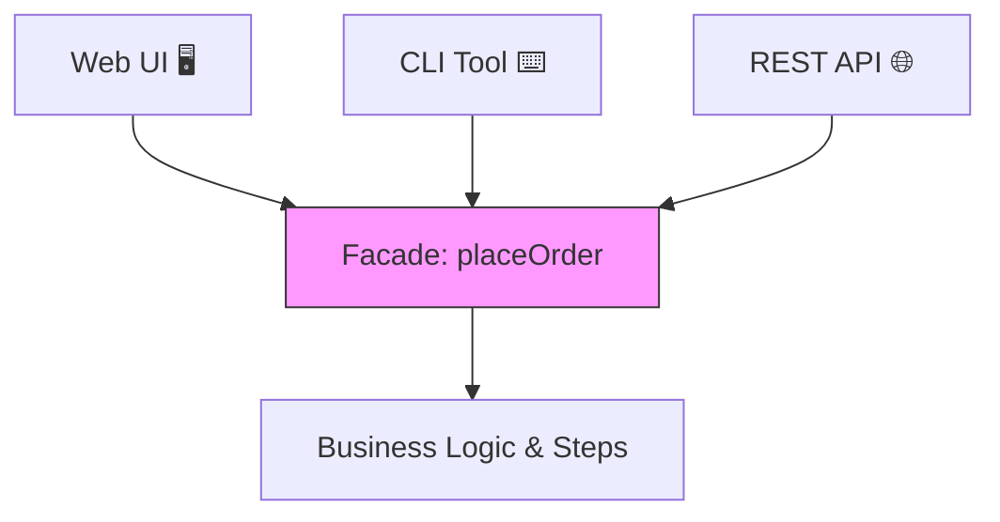

# 第50章：Facade ③ まとめ：呼び出し側のコードが短くなる🎉

## この章でのゴール🎯✨

* 「注文確定」みたいな複雑フローを **`placeOrder()` 1発**にまとめて、呼び出し側をスッキリさせる🧼
* UI/CLI/API みたいに入口が増えても、**同じFacadeを使い回せる**ようにする🔁
* Facadeが「隠す」だけじゃなく、**誤用を防ぐ門番**にもなる感覚をつかむ🛡️

---

## 1) Facadeの“いちばんおいしい所”🍰✨＝呼び出し側が短くなる！


Facadeの価値はこれ👇

* ✅ 呼び出し側が「手順」を知らなくていい（=読むのがラク）📖
* ✅ 入口が増えてもロジックが散らからない（UI/CLI/APIが増えても平気）🧩
* ✅ 手順の抜け・順番ミスを防げる（誤用防止）🚫
* ✅ テストがやりやすい（入口1個を叩けばOK）🧪



---

## 2) Before → After（短くなるの、体感しよっ）😆✨

## 😵 Before：呼び出し側が「手順」を全部知ってる

* どこで検証？
* 在庫は？
* 支払いは？
* 通知は失敗したら？
  …って、呼び出し側が考えること多すぎ💦

## 🎉 After：呼び出し側は「お願い」するだけ

* 「注文確定して！」→ `placeOrder(draft)`
* 「注文確定して！」→ `placeOrder(draft)`
* 結果を見て、UIを更新するだけ✨


---

## 3) 最小のFacadeを作る🧁（関数＋型でスッキリ）

ここでは、**Facade＝“1つの入口関数”**でいきます💡
クラス増殖はしません🙅‍♀️（必要になったら後で育てればOK🌱）

---

## 3-1) まずは型を用意（Resultもここで使うよ）🧠

```ts
// 成功/失敗を戻り値で表す（例外で暴れない）🧯
export type Result<T, E> =
  | { ok: true; value: T }
  | { ok: false; error: E };

export const ok = <T>(value: T): Result<T, never> => ({ ok: true, value });
export const err = <E>(error: E): Result<never, E> => ({ ok: false, error });

// 題材のデータ（できるだけ素直に）☕🧾
export type OrderItem = {
  sku: string;       // 商品ID
  name: string;
  unitPriceJPY: number;
  qty: number;
};

export type OrderDraft = {
  customerId: string;
  items: OrderItem[];
  couponCode?: string;
  paymentToken: string;
};

export type ConfirmedOrder = {
  orderId: string;
  items: OrderItem[];
  totalJPY: number;
  createdAt: Date;
};

// 失敗の種類（呼び出し側が分岐しやすい形に）🚦
export type PlaceOrderError =
  | { type: "ValidationError"; message: string }
  | { type: "OutOfStock"; sku: string }
  | { type: "PaymentFailed"; message: string; cause?: unknown }
  | { type: "NotificationFailed"; message: string; cause?: unknown };
```

---

## 3-2) Facadeが使う「外部との境界」をdepsに寄せる🔌

ポイント👇

* Facadeの中で `fetch` とかDBとか直接叩くとテストが辛い😵
* だから「外部I/O」は **関数として受け取る**（=差し替え簡単）💉✨

```ts
export type PlaceOrderDeps = {
  now: () => Date;
  generateOrderId: () => string;

  // 外部I/O（ここが差し替えポイント✨）
  reserveStock: (sku: string, qty: number) => Promise<Result<void, { type: "OutOfStock"; sku: string }>>;
  chargePayment: (paymentToken: string, amountJPY: number) => Promise<Result<{ receiptId: string }, { type: "PaymentFailed"; message: string; cause?: unknown }>>;
  saveOrder: (order: ConfirmedOrder) => Promise<void>;
  notifyCustomer: (customerId: string, orderId: string) => Promise<Result<void, { type: "NotificationFailed"; message: string; cause?: unknown }>>;
};
```

---

## 3-3) 中身は小さな関数に分解（Facadeが太るのを防ぐ）🧩

```ts
const validateDraft = (draft: OrderDraft): Result<void, { type: "ValidationError"; message: string }> => {
  if (!draft.customerId) return err({ type: "ValidationError", message: "customerIdが空だよ🥲" });
  if (!draft.paymentToken) return err({ type: "ValidationError", message: "支払い情報がないよ🥲" });
  if (draft.items.length === 0) return err({ type: "ValidationError", message: "商品が1つもないよ🥲" });

  for (const item of draft.items) {
    if (item.qty <= 0) return err({ type: "ValidationError", message: `数量が変だよ: ${item.name}` });
    if (item.unitPriceJPY < 0) return err({ type: "ValidationError", message: `価格が変だよ: ${item.name}` });
  }
  return ok(undefined);
};

const calcSubtotalJPY = (items: OrderItem[]): number =>
  items.reduce((sum, it) => sum + it.unitPriceJPY * it.qty, 0);

// ここは「例」。割引ルールが増えたらStrategyに逃がすとキレイ✨
const applyCouponJPY = (subtotalJPY: number, couponCode?: string): number => {
  if (!couponCode) return subtotalJPY;

  // 例：WELCOME10 → 10%OFF（雑でOK）
  if (couponCode === "WELCOME10") return Math.floor(subtotalJPY * 0.9);

  // 不明クーポンは無視（仕様次第でValidationErrorでもOK）
  return subtotalJPY;
};
```

---

## 3-4) Facade本体：`placeOrder()`（入口はここだけ！🚪✨）


**呼び出し側が知るのはこれだけ**になります🎉

```ts
export const placeOrder = async (
  draft: OrderDraft,
  deps: PlaceOrderDeps
): Promise<Result<ConfirmedOrder, PlaceOrderError>> => {
  // 1) 検証 ✅
  const v = validateDraft(draft);
  if (!v.ok) return err(v.error);

  // 2) 在庫確保 📦（順番をFacadeが守る）
  for (const item of draft.items) {
    const r = await deps.reserveStock(item.sku, item.qty);
    if (!r.ok) return err(r.error); // OutOfStock
  }

  // 3) 金額計算 💰
  const subtotal = calcSubtotalJPY(draft.items);
  const total = applyCouponJPY(subtotal, draft.couponCode);

  // 4) 決済 💳
  const pay = await deps.chargePayment(draft.paymentToken, total);
  if (!pay.ok) return err(pay.error);

  // 5) 注文確定データ作成 🧾
  const order: ConfirmedOrder = {
    orderId: deps.generateOrderId(),
    items: draft.items,
    totalJPY: total,
    createdAt: deps.now(),
  };

  // 6) 保存 💾
  await deps.saveOrder(order);

  // 7) 通知 📣（失敗をどう扱うかは仕様！ここでは失敗扱いにする例）
  const n = await deps.notifyCustomer(draft.customerId, order.orderId);
  if (!n.ok) return err(n.error);

  return ok(order);
};
```

---

## 4) UI/CLI/API…入口が増えても、呼び出しは同じ😍✨


## 4-1) UI（ボタン押した時）🖱️

```ts
const onClickConfirm = async (draft: OrderDraft, deps: PlaceOrderDeps) => {
  const result = await placeOrder(draft, deps);

  if (!result.ok) {
    showError(result.error); // ここはUI向けに整形してOK
    return;
  }

  showSuccess(`注文OK！注文番号: ${result.value.orderId} 🎉`);
};
```

## 4-2) CLI（コマンド実行）⌨️

```ts
const runCli = async (draft: OrderDraft, deps: PlaceOrderDeps) => {
  const result = await placeOrder(draft, deps);

  if (!result.ok) {
    console.error("失敗💥", result.error);
    process.exitCode = 1;
    return;
  }

  console.log("注文完了🎊", result.value);
};
```

## 4-3) API（HTTPハンドラ想定）🌐

```ts
const handleApi = async (draft: OrderDraft, deps: PlaceOrderDeps) => {
  const result = await placeOrder(draft, deps);

  if (!result.ok) {
    return { status: 400, body: result.error };
  }

  return { status: 200, body: result.value };
};
```

どれも「短っ！」ってなるのがFacadeの勝ち🎉✨
（複雑さは `placeOrder` の中に封じ込めた！🔒）

---

## 5) Facadeは“守る”🚧（誤用防止ポイント）


Facadeがあると、こういう事故が減るよ👇

* ❌ 検証を忘れて決済してしまう
* ❌ 在庫確保より先に保存してしまう
* ❌ 通知だけ別の場所で勝手にやって二重送信
* ❌ 手順が呼び出し側に散って、仕様変更で全滅

**手順の正しさ**を守るのがFacadeの強み🛡️✨

---

## 6) テストも“入口だけ叩けばOK”でラク🧪🎉


depsを差し替えるだけでテストできるのが気持ちいい💞

```ts
import { placeOrder, ok, err, type PlaceOrderDeps, type OrderDraft } from "./placeOrder";

const fixedDeps = (): PlaceOrderDeps => ({
  now: () => new Date("2026-02-05T00:00:00Z"),
  generateOrderId: () => "ORD-001",

  reserveStock: async () => ok(undefined),
  chargePayment: async () => ok({ receiptId: "R-123" }),
  saveOrder: async () => undefined,
  notifyCustomer: async () => ok(undefined),
});

export const testSuccess = async () => {
  const draft: OrderDraft = {
    customerId: "C-1",
    paymentToken: "tok_xxx",
    items: [{ sku: "S-1", name: "Latte", unitPriceJPY: 500, qty: 2 }],
    couponCode: "WELCOME10",
  };

  const r = await placeOrder(draft, fixedDeps());
  if (!r.ok) throw new Error("should succeed");

  // 合計 1000 → 10%OFF = 900
  if (r.value.totalJPY !== 900) throw new Error("total mismatch");
};

export const testOutOfStock = async () => {
  const deps = fixedDeps();
  deps.reserveStock = async (sku) => err({ type: "OutOfStock", sku });

  const draft: OrderDraft = {
    customerId: "C-1",
    paymentToken: "tok_xxx",
    items: [{ sku: "S-404", name: "SoldOut", unitPriceJPY: 500, qty: 1 }],
  };

  const r = await placeOrder(draft, deps);
  if (r.ok) throw new Error("should fail");
  if (r.error.type !== "OutOfStock") throw new Error("wrong error");
};
```

---

## 7) つまずきポイント集（あるある）😵‍💫➡️😆

## ① Facadeが太って「神関数」になる👑💥


✅ 対策：

* 中身は **小関数に分ける**（上の `validateDraft` みたいに）🧩
* 「金額計算」「通知」「在庫」などは、**別モジュールへ分離**📦

## ② “Facadeの中で全部決める”が増えて、変更が怖い😨


✅ 対策：

* ルールが増える所は **Strategy/Chain** に逃がしてOK（次の章でやるやつ！）⚙️⛓️

## ③ 失敗の扱いが曖昧でカオス😇

✅ 対策：

* `PlaceOrderError` を **型で固定**して、分岐を整理🚦
* 「通知失敗は注文自体は成功扱い？」みたいな仕様は、先に決める📌

---

## 8) まとめチェックリスト✅✨

* [ ] 呼び出し側が `placeOrder()` だけ知っていれば動く🎉
* [ ] 手順の順番・必須工程をFacadeが保証してる🛡️
* [ ] 外部I/Oはdepsに寄せて差し替えできる💉
* [ ] 失敗はResultで返して、UI/CLI/APIが同じ形で扱える🧯
* [ ] Facadeが太り始めたら“小関数/別モジュール”へ分ける🧩

---

## 9) AIプロンプト例🤖💬（そのままコピペOK）

```text
次のTypeScriptコードは、注文確定の手順が呼び出し側に散らばっていて読みにくいです。
GoFのFacadeとして「入口関数 placeOrder(draft, deps)」にまとめたいです。

制約：
- 余計な独自クラスを増やさない（関数＋型中心）
- 外部I/O（在庫/決済/保存/通知）はdepsとして注入
- 戻り値は Result<T, E> で、Eは判別Unionで表現

出力してほしいもの：
1) FacadeのAPI案
2) 中身を小関数に分けた実装例
3) 呼び出し側（UI/CLI/API）の短い例
4) テストしやすくするdepsスタブ例
```

---

## 10) 🆕最新メモ（本日時点の動き）📌✨

* **TypeScript 5.9** では、`import defer` のサポートなど、モジュールまわりの進化が入っています。Facadeみたいな「入口モジュール」を切り出す設計と相性がいいです。([Microsoft for Developers][1])
* Microsoft は TypeScript の将来として **6.0（橋渡し）→ 7.0（ネイティブ移行）**の話も公式に進捗共有しています。規模が大きいほど「入口を薄く固定するFacade」みたいな設計が効きやすいです。([Microsoft for Developers][2])
* **Node.js** は 2026-01-13 に **22.22.0 (LTS)** のセキュリティリリースが出ています（LTS運用は定期更新が大事💡）。([nodejs.org][3])
* `Error` の `cause`（エラー連鎖）みたいに、失敗情報を丁寧に運ぶ流れも一般化してきています。Facade内部で「失敗の文脈」を保ちたいときに便利です。([Zenn][4])

[1]: https://devblogs.microsoft.com/typescript/announcing-typescript-5-9/?utm_source=chatgpt.com "Announcing TypeScript 5.9"
[2]: https://devblogs.microsoft.com/typescript/progress-on-typescript-7-december-2025/?utm_source=chatgpt.com "Progress on TypeScript 7 - December 2025"
[3]: https://nodejs.org/en/blog/release/v22.22.0?utm_source=chatgpt.com "Node.js 22.22.0 (LTS)"
[4]: https://zenn.dev/pixiv/articles/bb123b2f50cdab?utm_source=chatgpt.com "エラーをチェインするライブラリと ES2022 Error Cause"
