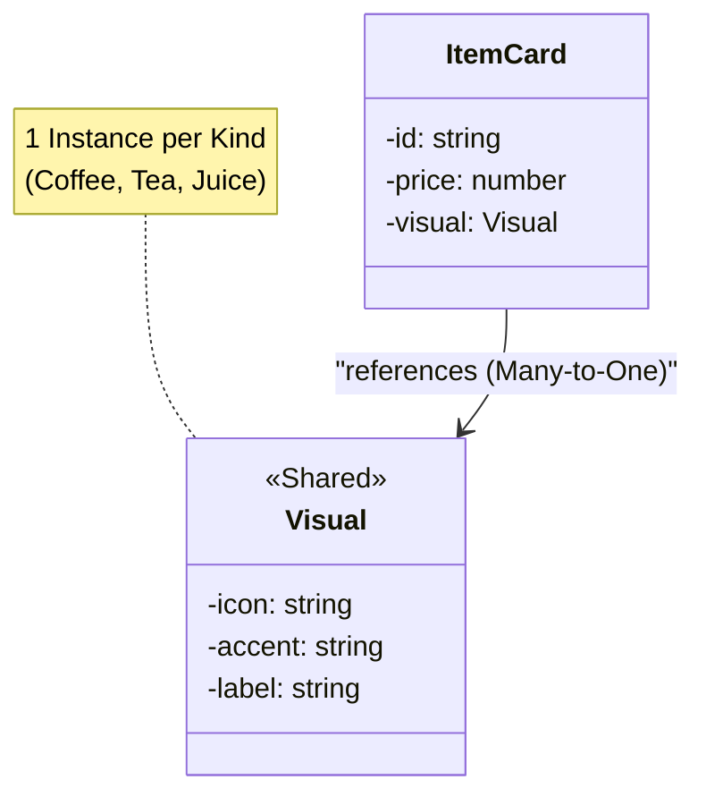

# 第51章：Flyweight ① 同じものを作りすぎて重い！🐢

## この章のねらい🎯

* 「**同じデータを何度も作って重い**」を見抜けるようになる👀
* **共有できる部分（共通）**と**共有できない部分（個別）**を分けられるようになる✂️
* TypeScriptで **Mapキャッシュ（標準）**を使って、Flyweightの考え方を“自然に”実装できるようになる🗃️✨

---

## 1. あるあるの困りごと😵‍💫「一覧が重い」「同じもの作りすぎ」

たとえば、カフェ注文アプリで「商品一覧カード」をいっぱい描画する場面を想像してみてね☕📱

* 商品は **1万件**ある（イベントで爆売れ！🎉）
* でも種類は **数種類**（コーヒー/紅茶/ジュース）しかない
* なのに…各商品カードで毎回こんなものを作ってたら？👇

  * アイコン（文字列/SVG/コンポーネント参照など）
  * 色・スタイル設定（オブジェクト）
  * 表示ラベル（“COFFEE”みたいな定数）

**同じ内容のオブジェクトが1万個**できて、メモリもGCも描画もつらくなる…🐢💦

---

## 2. Flyweightってなに？🪶（超ざっくり）

Flyweightは一言でいうと…

> **「みんなで使い回せる“共通パーツ”は共有して、個別の情報だけ各自が持つ」** だよ🧩✨
>
> 


ポイントはこの2つ👇

* **共有できる部分（Intrinsic / 内部状態）**：変わらない・共通のデータ
  例）アイコン、テーマ色、表示名、フォント設定 など
* **共有できない部分（Extrinsic / 外部状態）**：アイテムごとに違うデータ
  例）id、価格、在庫数、数量、ユーザーが選んだトッピング など



---

## 3. 「共有できる/できない」仕分け練習🧠✨

今回の題材（商品カード）で分けるとこんな感じ👇

## ✅ 共有できる（Flyweightにする候補）🪶

* `kind` が同じなら同じでOKなもの

  * アイコン：`"☕"` / `"🍵"`
  * アクセント色：`"#7b4a12"` みたいなテーマ
  * 種類ラベル：`"Coffee"` / `"Tea"`

## ✅ 個別（共有しない）📌

* 商品ごとに違うもの

  * `id`（商品ID）
  * `name`（商品名：同じkindでも商品名は色々あるよね）
  * `price`（価格）

---

## 4. まずはダメな例😇（同じものを毎回new）

```ts
type DrinkKind = "coffee" | "tea" | "juice";

type Visual = {
  icon: string;
  accent: string;
  label: string;
};

function createVisual(kind: DrinkKind): Visual {
  // ここが毎回作られてしまう！
  switch (kind) {
    case "coffee":
      return { icon: "☕", accent: "#7b4a12", label: "Coffee" };
    case "tea":
      return { icon: "🍵", accent: "#2e7d32", label: "Tea" };
    case "juice":
      return { icon: "🧃", accent: "#f57c00", label: "Juice" };
  }
}

type ItemCard = {
  id: string;
  name: string;
  price: number;
  kind: DrinkKind;
  visual: Visual; // ← 毎回 new されると重い
};

function createItemCard(input: { id: string; name: string; price: number; kind: DrinkKind }): ItemCard {
  return {
    ...input,
    visual: createVisual(input.kind),
  };
}
```

これ、`kind` が3種類でも、カードが1万件あったら **Visualが1万個**できちゃうよね😵‍💫

---

## 5. Flyweightにする✨（Mapキャッシュで共有する）

## Mapって何が嬉しいの？🗃️

`Map` は「キー→値」を持てて、キーに **文字列もオブジェクトも**使える標準コレクションだよ。([MDNウェブドキュメント][1])
（今回みたいに `kind` をキーにすると相性バツグン👌）

---

## 5-1. “共有Visual”をキャッシュする関数を作る🪶

```ts
type DrinkKind = "coffee" | "tea" | "juice";

type Visual = Readonly<{
  icon: string;
  accent: string;
  label: string;
}>;

// kindごとに1個だけ持つ（増え方が小さいならMapで十分）
const visualCache = new Map<DrinkKind, Visual>();

function buildVisual(kind: DrinkKind): Visual {
  // ここは「共通パーツ生成」なので、素直にswitchでOK！
  // （あとで章が進んだら、設定表にしてもいいよ）
  switch (kind) {
    case "coffee":
      return Object.freeze({ icon: "☕", accent: "#7b4a12", label: "Coffee" });
    case "tea":
      return Object.freeze({ icon: "🍵", accent: "#2e7d32", label: "Tea" });
    case "juice":
      return Object.freeze({ icon: "🧃", accent: "#f57c00", label: "Juice" });
  }
}

export function getVisual(kind: DrinkKind): Visual {
  const cached = visualCache.get(kind);
  if (cached) return cached;

  const created = buildVisual(kind);
  visualCache.set(kind, created);
  return created;
}
```

ポイント💡

* `Visual` を `Readonly` にしておくと、「共有なのに書き換えちゃった！」事故を減らせる🧯
* `Object.freeze` はさらに強め（実行時にも守る）🔒
  ※凍結は万能じゃないけど、学習では事故防止に便利！

---

## 5-2. “個別データ”はいつも通りカードに持たせる📌

```ts
type DrinkKind = "coffee" | "tea" | "juice";
type Visual = Readonly<{ icon: string; accent: string; label: string }>;

type ItemCard = {
  id: string;
  name: string;
  price: number;
  kind: DrinkKind;
  visual: Visual; // ← 参照を共有するだけ！
};

function createItemCard(input: { id: string; name: string; price: number; kind: DrinkKind }): ItemCard {
  return {
    ...input,
    visual: getVisual(input.kind),
  };
}
```

これで **カード1万件でも、Visualはkind数ぶんだけ**🎉🪶

---

## 6. 本当に共有できてる？👀（サクッと確認）

「同じ参照が使い回されてるか」は `Set` で確認できるよ✅

```ts
const kinds: DrinkKind[] = ["coffee", "tea", "juice"];

const cards = Array.from({ length: 10_000 }, (_, i) => {
  const kind = kinds[i % kinds.length];
  return createItemCard({
    id: `p-${i}`,
    name: `Item ${i}`,
    price: 300 + (i % 200),
    kind,
  });
});

const uniqueVisualRefs = new Set(cards.map((c) => c.visual));
console.log("unique visual refs =", uniqueVisualRefs.size); // 期待：3
```

`unique visual refs` が **3** になってたら、Flyweight成功〜！🎉✨

---

## 7. つまずきポイント集🧯（ここ超大事）

## ❌ 共有物を「後から書き換える」事故⚠️

共有Visualを誰かがこうやって変えたら…？

```ts
const v = getVisual("coffee");
// v.accent = "#ff0000"; // Readonlyならコンパイルで止まる（えらい！）
```

もし書き換えられちゃう設計だと、「coffee全部が赤になる」みたいな怪現象が起きるよ😱
→ **Flyweightは“基本不変（immutable）”が正義**🧊✨

---

## ❌ キャッシュが増え続ける問題🕳️

`Map` は入れたら基本残る（強参照）ので、キーが無限に増える用途には注意！([MDNウェブドキュメント][2])
（例：ユーザーごとに別キー、リクエストごとに別キー…など）

対策の考え方👇

* キーの種類が有限ならOK（今回の `kind` はまさにそれ！）🙆‍♀️
* 無限に増えるなら、**破棄戦略（LRUなど）**や設計見直しを検討🧹

---

## 8. ちょい補足：WeakMapっていつ使うの？🫧

`WeakMap` は **キーがオブジェクト限定**で、そのキーが他から参照されなくなると **GCされ得る**のが特徴だよ。([MDNウェブドキュメント][3])
だから「オブジェクトに紐づく一時キャッシュ」みたいなときに便利🧠✨

（今回みたいにキーが `"coffee"` のような文字列なら `Map` が素直！）

---

## 9. ハンズオン🛠️（手を動かすと一気にわかる！）

## お題🍰：商品カードをFlyweight化しよう

1. まず「ダメな例」で `Visual` を毎回作る
2. `getVisual(kind)` を作って `Map` キャッシュにする
3. `Set` で `unique visual refs` を数えてみる（3になる？）
4. 共有物をうっかり書き換える事故を想像して、`Readonly` と `Object.freeze` を入れる🔒

---

## 10. AIプロンプト例🤖💬（コピペOK）

```txt
次のTypeScriptコードで、同じ内容のオブジェクトが大量生成されて重いです。
Flyweightの考え方で「共有できる部分」と「個別部分」を仕分けし、
Mapキャッシュ（標準）で共有する実装にリファクタしてください。

条件：
- 余計な“Flyweight専用クラス”は作らない（関数 + Map中心）
- 共有するデータは不変（Readonly / Object.freezeなど）を意識
- 仕上げに、共有できているかSetで参照数を数えるサンプルもつけて
```

---

## 11. まとめ✅🎉

* Flyweightは **「同じもの作りすぎ問題」**に効く🪶
* コツは **共有（共通）**と**個別（アイテムごと）**を分けること✂️
* TypeScriptでは **Mapキャッシュ**で自然に書ける🗃️([MDNウェブドキュメント][1])
* 共有物は **基本immutable**！書き換え事故が一番こわい😱🧊

---

## おまけ：最新メモ📝✨

現時点（2026-02-05）で `typescript` の最新安定版は **5.9.3**。([npmjs.com][4])
TypeScript 6.0 は **2026-02-10にBeta、2026-03-17にFinal予定**として計画が公開されてるよ。([GitHub][5])

[1]: https://developer.mozilla.org/ja/docs/Web/JavaScript/Reference/Global_Objects/Map?utm_source=chatgpt.com "Map - JavaScript - MDN Web Docs - Mozilla"
[2]: https://developer.mozilla.org/en-US/docs/Web/JavaScript/Reference/Global_Objects/Map?utm_source=chatgpt.com "Map - JavaScript - MDN Web Docs - Mozilla"
[3]: https://developer.mozilla.org/en-US/docs/Web/JavaScript/Reference/Global_Objects/WeakMap?utm_source=chatgpt.com "WeakMap - JavaScript - MDN Web Docs"
[4]: https://www.npmjs.com/package/typescript?activeTab=versions&utm_source=chatgpt.com "typescript"
[5]: https://github.com/microsoft/TypeScript/issues/63085?utm_source=chatgpt.com "TypeScript 6.0 Iteration Plan · Issue #63085"
