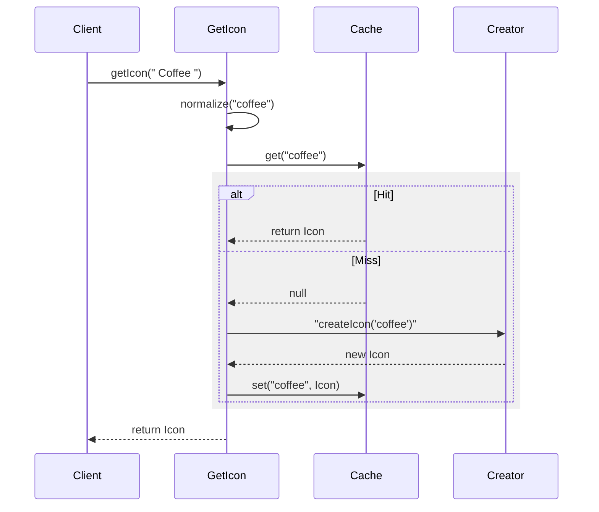

# 第52章：Flyweight ② TypeScript標準：Mapキャッシュで共有する🗃️

## ねらい🎯

* Flyweightの「共有する部分（intrinsic）」と「毎回変わる部分（extrinsic）」を分けられるようになる🧠✨ ([refactoring.guru][1])
* `Map` を使って「同じ重いものを何度も作らない」キャッシュ共有が書けるようになる🗃️💪
* 「キー設計」と「キャッシュ寿命（破棄）」の落とし穴を回避できるようになる🔑🧹

---

## 1) Flyweightって結局なに？🍬（超ざっくり）

Flyweightは「同じようなオブジェクトを大量に作るせいで重い…🥲」を、**共通部分を共有して**RAMを節約する考え方だよ〜🧁✨ ([refactoring.guru][1])

* **intrinsic（共有する中身）**：みんな同じでOKな“重い部分”
* **extrinsic（外から渡す）**：表示位置・色・サイズみたいに“都度変わる部分”
  この分け方がFlyweightのコアだよ📦➡️📌 ([UNC Computer Science][2])

---

## 2) TypeScriptでの現実解：Flyweight = `Map` キャッシュ🗃️✨

Flyweight専用のゴツいクラスを作らなくても、実務ではだいたいこれで十分👇

* **キー（例：アイコン名）** → **共有オブジェクト（例：SVG文字列/パース結果/設定オブジェクト）**
* すでに作ってあればそれを返す、なければ作って保存する


`Map` はキーと値を持てて、キーの等価性は **SameValueZero**（`NaN`同士も同一扱い、`+0`と`-0`も同一扱い）で判定されるよ🧠 ([MDNウェブドキュメント][3])
さらに **挿入順序を覚える**から、簡易な「古いものから捨てる」もやりやすい🎁 ([MDNウェブドキュメント][3])

---

## 3) ハンズオン🛠️：`getIcon(name)` を Map で共有しよう🎨

「メニューにアイコンを出す」みたいな場面を想像してね☕🍰
アイコンの **SVG生成が重い**（本当はパースや読み込みが重い想定）として、**同じアイコンを使い回す**よ！

## 3-1) 共有するもの（intrinsic）を定義📦

```ts
// 共有される“重い部分”にしたいもの（intrinsic）
export type Icon = Readonly<{
  name: string;
  svg: string; // 例：SVG文字列（本当はパース結果などでもOK）
}>;
```

## 3-2) Mapキャッシュ（Flyweightの本体）を作る🗃️


```ts
let createdCount = 0;

// ここが“工場＋キャッシュ”みたいな役（Flyweightっぽい中心）
const iconCache = new Map<string, Icon>();

// キーをブレさせない！🙅‍♀️（後で超大事）
function normalizeIconKey(name: string): string {
  return name.trim().toLowerCase();
}

function createIcon(name: string): Icon {
  createdCount++;

  // 例：重い生成処理っぽく（SVGを組み立てる想定）
  const svg = `<svg viewBox="0 0 24 24" aria-label="${name}">
    <text x="2" y="18">${name}</text>
  </svg>`;

  // 共有物は “不変” に寄せるのが鉄板（みんなで使うからね！）
  return Object.freeze({ name, svg });
}

export function getIcon(name: string): Icon {
  const key = normalizeIconKey(name);

  const cached = iconCache.get(key);
  if (cached) return cached;

  const icon = createIcon(key);
  iconCache.set(key, icon);
  return icon;
}

// デバッグ用：生成回数やキャッシュ数を見れるように
export function getIconStats() {
  return { createdCount, cacheSize: iconCache.size };
}
```



## 3-3) extrinsic（毎回変わるやつ）を外から渡す🎀


```ts
type MenuItemView = {
  label: string;
  iconName: string;

  // これが extrinsic（表示ごとに変わる）
  color: string;
  size: number;
};

export function renderMenuItem(view: MenuItemView): string {
  const icon = getIcon(view.iconName); // ← 共有！

  // extrinsic は“共有物に混ぜない”のがコツ🧁
  return [
    `label=${view.label}`,
    `icon=${icon.name}`,
    `color=${view.color}`,
    `size=${view.size}`,
  ].join(" | ");
}
```

✅ ここでのポイント

* `Icon` は **共有されるので不変が安全**（`Object.freeze`）🧊
* `color/size` は **外から渡す**（= extrinsic）🎀
* 共有物に `color` とか入れだすと「人によって色が変わる事故」になるよ〜😵‍💫

---

## 4) キー設計が9割🔑💥（Flyweightの地獄ポイント）


`Map` はキーで一致判定するから、**キーがブレると共有できない**😭

## よくあるキー事故😇


* `"Coffee"` と `"coffee"` が別扱い → キャッシュが2倍に増える
* `" coffee "`（空白つき）が別扱い → どんどん増える
* バージョンやテーマ違いを同じキーにしちゃう → 逆に共有しすぎて事故る💥

## キー設計のコツ✨

* 正規化する（trim/lowercase）✅
* **意味が違うならキーを分ける**（例：テーマが違うなら `theme:iconName`）✅
* 文字列キーは「人間が読める」形だとデバッグ楽🥰

例：複合キー（テーマ付き）

```ts
type Theme = "light" | "dark";
function iconKey(theme: Theme, name: string) {
  return `${theme}:${name.trim().toLowerCase()}`;
}
```

---

## 5) キャッシュの寿命（破棄）どうする？🧹🕰️


`Map` キャッシュは放置すると無限に増えていく可能性があるよ😱
だから「どこかで片付けるルール」を決めるのが大事！

## 5-1) まずは超シンプル：上限を決めて古いのを捨てる🗑️


`Map` は挿入順序を覚えてるから、最古のキーを `map.keys().next().value` で取れるよ📌 ([MDNウェブドキュメント][3])

```ts
function setWithCap<K, V>(map: Map<K, V>, key: K, value: V, cap: number) {
  if (!map.has(key) && map.size >= cap) {
    const oldestKey = map.keys().next().value;
    map.delete(oldestKey);
  }
  map.set(key, value);
}
```

> これは「なんちゃってLRU」寄りのやつだよ🍬
> “参照されたら新しくする”までやると本格LRUだけど、学習段階はここまででOK👌

## 5-2) 画面遷移や機能終了で `clear()` する🧼

「この画面だけのキャッシュ」なら、離脱時に `clear()` がいちばん安全✨

---

## 6) 文字列キーじゃなく「オブジェクトに紐づけたい」なら `WeakMap` 🫥🧠


`WeakMap` は **キーがオブジェクト限定**で、キーを弱く参照するから、他で参照されなくなったらGC対象になりやすい…っていう性質があるよ🌿 ([MDNウェブドキュメント][4])
（文字列キーはダメ！🙅‍♀️ それは普通の `Map` の役目）([MDNウェブドキュメント][5])

例：注文オブジェクトごとに「計算結果」をキャッシュ（共有）する

```ts
type Order = { items: Array<{ price: number; qty: number }> };

const totalCache = new WeakMap<Order, number>();

export function getOrderTotal(order: Order): number {
  const cached = totalCache.get(order);
  if (cached !== undefined) return cached;

  const total = order.items.reduce((sum, it) => sum + it.price * it.qty, 0);
  totalCache.set(order, total);
  return total;
}
```

WeakMapの注意点もあるよ⚠️

* キーはオブジェクトだけ（プリミティブ不可）([MDNウェブドキュメント][4])
* 反復できない（サイズ確認や一覧化ができない）🫠 ([MDNウェブドキュメント][6])

---

## 7) よくあるつまずき回避💡（ここ超重要！）

* **共有物に可変状態を入れない**（みんなで使うから事故る）😵‍💫
* **extrinsicを共有物に混ぜない**（色・位置・サイズは外から！）🎀
* **キーを正規化してブレを消す**（trim/lowercase）🔑
* **キャッシュは増え続ける前提**で、破棄方針を用意する🧹
* 最適化は「必要になってから」でOK（次章で計測するよ⏱️）🧡 ([refactoring.guru][1])

---

## 8) ミニ演習✅🎓

1. `renderMenuItem` を 10,000 回呼んで、`getIconStats()` を出してみよう📣
2. アイコン名を `"Coffee"` と `" coffee "` を混ぜて呼んで、**キー正規化の効果**を体感しよう🔑✨
3. `setWithCap` を使って、`cap=50` にしてキャッシュが増えすぎないようにしてみよう🧹🗑️

---

## 9) AIプロンプト例🤖💬

```text
FlyweightをTypeScriptで実装したいです。
- Mapでキャッシュ共有（キー設計込み）
- 共有する部分(intrinsic)と、外から渡す部分(extrinsic)を分ける
- 共有物は不変にする（事故防止）
題材：メニュー表示のアイコン共有
最小コードと、落とし穴を教えて
```

```text
このコードのキャッシュキー設計をレビューして。
キーが増殖するパターン（空白・大小文字・バージョン違い）を想定して改善案を出して。
```

```text
Mapキャッシュが増え続けないようにする方法を3つ提案して。
- 画面単位でclear
- 上限制限（簡易LRU）
- WeakMapが使える条件
メリット/デメリットも
```

---

## まとめ✅🎉

* Flyweightは「大量に作りすぎ問題」を **共有（intrinsic）＋外部入力（extrinsic）** で解くパターンだよ🧁✨ ([refactoring.guru][1])
* TypeScriptではまず **`Map` キャッシュ** が現実解！🗃️
* 成否は **キー設計🔑** と **破棄方針🧹** で決まる！
* オブジェクトに紐づくキャッシュなら **`WeakMap`** も選択肢🌿 ([MDNウェブドキュメント][4])

（次章で「本当に効いた？」を計測して、気持ちよく最適化しようね⏱️💕）

[1]: https://refactoring.guru/design-patterns/flyweight?utm_source=chatgpt.com "Flyweight"
[2]: https://www.cs.unc.edu/~stotts/GOF/hires/pat4ffso.htm?utm_source=chatgpt.com "Flyweight"
[3]: https://developer.mozilla.org/en-US/docs/Web/JavaScript/Reference/Global_Objects/Map?utm_source=chatgpt.com "Map - JavaScript - MDN Web Docs - Mozilla"
[4]: https://developer.mozilla.org/en-US/docs/Web/JavaScript/Reference/Global_Objects/WeakMap?utm_source=chatgpt.com "WeakMap - JavaScript - MDN Web Docs"
[5]: https://developer.mozilla.org/en-US/docs/Web/JavaScript/Reference/Errors/Key_not_weakly_held?utm_source=chatgpt.com "TypeError: WeakSet key/WeakMap value 'x' must be an object ..."
[6]: https://developer.mozilla.org/ja/docs/Web/JavaScript/Guide/Memory_management?utm_source=chatgpt.com "メモリー管理 - JavaScript - MDN Web Docs"
