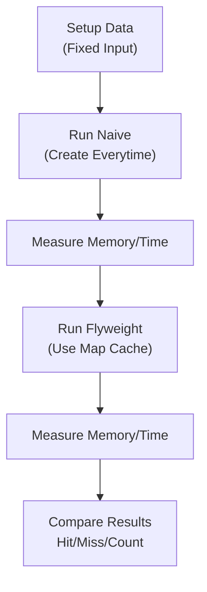

# 第53章：Flyweight ③ まとめ：計測して“本当に効いたか”確認⏱️

Flyweightって「最適化」寄りのパターンなので、**“効いた気がする”じゃなくて、数字で確認する**のが超だいじです🧡
しかも、キャッシュ（Map）って **合う時は爆効き**だけど、**合わない時は逆に遅くなる**こともあります😇（Map参照のコストが増えるから）

---

## この章でできるようになること✅✨

* Flyweightの効果を **3点セット（回数・時間・メモリ）**で見える化できる👀
* 「速くなった？」「軽くなった？」を **ちゃんと判断**できる🧠
* “効かないFlyweight”を見抜いて撤退できる🏃‍♀️💨

---

## 1) まずは「測るもの」を決めよう🧭

Flyweightの効果は、だいたいこの3つで見えます👇

## A. 生成回数（いちばん分かりやすい）🧮


* 共有前：`N回` 作ってる（大量に new してる）
* 共有後：**ユニーク種類数だけ**作ってる（例：20種類なら20回）

## B. 実行時間（速くなった？）⏱️


* 重要：**“同じ入力データ”で比較**すること（測定の基本！）
* Nodeでは `performance.now()` が使えます。([nodejs.org][1])

## C. メモリ（軽くなった？）🧠


* `process.memoryUsage()` でざっくり見えます。([nodejs.org][2])
* 「heapUsed」や「rss」の増え方が目安になります📈


---

## 2) ハンズオン🛠️：Flyweightの効果を“数字”で比べる


やることはシンプルです😊
**同じデータ（大量のアイコン名）**を使って、

* ①毎回作る（共有なし）
* ②Mapで共有する（Flyweight）

を比べます✨

> ここでは「アイコンの定義オブジェクト」を Flyweight（共有）にします🎨
> “位置”や“表示対象の注文ID”みたいな **個別情報は共有しない（外在状態）**のがコツです💡



---

## 2-1) 計測コード（TypeScript）📄✨

```ts
// bench-flyweight.ts
import { performance } from "node:perf_hooks";
import process from "node:process";

// 共有したい「重い/よく使い回す」情報（例：svg文字列、className など）
type Icon = Readonly<{
  name: string;
  svg: string;
  className: string;
}>;

// ---- データ生成（測定対象の入力を固定する） ----
function makeIconNames(total: number, uniqueKinds: number): string[] {
  const pool = Array.from({ length: uniqueKinds }, (_, i) => `icon-${i}`);
  // ここは計測外（入力準備）にして、測定を汚さない
  const names: string[] = new Array(total);
  for (let i = 0; i < total; i++) {
    names[i] = pool[i % uniqueKinds]; // 規則的に繰り返し（共有が効く典型）
  }
  return names;
}

// ---- ① 共有なし：毎回生成する ----
function createIcon(name: string, counter: { created: number }): Icon {
  counter.created++;
  // 「作るのがそこそこ重い」つもりで、文字列を組み立てる例
  const svg = `<svg data-name="${name}">${"x".repeat(200)}</svg>`;
  return { name, svg, className: `c-${name}` };
}

function runNaive(names: string[]): { created: number } {
  const counter = { created: 0 };
  const result: Icon[] = [];
  for (const name of names) {
    result.push(createIcon(name, counter));
  }
  // 何も返さないと最適化で消される可能性があるので保持する（測定あるある）
  if (result.length === 0) console.log("noop");
  return counter;
}

// ---- ② Flyweight：Mapで共有する ----
function makeFlyweightIconGetter() {
  const cache = new Map<string, Icon>();
  const stats = { created: 0, hit: 0, miss: 0 };

  const getIcon = (name: string): Icon => {
    const cached = cache.get(name);
    if (cached) {
      stats.hit++;
      return cached;
    }
    stats.miss++;
    stats.created++;
    const svg = `<svg data-name="${name}">${"x".repeat(200)}</svg>`;
    const icon: Icon = { name, svg, className: `c-${name}` };
    cache.set(name, icon);
    return icon;
  };

  return { getIcon, stats, cache };
}

function runFlyweight(names: string[]) {
  const { getIcon, stats, cache } = makeFlyweightIconGetter();
  const result: Icon[] = [];
  for (const name of names) {
    result.push(getIcon(name));
  }
  if (result.length === 0) console.log("noop");
  return { ...stats, cacheSize: cache.size };
}

// ---- 計測ユーティリティ ----
function memSnapshot() {
  const m = process.memoryUsage();
  return { rss: m.rss, heapUsed: m.heapUsed };
}

function formatBytes(n: number) {
  return `${(n / 1024 / 1024).toFixed(1)} MB`;
}

function median(values: number[]) {
  const sorted = [...values].sort((a, b) => a - b);
  const mid = Math.floor(sorted.length / 2);
  return sorted.length % 2 === 0
    ? (sorted[mid - 1] + sorted[mid]) / 2
    : sorted[mid];
}

function bench(label: string, fn: () => void, repeats = 7) {
  // ウォームアップ（JIT/キャッシュの影響を少し減らす）
  for (let i = 0; i < 2; i++) fn();

  const times: number[] = [];
  for (let i = 0; i < repeats; i++) {
    const t0 = performance.now();
    fn();
    const t1 = performance.now();
    times.push(t1 - t0);
  }
  console.log(`${label}: median ${median(times).toFixed(2)} ms (runs=${repeats})`);
}

// ---- 実行 ----
const TOTAL = 200_000;       // “大量”を作る
const UNIQUE = 50;           // ユニーク種類（小さいほどFlyweightが効く）

const names = makeIconNames(TOTAL, UNIQUE);

// メモリ（前）
const memBefore = memSnapshot();

// 時間 + 生成回数
let naiveCreated = 0;
bench("Naive", () => {
  const r = runNaive(names);
  naiveCreated = r.created;
});

let flyStats: { created: number; hit: number; miss: number; cacheSize: number } | null = null;
bench("Flyweight(Map)", () => {
  flyStats = runFlyweight(names);
});

// メモリ（後）
const memAfter = memSnapshot();

console.log("---- Counts ----");
console.log(`Naive created: ${naiveCreated}`);
if (flyStats) {
  console.log(`Fly created : ${flyStats.created} (cacheSize=${flyStats.cacheSize})`);
  console.log(`hit=${flyStats.hit} miss=${flyStats.miss}`);
}

console.log("---- Memory (rough) ----");
console.log(`rss     : ${formatBytes(memBefore.rss)} -> ${formatBytes(memAfter.rss)}`);
console.log(`heapUsed: ${formatBytes(memBefore.heapUsed)} -> ${formatBytes(memAfter.heapUsed)}`);
```

---

## 2-2) どう読めばいい？👀✨（超重要）


出力はだいたいこんな観点で見ます👇

## ✅ 生成回数

* `Naive created` が **TOTAL（例：200,000）に近い** → 毎回作ってる
* `Fly created` が **UNIQUE（例：50）に近い** → 共有できてる🎉

## ✅ hit/miss

* miss が UNIQUE くらいで止まって、あとは hit が増える → キャッシュが効いてる💖

## ✅ 時間（median）

* Flyweight が速ければ最高🥳
* もし遅いなら…

  * **Map参照のコスト**が勝ってる可能性あり（「作るのが軽い」ケースに多い）😇

## ✅ メモリ

* `heapUsed` の増え方がマイルドなら、共有の効果が出てる可能性↑
* ただしOSやGCの影響も大きいので、**“傾向”を見る**のがコツです🧠

Nodeでの時間計測は `perf_hooks`（`performance.now()`）が基本になります。([nodejs.org][1])
メモリは `process.memoryUsage()` が入口として分かりやすいです。([nodejs.org][2])

---

## 3) “計測の落とし穴”あるある😵‍💫（ここで事故る）

## 落とし穴①：測定中に `Math.random()` とかやっちゃう🎲


→ ランダム生成がボトルネックになって、Flyweight差が埋もれます💦
✅ **入力データは先に作って固定**が正義！

## 落とし穴②：1回だけ測って信じる🙏


→ たまたま速い/遅いが起きます（GCとか）
✅ **複数回**走らせて **median（中央値）**で見るのが安定✨

## 落とし穴③：共有したオブジェクトを後で書き換える✍️

→ 共有してる全員に影響して事故💥
✅ `Readonly` で縛る・作ったら不変にする🧊

---

## 4) 判断基準🧠：「Flyweight、採用していいのいつ？」

## 採用しやすい✅

* 同じものが大量に出る（繰り返しが多い）🔁
* 生成が重い（大きい文字列、パース、初期化コスト）🐘
* 共有対象が **不変（読み取り中心）**🧊
* キーが安定（文字列/IDがブレない）🔑

## やめといた方がいい❌

* ほとんどユニーク（共有できない）🫠
* 生成が軽い（Mapの方が重くなる）⚖️
* オブジェクトがよく変更される（共有事故）💥

---

## 5) ちょい最新メモ🗓️（再現性のための目安）

* TypeScript は **5.9 系**のリリースノートが公開されています。([typescriptlang.org][3])
* Node.js は **v24 がActive LTS**、v25 はCurrentとして更新されています（ページ更新日も確認できます）。([nodejs.org][4])

この章の計測は、Nodeの `perf_hooks` と `process.memoryUsage()` があれば十分いけます💪✨

---

## 6) AIプロンプト例🤖💬（コピペOK✨）

```text
Flyweightの効果を測りたいです。
- 共有前/共有後で「生成回数」「実行時間」「メモリ」を比較したい
- Nodeの performance.now / process.memoryUsage を使う前提
- micro-benchmarkの落とし穴（ウォームアップ、複数回、中央値、入力固定）も考慮して
私のコード（貼る）を改善して、測定結果の読み取り方もセットで提案して。
```

---

## 7) つまずき回避💡🧸

* 「速くなってない！」でも落ち込まないでOK🙆‍♀️
  → Flyweightは **“速さ”より“メモリ/生成回数の削減”が主役**なことも多いです
* 「共有できる割合（UNIQUE/TOTAL）」を変えて試すと、効く境界が見えます🔍
* 迷ったらまず **生成回数が減ってるか**だけ確認すると前進しやすいです🧡

[1]: https://nodejs.org/api/perf_hooks.html?utm_source=chatgpt.com "Performance measurement APIs | Node.js v25.5.0 ..."
[2]: https://nodejs.org/en/learn/diagnostics/memory/understanding-and-tuning-memory?utm_source=chatgpt.com "Understanding and Tuning Memory"
[3]: https://www.typescriptlang.org/docs/handbook/release-notes/typescript-5-9.html?utm_source=chatgpt.com "Documentation - TypeScript 5.9"
[4]: https://nodejs.org/en/about/previous-releases?utm_source=chatgpt.com "Node.js Releases"
