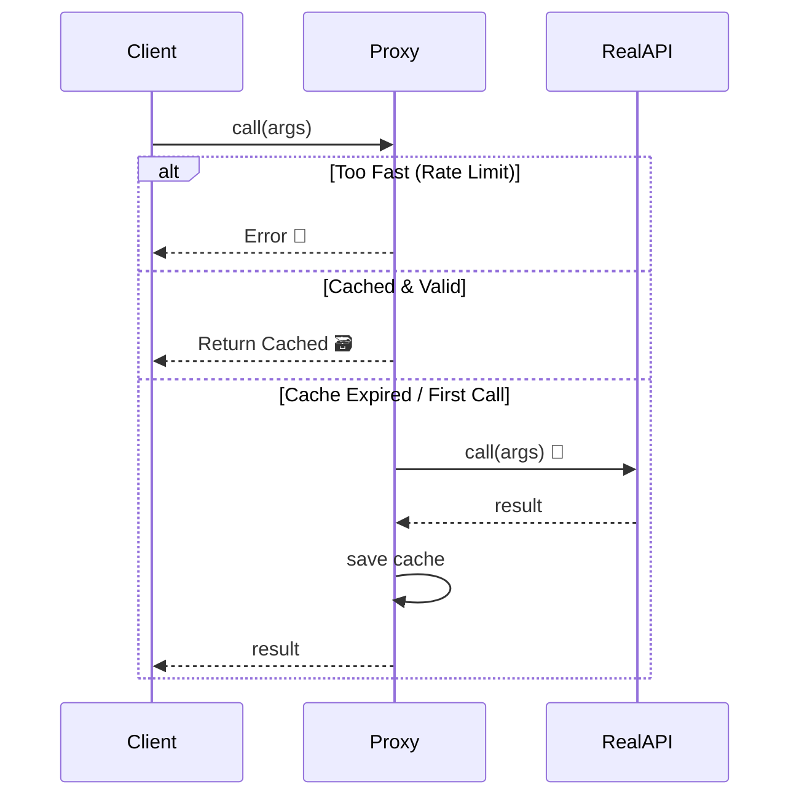

# 第54章：Proxy ① 代理人を置きたい（遅延/制限/監視/キャッシュ）🕵️

## この章でできるようになること🎯

* Proxy（代理人）の役割を「一言」で説明できる🗣️
* Proxy が効く代表パターンを4つ言える（遅延・制限・監視・キャッシュ）🧠
* JavaScript標準の `Proxy` を使って、**API呼び出しにキャッシュ＋レート制限**を付けられる🚦🗃️

---

## Proxyってなに？（超やさしく）🧁

Proxyは、**本体（リアルな処理）に直接触らせずに、手前に“代理人”を置く**考え方だよ👤➡️👑
この代理人が「通していい？」「記録しとくね」「同じなら前の結果返すね」みたいに、**入口でコントロール**してくれるの✨


GoFのProxyは“概念”で、実装方法はいろいろあるけど、TypeScript/JavaScriptだと **標準の `Proxy`** がそのまま使えて便利！🧰✨ ([MDNウェブドキュメント][1])

---

## Proxyが効く代表4つ（まずコレだけ覚えよ）🧠✨


| 代表用途                     | ひとことで             | ありがたみ          |
| ------------------------ | ----------------- | -------------- |
| Virtual（遅延）🐢            | 重いものは“必要になってから”作る | 起動が速い・無駄が減る    |
| Protection（制限）🛡️        | 権限チェックして通す/止める    | 誤用・不正アクセス防止    |
| Logging/Monitoring（監視）👀 | 呼び出しを記録・計測する      | デバッグしやすい・観測できる |
| Caching（キャッシュ）🗃️        | 同じ結果は使い回す         | API回数減る・速い     |

`Proxy` はプロパティ読み書き・関数呼び出しなどを“横取り（トラップ）”できるのが強みだよ✨（`get`/`set`/`apply`/`construct` など） ([MDNウェブドキュメント][1])

---

## 「Proxyいま欲しいかも…」のサイン🚨


* APIアクセスが多くて、**同じリクエストを何回も叩いてる**😵‍💫
* 外部APIに負荷をかけたくないから、**レート制限**したい🚦
* どこから何回呼ばれたか分からなくて、**ログ入れたい**🕵️
* 重い初期化（巨大設定ロード等）を、**使う時まで遅らせたい**🐢

---

## ハンズオン🛠️：API呼び出しをProxyで「キャッシュ＋レート制限」🗃️🚦


ここでは **関数**を `Proxy` で包むよ✨
関数Proxyは `apply` トラップで「呼び出し」を横取りできる！ ([MDNウェブドキュメント][1])

## 1) 題材：メニューを取るAPI（ダミー）☕📋

```ts
type Menu = { shopId: string; items: string[] };

// ダミーAPI：ちょっと遅いフリ
const fetchMenuReal = async (shopId: string): Promise<Menu> => {
  await new Promise((r) => setTimeout(r, 200));
  return { shopId, items: ["Coffee", "Latte", "Tea"] };
};
```

---

## 2) Proxyで包む：キャッシュ（TTL付き）＋レート制限（最短間隔）✨

ポイントは3つだよ🧡

* **キャッシュは Promise を丸ごと保持**（同時多発でも1回の呼び出しにまとまる）🗃️
* **TTL（有効期限）**で古いキャッシュは捨てる⌛
* **レート制限**は「前回呼び出しから○ms未満は拒否」でミニマムに🚦



```ts
type AsyncFn = (...args: any[]) => Promise<any>;

type ProxyOptions = {
  ttlMs: number;          // キャッシュ寿命
  minIntervalMs: number;  // 最短呼び出し間隔（レート制限）
};

function withCacheAndRateLimit<F extends AsyncFn>(fn: F, opt: ProxyOptions): F {
  const cache = new Map<string, { expiresAt: number; promise: ReturnType<F> }>();
  let lastCallAt = 0;

  const proxied = new Proxy(fn, {
    apply(target, thisArg, argArray) {
      const now = Date.now();

      // 🚦 レート制限（シンプル版）
      if (now - lastCallAt < opt.minIntervalMs) {
        throw new Error("Rate limit: 呼び出しが速すぎるよ💦 少し待ってね🙏");
      }
      lastCallAt = now;

      // 🗃️ キャッシュキー（今回は引数がシンプル前提）
      const key = JSON.stringify(argArray);

      const hit = cache.get(key);
      if (hit && hit.expiresAt > now) {
        return hit.promise; // ✅ キャッシュ命中
      }

      // ✅ 本体呼び出し（Reflect.applyで素直に委譲）
      const promise = Reflect.apply(target, thisArg, argArray) as ReturnType<F>;

      cache.set(key, { expiresAt: now + opt.ttlMs, promise });
      return promise;
    },
  });

  return proxied as F;
}
```

`Proxy` の中で「本体に処理を委譲する」ときは、`Reflect.apply` みたいに **Reflect系で素直に渡す**のが読みやすくて安全寄りだよ✨ ([MDNウェブドキュメント][1])

---

## 3) 使ってみる🎉

```ts
const fetchMenu = withCacheAndRateLimit(fetchMenuReal, {
  ttlMs: 5_000,         // 5秒はキャッシュ🗃️
  minIntervalMs: 300,   // 0.3秒以内の連打はNG🚦
});

async function demo() {
  console.log("1回目（本体呼ぶ）");
  console.log(await fetchMenu("shibuya"));

  console.log("2回目（キャッシュ期待）");
  console.log(await fetchMenu("shibuya"));

  console.log("連打（レート制限にひっかかるかも）");
  console.log(await fetchMenu("shibuya"));
}

demo().catch((e) => console.error("ERROR:", e.message));
```

---

## 仕組みをもう一段だけ理解🧠✨


## `apply` トラップって何？🔁

* 「関数が呼ばれた瞬間」を横取りする入口だよ🚪
* ここで **キャッシュ判定**や **制限**や **ログ**ができる！

TypeScript側でも `ProxyHandler<T>` に `apply` が定義されていて、`Proxy` で関数呼び出しを横取りできる前提があるよ🧩 ([GitHub][2])

---

## よくある落とし穴🕳️（ここ超だいじ！）

## 1) Proxyは“魔法”っぽく見えて、読みづらくなる🧙‍♀️💦


Proxyは便利だけど、やりすぎると「どこで何してるの？」ってなるやつ😵
なので、**範囲を狭く**（例：I/O境界の関数だけ）がおすすめ✨

## 2) パフォーマンス：便利＝無料ではない🐢

エンジン側でProxyを速くする努力はされてるけど、Proxyは一般に“素のアクセス”よりコストが増えやすいよ💦 ([v8.dev][3])
だから、**ホットパス（超頻繁ループ）にベタ貼り**は避けるのが無難👌

## 3) キャッシュキーの作り方が雑だと事故る🧨

`JSON.stringify(args)` は引数が複雑になると危ない（順序・循環参照など）😇
最初は **文字列や数値中心**の引数で使う、が安全だよ🧡

---

## ミニ演習✍️✨

1. `ttlMs` を 1秒にして、キャッシュが切れた後に本体が呼ばれるのを確認してね⌛
2. レート制限を「shopIdごと」にしたい！

   * ヒント：`lastCallAt` を `Map<string, number>` にしてキーを `shopId` にする🗺️
3. 失敗（例：APIエラー）のときはキャッシュに残したくない！

   * ヒント：`promise.catch(()=>cache.delete(key))` を入れる✅

---

## AIプロンプト例🤖💬

```text
TypeScriptで、async関数をProxy(applyトラップ)で包んで
1) TTL付きキャッシュ 2) レート制限 3) 失敗時はキャッシュ破棄
を実装して。引数は文字列1つ（shopId）でOK。
読みやすさ優先で、独自クラスは作らないで。
```

```text
次のwithCacheAndRateLimit関数をレビューして：
- バグになりやすい点
- 改善できる命名
- “やりすぎProxy”にならないための境界設計
を指摘して。
```

---

## つまずき回避💡

* まずは **「I/O境界（API呼び出し）」だけProxy**にするのが勝ち🏁
* Proxyでやることは **入口の付加価値（制限/監視/キャッシュ）だけ**にする🧼
* 本体ロジック（業務判断）までProxyに入れない🙅‍♀️（混ぜるとカオス！）

---

[1]: https://developer.mozilla.org/en-US/docs/Web/JavaScript/Reference/Global_Objects/Proxy?utm_source=chatgpt.com "Proxy - JavaScript - MDN Web Docs - Mozilla"
[2]: https://github.com/microsoft/TypeScript/blob/main/src/lib/es2015.proxy.d.ts?utm_source=chatgpt.com "TypeScript/src/lib/es2015.proxy.d.ts at main"
[3]: https://v8.dev/blog/optimizing-proxies?utm_source=chatgpt.com "Optimizing ES2015 proxies in V8"
