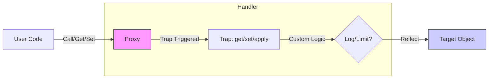

# 第55章：Proxy ② TypeScript標準：JavaScriptの `Proxy` を使う✨

## ねらい🎯

* GoFの **Proxy（代理人）** を、**JavaScript標準の `Proxy`** でサクッと実装できるようになる✨
* `get` / `set` / `apply` などの **トラップ（trap）** を使って、**監視・制限・遅延・キャッシュ** を実現できるようになる🧠

---

## 1) `Proxy`ってなに？（超ざっくり）🧁

`Proxy` は **あるオブジェクト（本体）を“包んで”**、プロパティの読み書きや関数呼び出しを **横取り（intercept）** できる仕組みだよ👀✨
GoFのProxyでよくある用途（例：アクセス制御、ログ、キャッシュ、遅延ロード）を、言語機能でそのまま作れるのが強み💪

* 本体：`target`
* 代理人のルール：`handler`（`ProxyHandler<T>`）
* 代理人：`new Proxy(target, handler)`

`apply` トラップは「関数呼び出し」を捕まえるための仕組みだよ📞✨ ([MDNウェブドキュメント][1])




---

## 2) 最小例：`get` / `set` をログする📒✨


「読んだ」「書いた」を全部ログに残す、いちばんベタで役に立つ例からいくよ〜😊

```ts
type Order = {
  id: string;
  total: number;
  status: "draft" | "confirmed";
};

const order: Order = { id: "A-001", total: 1200, status: "draft" };

const logs: string[] = [];

const handler = {
  get(target, prop, receiver) {
    logs.push(`get ${String(prop)}`);
    return Reflect.get(target, prop, receiver);
  },
  set(target, prop, value, receiver) {
    logs.push(`set ${String(prop)}=${String(value)}`);
    return Reflect.set(target, prop, value, receiver);
  },
} satisfies ProxyHandler<Order>;

const orderProxy = new Proxy(order, handler);

// 使ってみる
orderProxy.total;          // get total
orderProxy.total = 1500;   // set total=1500

console.log(logs);
```

## ここがポイント💡

* `Reflect.get / Reflect.set` を使うと、**元の挙動を崩しにくい**（基本はこれ推奨）🪞✨
* `satisfies ProxyHandler<Order>` で **トラップ名のミス**（`getOwnPropertyDescriptor` とか）を早めに検知できる👍

---

## 3) TypeScriptで“型”をきれいに保つコツ🧠✨


TypeScriptの標準ライブラリ（`lib.es2015.proxy.d.ts`）には `Proxy` と `ProxyHandler<T>` が用意されてるよ📦 ([GitHub][2])
なので、`new Proxy(order, handler)` の戻り値は **ちゃんと `Order` 扱い**になりやすい👌

よく出てくる型たち👇

* `ProxyHandler<T>`：トラップの型（`get` / `set` / `apply` …） ([GitHub][2])
* `PropertyKey`：プロパティ名（`string | number | symbol`）※トラップ引数に出やすい
* `Reflect`：本来の操作を“正しく実行”するための相棒🪞

---

## 4) 実務で多いProxyの使い方 4選💎

## 4-1) Logging Proxy（監視ログ）👀📒

さっきの例がまさにこれ！
**本体のコードを汚さず**にログを仕込めるのが気持ちいい✨

---

## 4-2) Validation Proxy（書き込み制限）🚧


「変な値を入れたら止めたい！」ってやつ💥

```ts
type Order = { total: number };

const order: Order = { total: 1000 };

const orderProxy = new Proxy(order, {
  set(target, prop, value, receiver) {
    if (prop === "total" && typeof value === "number" && value < 0) {
      throw new Error("total は 0以上にしてね🥺");
    }
    return Reflect.set(target, prop, value, receiver);
  },
} satisfies ProxyHandler<Order>);

orderProxy.total = 2000; // OK
orderProxy.total = -1;   // エラー
```

✅ **入力チェックを1か所に寄せられる**のが強い！

---

## 4-3) Protection Proxy（アクセス制御）🔐


「このプロパティ触らせたくない」みたいなときに使うよ。
※これは **“セキュリティ”ではなく設計上のガード**として使うのが現実的🙆‍♀️

```ts
type User = { id: string; name: string; _adminMemo: string };

const user: User = { id: "u1", name: "Mika", _adminMemo: "内部メモ" };

const safeUser = new Proxy(user, {
  get(target, prop, receiver) {
    if (typeof prop === "string" && prop.startsWith("_")) {
      throw new Error("それは見ちゃだめ🙈");
    }
    return Reflect.get(target, prop, receiver);
  },
} satisfies ProxyHandler<User>);

safeUser.name;      // OK
safeUser._adminMemo; // エラー
```

---

## 4-4) Virtual Proxy（遅延ロード）🐢➡️⚡

「重いデータは **必要になった瞬間に** 作る！」ってやつ。

```ts
type Profile = { bio: string };

let loaded: Profile | null = null;

function loadProfile(): Profile {
  // 本当はDB/APIなど重い処理を想定
  return { bio: "はじめまして！☕" };
}

const profile = new Proxy(
  {},
  {
    get(_target, prop) {
      loaded ??= loadProfile();
      return (loaded as any)[prop];
    },
  } satisfies ProxyHandler<object>
) as Profile;

console.log(profile.bio); // ここで初めて loadProfile() が走る
```

「最初は軽く、必要なら重く」って感じで体験が良くなる✨

---

## 5) `apply` トラップ：関数呼び出しをProxyする⏱️📞

`apply` は **関数を呼んだ瞬間** を捕まえるトラップだよ✨ ([MDNウェブドキュメント][1])
これで「計測」「キャッシュ」「リトライ」などがやりやすい！

## 5-1) 呼び出し時間を測る（Timing Proxy）⏱️


```ts
type CalcTotal = (prices: number[]) => number;

const calcTotal: CalcTotal = (prices) => prices.reduce((a, b) => a + b, 0);

const timedCalc = new Proxy(calcTotal, {
  apply(target, thisArg, args) {
    const t0 = Date.now();
    const result = Reflect.apply(target, thisArg, args);
    const t1 = Date.now();
    console.log(`calcTotal took ${t1 - t0}ms ⏱️`);
    return result;
  },
} satisfies ProxyHandler<CalcTotal>);

timedCalc([100, 200, 300]);
```

## 5-2) キャッシュする（Caching Proxy）🗃️

```ts
type SlowFn = (x: number) => number;

const slow: SlowFn = (x) => {
  // 重い処理のつもり
  let s = 0;
  for (let i = 0; i < 1_000_000; i++) s += i % 7;
  return x * 2 + (s % 10);
};

const cache = new Map<string, number>();

const cachedSlow = new Proxy(slow, {
  apply(target, thisArg, args) {
    const key = JSON.stringify(args);
    const hit = cache.get(key);
    if (hit !== undefined) return hit;

    const result = Reflect.apply(target, thisArg, args) as number;
    cache.set(key, result);
    return result;
  },
} satisfies ProxyHandler<SlowFn>);

console.log(cachedSlow(10)); // 初回は重い
console.log(cachedSlow(10)); // 2回目は速い（キャッシュ）
```

💡 キャッシュキーは雑に作ると事故るので、実務では **キー設計**が超大事だよ〜😵‍💫

---

## 6) “落とし穴”も知っておこう🧯（大事！）

## 6-1) Proxyには「破っちゃダメな約束（invariants）」がある⚠️

とくに `ownKeys` などは、ルールを破ると **`TypeError`** を投げることがあるよ。 ([MDNウェブドキュメント][3])
だから迷ったら…

✅ **基本は `Reflect` に寄せる**
✅ どうしてもカスタムするなら **最小限** にする

---

## 6-2) `set` が `false` を返すと、状況によっては例外になる😵

モジュールなど（厳格モード相当）では、`set` トラップが `false` を返すと代入が失敗して例外になりがち。
→ 迷ったら **throw で理由を明確に** がオススメ🧠✨

---

## 6-3) デバッグが難しくなる😇

Proxyは便利だけど、**何がいつ起きたかが見えにくい**ことがあるよ。

* ログを丁寧に残す📒
* Proxyを作る場所を1か所に寄せる🏠
* “魔法”を広げすぎない🪄🚫

---

## 7) ハンズオン🛠️：Proxyで「監視ログ」→「制限」までやってみよう✨

## お題☕

注文オブジェクトに対して…

1. 読み書きをログる📒
2. `status === "confirmed"` になったら `total` を変更できないようにする🔒

```ts
type Order = {
  id: string;
  total: number;
  status: "draft" | "confirmed";
};

const logs: string[] = [];

function createOrderProxy(order: Order): Order {
  return new Proxy(order, {
    get(target, prop, receiver) {
      logs.push(`get ${String(prop)}`);
      return Reflect.get(target, prop, receiver);
    },
    set(target, prop, value, receiver) {
      logs.push(`set ${String(prop)}=${String(value)}`);

      if (prop === "total" && target.status === "confirmed") {
        throw new Error("confirmed の注文は金額変更できないよ🥺");
      }

      return Reflect.set(target, prop, value, receiver);
    },
  } satisfies ProxyHandler<Order>);
}

const order = createOrderProxy({ id: "A-001", total: 1200, status: "draft" });

order.total = 1500;          // OK
order.status = "confirmed";  // OK
// order.total = 2000;       // ここでエラー！

console.log(logs);
```

---

## 8) ミニテスト🧪（ログと制限をチェック）

```ts
import test from "node:test";
import assert from "node:assert/strict";

type Order = { total: number; status: "draft" | "confirmed" };

function create(order: Order, logs: string[]): Order {
  return new Proxy(order, {
    get(target, prop, receiver) {
      logs.push(`get ${String(prop)}`);
      return Reflect.get(target, prop, receiver);
    },
    set(target, prop, value, receiver) {
      if (prop === "total" && target.status === "confirmed") {
        throw new Error("locked");
      }
      logs.push(`set ${String(prop)}=${String(value)}`);
      return Reflect.set(target, prop, value, receiver);
    },
  } satisfies ProxyHandler<Order>);
}

test("Proxy: get/set log works", () => {
  const logs: string[] = [];
  const o = create({ total: 1000, status: "draft" }, logs);

  o.total;        // get
  o.total = 1200; // set

  assert.deepEqual(logs, ["get total", "set total=1200"]);
});

test("Proxy: confirmed blocks total change", () => {
  const logs: string[] = [];
  const o = create({ total: 1000, status: "confirmed" }, logs);

  assert.throws(() => {
    o.total = 1200;
  }, /locked/);
});
```

---

## 9) AIプロンプト例🤖💬（コピペOK）

```text
次のTypeScriptコードで Proxy を使って、ログ監視と書き込み制限を入れたいです。
制約：
- 独自の巨大クラスは作らない（関数＋標準Proxy中心）
- Reflect を使ってデフォルト挙動を崩さない
- satisfies ProxyHandler<T> を使って型を崩さない
出力：
1) handler案
2) ありがちな落とし穴
3) ミニテスト案（node:test でOK）

対象：
type Order = { id: string; total: number; status: "draft" | "confirmed" };
要件：status が confirmed のとき total を変更禁止、get/set をログ
```

---

## 10) おまけ：TypeScriptの“いま”（Proxy自体は安定）📌

`Proxy` / `ProxyHandler` 周りは **長く安定している標準機能**で、MDNでも広く利用可能な機能として扱われているよ。 ([MDNウェブドキュメント][1])
TypeScript自体は 2025年末〜2026年にかけて大きな動き（6.0・7.0の話題）があるけど、**この章のProxy実装はそのまま使える**内容だよ。 ([Microsoft for Developers][4])

[1]: https://developer.mozilla.org/en-US/docs/Web/JavaScript/Reference/Global_Objects/Proxy/Proxy/apply?utm_source=chatgpt.com "handler.apply() - JavaScript - MDN Web Docs"
[2]: https://github.com/microsoft/TypeScript/blob/main/src/lib/es2015.proxy.d.ts?utm_source=chatgpt.com "TypeScript/src/lib/es2015.proxy.d.ts at main"
[3]: https://developer.mozilla.org/en-US/docs/Web/JavaScript/Reference/Global_Objects/Proxy/Proxy/ownKeys?utm_source=chatgpt.com "handler.ownKeys() - JavaScript - MDN Web Docs"
[4]: https://devblogs.microsoft.com/typescript/progress-on-typescript-7-december-2025/?utm_source=chatgpt.com "Progress on TypeScript 7 - December 2025"
