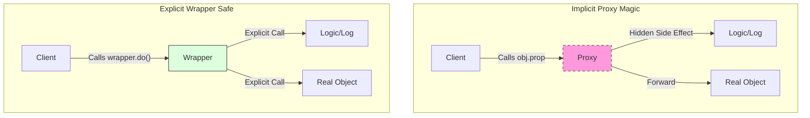

# 第56章：Proxy ③ まとめ：やりすぎ注意（魔法に見えて危険）🧯

## この章のねらい🎯

* `Proxy` を「便利だけど危ない道具🪄⚠️」として扱えるようになる
* **使っていい範囲**と**やめた方がいい範囲**を言葉にできる
* `Proxy` なしの定番解法（関数ラップ・`Map`・明示API）と比べて選べるようになる✨

---

## 1) Proxyって結局なに？🕵️‍♀️

`new Proxy(target, handler)` で、オブジェクト操作（プロパティ取得/代入/列挙/関数呼び出し…）を横取りして、好きな処理を差し込める仕組みだよ✨
主な “トラップ（traps）” は `get`, `set`, `has`, `ownKeys`, `apply`, `construct` など。([Zenn][1])

ここで重要なのは👇
**呼び出し側からは普通のオブジェクトに見える**のに、裏で何でも起きうること😇

---

## 2) なぜ“魔法”に見えて危険なの？🪄💣


Proxyは「見た目は普通」なのに、実体はこうなりがち👇

* どこでログが出てるのか分からない😵‍💫
* いつキャッシュされたのか追えない🌀
* ただの `obj.price` のはずが、裏で重い処理が走る🐢
* テストで「何が本体で何が代理か」分かりにくい🧩

つまり Proxy は **“透明すぎる拡張”** になりやすくて、チーム開発だと事故りやすい…！


---

## 3) やりすぎNGパターン集🚫⚠️（ここ踏むと沼）

### NG①：ビジネスロジックを `get/set` に書く💥

例：`order.total` を読むだけで割引計算や在庫判定が走る…
➡️ **処理の入口が見えなくなって**、バグ調査が地獄😇

### NG②：`get` でネットワーク/DBアクセスする🌐💸

「プロパティ読むだけ」が **I/O** になるのは危険度MAX。
➡️ タイムアウトや再試行の責務が迷子になるよ😵‍💫

### NG③：型を“嘘”にしてしまう🎭

`Proxy` は「存在しないプロパティを生やす」こともできる。
でも TypeScript 的には、そこが **型安全の穴** になりやすい🕳️

### NG④：深いネストProxy（ProxyのProxyのProxy…）🌀


* ステップ実行が追えない
* 例外の発生地点が分からない
* パフォーマンスの原因になりやすい
  ➡️ つらい😇

### NG⑤：「セキュリティ境界」に Proxy を置く🔒❌

Proxyは**セキュリティ機構じゃない**よ。
（本気の権限制御は、明示的なチェックと境界設計でやる✨）

### NG⑥：`#private`（private field）を持つ class を Proxy で包む🧨

`#private` は “ブランドチェック” があるので、Proxy越しにメソッドを呼ぶとエラーになることがあるよ。([Stack Overflow][2])
➡️ 「なんでここで落ちるの！？😱」ってなりやすい代表例！

---

## 4) Proxyより先にやる“定番の解決策”✅🧁


Proxyは最終手段寄り。先にこれを疑うと勝ちやすいよ✨

* **ログ/計測**：関数をラップ（Decorator章の高階関数）📦
* **キャッシュ**：`Map` / memoize で明示的に🗃️
* **検証**：`validate(x)` を入口に置く（失敗も明示）🧯
* **権限/制限**：普通に `if` + 明示API（読みやすさ最強）🧼
* **監視/通知**：Observer（イベント）📣

> Proxy は「呼び出し側を一切変えずに差し込む」から強い。
> でも同時に「気づかれずに副作用を増やせる」から危ない😇



---

## 5) Proxyを使ってもいい“狭い範囲”🎯✨


Proxyを採用しても平和になりやすいのはこの辺👇

* **開発時のデバッグ**（アクセスログ、書き込み監視）🔎
* **テスト時の監視**（特定プロパティに触ったか検証）🧪
* **境界での薄い代理**（キャッシュ/レート制限などを“外側”に）🧱
* **目的が1つ**で、範囲が小さく、やってることが明確🧾

---

## 6) Proxyを書くなら「Reflectに委譲」が基本形🪞

Proxyのトラップは、**原則 `Reflect.*` に委譲**すると事故りにくいよ。([Zenn][1])
さらに Proxy には「守らないと例外になる不変条件（invariants）」があるので、雑に書くと `TypeError` を踏むことがある…！([MDNウェブドキュメント][3])

---

## 7) ハンズオン🛠️：Proxyあり/なしで可読性を比べよう👀✨


### 7-A) Proxy版：アクセスログ（※目的1つに限定）🔎

* **やること**：`get/set` のたびにログを出す
* **やらないこと**：業務判断・I/O・データ加工はしない🙅‍♀️

```ts
type Log = (msg: string) => void;

export function withAccessLog<T extends object>(target: T, log: Log): T {
  const handler: ProxyHandler<T> = {
    get(t, prop, receiver) {
      // Symbol(…) はログが荒れるので抑制してもOK
      if (typeof prop !== "symbol") log(`GET  ${String(prop)}`);

      const value = Reflect.get(t, prop, receiver);

      // メソッドを返す場合：this問題を減らすため target に bind する案
      // （ただし関数同一性が変わるので “必要な時だけ”）
      if (typeof value === "function") {
        return value.bind(t);
      }
      return value;
    },
    set(t, prop, value, receiver) {
      if (typeof prop !== "symbol") log(`SET  ${String(prop)} = ${String(value)}`);
      return Reflect.set(t, prop, value, receiver);
    },
  };

  return new Proxy(target, handler);
}
```

ポイント💡

* `Reflect.get/set` で “普通の挙動” を保つ🪞
* メソッドは `bind(target)` で **this由来の事故**を減らせる（ただし万能ではない）
* 目的をログに固定して、肥大化させない🧯

### 7-B) Proxyなし版：ログを“入口”に置く（明示的）🧼

「何をするとログが出るか」が見えるのが強い✨

```ts
type Log = (msg: string) => void;

export function createLoggedOrderApi(log: Log) {
  return {
    getTotal(order: { items: { price: number; qty: number }[] }) {
      log("CALL getTotal");
      return order.items.reduce((sum, it) => sum + it.price * it.qty, 0);
    },
    addItem(order: { items: { price: number; qty: number }[] }, item: { price: number; qty: number }) {
      log("CALL addItem");
      order.items.push(item);
    },
  };
}
```

比べてメモしよう✍️🧠

* どっちが「何が起きるか」読みやすい？
* デバッグはしやすい？
* テストはどっちが楽？

---

## 8) Proxy採用の判断フロー🧭✨（迷ったらこれ）

* それ、**関数ラップ**や**明示API**で書けない？🤔
* 呼び出し側に「隠していい挙動」？（副作用があるなら基本NG）⚠️
* Proxyの目的は **1つ**？（ログだけ、キャッシュだけ…）🎯
* トラップ内で **I/Oしない**？🌐❌
* テストで「Proxyがいる前提」をちゃんと押さえられる？🧪

YESが揃わないなら、Proxyは封印の方向が安全🧯

---

## 9) テスト観点🧪✅（Proxyはここを押さえると壊れにくい）

* **透過性テスト**：Proxyありでも戻り値が同じ
* **目的テスト**：ログが出る / キャッシュされる、など目的だけ検証
* **副作用テスト**：意図しない書き換えが起きない
* **落とし穴**：列挙（`Object.keys`）や `in` などが思わぬトラップを呼ぶことがある（必要な時だけトラップ追加）([Zenn][1])

---

## 10) つまずき回避💡（Proxyあるある事故集）

* **無限再帰🔁**：トラップ内で `proxy[prop]` を触る → `Reflect.*` を使う
* **ログが爆発💥**：`Symbol` 系まで全部ログ → 必要なら除外
* **class + #private で謎エラー😱**：Proxy越しにメソッド実行で落ちることがある([Stack Overflow][2])
* **魔改造しがち🧙‍♀️**：目的を1つに固定！増やすなら別レイヤで

---

## 11) AIプロンプト例🤖💬

```text
Proxyを使った実装案をレビューして。
- 目的が1つに収まっているか
- trap内でI/Oや業務ロジックが混ざってないか
- Reflect委譲になっているか
- 代替案（関数ラップ/Mapキャッシュ/明示API）も提示して
コード: <ここに貼る>
```

```text
次のProxyコードに潜む「分かりにくさポイント」を5つ挙げて、
それぞれに「Proxyをやめる場合の書き方」も提案して。
コード: <ここに貼る>
```

```text
Proxyあり/なしの2案を作って比較して。
評価軸は「可読性」「デバッグ容易性」「テスト容易性」「性能リスク」。
題材: <ここに書く>
```

---

## 12) 🧁ミニまとめ

* Proxyは強いけど、**透明すぎて危ない**🪄⚠️
* まずは **関数ラップ / `Map` / 明示API** を疑うのが勝ち筋✅
* 使うなら **範囲を狭く・目的1つ・`Reflect`委譲・テスト厚め** 🧪✨
* `#private` を持つ class と Proxy は相性に注意！([Stack Overflow][2])

---

## （おまけ）本日時点のTypeScript小ネタ📰✨

* `typescript` パッケージの最新は **5.9.3** として公開されているよ。([GitHub][4])
* さらに **Visual Studio 2026** では “TypeScript Native Preview（TypeScript 7）” の話も出ていて、ツール体験がどんどん速くなってきてる👀⚡([developer.microsoft.com][5])

[1]: https://zenn.dev/serada/articles/20260105-typescript-7-native?utm_source=chatgpt.com "[リリース] TypeScript 7.0：Go実装で10倍高速化、2026年登場へ"
[2]: https://stackoverflow.com/questions/69269069/can-not-access-private-field-through-public-get-via-proxy?utm_source=chatgpt.com "Can not access private field through public get via proxy"
[3]: https://developer.mozilla.org/en-US/docs/Web/JavaScript/Reference/Global_Objects/Proxy?utm_source=chatgpt.com "Proxy - JavaScript - MDN Web Docs - Mozilla"
[4]: https://github.com/microsoft/typescript/releases?utm_source=chatgpt.com "Releases · microsoft/TypeScript"
[5]: https://developer.microsoft.com/blog/typescript-7-native-preview-in-visual-studio-2026 "TypeScript 7 native preview in Visual Studio 2026 - Microsoft for Developers"
