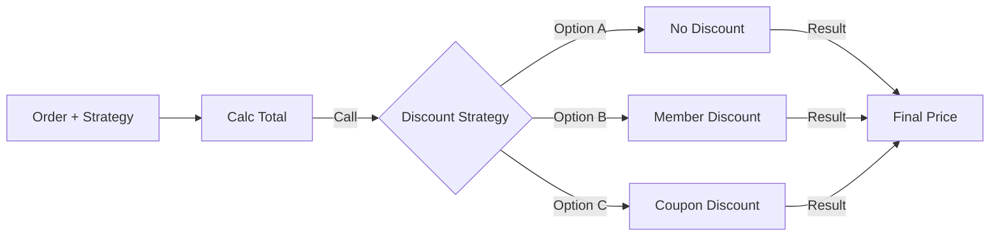

# 第57章：Strategy ① まずは関数で差し替える（最重要その1）⚙️

## ねらい🎯

* 「やり方（アルゴリズム）」を**差し替え**できる設計になる✨
* `if / switch` が増殖して地獄…😵 を止める
* 戦略（Strategy）ごとに **テストが超ラク** になる🧪🎉

---

## Strategyってなに？🧠✨

**Strategy（ストラテジー）**は、ざっくり言うと…

> 「同じ目的（例：合計金額を出す）は同じ。でも“やり方”（例：割引の計算）が何種類もある」
> そんなときに、**やり方だけを差し替え可能にする**ための考え方だよ〜⚙️💕

GoFの定義も、意図はこの一言に集約されます：
**「アルゴリズム（やり方）の家族を定義し、入れ替え可能にする」** というやつ📦🔁。([stg-tud.github.io][1])


---

## よくある“つらさ”😵‍💫（まずは失敗例から）

割引ルールが増えるたびに、こういうコードが育つ…🌱➡️🌳➡️🌲（そして崩壊）💥

```ts
type MemberRank = "NONE" | "SILVER" | "GOLD";

function calcTotal(subTotal: number, rank: MemberRank, couponPercent?: number) {
  let discount = 0;

  if (couponPercent != null) {
    discount += subTotal * (couponPercent / 100);
  }

  if (rank === "SILVER") discount += subTotal * 0.03;
  if (rank === "GOLD") discount += subTotal * 0.07;

  // さらに…「学割」「ハッピーアワー」「上限」「対象商品だけ」…が追加される😱
  return Math.max(0, subTotal - discount);
}
```

## ここが苦しいポイント💦

* ルール追加のたびに `calcTotal` が肥大化して読むのが辛い📚😵
* どの割引が効いたのか追えない（デバッグが地獄）🕵️‍♀️💥
* テストが「条件の組合せ爆発」になりがち🧪💣

---

## 解決方針：割引を“関数”として差し替える🧁⚙️

この章では **クラスで頑張らず**、TypeScriptらしく **関数Strategy**でいきます💖
（必要になったら後でクラス版もできるけど、最初はこれが一番強い✨）

---

## ハンズオン🛠️：割引Strategyを関数で作る（カフェ注文）☕🧾

## Step 1️⃣ 型を小さく用意する（シンプル命）🧼

```ts
export type Money = number;

export type OrderItem = {
  name: string;
  unitPrice: Money;
  qty: number;
};

export type MemberRank = "NONE" | "SILVER" | "GOLD";

export type Coupon = {
  code: string;
  percent: number; // 例：10 = 10%
};

export type Order = {
  items: readonly OrderItem[];
  memberRank: MemberRank;
  coupon?: Coupon;
};
```

---

## Step 2️⃣ 小さな計算を先に切り出す（準備運動）🏃‍♀️💨

```ts
import type { Money, Order } from "./types.js";

export function calcSubTotal(order: Order): Money {
  return order.items.reduce((sum, it) => sum + it.unitPrice * it.qty, 0);
}
```

---

## Step 3️⃣ ここが本題！Strategy = 「割引を計算する関数」⚙️✨

割引の計算に必要な情報だけ渡す用のコンテキストを作ります📦

```ts
import type { Money, Order } from "./types.js";

export type DiscountContext = {
  order: Order;
  subTotal: Money;
};

// 「割引額を返す」関数が Strategy
export type DiscountStrategy = (ctx: DiscountContext) => Money;
```

> ✅ **ポイント**：Strategyは「割引後の合計」じゃなくて「割引額」を返すと、合成しやすいよ🎁✨
> （あとで “最大の割引だけ適用” とかやりやすい！）

---

## Step 4️⃣ Strategyをいくつか作る🎨✨（関数だけ！）

### ① 割引なし🙅‍♀️

```ts
import type { DiscountStrategy } from "./discountTypes.js";

export const noDiscount: DiscountStrategy = () => 0;
```

### ② 会員ランク割引👑

```ts
import type { DiscountStrategy } from "./discountTypes.js";

export const memberDiscount: DiscountStrategy = ({ order, subTotal }) => {
  switch (order.memberRank) {
    case "SILVER":
      return subTotal * 0.03;
    case "GOLD":
      return subTotal * 0.07;
    case "NONE":
      return 0;
  }
};
```

### ③ クーポン割引🎟️

```ts
import type { DiscountStrategy } from "./discountTypes.js";

export const couponDiscount: DiscountStrategy = ({ order, subTotal }) => {
  const c = order.coupon;
  if (!c) return 0;
  return subTotal * (c.percent / 100);
};
```

### ④ どっちか“得な方”だけ採用💰✨（例：二重取り禁止ルール）

```ts
import type { DiscountStrategy } from "./discountTypes.js";

export function maxDiscount(...strategies: DiscountStrategy[]): DiscountStrategy {
  return (ctx) => Math.max(...strategies.map((s) => s(ctx)));
}
```

---

## Step 5️⃣ 合計計算は「Strategyを受け取る」だけにする🎯

```ts
import type { Money, Order } from "./types.js";
import type { DiscountStrategy } from "./discountTypes.js";
import { calcSubTotal } from "./subTotal.js";

export function calcTotal(order: Order, discountStrategy: DiscountStrategy): Money {
  const subTotal = calcSubTotal(order);
  const discount = discountStrategy({ order, subTotal });
  return Math.max(0, subTotal - discount);
}
```

✨これで、合計計算は「割引の中身」を知らなくてOKになりました！🎉



---

## “どのStrategyを使うか”は、1か所にまとめる📌🧠

`if/switch` を **ゼロにする**のが目的じゃないよ🙆‍♀️
**散らばるのを止めて、選ぶ場所を1か所に固定する**のが第一ゴール✨

```ts
import type { DiscountStrategy } from "./discountTypes.js";
import { noDiscount, memberDiscount, couponDiscount, maxDiscount } from "./discounts.js";
import type { Order } from "./types.js";

export function chooseDiscount(order: Order): DiscountStrategy {
  // 例：クーポンがあるなら「会員割 or クーポン割」の得な方だけ
  if (order.coupon) return maxDiscount(memberDiscount, couponDiscount);

  // クーポンがないなら会員割のみ
  if (order.memberRank !== "NONE") return memberDiscount;

  return noDiscount;
}
```

---

## テストが“戦略ごと”に超ラクになる🧪🎉

Strategyを **純粋関数**（入力→出力）に寄せると、テストが天国になります👼✨
組み込みのテストランナー（`node:test`）みたいに、追加インストール無しで回せる選択肢もあります🧰([nodejs.org][2])

```ts
import test from "node:test";
import assert from "node:assert/strict";
import { calcTotal } from "./total.js";
import { noDiscount, memberDiscount, couponDiscount, maxDiscount } from "./discounts.js";
import type { Order } from "./types.js";

const baseOrder: Order = {
  items: [{ name: "Latte", unitPrice: 500, qty: 2 }], // subTotal = 1000
  memberRank: "NONE",
};

test("noDiscountは0円割引", () => {
  const total = calcTotal(baseOrder, noDiscount);
  assert.equal(total, 1000);
});

test("SILVERは3%割引", () => {
  const order: Order = { ...baseOrder, memberRank: "SILVER" };
  const total = calcTotal(order, memberDiscount);
  assert.equal(total, 970);
});

test("coupon 10%は10%割引", () => {
  const order: Order = { ...baseOrder, coupon: { code: "OFF10", percent: 10 } };
  const total = calcTotal(order, couponDiscount);
  assert.equal(total, 900);
});

test("maxDiscountは得な方だけ採用", () => {
  const order: Order = {
    ...baseOrder,
    memberRank: "GOLD", // 7% => 70円
    coupon: { code: "OFF10", percent: 10 }, // 10% => 100円
  };

  const best = maxDiscount(memberDiscount, couponDiscount);
  const total = calcTotal(order, best);
  assert.equal(total, 900);
});
```

---

## つまずき回避💡（ここ超大事！）🚧

## 1) StrategyにI/Oを混ぜない📡❌

* Strategy内でAPI呼び出し・DB参照・日時取得…をやり始めると
  テストが一気に辛くなる😵‍💫
* まずは「計算だけ」に寄せよう🧮✨

## 2) Strategyの責務を“1個”にする🎯

* 「割引」Strategyなのに「在庫チェック」もやる…は混ぜすぎ⚠️
* それは別の仕組み（Chainとか）でやると綺麗💎

## 3) 「選ぶ場所」を増やさない📌

* Strategyが増えてきたら、**どこで選ぶか**を固定するのが勝ち🏆
* 章58で “登録（Map）” に進むともっとスッキリ🗂️✨

## 4) 返り値のルールを統一する📏

* 「割引額を返す」か「割引後合計を返す」か、混ぜないでね😇
* この章は **割引額** で統一💰✅

---

## 実務っぽい“効きどころ”メモ🧠✨

* 会員ランク別価格・送料計算・税率の違い…みたいに
  **ポリシー（方針）が差し替わる**ところに刺さる🎯
* `if` が「種類追加のたび増える」なら、まずStrategy疑ってOK👀⚙️

---

## AIプロンプト例🤖💬（コピペOK✨）

```text
次の制約で、割引Strategy（関数）を設計して最小実装を書いてください。
- Strategyは「割引額」を返す純粋関数に寄せる
- 余計な独自クラスは作らない（関数 + 型中心）
- 戦略: noDiscount / memberDiscount / couponDiscount / maxDiscount(得な方だけ)
- テストケースも4本（代表ケース）提案して
題材: カフェ注文（items, memberRank, coupon）
```

```text
このコードのif/switch増殖ポイントを指摘して、Strategy（関数）に段階的にリファクタしてください。
手順:
1) Strategy型を作る
2) 割引ロジックを3戦略に分離
3) chooseDiscountを1か所にまとめる
4) 既存挙動が変わらないテスト案を出す
```

（AI補助は便利だけど、**採用判断は人間がやる**のが鉄則だよ〜🧠✨）

---

## 2026年2月時点の“最新”ミニ注釈📌

* TypeScript 5.9系のリリース情報・公式リリースノートは継続更新されています🆕([GitHub][3])
* TypeScript 6.0 は「5.9→7.0の橋渡し」として計画が公開されていて、**最終リリース予定日は 2026-03-17** とされています📅([GitHub][4])

---

## まとめ🎀✅

* Strategyは「やり方」を差し替えるための道具箱⚙️🎁
* TypeScriptではまず **関数Strategy** が最強ルート🧁✨
* `if/switch` を消すより、**散らばらせない**のが第一勝利🏆
* 戦略ごとのテストが簡単になって、安心して増やせる🧪🎉

[1]: https://stg-tud.github.io/eise/WS15-SE-15-Strategy_Design_Pattern.pdf?utm_source=chatgpt.com "The Strategy Design Pattern"
[2]: https://nodejs.org/en/learn/test-runner/introduction?utm_source=chatgpt.com "Discovering Node.js's test runner"
[3]: https://github.com/microsoft/typescript/releases?utm_source=chatgpt.com "Releases · microsoft/TypeScript"
[4]: https://github.com/microsoft/TypeScript/issues/63085?utm_source=chatgpt.com "TypeScript 6.0 Iteration Plan · Issue #63085"
