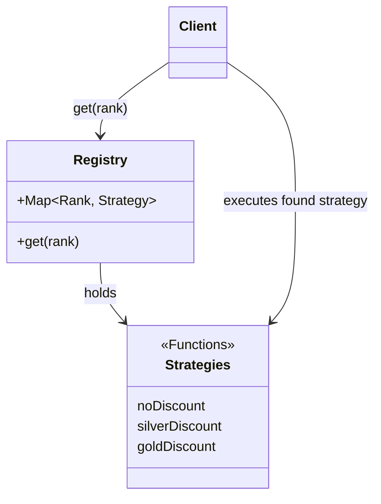

# 第58章：Strategy ② デファクト：配列/Mapで戦略を登録する🗂️

## ねらい🎯

* Strategy（差し替えたい処理）を **「登録して選ぶ」** 形にして、コードが散らばらないようにする📌
* 戦略追加のたびに `if/switch` を増やさない🧠✨
* TypeScriptで **型安全** と **現実の入力（文字列など）** の両方に強くなる🛡️

---

## 今日の主役🌟：戦略を「Map（または配列）」に入れておく

Strategyは「関数」として作るのが一番ラクです⚙️
で、問題は次👇

* 戦略が増える
* 選ぶロジックがあちこちに散る
* いつのまにか `if (rank === 'gold') ...` が増殖 😵‍💫

これを止めるには **「登録場所は1つ」** がコツです🗂️✨


---

## 例題☕：会員ランクで割引を変える

* `regular`：割引なし🙂
* `silver`：5%OFF✨
* `gold`：10%OFF🌟

さらに「知らないランク」が来ても落ちないように、**デフォルト戦略**も用意します🧯

---

## 1) 最小構成：Strategy（関数）＋ Map登録 🗺️

```ts
// --- ドメイン（例題） ---
type Order = {
  subtotalYen: number; // 税抜き小計のつもり（例）
};

type DiscountFn = (order: Order) => number; 
// 返り値は「割引後の金額（円）」にする例

type MemberRank = "regular" | "silver" | "gold";

// --- 戦略（Strategy） ---
const noDiscount: DiscountFn = (o) => o.subtotalYen;

const silverDiscount: DiscountFn = (o) =>
  Math.floor(o.subtotalYen * 0.95);

const goldDiscount: DiscountFn = (o) =>
  Math.floor(o.subtotalYen * 0.90);

// --- 登録（Registry）: Mapにまとめる ---
const discountStrategies = new Map<MemberRank, DiscountFn>([
  ["regular", noDiscount],
  ["silver", silverDiscount],
  ["gold", goldDiscount],
]);

// --- 選択（Selection）: ここが「入口」になる ---
export function calcTotalAfterDiscount(rank: MemberRank, order: Order): number {
  const strategy = discountStrategies.get(rank) ?? noDiscount;
  return strategy(order);
}
```

## ここが気持ちいいポイント💖

* 戦略追加は「Mapに1行足すだけ」🧩
* 利用側は `calcTotalAfterDiscount(...)` を呼ぶだけ📞
* `if/switch` が育たない🌱



---

## 2) キー設計が命🔑✨（型安全を上げる“王道”）

Mapは便利だけど、**`.get()` が `undefined` を返しうる**のが落とし穴です⚠️
なので「キーの型」をしっかり作るのが大事だよ🧠

## “ランク一覧”を1個に固定する📌（文字列ブレ防止）

```ts
const MEMBER_RANKS = ["regular", "silver", "gold"] as const;
type MemberRank = typeof MEMBER_RANKS[number];

// ランタイム用ガード（外部入力が来るときに強い）
const memberRankSet = new Set<string>(MEMBER_RANKS);

export function isMemberRank(x: string): x is MemberRank {
  return memberRankSet.has(x);
}
```

## 外部入力（例：APIやフォーム）から選ぶとき🧾

```ts
export function calcFromUserInput(rankText: string, order: Order): number {
  const rank: MemberRank = isMemberRank(rankText) ? rankText : "regular";
  const strategy = discountStrategies.get(rank) ?? noDiscount;
  return strategy(order);
}
```

これで **「知らないランク」で落ちない**し、**既知ランクは型で守れる**よ🛡️✨

---

## 3) もう一つのデファクト：Record（オブジェクト登録）も強い💪

「キーが固定で増え方が穏やか」なら、実は `Record` が最強に読みやすいです📚
（Mapにこだわらない現場も多いよ）

```ts
type StrategyTable = Record<MemberRank, DiscountFn>;

const table: StrategyTable = {
  regular: noDiscount,
  silver: silverDiscount,
  gold: goldDiscount,
};

export function calcByRecord(rank: MemberRank, order: Order): number {
  return table[rank](order);
}
```

## どっちを選ぶ？🤔

* **Map**：動的に追加・差し替えしたい（プラグインっぽい）🧩
* **Record**：固定キーで読みやすく、`undefined` を踏みにくい📚

---

## 4) 配列で登録するパターン（条件が増えるとき最強）📦✨

ランクだけじゃなくて、例えば👇みたいになるとします：

* `gold` だけど「誕生日ならさらに…」🎂
* 「平日だけ割引」📅
* 「クーポンコードがあれば」🎟️

こういう **条件が重なりうる**世界は、Map（1キー1戦略）より **配列（上から順に当てる）** が自然です🔁

```ts
type DiscountContext = {
  rank: MemberRank;
  isBirthday: boolean;
  subtotalYen: number;
};

type Rule = {
  when: (ctx: DiscountContext) => boolean;
  apply: (ctx: DiscountContext) => number;
};

const rules: Rule[] = [
  {
    when: (c) => c.isBirthday,
    apply: (c) => Math.floor(c.subtotalYen * 0.85), // 誕生日15%OFF🎂
  },
  {
    when: (c) => c.rank === "gold",
    apply: (c) => Math.floor(c.subtotalYen * 0.90),
  },
  {
    when: (c) => c.rank === "silver",
    apply: (c) => Math.floor(c.subtotalYen * 0.95),
  },
  {
    when: (_c) => true,
    apply: (c) => c.subtotalYen,
  },
];

export function calcByRules(ctx: DiscountContext): number {
  const matched = rules.find((r) => r.when(ctx));
  return (matched ?? rules[rules.length - 1]).apply(ctx);
}
```

## 配列ルールの良いところ😍

* 「優先順位」がそのままコード順になる👑
* 条件が増えても `switch` より事故りにくい🚧
* 仕様変更が「ルール1個追加」で済みやすい🧩

---

## 5) よくあるつまずきポイント集💡😵‍💫

## ❌ つまずき1：キー文字列が増殖してタイポ地獄

* `"Gold"`, `"gold "`, `"GOLD"` とか混ざるやつ😇
  ✅ 対策：**キー一覧を1箇所**に固定（`as const` + ガード）🔒

## ❌ つまずき2：Strategyの中でI/O（API呼び出し等）を始める

* テストが急に重くなる🐘
  ✅ 対策：Strategyはなるべく **純粋関数**に寄せる（次章のテストが超ラク）🧪✨

## ❌ つまずき3：選ぶロジックが分散する

* 画面Aと画面Bで選び方が違う、とか😵
  ✅ 対策：**選択関数（入口）を1つ**にする🚪

---

## 6) ハンズオン🛠️（手を動かすやつ💖）

## STEP 1️⃣：戦略を1つ追加してみよう

* `student` を追加して 12%OFF🎓✨
  やること：
* `MEMBER_RANKS` に追加
* Strategy関数を追加
* Map（またはRecord）に登録

## STEP 2️⃣：「未知ランク」が来た時の挙動を決めよう

* デフォルトで `regular` 扱いにする🙂
* それともエラーにする？（UIなら「選択してください」にしたいかも）⚠️

## STEP 3️⃣：配列ルール方式に切り替えてみよう

* `isBirthday` が true なら最優先🎂👑
* ランク割引より上に置く（順番が仕様！）🧠

---

## 7) テスト例（Vitest）🧪✨

Vitestはメジャーアップデートが継続していて、公式でも 4.0 を案内しています。([vitest.dev][1])
（GitHubのリリースでも継続更新が確認できます）([GitHub][2])

```ts
import { describe, it, expect } from "vitest";
import { calcTotalAfterDiscount } from "./discount";

describe("Strategy registry (Map)", () => {
  it("regular は割引なし🙂", () => {
    expect(calcTotalAfterDiscount("regular", { subtotalYen: 1000 })).toBe(1000);
  });

  it("silver は 5%OFF✨", () => {
    expect(calcTotalAfterDiscount("silver", { subtotalYen: 1000 })).toBe(950);
  });

  it("gold は 10%OFF🌟", () => {
    expect(calcTotalAfterDiscount("gold", { subtotalYen: 1000 })).toBe(900);
  });

  it("端数は切り捨てになる（floor）🧮", () => {
    expect(calcTotalAfterDiscount("silver", { subtotalYen: 999 })).toBe(949);
  });
});
```

---

## 8) AIプロンプト例🤖💬（登録型Strategyを育てる用）

```text
割引StrategyをMap登録で管理したいです。
要件:
- 会員ランク regular/silver/gold/student
- 未知ランクは regular 扱い
- Strategyは純粋関数に寄せたい（I/Oなし）
出力:
1) 型定義
2) Map登録の実装
3) 選択関数（入口）
4) Vitestのテスト案（代表＋境界）
```

```text
次のコードをレビューして:
- キー設計（文字列ブレが起きないか）
- Strategyの責務が混ざってないか
- 追加が楽な形になってるか
改善案を段階的に3つください。
```

---

## 9) ミニ補足📌（2026年2月時点の“土台”）

* Node.js は **v24 が Active LTS** として扱われ、更新も続いています。([nodejs.org][3])
* TypeScript は 5.7（`--target es2024` など）以降の改善が進んでいます。([Microsoft for Developers][4])
* ECMAScript 仕様も年次で更新され、2025版が公開されています。([Ecma International][5])

---

## まとめ🎀✨

* Strategyは **作るより「増えた時の管理」が本番** 🧠
* **登録（Map/Record/配列）＋入口（選択関数）** にすると、コードが散らばらない🗂️
* キーは **1箇所で定義**して、入力が怪しい時は **型ガード**で守る🔒
* 次章の「戦略ごとのテスト」が、ここまで整ってると超カンタンになるよ🧪🎉

[1]: https://vitest.dev/blog/vitest-4?utm_source=chatgpt.com "Vitest 4.0 is out!"
[2]: https://github.com/vitest-dev/vitest/releases?utm_source=chatgpt.com "Releases · vitest-dev/vitest"
[3]: https://nodejs.org/en/about/previous-releases?utm_source=chatgpt.com "Node.js Releases"
[4]: https://devblogs.microsoft.com/typescript/announcing-typescript-5-7/?utm_source=chatgpt.com "Announcing TypeScript 5.7"
[5]: https://ecma-international.org/publications-and-standards/standards/ecma-262/?utm_source=chatgpt.com "ECMA-262"
