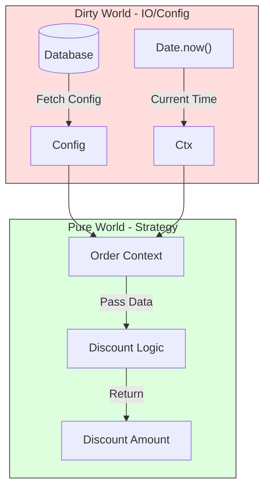

# 第59章：Strategy ③ まとめ：テストが超簡単になる🧪🎉

## ねらい🎯

* Strategy（戦略）を「**純粋関数**」に寄せて、戦略ごとに**独立テスト**できるようになる✨
* 代表ケース＋境界値で「壊れてない安心感」を作れる✅
* 戦略がI/O（API/DB）に近づきそうなときの**分離ライン**がわかる🚧

---

## 最新情報メモ🗞️（2026-02時点）

* TypeScript は npm 上の “Latest” が **5.9.3** として公開されているよ📌 ([npmjs.com][1])
* TypeScript 6.0 は **5.9 と 7.0 の橋渡し**（非推奨整理など）という位置づけが語られているよ🧭 ([Microsoft for Developers][2])
* Node の組み込みテスト（`node:test`）は **Node 20 で stable**（標準で使える）🧪 ([nodejs.org][3])
* 2026-02 頃の Node リリースラインだと **v24 が LTS / v25 が Current** になってるよ🔁 ([nodejs.org][4])
* テスト基盤としては **Vitest v4 系**も普及していて、機能拡張が進んでる（選択肢の1つ）🧰 ([void(0)][5])

---

## 1) 今日の結論💡「Strategyが純粋なら、テストは呼ぶだけ」

Strategy をこうする👇

* 入力：注文データ（order）と計算済み小計（subtotal）
* 出力：割引額（または最終金額）
* ルール：**副作用なし**（ログ出力しない / Date.now() 使わない / 外部アクセスしない）

こうなるとテストは超シンプル🎉

* 「この注文を入れたら割引いくら？」を **assert** するだけ🧪




---

## 2) 題材☕：割引 Strategy を3つ作ってテストする

ここでは「円（整数）」で扱うよ💴（小数の丸め地獄を避けるため😇）

## 戦略の例🧁

* 👩‍🎓 学割：10% OFF（上限 500円）
* 🥇 ゴールド会員：いつでも 5% OFF（上限なし）
* 🕒 ハッピーアワー：15:00〜16:59 は 200円 OFF（ただし小計 1000円以上）

---

## 3) 実装：Strategy を “関数＋Map登録” にする🗂️✨

## `src/discount.ts`

```ts
export type Item = {
  name: string;
  priceYen: number; // 円（整数）
  qty: number;      // 個数（整数）
};

export type MemberTier = "guest" | "silver" | "gold";

export type Order = {
  items: Item[];
  memberTier: MemberTier;
  isStudent: boolean;
  createdAt: Date; // 「いつ注文したか」を外から注入（Date.now()禁止）
};

export type DiscountKey = "none" | "student" | "gold" | "happyHour";

/**
 * Strategy：割引額（円）を返す
 * - 副作用なし
 * - 入力が同じなら出力も同じ
 */
export type DiscountStrategy = (order: Order, subtotalYen: number) => number;

export function calcSubtotalYen(order: Order): number {
  const subtotal = order.items.reduce((sum, it) => {
    assertNonNegativeInt(it.priceYen, "priceYen");
    assertNonNegativeInt(it.qty, "qty");
    return sum + it.priceYen * it.qty;
  }, 0);

  return subtotal;
}

export function calcTotalYen(order: Order, key: DiscountKey): number {
  const subtotal = calcSubtotalYen(order);
  const strategy = getDiscountStrategy(key);

  const discount = clampYen(strategy(order, subtotal), 0, subtotal);
  return subtotal - discount;
}

/** Strategy 登録（Map） */
const strategies = new Map<DiscountKey, DiscountStrategy>([
  ["none", () => 0],

  ["student", (order, subtotal) => {
    if (!order.isStudent) return 0;
    const raw = Math.floor(subtotal * 0.1);
    return Math.min(raw, 500);
  }],

  ["gold", (order, subtotal) => {
    if (order.memberTier !== "gold") return 0;
    return Math.floor(subtotal * 0.05);
  }],

  ["happyHour", (order, subtotal) => {
    if (subtotal < 1000) return 0;
    const h = order.createdAt.getHours();
    // 15:00〜16:59
    const isHappy = h === 15 || h === 16;
    return isHappy ? 200 : 0;
  }],
]);

export function getDiscountStrategy(key: DiscountKey): DiscountStrategy {
  return strategies.get(key) ?? strategies.get("none")!;
}

/** ちょいユーティリティ（独自クラスは作らない） */
function clampYen(n: number, min: number, max: number): number {
  if (!Number.isFinite(n)) return min;
  return Math.max(min, Math.min(max, Math.floor(n)));
}

function assertNonNegativeInt(n: number, name: string): void {
  if (!Number.isInteger(n) || n < 0) {
    throw new Error(`${name} must be a non-negative integer. got=${n}`);
  }
}
```

ポイント✅

* Strategy は **関数**（`DiscountStrategy`）
* 追加は `strategies.set("newKey", fn)` でOK🗂️
* `createdAt` を Order に持たせて、時間判定も **テスト可能**にしてる🕒

---

## 4) テスト：Node標準の `node:test` で戦略ごとにサクッと🧪✨

Node の組み込みテストは `node:test` を使うよ（Node 20 で stable）([nodejs.org][3])

## `src/discount.test.ts`

```ts
import test from "node:test";
import assert from "node:assert/strict";
import { calcTotalYen, type Order } from "./discount.js"; // NodeNext想定（.js参照）

function makeOrder(partial: Partial<Order> = {}): Order {
  return {
    items: [
      { name: "Latte", priceYen: 500, qty: 1 },
      { name: "Cookie", priceYen: 300, qty: 2 },
    ],
    memberTier: "guest",
    isStudent: false,
    createdAt: new Date("2026-02-01T14:00:00+09:00"),
    ...partial,
  };
}

test("none: 割引なし", () => {
  const order = makeOrder();
  // 小計 = 500*1 + 300*2 = 1100
  assert.equal(calcTotalYen(order, "none"), 1100);
});

test("student: 学割10%（上限500円）", () => {
  const order = makeOrder({ isStudent: true });
  // 1100 * 10% = 110（端数切り捨て）
  assert.equal(calcTotalYen(order, "student"), 990);
});

test("gold: ゴールド会員5%", () => {
  const order = makeOrder({ memberTier: "gold" });
  // 1100 * 5% = 55
  assert.equal(calcTotalYen(order, "gold"), 1045);
});

test("happyHour: 15-16時は200円OFF（小計1000円以上）", () => {
  const order = makeOrder({ createdAt: new Date("2026-02-01T15:30:00+09:00") });
  assert.equal(calcTotalYen(order, "happyHour"), 900);
});

test("happyHour: 小計1000円未満なら0円", () => {
  const order = makeOrder({
    items: [{ name: "Tea", priceYen: 400, qty: 2 }], // 800
    createdAt: new Date("2026-02-01T15:10:00+09:00"),
  });
  assert.equal(calcTotalYen(order, "happyHour"), 800);
});
```

---

## 5) 動かし方（TS→JSにして Node でテスト）🧰

Node のテストランナーは標準で使えるけど、TypeScript はそのままだと実行できないので、まず `tsc` で JS にするよ（いちばん堅い＆標準寄り）✨

## `tsconfig.json`（例）

```json
{
  "compilerOptions": {
    "target": "ES2022",
    "module": "NodeNext",
    "moduleResolution": "NodeNext",
    "strict": true,
    "outDir": "dist",
    "rootDir": "src",
    "declaration": false,
    "sourceMap": true
  },
  "include": ["src/**/*.ts"]
}
```

## `package.json` scripts（例）

```json
{
  "scripts": {
    "build": "tsc -p tsconfig.json",
    "test": "npm run build && node --test dist/**/*.test.js"
  },
  "devDependencies": {
    "typescript": "^5.9.3"
  }
}
```

`node --test` は Node の組み込み機能だよ🧪 ([nodejs.org][3])
（`--watch` もあるけど、watch は一部 experimental 扱いの箇所があるので「便利だけど様子見」でOK👀）([nodejs.org][3])

---

## 6) 境界値テストの作り方🧊（Strategyはここが気持ちいい）

「戦略が壊れやすい境界」を狙うのがコツ🎯

## よく効く境界値リスト🧪

* 💴 **0円**：小計0のとき（items空、qty=0）
* 🔢 **ちょうど**：ハッピーアワー開始時刻（15:00）、終了境界（16:59→17:00）
* 📏 **しきい値**：小計が 999 / 1000 のとき
* 🧢 **上限**：学割の上限500円（小計が 4999 / 5000 / 5001 とか）
* 🧮 **丸め**：%計算の端数（1099円の10%は109円、1100円は110円）
* 🧨 **異常系**：priceYen や qty が負数・小数（ちゃんと落ちる？）

> ここが最高ポイント💖
> Strategy が純粋だと、「入力をちょっと変えて assert」だけで境界値が全部いける✨

---

## 7) つまずき回避💡（Strategyが“テストしにくい子”になる原因）

## ❌ ありがち地雷💣 → ✅ こう直す

* ❌ `Date.now()` を Strategy 内で使う → ✅ `createdAt` を Order に入れて注入🕒
* ❌ `console.log` を Strategy に入れる → ✅ ログは外側（Decorator/呼び出し側）へ📣
* ❌ Strategy が API/DB を叩く → ✅ 「取得」と「計算」を分離して、計算だけ Strategy にする🧼
* ❌ Order を破壊的に変更する → ✅ できれば読み取り専用で扱う（必要ならコピー）🧊

---

## 8) 「戦略がI/Oし始めたら」分離ライン🚧（超大事）

たとえば「割引率が管理画面で変わる」みたいになると、Strategy が設定取得をしたくなるよね😵‍💫
でも **Strategy は計算担当に固定**するのが勝ち✨

## 形のイメージ🧠

* ✅ `fetchDiscountConfig()`：外部I/O（API/DB）
* ✅ `calcDiscount(config, order, subtotal)`：純粋関数（Strategyにする）
* ✅ テスト：`calcDiscount` を全力でテストする🧪

これで「I/Oの不安定さ」と「割引計算の正しさ」が混ざらない🧼✨

---

## 9) AIプロンプト例🤖💬（テスト設計が一気に進む）

```txt
次の割引Strategy（純粋関数）について、代表ケース＋境界値のテストケースを10個提案して。
- 入力: order, subtotalYen
- 出力: discountYen
- 仕様: 学割10%上限500円 / Gold5% / HappyHour(15-16時200円OFFかつ1000円以上)
- 出力形式: ケース名 / 入力 / 期待値 / そのケースが重要な理由
```

```txt
このStrategyが「純粋関数になっていない」疑いがある点をチェックして、改善案を3つ出して。
（Date.now, random, I/O, mutation なども観点に入れて）
```

```txt
node:test + assert/strict で、境界値テスト中心のテストコードを書いて。
（過剰なモックや独自テストユーティリティは作らない）
```

---

## 10) まとめ✅🎉

* Strategy を **関数**にして **Map登録**すると、追加も整理もラク🗂️✨
* Strategy を **純粋関数**に寄せると、テストは「呼んで assert」だけ🧪💖
* I/O が絡みそうになったら、「取得」と「計算」を分けて、計算だけを Strategy に残す🧼

次は「通知したい」を疎結合で実現する **Observer** に進むよ📣✨

[1]: https://www.npmjs.com/package/typescript?activeTab=versions&utm_source=chatgpt.com "typescript"
[2]: https://devblogs.microsoft.com/typescript/progress-on-typescript-7-december-2025/?utm_source=chatgpt.com "Progress on TypeScript 7 - December 2025"
[3]: https://nodejs.org/api/test.html?utm_source=chatgpt.com "Test runner | Node.js v25.6.0 Documentation"
[4]: https://nodejs.org/en/about/previous-releases?utm_source=chatgpt.com "Node.js Releases"
[5]: https://voidzero.dev/posts/announcing-vitest-4?utm_source=chatgpt.com "Announcing Vitest 4.0"
