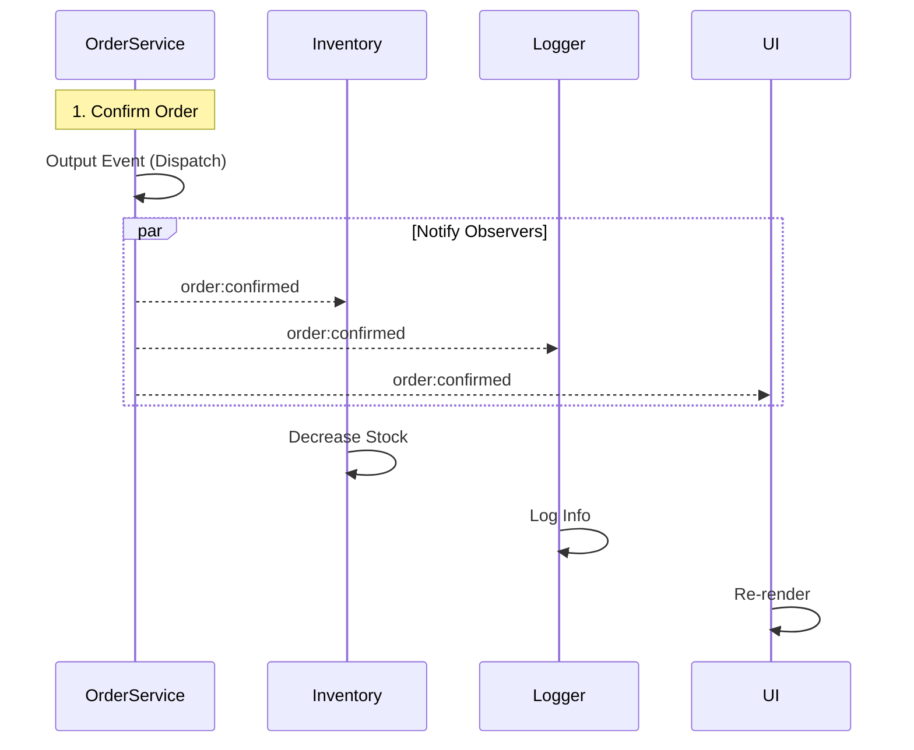

# 第60章：Observer ① “通知したい”を疎結合でやる（最重要その2）📣

---

## ねらい🎯

* Observer（オブザーバー）＝「購読して、通知を受け取る」仕組みが説明できるようになる✨ ([ウィキペディア][1])
* 「発行側（Subject）」が「受信側（Observer）」を知らなくていい状態（疎結合）を作れるようになる🧩 ([ウィキペディア][1])
* “注文確定したら〇〇も△△も…”みたいな連鎖を、if地獄にせず整理できる🧹✨

---

## 1. Observerってなに？🍩

Observerは、「ある出来事が起きたら、それを知りたい人たちにまとめてお知らせする」仕組みだよ📣
ポイントは **1対多**（ひとつの発行元 → たくさんの購読者）で、しかも **ゆるくつながる** こと！ ([ウィキペディア][1])

* **発行側（Subject / Provider）**：出来事を起こして通知する人
* **購読側（Observer / Subscriber）**：通知を受け取って何かする人

たとえば「注文が確定した！」という出来事に対して👇

* 在庫を減らす📦
* ログを残す📝
* 画面を更新する🖥️✨
* 分析イベントを送る📊

…みたいな処理を、それぞれ別々に“購読”して動かせるようになるよ💗


---

## 2. Observerが効く“つらさ”あるある😵‍💫➡️😊

## こうなってきたら出番かも👀

* 「注文確定」の関数がどんどん巨大化していく🐘
* いろんな場所に “注文確定したら〇〇” が散らばる🌀
* 追加したい処理（例：通知先が増える）が来るたびに、同じ関数を編集することになる✍️💥

Observerにすると👇

* 発行側は「注文確定イベントを出す」だけでOK✨
* 受け取り側は「必要なら購読する」「不要なら購読解除する」でOK✨ ([ウィキペディア][1])



---

## 3. TypeScriptでの最短ルート：`EventTarget` でObserverを体験しよう🎀

`EventTarget` はイベント購読（`addEventListener`）と通知（`dispatchEvent`）を提供する標準の仕組みだよ✨ ([MDNウェブドキュメント][2])
（最近の `Node.js` でも `EventTarget` や `CustomEvent` が使える流れが整ってきてるよ〜！） ([nodejs.org][3])

---

## 4. ハンズオン🛠️：注文確定 → 在庫更新 / ログ / UI更新 を通知でつなぐ📣✨

## 4-1. まずイベント名と payload（通知の中身）を決める📦

* イベント名は **過去形** が分かりやすい（「起きた」ことを通知する）🕰️
  例：`order:confirmed`（注文が確定した）✅
* payload は “受け取り側が必要な最低限” にする（入れすぎ注意）🍱

```ts
// イベント名は “定数” にしてブレ防止✨
export const OrderEvents = {
  Confirmed: "order:confirmed",
} as const;

export type OrderConfirmedDetail = {
  orderId: string;
  items: Array<{ sku: string; qty: number }>;
  totalYen: number;
};
```

---

## 4-2. 発行側（Subject）：注文確定したらイベントを出す📣

`dispatchEvent` で通知するよ✨ ([nodejs.org][4])

```ts
import { OrderEvents, type OrderConfirmedDetail } from "./events";

export type Order = {
  id: string;
  items: Array<{ sku: string; qty: number }>;
  totalYen: number;
};

export class OrderService extends EventTarget {
  confirm(order: Order): void {
    // ✅ ここに「注文確定」の本体ロジック（DB保存など）がある想定

    // 通知（Observerへ📣）
    const detail: OrderConfirmedDetail = {
      orderId: order.id,
      items: order.items,
      totalYen: order.totalYen,
    };

    // CustomEvent の detail に payload を載せるよ🎁
    const ev = new CustomEvent<OrderConfirmedDetail>(OrderEvents.Confirmed, { detail });
    this.dispatchEvent(ev);
  }
}
```

`CustomEvent` は「detail に情報を載せられるイベント」だよ🎁 ([MDNウェブドキュメント][5])

---

## 4-3. 購読側（Observers）：必要な人だけ購読する🎧✨

## 在庫更新📦

```ts
import { OrderEvents, type OrderConfirmedDetail } from "./events";
import type { OrderService } from "./order-service";

export function subscribeInventoryUpdate(service: OrderService) {
  const handler = (ev: Event) => {
    const { detail } = ev as CustomEvent<OrderConfirmedDetail>;
    // ✅ 在庫を減らす（例）
    for (const item of detail.items) {
      console.log("[inventory] decrease", item.sku, item.qty);
    }
  };

  service.addEventListener(OrderEvents.Confirmed, handler);
  return () => service.removeEventListener(OrderEvents.Confirmed, handler); // 解除も大事✨
}
```

## ログ📝

```ts
import { OrderEvents, type OrderConfirmedDetail } from "./events";
import type { OrderService } from "./order-service";

export function subscribeOrderLogging(service: OrderService) {
  const handler = (ev: Event) => {
    const { detail } = ev as CustomEvent<OrderConfirmedDetail>;
    console.log("[log] confirmed", detail.orderId, "total:", detail.totalYen);
  };

  service.addEventListener(OrderEvents.Confirmed, handler);
  return () => service.removeEventListener(OrderEvents.Confirmed, handler);
}
```

## UI更新🖥️✨（例：再描画トリガー）

```ts
import { OrderEvents, type OrderConfirmedDetail } from "./events";
import type { OrderService } from "./order-service";

export function subscribeUiUpdate(service: OrderService, render: (orderId: string) => void) {
  const handler = (ev: Event) => {
    const { detail } = ev as CustomEvent<OrderConfirmedDetail>;
    render(detail.orderId);
  };

  service.addEventListener(OrderEvents.Confirmed, handler);
  return () => service.removeEventListener(OrderEvents.Confirmed, handler);
}
```

---

## 4-4. 組み立て（購読して、確定してみる🎉）

```ts
import { OrderService } from "./order-service";
import { subscribeInventoryUpdate } from "./inventory-subscriber";
import { subscribeOrderLogging } from "./log-subscriber";
import { subscribeUiUpdate } from "./ui-subscriber";

const service = new OrderService();

const unsubInventory = subscribeInventoryUpdate(service);
const unsubLog = subscribeOrderLogging(service);
const unsubUi = subscribeUiUpdate(service, (orderId) => {
  console.log("[ui] re-render for", orderId);
});

service.confirm({
  id: "ORD-001",
  items: [{ sku: "LATTE", qty: 1 }, { sku: "COOKIE", qty: 2 }],
  totalYen: 980,
});

// もう要らなくなったら解除🧹
unsubUi();
unsubLog();
unsubInventory();
```

---

## 5. “購読解除”をラクにする小技：`AbortController` でまとめて解除🧯✨

`addEventListener` は `AbortSignal` を使って解除できるオプションがあるよ（まとめて解除に便利）🧼
特に「画面が閉じたら購読ぜんぶ解除」みたいなとき気持ちいい！ ([MDNウェブドキュメント][6])

```ts
const controller = new AbortController();

service.addEventListener("order:confirmed", handler1, { signal: controller.signal });
service.addEventListener("order:confirmed", handler2, { signal: controller.signal });

// まとめて解除✨
controller.abort();
```

---

## 6. テスト🧪：Observerの“価値”はテストしやすさで実感できるよ💗

`dispatchEvent` は購読者へ通知する仕組みだよ（通知できてるか確認しよ〜） ([nodejs.org][4])

```ts
import test from "node:test";
import assert from "node:assert/strict";
import { OrderService } from "./order-service";
import { OrderEvents } from "./events";

test("注文確定で order:confirmed が通知される📣", () => {
  const service = new OrderService();

  let called = 0;
  const handler = () => { called += 1; };

  service.addEventListener(OrderEvents.Confirmed, handler);

  service.confirm({
    id: "ORD-TEST",
    items: [{ sku: "TEA", qty: 1 }],
    totalYen: 500,
  });

  assert.equal(called, 1);
  service.removeEventListener(OrderEvents.Confirmed, handler);
});

test("購読解除したら通知されない🧹", () => {
  const service = new OrderService();

  let called = 0;
  const handler = () => { called += 1; };

  service.addEventListener(OrderEvents.Confirmed, handler);
  service.removeEventListener(OrderEvents.Confirmed, handler);

  service.confirm({
    id: "ORD-TEST2",
    items: [{ sku: "COFFEE", qty: 1 }],
    totalYen: 450,
  });

  assert.equal(called, 0);
});
```

---

## 7. よくある落とし穴⚠️（ここで事故る人多い〜！）

## 7-1. イベント名が乱立してカオス🌀

* `orderConfirmed`, `order_confirmed`, `OrderConfirmed` …みたいに揺れると死ぬ😇
  → **定数化**（`OrderEvents`）で固定しよ📌

## 7-2. payload（detail）が太りすぎる🍔

* なんでも入れると、受け取り側がイベントに依存して逆に密結合💥
  → **必要最低限**＋足りないものは「IDで取りに行く」発想もOK👌

## 7-3. 解除し忘れ（メモリリーク・二重購読）👻

* “画面開くたび購読追加” して “閉じても解除しない” と地獄🫠
  → **unsubscribe を必ず戻す** or `AbortController` でまとめて解除🧯 ([MDNウェブドキュメント][6])

## 7-4. ハンドラが例外を投げて全体が壊れる💣

環境によっては、イベントハンドラ内の例外が「未処理例外」扱いになったりするので注意だよ⚠️（他のハンドラは呼ばれるけど、落ち方が怖い） ([nodejs.org][3])
→ ハンドラ内は **try/catch** か、Result的に失敗を扱うのが安心🧯

---

## 8. ミニ課題🎒✨（手を動かすと一気に腹落ちするよ！）

## 課題A：分析イベントを追加📊

* `order:confirmed` を購読して

  * 合計金額をログに出す
  * SKUの種類数を数える
    …みたいな “分析っぽい処理” を追加してみよ🙌

## 課題B：失敗もイベントにしてみる😢

* `order:confirmFailed` を追加して

  * UIにエラー表示（例：`renderError(msg)`）
  * ログに残す
    を購読で分けてみよ✨

## 課題C：イベント一覧を作る📝（次章の伏線💞）

* イベント名 / いつ出る？ / payload は？ を3〜5個まとめてみよ📦

---

## 9. AIに投げると捗るプロンプト例🤖💬（コピペOK✨）

```text
Observer（購読/通知）のイベント設計をレビューして！
- イベント名は過去形で統一したい
- payload（detail）は必要最低限にしたい
- 追加したい購読者：在庫更新、ログ、UI更新、分析

次を出して：
1) イベント名候補（3案）
2) payload設計（過不足チェック）
3) 購読解除の設計（removeEventListener / AbortController）
4) テストケース案（境界ケースも）
```

AI拡張（GitHub系 / OpenAI系）があると、イベント名の揺れチェックとかテスト案出しが速くて気持ちいいよ〜🫶💕

---

## 10. まとめ🎀✨

* Observerは「通知したい」を **疎結合** で実現する最重要パターン📣 ([ウィキペディア][1])
* **発行側は購読者を知らない**／購読者は **必要なら購読して、不要なら解除**🧩
* TypeScriptではまず `EventTarget`（購読）＋ `dispatchEvent`（通知）＋ `CustomEvent.detail`（payload）で体験すると最短✨ ([MDNウェブドキュメント][2])
* イベント名の規約📌・解除🧹・例外対策🧯をセットで覚えると強い！

次の章では、`EventTarget` と `EventEmitter` の使い分けを “迷わない基準” で整理していくよ〜🧠✨

[1]: https://en.wikipedia.org/wiki/Observer_pattern?utm_source=chatgpt.com "Observer pattern"
[2]: https://developer.mozilla.org/ja/docs/Web/API/EventTarget/dispatchEvent?utm_source=chatgpt.com "EventTarget: dispatchEvent() メソッド - Web API | MDN"
[3]: https://nodejs.org/api/events.html?utm_source=chatgpt.com "Events | Node.js v25.5.0 Documentation"
[4]: https://nodejs.org/en/learn/asynchronous-work/the-nodejs-event-emitter?utm_source=chatgpt.com "The Node.js Event emitter"
[5]: https://developer.mozilla.org/en-US/docs/Web/API/CustomEvent/detail?utm_source=chatgpt.com "CustomEvent: detail property - Web APIs - MDN Web Docs"
[6]: https://developer.mozilla.org/ja/docs/Web/API/EventTarget/addEventListener?utm_source=chatgpt.com "EventTarget: addEventListener() メソッド - Web API | MDN"
