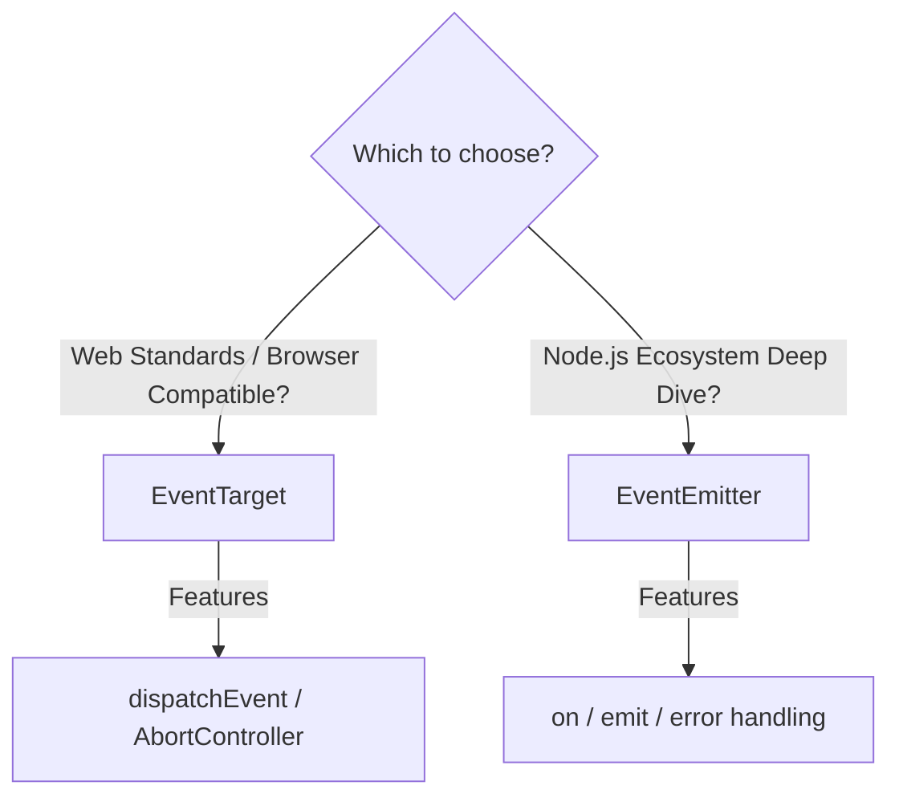

# 第61章：Observer ② TypeScriptの定番：EventTarget / EventEmitterの使い分け🧠

## ねらい🎯

Observer（購読→通知）を「標準/デファクトの道具」でスッと書けるようになること✨
特に **EventTarget**（Web標準）と **EventEmitter**（Node定番）の違いを、迷わず選べるようにします😊


---

## 1) まず結論：どっちを使う？🗺️✨


### ✅ EventTarget を選ぶと気持ちいい場面🌐

* ブラウザやWeb系の設計に寄せたい（Web標準のイベントモデルで統一したい）
* `addEventListener` / `dispatchEvent` の世界で書きたい
* `AbortController` の `signal` で **購読解除を自動化**したい（リーク対策がラク）
* NodeでもEventTarget系を使いたい（NodeにもEventTarget/Event/CustomEventがある）([nodejs.org][1])

### ✅ EventEmitter を選ぶと気持ちいい場面🟢

* Nodeのエコシステム（`node:events`）にどっぷり
* `on/once/off/emit` が自然なコードになっている
* **`error` イベントの扱い**など、Node流の作法で揃えたい([nodejs.org][1])



---

## 2) EventTargetって何？🌐🧩

EventTargetは「イベントを購読（`addEventListener`）して、発行（`dispatchEvent`）する」ための標準的な仕組みだよ😊
同じリスナーを同じイベントに複数回登録しても、重複登録はされない（＝勝手に増殖しにくい）という特徴もあるよ✨([MDNウェブドキュメント][2])

そして重要ポイント👇

* `dispatchEvent` は **基本的に同期的**にリスナーを呼ぶ（登録順に実行）([nodejs.org][1])
* `CustomEvent` を使うと、イベントに **payload（`detail`）** を載せられる📦([nodejs.org][1])
* `signal` を使うと購読解除がラク（Abortで一発）🧯([MDNウェブドキュメント][2])

---

## 3) EventEmitterって何？🟢📣

EventEmitterはNodeのイベント通知の王道🥳
`on` で購読して `emit` で発行。リスナー呼び出しは同期的で、戻り値は無視されるよ。([nodejs.org][1])

注意したいのはここ👇

* `error` イベントは特別扱いで、購読されてないと例外につながる…みたいな“Node流”がある（設計に影響する）([Stack Overflow][3])
* リスナーを増やしすぎると警告（メモリリーク疑い）などの概念がある([Stack Overflow][3])

---

## 4) ハンズオン🛠️：EventTargetで「注文確定」を通知する☕🧾➡️📣


ここでは **“イベントバス専用の独自クラス”は作らず**、`EventTarget` と関数でサクッと組みます😊
（やることは「イベント名」「payload型」「emit/on」だけ✨）

```ts
// events.ts
export type OrderPlacedDetail = {
  orderId: string;
  totalYen: number;
};

export const EVT = {
  orderPlaced: "order:placed",
} as const;

const bus = new EventTarget();

/** 発行（notify）📣 */
export function emitOrderPlaced(detail: OrderPlacedDetail) {
  bus.dispatchEvent(new CustomEvent<OrderPlacedDetail>(EVT.orderPlaced, { detail }));
}

/** 購読（subscribe）👂 解除関数を返す（unsubscribe）🧹 */
export function onOrderPlaced(listener: (detail: OrderPlacedDetail) => void) {
  const handler = (ev: Event) => {
    const ce = ev as CustomEvent<OrderPlacedDetail>;
    listener(ce.detail);
  };

  bus.addEventListener(EVT.orderPlaced, handler);
  return () => bus.removeEventListener(EVT.orderPlaced, handler);
}
```

`CustomEvent` の `detail` がpayloadだよ📦([nodejs.org][1])
`dispatchEvent` は登録順に同期的に呼ぶので、「発行した直後に反応が走る」イメージでOK✨([nodejs.org][1])

---

## 5) 使ってみよう😊（ログ・在庫更新・UI更新っぽいのを分ける）

```ts
import { emitOrderPlaced, onOrderPlaced } from "./events.js";

// ログ担当📝
const offLog = onOrderPlaced(({ orderId, totalYen }) => {
  console.log(`[LOG] placed: ${orderId} total=${totalYen}`);
});

// 在庫担当📦
const offStock = onOrderPlaced(({ orderId }) => {
  console.log(`[STOCK] decrease items for order=${orderId}`);
});

// 注文確定🎉（ここがSubject側）
emitOrderPlaced({ orderId: "A001", totalYen: 1280 });

// いらなくなったら解除🧹
offLog();
offStock();
```

ポイントはこれ👇

* 注文確定側は「誰が聞いてるか」を知らない🙆‍♀️
* 機能追加は購読を増やすだけ（既存を壊しにくい）🎁

---

## 6) つまずき回避💡：購読解除を“自動化”する（AbortController）🧯✨


「解除し忘れ」が一番あるある😵‍💫
`signal` を使うと、Abortでまとめて解除できるよ！

```ts
import { EVT } from "./events.js";

const bus = new EventTarget();
const ac = new AbortController();

bus.addEventListener(
  EVT.orderPlaced,
  (ev) => {
    const { detail } = ev as CustomEvent<{ orderId: string }>;
    console.log("once session:", detail.orderId);
  },
  { signal: ac.signal }
);

// まとめて解除（購読の寿命を終わらせる）
ac.abort();
```

`addEventListener` の `signal` は標準的なオプションで、NodeのEventTargetでも説明されてるよ✅([MDNウェブドキュメント][2])

---

## 7) じゃあ EventEmitter で同じことを書くと？🟢（Node寄り）

```ts
import { EventEmitter } from "node:events";

type OrderPlacedDetail = { orderId: string; totalYen: number };

const emitter = new EventEmitter();

emitter.on("order:placed", (detail: OrderPlacedDetail) => {
  console.log("[LOG]", detail);
});

emitter.emit("order:placed", { orderId: "A001", totalYen: 1280 });
```

EventEmitterはNodeの基本として超強い💪
ただし **`error` イベントの扱い**など“Node流の罠”があるので、設計時にちゃんと意識してね⚠️([Stack Overflow][3])

---

## 8) EventTarget と EventEmitter の“差”で事故りやすい所⚠️🧠


### 🧨 ① エラーの扱いが違う

NodeのEventTargetは、エラー処理まわりでEventEmitterと挙動が違う（プロセスを止める方向に寄る説明もある）ので、**「例外どうする？」**は早めに決めようね🧯([nodejs.org][1])

### 🧷 ② 同じリスナーを何回も登録しちゃう

EventTargetは同一登録が無視されるけど、設計的には「二重購読しない設計」にしておく方が読みやすいよ✨([MDNウェブドキュメント][2])

### 🕰️ ③ `dispatchEvent/emit` は基本“同期”

イベントを投げた瞬間に購読側が動くから、重い処理を入れると呼び出し元が詰まる😵
重い処理は「購読側で非同期キューに積む」などで逃がそうね（これは次の章の設計にもつながるよ）([nodejs.org][1])

---

## 9) ミニ演習✍️🎀

### 演習A：イベントを増やす📦

* `order:cancelled` を追加して、payloadを `{ orderId: string; reason: "user" | "timeout" }` にしてみよう😊

### 演習B：一回だけ購読（once）🎯

* `addEventListener(..., { once: true })` を使って「最初の1回だけ反応」する購読を作ってみよう✨([MDNウェブドキュメント][2])

### 演習C：購読の寿命をsignalで管理🧯

* “画面が開いてる間だけ購読”みたいに、Abortでまとめて解除する形にしてみよう😊([MDNウェブドキュメント][2])

---

## 10) AIプロンプト例🤖💬（コピペOK）

```text
EventTargetでObserverを実装しています。
イベント名・payload設計（粒度/命名/過不足）をレビューして、改善案を3つください。
また、購読解除漏れを防ぐ設計（AbortControllerなど）も提案してください。
コードは「独自イベントバスのクラス」を作らず、標準/デファクト中心でお願いします。
```

```text
次のイベント一覧から、最小限の EventTarget ヘルパー関数（emit/on）を提案してください。
- order:placed { orderId: string; totalYen: number }
- order:cancelled { orderId: string; reason: "user" | "timeout" }
TypeScriptで型安全に（でも過剰な仕組みにしない）お願いします。
```

[1]: https://nodejs.org/api/events.html "Events | Node.js v25.6.0 Documentation"
[2]: https://developer.mozilla.org/ja/docs/Web/API/CustomEvent/detail?utm_source=chatgpt.com "CustomEvent: detail プロパティ - Web API | MDN"
[3]: https://stackoverflow.com/questions/43001679/how-do-you-create-custom-event-in-typescript?utm_source=chatgpt.com "How do you create custom Event in Typescript?"
