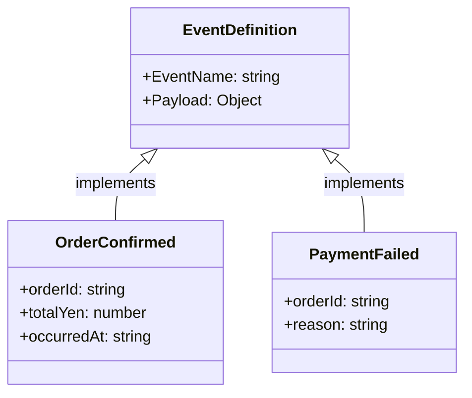

# 第62章：Observer ③ まとめ：イベント設計（粒度・名前・ペイロード）📦

## ねらい🎯

* 「イベント」を“実装テク”じゃなく **仕様（ルール）** として設計できるようになるよ🧠✨
* 「イベント名」「粒度」「payload（ペイロード）」を決める時に、迷いが減るよ🧭💕

## 学ぶこと📌

* イベント名の付け方（安定して読みやすい命名）🏷️
* イベント粒度（細かすぎ/粗すぎのバランス）🔍
* payload設計（必要十分・壊れにくい・型で守る）🧩
* 互換性（あとから変更しても事故らない）🛡️
* テスト観点（「イベントは仕様」だからテストしやすい）🧪



---

## 0. まず大事な前提：イベントは「仕様書」🧾💡

Observerは「通知」だけど、実務で強いのは **“イベントを仕様として決める”** ところだよ✨
実装（EventTargetで飛ばす等）は後でOK。まずはこの3点を設計しよう👇

1. **イベント名**（人間が読める・意味がぶれない）🏷️
2. **粒度**（増え方が健全）🔍
3. **payload**（必要十分・破壊的変更が起きにくい）📦

ちなみに、`EventTarget.dispatchEvent()` はイベントを **同期的に** 配送するよ（リスナーが順に呼ばれるイメージ）🧵
これ、設計にも効くポイント！ ([MDNウェブドキュメント][1])

---

## 1. イベント粒度（Granularity）🔍🍰

粒度って「イベントをどれくらい細かく分けるか」だよ！

### 粒度が細かすぎると…🥲

* イベント名が増殖 → 把握できない 😵‍💫
* 似たイベントが乱立 → “違い何？” になる
* 購読側が増えてカオス 💥

### 粒度が粗すぎると…🥲

* payloadが巨大化 → 依存が太くなる 🐘
* 1イベントで何でも起きる → 読めない 😭
* 「どの時点の話？」が曖昧になる

### ちょうどいい粒度の目安🧁✨

* **業務的に意味がある“出来事”** を1つのイベントにする

  * ✅ `order:confirmed`（注文が確定した）
  * ✅ `payment:failed`（支払いが失敗した）
  * ❌ `order:clicked`（UIのクリックは別枠になりがち）
* 「状態が変わった」か「意思決定が終わった」タイミングを狙うと安定しやすい🎯

---

## 2. イベント名（Naming）🏷️✨

イベント名は “設計の命” だよ〜！💘

### 命名のおすすめルール（迷子防止）🧭

* **小文字 + 区切り記号（`:`）** で読みやすく

  * 例：`order:confirmed` / `inventory:reserved`
* **過去形/完了形**（「起きた」出来事として）

  * 例：`order:confirm` より `order:confirmed`
* **ドメイン名を先頭に**（衝突を防ぐ）

  * 例：`order:*` `payment:*` `inventory:*`
* **同じ名前で意味を変えない**（超重要⚠️）

イベント名は大文字小文字を区別する仕様なので、表記ゆれは事故のもと！統一しようね🧼
（イベント名がcase-sensitiveである点は `CustomEvent` の説明でも触れられてるよ） ([MDNウェブドキュメント][2])

---

## 3. payload（ペイロード）設計📦🧩

payloadは「イベントにくっつけるデータ」。
`CustomEvent` なら `detail` に入れて、受け取り側は `event.detail` で読めるよ✨ ([MDNウェブドキュメント][3])


### payload設計の基本ルール🌸

* **原則オブジェクト1個**（引数を増やさない）📦
* **必要十分**（全部渡さない。使う側が必要な最小だけ）✂️
* **シリアライズ可能寄り**（関数・クラス实例は避ける）🧊
* **ID中心**にすることが多い

  * 例：`orderId` を渡して、詳細は必要なら別で取りに行く

### “あとで困りにくい”おすすめフィールド🍀

* `occurredAt`：ISO文字列（例：`new Date().toISOString()`）🕒
* `correlationId`：一連の流れを追うためのID（ログ追跡が神）🧵
* `version`：将来の変更に備える（必須ではないけど便利）🧩

---

## 4. 互換性（壊れにくさ）🛡️🧸

イベントは購読者が増えやすいから、変更が地雷になりがち💣

### 安全な変更✅

* payloadに **新しいフィールドを追加**（既存はそのまま）
* 新イベントを追加（旧イベントも当面残す）

### 危険な変更⚠️

* フィールド削除 / 名前変更
* 型を変える（`number` → `string` など）
* 意味を変える（同じイベント名なのに別の出来事になる）

### 現実的な運用テク🧰

* 新旧を並走：`order:confirmed` は残しつつ `order:confirmed:v2` を追加、みたいに **バージョンをイベント名に入れる** のもアリ🎮
* 旧イベントを“deprecated（非推奨）”として周知して、段階的に移行📣

---

## 5. 同期配送の注意（リスナーの設計）🧵⚠️

`dispatchEvent()` は同期でリスナーが呼ばれるよ。つまり…

* 重い処理をリスナーでやると、発行側が詰まる可能性がある 😵‍💫
* 失敗（例外）が設計に影響しやすい（どこまで伝播させる？）🧯

仕様として「dispatchEventは同期で呼ぶ」ことが明記されてるので、イベントでやる処理は軽め＆安全寄りに設計するのが無難だよ✨ ([MDNウェブドキュメント][1])

---

## 6. ハンズオン🛠️：イベント一覧（カタログ）＋payload型を作る📚✨

### 6-1) イベントカタログ（例）🗒️

最低限、次の列があると強いよ💪

* event（イベント名）
* when（いつ発生？）
* emitter（誰が発行？）
* payload（何を渡す？）
* consumers（誰が購読？）
* notes（注意点）

例（カフェ注文）☕🧁

* `order:confirmed`：注文が確定した
* `inventory:reserved`：在庫が確保された
* `payment:failed`：支払いが失敗した

---

## 7. TypeScriptで「型つきイベント設計」を最小実装する✨

`EventTarget` + `CustomEvent` でいくよ！
（`CustomEvent.detail` にpayloadを入れるのが基本） ([MDNウェブドキュメント][3])
（`EventTarget` はイベントを配送できるターゲットという位置づけ） ([dom.spec.whatwg.org][4])

```ts
// 1) イベント名を「定数」で固定（表記ゆれ防止）🏷️
export const EVENTS = {
  orderConfirmed: "order:confirmed",
  inventoryReserved: "inventory:reserved",
  paymentFailed: "payment:failed",
} as const;

export type EventName = (typeof EVENTS)[keyof typeof EVENTS];

// 2) payload（detail）の型を、イベント名ごとにマップ化📦
export type CafeEventMap = {
  [EVENTS.orderConfirmed]: {
    orderId: string;
    totalYen: number;
    occurredAt: string; // ISO文字列
    correlationId?: string;
  };
  [EVENTS.inventoryReserved]: {
    orderId: string;
    items: Array<{ sku: string; qty: number }>;
    occurredAt: string;
    correlationId?: string;
  };
  [EVENTS.paymentFailed]: {
    orderId: string;
    reason: "card_declined" | "network" | "unknown";
    occurredAt: string;
    correlationId?: string;
  };
};

// 3) EventTargetを包む「小さな関数」だけ用意（最小）🧁
//   - 独自巨大バスを作らず、型をつけるための薄いラッパーだけ！
export function createEventBus<EM extends Record<string, unknown>>() {
  const target = new EventTarget();

  function on<K extends keyof EM & string>(
    type: K,
    handler: (detail: EM[K], ev: CustomEvent<EM[K]>) => void,
  ) {
    const listener: EventListener = (ev) => {
      const cev = ev as CustomEvent<EM[K]>;
      handler(cev.detail, cev);
    };
    target.addEventListener(type, listener);
    return () => target.removeEventListener(type, listener);
  }

  function emit<K extends keyof EM & string>(type: K, detail: EM[K]) {
    // CustomEventのdetailにpayloadを載せる✨
    const ev = new CustomEvent<EM[K]>(type, { detail });
    return target.dispatchEvent(ev); // 同期配送🧵
  }

  return { on, emit };
}
```

### 使ってみる（購読＆発行）📣📨

```ts
import { createEventBus, EVENTS, type CafeEventMap } from "./eventBus";

const bus = createEventBus<CafeEventMap>();

// 購読（UI更新とかログとか）👂✨
const off = bus.on(EVENTS.orderConfirmed, (detail) => {
  console.log("✅ 注文確定!", detail.orderId, detail.totalYen);
});

// 発行（注文確定したタイミング）📣✨
bus.emit(EVENTS.orderConfirmed, {
  orderId: "o-100",
  totalYen: 780,
  occurredAt: new Date().toISOString(),
  correlationId: "c-abc",
});

// 解除（画面破棄など）🧹
off();
```

---

## 8. テスト観点🧪✨（イベントは仕様だからテストしやすい！）

「イベントが **正しい名前で**」「**正しいpayloadで**」「**必要な回数だけ**」飛んだかを確認するよ✅

```ts
import { describe, it, expect, vi } from "vitest";
import { createEventBus, EVENTS, type CafeEventMap } from "./eventBus";

describe("event design", () => {
  it("order:confirmed が payload付きで通知される 📣", () => {
    const bus = createEventBus<CafeEventMap>();
    const spy = vi.fn();

    bus.on(EVENTS.orderConfirmed, (detail) => spy(detail));

    const payload: CafeEventMap[typeof EVENTS.orderConfirmed] = {
      orderId: "o-1",
      totalYen: 500,
      occurredAt: new Date().toISOString(),
    };

    bus.emit(EVENTS.orderConfirmed, payload);

    expect(spy).toHaveBeenCalledTimes(1);
    expect(spy).toHaveBeenCalledWith(payload);
  });
});
```

---

## AIプロンプト例🤖💬（イベント設計レビュー用）

```txt
次のイベント設計をレビューして！
- 目的：Observerのイベントを仕様として安定させたい
- 観点：粒度 / 命名 / payloadの過不足 / 互換性（将来の変更）/ テスト観点
- 出力：1) 良い点 2) リスク 3) 改善案（イベント名案も）4) payloadの型案

イベント候補：
- order:confirmed payload: { ... }
- payment:failed payload: { ... }
- inventory:reserved payload: { ... }
```

---

## つまずき回避💡（ありがち事故あるある）🚧

* **イベント名の表記ゆれ**（`OrderConfirmed` と `order:confirmed` が混在）→ 定数化で封殺🏷️✨
* **payloadが巨大化** → まず `id` 中心にして、必要なら別取得🪶
* **細かすぎイベント乱立** → “業務的に意味ある出来事”に戻る☕
* **リスナーで重い処理** → 同期配送だから詰まりやすい。軽く＆安全に🧵 ([MDNウェブドキュメント][1])

---

## この章のまとめ🎉

* Observerは「通知」だけど、強さは **イベント設計（仕様化）** にある📦🧾
* **名前（安定）× 粒度（バランス）× payload（必要十分）** が揃うと、後から増えても壊れにくい🛡️✨
* `EventTarget` + `CustomEvent.detail` で、標準API中心にスッキリ作れるよ💖 ([dom.spec.whatwg.org][4])

[1]: https://developer.mozilla.org/en-US/docs/Web/API/EventTarget/dispatchEvent?utm_source=chatgpt.com "EventTarget: dispatchEvent() method - Web APIs | MDN"
[2]: https://developer.mozilla.org/en-US/docs/Web/API/CustomEvent/CustomEvent?utm_source=chatgpt.com "CustomEvent() constructor - Web APIs - MDN Web Docs"
[3]: https://developer.mozilla.org/ja/docs/Web/API/CustomEvent/CustomEvent?utm_source=chatgpt.com "CustomEvent() コンストラクター - Web API - MDN Web Docs"
[4]: https://dom.spec.whatwg.org/?utm_source=chatgpt.com "DOM Standard - WhatWG"
