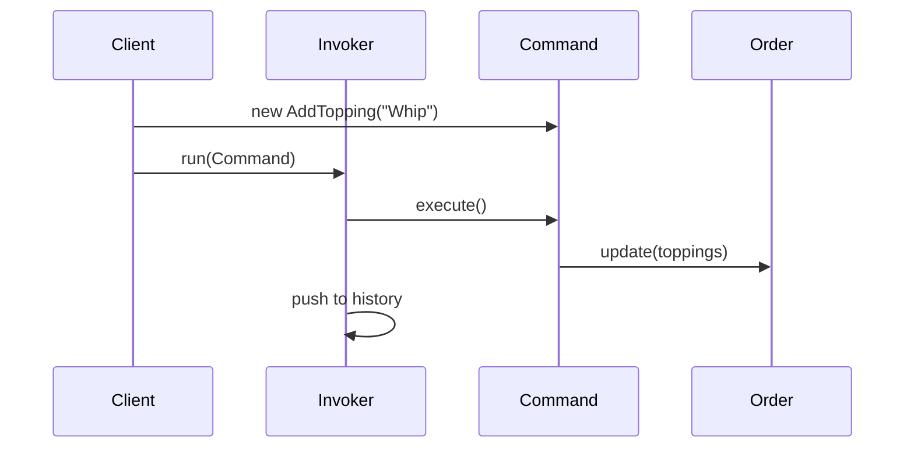

# 第63章：Command ① 操作を“命令”として扱う（Undo/履歴に強い）🎮

## ねらい🎯

* 「ユーザー操作」や「処理の1ステップ」を、ただの関数呼び出しじゃなく **“命令（Command）”** として持ち運べるようになる✨
* その結果、**Undo（取り消し）**・**履歴**・**あとで実行**・**まとめて実行（マクロ）** がやりやすくなる📚🪄

---

## まず困るやつ😵‍💫（Commandがない世界）

カフェ注文のUIを想像してね☕️

* 「トッピング追加」ボタンを押す
* 「トッピング削除」ボタンを押す
* 「サイズ変更」する
* 「元に戻す」ボタンを押す（Undo）

ここでありがちなのが👇

* クリックイベントの中で `order` を直接いじる（変更が散らばる）💥
* Undoしたいけど、「何をどう変更したか」を保存してない😇
* 途中で失敗した時の巻き戻しもつらい（戻せない）🧯

---

## Commandパターンのコア💡（超やさしく）


**「操作」を“命令オブジェクト（命令データ＋実行方法）”として扱う**だけ！

### 最低限これだけ覚える🧠✨

* **execute**：命令を実行する（やる）▶️
* **undo**：実行した命令を取り消す（戻す）⏪（必要なら）

Commandの良さは、「実行する側」が **中身を知らなくていい**ところ！

* ボタン側（呼び出し側）は「executeして、履歴に入れる」だけでOK📦
* 命令の中身（何が起きるか）はCommandが知ってる🧩


---

## ざっくり登場人物（難しくないよ）🎭

* **Command**：命令（execute/undoを持つ）📜
* **Receiver**：実際に変更される対象（今回だと注文データ `order`）📦
* **Invoker**：命令を実行して履歴に積む係（UIやコントローラ）🎛️
* **Client**：命令を作る係（UIイベントの中とか）🧑‍🍳



---

## TypeScriptでの“自然な”書き方（クラス地獄にしない）🧁


GoFの本だと「Commandクラスを量産」しがちだけど、TypeScriptだともっと素直に👇

* **「do/undo関数を持つオブジェクト」**で十分
* 命令は **関数＋必要な情報を閉じ込めたクロージャ** がめっちゃ相性いい✨

---

## ハンズオン🛠️：トッピング追加/削除をCommand化する🍫🧋

### 1) まずはデータ（注文）をシンプルに📦

```ts
type Topping = "whip" | "choco" | "caramel";

type Item = {
  id: string;
  name: string;
  toppings: Topping[];
};

type Order = {
  items: Item[];
};
```

### 2) Command型を用意（これが“命令”の共通ルール）📜

```ts
type Command = {
  label: string;
  execute: () => void;
  undo?: () => void; // 最初は optional でOK 🙆‍♀️
};
```

### 3) 「トッピング追加Command」を作る（Commandを“作る関数”）🧁

ポイントはこれ👇

* 実行前の状態を **必要な分だけ** 取っておく（Undo用）🧠
* 「どのItemに」「何を追加したか」をCommandに閉じ込める📦

```ts
function makeAddToppingCommand(order: Order, itemId: string, topping: Topping): Command {
  let executed = false;

  return {
    label: `add:${topping} to ${itemId}`,
    execute: () => {
      const item = order.items.find((x) => x.id === itemId);
      if (!item) return;

      if (!item.toppings.includes(topping)) {
        item.toppings.push(topping);
        executed = true;
      }
    },
    undo: () => {
      if (!executed) return;
      const item = order.items.find((x) => x.id === itemId);
      if (!item) return;

      item.toppings = item.toppings.filter((t) => t !== topping);
      executed = false;
    },
  };
}
```

### 4) 「トッピング削除Command」も同じノリで🍬

削除は「実行前に存在してたか？」を覚えておくと安全だよ✅

```ts
function makeRemoveToppingCommand(order: Order, itemId: string, topping: Topping): Command {
  let existedBefore = false;

  return {
    label: `remove:${topping} from ${itemId}`,
    execute: () => {
      const item = order.items.find((x) => x.id === itemId);
      if (!item) return;

      existedBefore = item.toppings.includes(topping);
      item.toppings = item.toppings.filter((t) => t !== topping);
    },
    undo: () => {
      if (!existedBefore) return;
      const item = order.items.find((x) => x.id === itemId);
      if (!item) return;

      if (!item.toppings.includes(topping)) {
        item.toppings.push(topping);
      }
    },
  };
}
```

---

## Invoker（実行＆履歴）を“配列”で作る📚✨


ここが気持ちいいポイント！
Invokerは「命令の種類」を知らない。**executeして積むだけ**😍

```ts
type History = {
  done: Command[];
};

function run(history: History, cmd: Command) {
  cmd.execute();
  history.done.push(cmd);
}

function undo(history: History) {
  const cmd = history.done.pop();
  cmd?.undo?.();
}
```

使い方はこう👇

```ts
const order: Order = {
  items: [{ id: "coffee-1", name: "Latte", toppings: [] }],
};

const history: History = { done: [] };

run(history, makeAddToppingCommand(order, "coffee-1", "whip"));
run(history, makeAddToppingCommand(order, "coffee-1", "choco"));

undo(history); // choco が消える
undo(history); // whip が消える
```

---

## テスト観点🧪（Commandはテストしやすいのが神）

最近のテスト事情だと、軽く始めるなら **Vitest** がかなり定番になってるよ📌（Vitest 4.0リリースなど動きも活発）([vitest.dev][1])

「Commandのテスト」は超シンプル👇

* executeしたら状態が変わる
* undoしたら元に戻る

```ts
import { describe, it, expect } from "vitest";

describe("Command: add/remove topping", () => {
  it("execute then undo returns to previous state", () => {
    const order = { items: [{ id: "coffee-1", name: "Latte", toppings: [] as Topping[] }] };
    const history = { done: [] as Command[] };

    run(history, makeAddToppingCommand(order, "coffee-1", "whip"));
    expect(order.items[0].toppings).toEqual(["whip"]);

    undo(history);
    expect(order.items[0].toppings).toEqual([]);
  });
});
```

---

## Commandが効く“ありがち場面”ベスト5🌟


1. **Undo/Redo**（編集・お絵描き・フォーム操作）↩️↪️
2. **履歴（操作ログ）**（監査ログ・分析）🧾
3. **あとで実行**（キュー、バッチ、予約実行）⏳
4. **まとめて実行（マクロ）**（複数操作を1ボタンで）🧩
5. **リトライ**（失敗した操作だけもう一回）🔁

---

## よくある落とし穴😇（先に避けよ〜）

* **Commandが巨大化**：executeの中に業務判断まで詰めすぎると破滅💥
  → “変更”だけに寄せる（判断は別の関数へ）🧼
* **Undo情報を取りすぎ**：全部コピーすると重い🐘
  → 「戻すのに必要な差分だけ」か、「小規模なら割り切り」
* **外部I/O混ぜる**：API呼び出しまでUndoしようとして地獄🌋
  → まずは“メモリ内の状態”でCommandを練習するのが勝ち🏆

---

## ちょい最新の補足🧠✨（今のTS周辺の空気感）

* 現時点の安定版は TypeScript 5.9 系（5.9.3など）で、TypeScript 6.0 は 2026-02〜03 にかけて Beta/RC/Final の予定が公開されてるよ📅([GitHub][2])
* Node.js は v24 が Active LTS 側にいて、安定運用ならそこらへんが安心枠🟢([nodejs.org][3])

（この章のコードは“素のTypeScript”なので、特定バージョン依存はほぼなしだよ👌）

---

## AIプロンプト例🤖💬（コピペOK）

```text
あなたはTypeScriptの先生です。
Commandパターンで「トッピング追加/削除」をUndoできるようにしたいです。

条件:
- クラス量産は避けて、do/undo関数を持つオブジェクトで表現して
- undoに必要な情報は最小限だけ保存して
- テスト観点（execute→undoで元に戻る）も提案して

出力:
1) 設計の意図
2) 最小コード
3) テスト案
4) よくある落とし穴
```

---

## ミニ演習🎓✨（手を動かすと一気にわかる！）

1. 🧋 **「サイズ変更」Command** を作って、Undoで元サイズに戻してみよう
2. 🍪 **「商品削除」Command** を作って、Undoで元の位置に復活させてみよう
3. 🧾 `history.done` に `label` を表示して、「操作ログ」っぽく出してみよう（これ超それっぽい！）

---

## まとめ✅🎉

* Commandは「操作」を **データとして扱える**ようにするパターン📦
* だから **Undo/履歴/あとで実行/まとめ実行** にめちゃ強い💪
* TypeScriptなら「do/undo関数を持つオブジェクト」で軽く始めるのが自然🧁

[1]: https://vitest.dev/blog/vitest-4?utm_source=chatgpt.com "Vitest 4.0 is out!"
[2]: https://github.com/microsoft/typescript/releases?utm_source=chatgpt.com "Releases · microsoft/TypeScript"
[3]: https://nodejs.org/en/about/previous-releases?utm_source=chatgpt.com "Node.js Releases"
