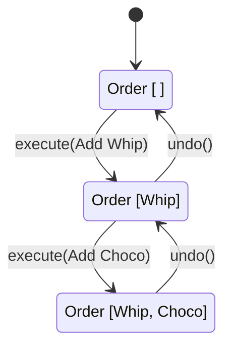

# 第64章：Command ② TypeScript定番：関数Command＋履歴配列📚

## ねらい🎯

* Commandを「クラスの山」にせず、**関数でスッキリ**表現できるようになる✨
* **履歴配列（history）**を使って、Undo（取り消し）を実装できるようになる↩️
* 「副作用（DB/通信/ファイル）」を巻き込まない安全な範囲で、まず成功体験する🧡

---

## 1) Commandを“関数ペア”で表すのがTSの王道🧁✨

GoFのCommandは「操作をひとつの“命令”として扱う」パターンだよ🎮
TypeScriptでは、まずこれが一番ラク＆読みやすい👇

* Command = **do（実行）** + **undo（取り消し）** の2つの関数
* 履歴 = **配列にpush**（Undoしたらpop）
* 状態 = なるべく **不変（immutable）** に扱う（コピーして返す）🧊

> “不変”に寄せると、Undoが超やりやすくなるよ😊


---

## 2) ミニ題材：カフェ注文のトッピングをUndoしたい☕🍫↩️

ここでは「注文（Order）」にトッピングを追加/削除する操作をCommand化するよ🍓
ポイントは **状態を直接書き換えず**、新しい状態を返すこと🧊

---

## 3) 最小の型：CommandとHistory（汎用）🧩

```ts
// アプリの状態（ここでは注文だけ）
export type Order = Readonly<{
  id: string;
  basePrice: number;
  toppings: ReadonlyArray<string>;
}>;

export type AppState = Readonly<{
  order: Order;
}>;

// Commandは「やる」「戻す」の2関数 ✨
export type Command<S> = Readonly<{
  name: string;
  do: (state: S) => S;
  undo: (state: S) => S;
}>;

// 履歴（Undo用のスタック）📚
export type History<S> = {
  state: S;
  done: Command<S>[];
};

export function createHistory<S>(initial: S): History<S> {
  return { state: initial, done: [] };
}

export function execute<S>(h: History<S>, cmd: Command<S>): void {
  h.state = cmd.do(h.state);
  h.done.push(cmd);
}

export function undo<S>(h: History<S>): void {
  const cmd = h.done.pop();
  if (!cmd) return; // 何もなければ静かに終了🙂
  h.state = cmd.undo(h.state);
}
```

---



## 4) Commandを“作る”関数（トッピング追加/削除）🍓🧁

ここが超大事💡
**Commandは「実行される前提の情報」を閉じ込める**と扱いやすいよ（クロージャの出番！）🧠✨

## A. いちばん簡単：スナップショット（before）方式📸

* do()した瞬間の **実行前state** を覚えておいて
* undo()で **そのstateに戻す**

小〜中規模のUIならこれで超十分だよ🙆‍♀️

```ts
import type { AppState, Command } from "./command-core";

// toppingを追加するCommandを作る🍓
export function addTopping(topping: string): Command<AppState> {
  let before: AppState | null = null;

  return {
    name: `add:${topping}`,
    do: (state) => {
      before = state;

      // すでに同じトッピングがあればそのまま（仕様は自由）🙂
      if (state.order.toppings.includes(topping)) return state;

      return {
        ...state,
        order: {
          ...state.order,
          toppings: [...state.order.toppings, topping],
        },
      };
    },
    undo: (_stateNow) => {
      // do前に戻す（doが呼ばれてないなら現状維持）
      return before ?? _stateNow;
    },
  };
}

// toppingを削除するCommandを作る🧹
export function removeTopping(topping: string): Command<AppState> {
  let before: AppState | null = null;

  return {
    name: `remove:${topping}`,
    do: (state) => {
      before = state;

      if (!state.order.toppings.includes(topping)) return state;

      return {
        ...state,
        order: {
          ...state.order,
          toppings: state.order.toppings.filter((t) => t !== topping),
        },
      };
    },
    undo: (_stateNow) => before ?? _stateNow,
  };
}
```

## ✅ “スナップショット方式”の注意⚠️

* **同じCommandインスタンスを使い回さない**（beforeが上書きされて事故る🥲）
  → ボタン押下のたびに `addTopping(...)` を呼んで「新しいCommand」を作ってね✨
* 履歴が長いとメモリを使う（必要なら上限を決める📏）

---

## 5) 使ってみよう：履歴に積んでUndoする📚↩️

```ts
import { createHistory, execute, undo } from "./command-core";
import { addTopping, removeTopping } from "./cafe-commands";

const initial = {
  order: { id: "o1", basePrice: 450, toppings: [] as const },
} as const;

const h = createHistory(initial);

execute(h, addTopping("whip"));       // 追加🍦
execute(h, addTopping("choco"));      // 追加🍫
execute(h, removeTopping("whip"));    // 削除🧹

console.log(h.state.order.toppings);  // ["choco"]

undo(h); // removeを取り消し↩️
console.log(h.state.order.toppings);  // ["whip","choco"]

undo(h); // add chocoを取り消し↩️
console.log(h.state.order.toppings);  // ["whip"]
```

---

## 6) テスト：標準の `node:test` でUndoを守る🧪✨

Nodeの組み込みテストランナー（`node:test`）は**安定版（Stable）**になっていて、追加ライブラリなしで書けるよ✅ ([Node.js][1])
（もちろんVitest/Jestも人気！最近だとVitest 4.xが出てたり、Jestは30系が安定版だよ📌）([Vitest][2])

```ts
import test from "node:test";
import assert from "node:assert/strict";

import { createHistory, execute, undo } from "./command-core";
import { addTopping, removeTopping } from "./cafe-commands";

test("Command + history: undo restores previous state", () => {
  const initial = {
    order: { id: "o1", basePrice: 450, toppings: [] as const },
  } as const;

  const h = createHistory(initial);

  execute(h, addTopping("whip"));
  execute(h, addTopping("choco"));
  execute(h, removeTopping("whip"));

  assert.deepEqual(h.state.order.toppings, ["choco"]);

  undo(h);
  assert.deepEqual(h.state.order.toppings, ["whip", "choco"]);

  undo(h);
  assert.deepEqual(h.state.order.toppings, ["whip"]);

  undo(h);
  assert.deepEqual(h.state.order.toppings, []);
});

test("undo on empty history does nothing", () => {
  const initial = {
    order: { id: "o1", basePrice: 450, toppings: [] as const },
  } as const;

  const h = createHistory(initial);

  undo(h);
  assert.deepEqual(h.state, initial);
});
```

---

## 7) “副作用”をどうする？（まずは分離が正解）🧯✨

Undoが難しくなるのは、だいたいここ👇

* API呼び出し📡
* DB更新🗄️
* ファイル書き込み📁

最初は、Commandの do/undo を **純粋（state→state）**に保とう🧊
どうしても副作用が必要なら：

* **副作用は外側でやる**（例：doで「やるべきこと」を返して、実行は別レイヤ）
* もしくは「取り消し用の補償処理（compensating action）」を別で用意する
  （このへんは次章のキュー/リトライ感覚に繋がるよ🧾）

---

## 8) よくあるつまずき回避💡（チェックリスト✅）

* ✅ Commandを“使い回さない”（毎回生成する）
* ✅ stateをミューテートしない（`push`/`splice`は封印しよ🥹）
* ✅ 仕様を決める：「同じトッピング2回OK？」みたいなやつ🍓🍓
* ✅ 履歴上限を決める（UIなら50〜200とかで十分なこと多い📏）
* ✅ 取り消し不能な操作は、最初からCommandにしない（境界を引く✂️）

---

## 9) AIプロンプト例🤖💬（そのままコピペOK）

```text
次の条件で、TypeScriptのCommand（関数Command）を改善して！
- Commandは do/undo の2関数
- 履歴は配列スタック
- stateは不変更新（ミューテート禁止）
- エッジケース：undo空、同一操作の連続、重複トッピング仕様
出力：
1) 改善ポイント
2) 改善後コード
3) テストケース（node:test か Vitest）
```

（AI支援は、GitHubのCopilotや、Microsoft製ツール、OpenAI系のCodexなどを“下書き＆テスト案出し”に使うのが相性いいよ💡）

---

## つまずき回避💡：副作用の範囲を小さく🧊

Undoがつらいのは「外部に何かしちゃった時」😵‍💫
まずは **メモリ上の状態だけ**でCommand+Undoに慣れようね📚✨

---

## おまけ：ちょい最新豆知識🫘

* Nodeは偶数系がLTSになっていく流れで、今は **v24がActive LTS**、**v25がCurrent** という状態だよ📌 ([Node.js][3])
* `structuredClone` はNodeでも使える“深いコピー”で、Nodeでは **v17で追加**されてるよ🧬 ([Node.js][4])

[1]: https://nodejs.org/api/test.html?utm_source=chatgpt.com "Test runner | Node.js v25.6.0 Documentation"
[2]: https://vitest.dev/blog/vitest-4?utm_source=chatgpt.com "Vitest 4.0 is out!"
[3]: https://nodejs.org/en/about/previous-releases?utm_source=chatgpt.com "Node.js Releases"
[4]: https://nodejs.org/api/globals.html?utm_source=chatgpt.com "Global objects | Node.js v25.6.0 Documentation"
