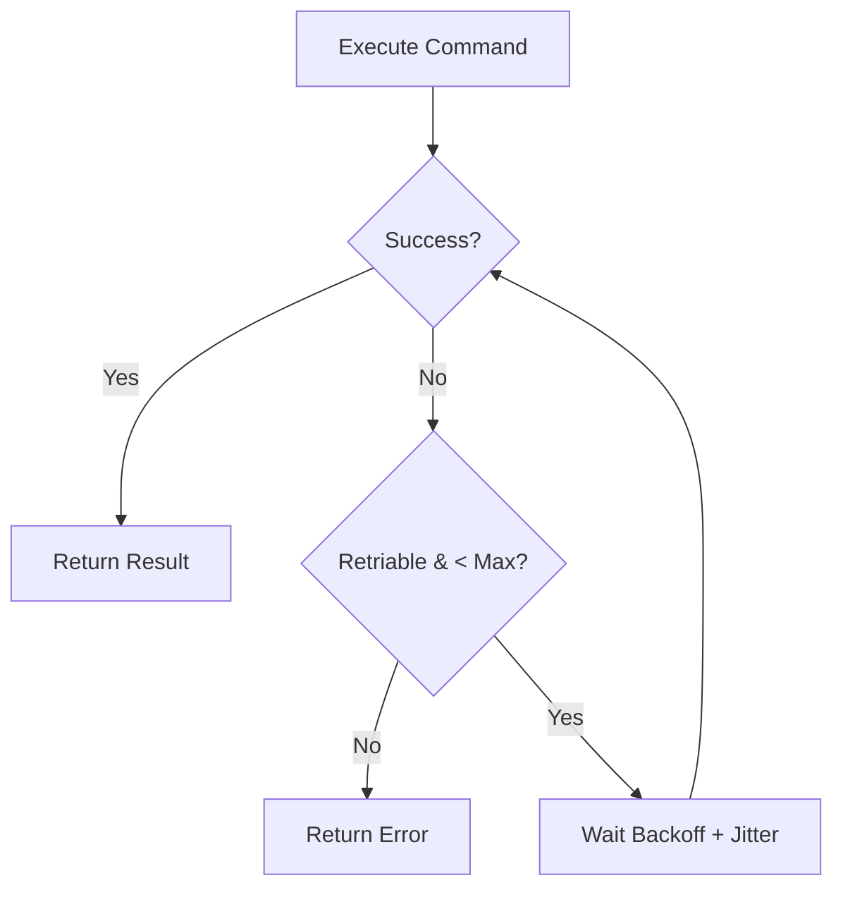

# 第65章：Command ③ まとめ：キュー/リトライ/トランザクションっぽさ🧾

## ねらい🎯

* Command が「Undo できる」だけじゃなく、「後で実行する」「失敗したらやり直す」「途中で止める」を支える道具になるのを体感するよ✨
* “なんちゃってトランザクション”の考え方（失敗したら巻き戻す）を、**安全に小さく**書けるようになる🧯

---

## 1) まず結論：Command が強いのは「実行のしかた」をあとから変えられる所💪

Command を「やること（処理）」として切り出しておくと……

* ⏳ **キュー**：順番どおりに実行（混ぜてもOK）
* 🔁 **リトライ**：失敗したコマンドだけ再実行
* 🛑 **キャンセル**：途中で止める（AbortSignal）
* 🧾 **トランザクションっぽさ**：途中で失敗したら、成功済みだけ逆順で“埋め合わせ”して戻す

こういう “実行オプション” を、**呼び出し側のコードを汚さず**に追加できるのが最大のご褒美だよ🎁


---

## 2) 2026メモ（ちょい最新）：TS周辺は「移行期」だから、実装は標準API寄せが安心🧠✨

TypeScript は 6.0 を「橋渡し（bridge）」として 7.0（ネイティブ実装）へ進む方針が公式に説明されているよ。だからこそ、学習コードは **Promise / async-await / AbortController みたいな標準寄り**で組むのが堅い👍 ([Microsoft for Developers][1])
（モジュールまわりも TypeScript 5.9 で `--module node20` などが整理されてきてるよ） ([TypeScript][2])

---

## 3) 今章の完成形：Command実行ランナーを3つ作る🏃‍♀️💨

1. **runQueue**：順番に実行して結果を集約📦
2. **runWithRetry**：失敗したら指数バックオフ＋ジッターで再試行⏳🎲
3. **runTransactionLike**：途中失敗で“埋め合わせ（compensation）”実行↩️🧾

ポイント：**独自の巨大クラスは作らない**よ。型＋関数でいくよ🧁



---

## 4) 最小の型：Result と Command（関数Command）🧩

* Command は「実行すると Result を返す関数」
* キャンセル用に `AbortSignal` を受け取れるようにする（標準の流れ）🛑 ([MDNウェブドキュメント][3])

```ts
// 成功/失敗を「戻り値」で表す（第15章のResult的なやつ）
export type Ok<T> = { ok: true; value: T };
export type Err<E> = { ok: false; error: E };
export type Result<T, E> = Ok<T> | Err<E>;

export const ok = <T>(value: T): Ok<T> => ({ ok: true, value });
export const err = <E>(error: E): Err<E> => ({ ok: false, error });

// エラーはまず文字列でもOK（学習はシンプルに！）
export type CommandError = { message: string; retriable?: boolean };

// 関数Command：実行すると Promise<Result<...>> を返す
export type Command<T> = (signal?: AbortSignal) => Promise<Result<T, CommandError>>;
```

---

## 5) キャンセルできる sleep（標準APIだけ）😴🛑

リトライの待ち時間に使うよ⏳
（AbortSignal は Web でも Node.js でも標準的に使われるよ） ([MDNウェブドキュメント][3])

```ts
export const sleep = (ms: number, signal?: AbortSignal) =>
  new Promise<void>((resolve, reject) => {
    if (signal?.aborted) {
      reject(Object.assign(new Error("aborted"), { name: "AbortError" }));
      return;
    }
    const id = setTimeout(resolve, ms);
    signal?.addEventListener(
      "abort",
      () => {
        clearTimeout(id);
        reject(Object.assign(new Error("aborted"), { name: "AbortError" }));
      },
      { once: true }
    );
  });
```

---

## 6) リトライ：指数バックオフ＋ジッター（ちょい本格）🎲⏳

「とりあえず即リトライ！」は、サーバーにも自分にも優しくない🥲
現実では **指数バックオフ＋ジッター**が定番だよ（AWSの設計ガイドでも推されるやつ） ([Amazon Web Services, Inc.][4])

```ts
export type RetryPolicy = {
  maxAttempts: number;     // 例: 3
  baseDelayMs: number;     // 例: 200
  maxDelayMs: number;      // 例: 2000
  jitterRatio: number;     // 例: 0.2 (±20%)
};

export const defaultRetry: RetryPolicy = {
  maxAttempts: 3,
  baseDelayMs: 200,
  maxDelayMs: 2000,
  jitterRatio: 0.2,
};

const calcBackoffMs = (attempt: number, p: RetryPolicy) => {
  // attempt: 1,2,3...（失敗回数ベース）
  const exp = p.baseDelayMs * 2 ** (attempt - 1);
  const capped = Math.min(exp, p.maxDelayMs);
  const jitter = capped * p.jitterRatio * (Math.random() * 2 - 1); // -ratio..+ratio
  return Math.max(0, Math.round(capped + jitter));
};

export const runWithRetry = async <T>(
  cmd: Command<T>,
  policy: RetryPolicy = defaultRetry,
  signal?: AbortSignal
): Promise<{ attempts: number; result: Result<T, CommandError> }> => {
  for (let attempt = 1; attempt <= policy.maxAttempts; attempt++) {
    try {
      const r = await cmd(signal);
      if (r.ok) return { attempts: attempt, result: r };

      // retriable=false なら即終了（やり直しても無駄な失敗）
      if (r.error.retriable === false) return { attempts: attempt, result: r };

      if (attempt < policy.maxAttempts) {
        await sleep(calcBackoffMs(attempt, policy), signal);
        continue;
      }
      return { attempts: attempt, result: r };
    } catch (e) {
      // Abort など例外系はここに来る
      return {
        attempts: attempt,
        result: err({ message: e instanceof Error ? e.message : String(e), retriable: false }),
      };
    }
  }
  // 到達しない想定
  return { attempts: policy.maxAttempts, result: err({ message: "unexpected", retriable: false }) };
};
```

---

## 7) キュー：コマンドを順に実行して結果を集約📦✅❌

「成功した？失敗した？何回目で成功？」を **実行ログとして残せる**のが嬉しい✨

```ts
export type QueueItem<T> = {
  name: string;
  command: Command<T>;
  retry?: RetryPolicy; // itemごとに変えてOK
};

export type QueueReportItem<T> = {
  name: string;
  attempts: number;
  result: Result<T, CommandError>;
};

export const runQueue = async <T>(
  items: QueueItem<T>[],
  signal?: AbortSignal
): Promise<QueueReportItem<T>[]> => {
  const report: QueueReportItem<T>[] = [];
  for (const item of items) {
    const { attempts, result } = await runWithRetry(item.command, item.retry ?? defaultRetry, signal);
    report.push({ name: item.name, attempts, result });

    // キュー方針：失敗したら止める（学習はこれが分かりやすい）
    if (!result.ok) break;
  }
  return report;
};
```

---

## 8) トランザクションっぽさ：途中失敗なら“埋め合わせ”で戻す↩️🧾

DBのトランザクションみたいに「全部成功か全部失敗」に寄せたいとき、
外部I/O（決済・メール送信・在庫確保）って **完全な巻き戻しが難しい**よね🥲

そこで現実的にやるのがこれ👇

* ✅ 成功した操作は履歴に積む
* ❌ 途中で失敗したら、履歴を逆順にたどって **undo（または compensation）** を実行する

```ts
export type TxStep<T> = {
  name: string;
  do: Command<T>;
  // “取り消し”というより “埋め合わせ” でもOK（例：予約解除、返金リクエストなど）
  undo?: Command<void>;
  retry?: RetryPolicy;
};

export type TxReport = {
  ok: boolean;
  logs: { step: string; phase: "do" | "undo"; attempts: number; result: Result<unknown, CommandError> }[];
};

export const runTransactionLike = async (steps: TxStep<unknown>[], signal?: AbortSignal): Promise<TxReport> => {
  const doneUndos: { name: string; undo: Command<void> }[] = [];
  const logs: TxReport["logs"] = [];

  // 1) do を順に実行
  for (const s of steps) {
    const r = await runWithRetry(s.do, s.retry ?? defaultRetry, signal);
    logs.push({ step: s.name, phase: "do", attempts: r.attempts, result: r.result });

    if (r.result.ok) {
      if (s.undo) doneUndos.push({ name: s.name, undo: s.undo });
      continue;
    }

    // 2) 失敗したら undo を逆順に
    for (const u of doneUndos.reverse()) {
      const ur = await runWithRetry(u.undo, defaultRetry, signal);
      logs.push({ step: u.name, phase: "undo", attempts: ur.attempts, result: ur.result });
      // undo 失敗は「別の事故」なので、ログに残して次へ（学習用方針）
    }

    return { ok: false, logs };
  }

  return { ok: true, logs };
};
```

---

## 9) ハンズオン🛠️：失敗するCommandを混ぜて「結果をまとめる」☕📦

## お題🍰

* `reserveStock`（在庫確保）✅
* `chargePayment`（決済）❌（たまに失敗）
* `sendReceipt`（レシート送信）✅

失敗したら：

* キューなら「そこで止まる」🛑
* トランザクションっぽくなら「在庫確保を戻す」↩️

```ts
// 疑似I/O：失敗を制御しやすいように回数で落とす
const failOn = (n: number) => {
  let count = 0;
  return () => {
    count++;
    return count === n;
  };
};

const paymentFailsNow = failOn(1); // 1回目だけ失敗

export const reserveStock: Command<string> = async () => {
  // 本当はAPI呼ぶ想定（ここでは成功固定）
  return ok("stock-reserved");
};

export const releaseStock: Command<void> = async () => {
  return ok(undefined);
};

export const chargePayment: Command<string> = async () => {
  if (paymentFailsNow()) return err({ message: "payment temporary error", retriable: true });
  return ok("paid");
};

export const refundPayment: Command<void> = async () => {
  // 埋め合わせ：返金要求（成功固定）
  return ok(undefined);
};

export const sendReceipt: Command<void> = async () => ok(undefined);

// 1) キュー実行
export const demoQueue = () =>
  runQueue([
    { name: "reserveStock", command: reserveStock },
    { name: "chargePayment", command: chargePayment, retry: { ...defaultRetry, maxAttempts: 3 } },
    { name: "sendReceipt", command: sendReceipt },
  ]);

// 2) トランザクションっぽく実行
export const demoTx = () =>
  runTransactionLike([
    { name: "reserveStock", do: reserveStock as Command<unknown>, undo: releaseStock },
    { name: "chargePayment", do: chargePayment as Command<unknown>, undo: refundPayment },
    { name: "sendReceipt", do: sendReceipt as Command<unknown> },
  ]);
```

---

## 10) テスト観点🧪（ここだけ押さえればOK）✨

* ✅ **順序**：キューは上から順に実行される
* ✅ **停止条件**：失敗したら後続が走らない
* ✅ **リトライ回数**：最大回数で止まる／成功したら途中で止まる
* ✅ **巻き戻し順**：undo は「成功したものの逆順」になる
* 🛑 **キャンセル**：Abort したら待ち・実行が止まる（少なくともログに残る）

（sleep を差し替えられるようにするとテストが楽だけど、今章は“考え方”優先でOK👌）

---

## 11) つまずき回避💡（あるある事故を先に潰す）

* 😵 **何でもリトライ**しない

  * 「入力エラー」みたいな失敗は retriable=false で即終了が優しい
* 😵 **undo は万能じゃない**

  * “取り消し”じゃなくて “埋め合わせ” として設計すると現実に強い🧾
* 😵 **並列化を急がない**

  * まずは **直列キュー**で「順番」「停止」「ログ」が理解できれば勝ち🎉
* 😵 **例外とResultが混在してカオス**

  * ルールを決める：基本は Result、Abort など “制御系” だけ例外でもOK🧯

---

## 12) AIプロンプト例🤖💬（コピペ用）

```text
次の処理を「関数Command」に分割し、runQueue / runWithRetry / runTransactionLike で実行できる形にして。
条件:
- 独自の巨大クラスは作らない（型＋関数中心）
- Result<T,E> で成功/失敗を返す
- retriable の判断基準も提案して
入力: <ここに今の処理を書く>
```

```text
このCommand群に対して、リトライポリシー（maxAttempts/baseDelay/maxDelay/jitterRatio）を現実的に提案して。
さらに「リトライすべきでない失敗」を分類して。
前提: 指数バックオフ＋ジッター
```

---

## 13) まとめ✅🎉

* Command を「やること」として切り出すと、**実行方法（キュー・リトライ・キャンセル・巻き戻し）**をあとから足せる🎁
* 実務っぽさはここから：

  * キューで順序とログ📦
  * リトライで耐障害性🔁
  * “埋め合わせ”でトランザクションっぽさ🧾

次章（State）へ行くと、「状態でできる操作が変わる」を型安全に管理できて、Command の“実行タイミング”とも相性が良くなるよ🚦✨

[1]: https://devblogs.microsoft.com/typescript/progress-on-typescript-7-december-2025/?utm_source=chatgpt.com "Progress on TypeScript 7 - December 2025"
[2]: https://www.typescriptlang.org/docs/handbook/release-notes/typescript-5-9.html?utm_source=chatgpt.com "Documentation - TypeScript 5.9"
[3]: https://developer.mozilla.org/ja/docs/Web/API/AbortController?utm_source=chatgpt.com "AbortController - Web API | MDN"
[4]: https://aws.amazon.com/builders-library/timeouts-retries-and-backoff-with-jitter/?utm_source=chatgpt.com "Timeouts, retries and backoff with jitter"
