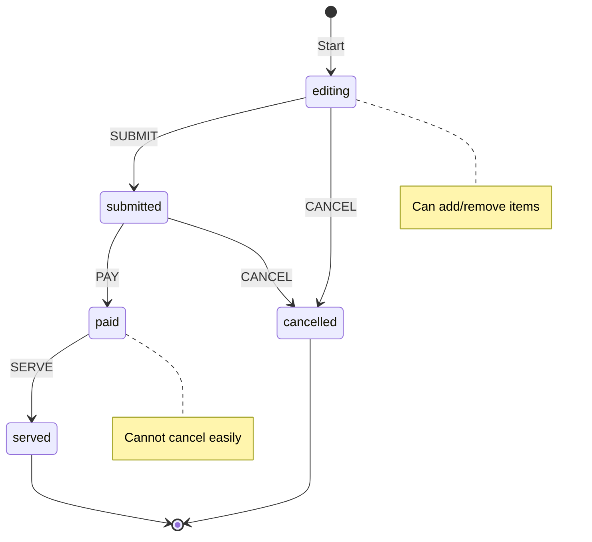

# 第66章：State ① if地獄を卒業：状態で振る舞いが変わる🚦

---

## 0. この章でできるようになること🎯

* 「状態（State）が増えるほど if / switch が爆発する理由」を説明できる🙂
* **“状態ごとに許可される操作”** を整理して、コードをスッキリさせられる🧹✨
* 注文の状態（編集中→送信→支払い→提供…）を **状態遷移（ステートマシン）** として扱えるようになる🚦

※ 2026年2月時点の最新安定版 TypeScript は **5.9 系（npm 上は 5.9.3）** だよ〜🆕✨ ([TypeScript][1])

---

## 1. 「if地獄」ってどんな地獄？😵‍💫🔥\n\n\n

## よくあるつらさ👀

注文に `status` が付いた瞬間、こうなりがち👇

* **あちこちの関数に** `if (order.status === ...)` が散らばる
* 状態が増えるたび、**全部の分岐を探して修正**する羽目になる
* 「この状態でこの操作できるんだっけ？」が **コードから読めない**

## ダメになりやすい例（分岐が散らばる）😇

```ts
type OrderStatus = "editing" | "submitted" | "paid" | "served" | "cancelled";

type Order = {
  id: string;
  status: OrderStatus;
  items: { sku: string; qty: number }[];
};

function addItem(order: Order, sku: string, qty: number): Order {
  if (order.status !== "editing") {
    throw new Error("編集中以外は追加できません");
  }
  return { ...order, items: [...order.items, { sku, qty }] };
}

function pay(order: Order): Order {
  if (order.status === "editing") throw new Error("先に送信してね");
  if (order.status === "submitted") return { ...order, status: "paid" };
  if (order.status === "paid") throw new Error("二重払い");
  if (order.status === "cancelled") throw new Error("キャンセル済み");
  throw new Error("提供済み");
}

// cancel / serve / removeItem / ... が増えるほど分岐が増殖😵‍💫
```

ポイント：**「状態のルール」が“関数ごとに散ってる”** のが痛いの🥲

---

## 2. Stateパターンの考え方🧠✨（超やさしく）

State のコアはこれ👇

> 「いまの状態（State）によって、許可される操作と次の状態が決まる」🚦
> だから **状態のルールを1か所（または状態ごと）に集めよう** 🧺✨

つまり、

* **状態（status）**
* **イベント（操作：submit/pay/cancel…）**
* **遷移（どこへ移る？）**
* **禁止（この状態ではその操作ムリ！）**

を整理すると、コードが落ち着くよ🙂


---

## 3. ハンズオン☕🧾：カフェ注文を「状態遷移」で設計しよう🚦\n\n\n

## 3.1 まずは状態と操作を“紙に書く”📋✨

今回はこの5状態でいくよ👇

* `editing`（編集中✍️）
* `submitted`（送信済み📤）
* `paid`（支払い済み💳）
* `served`（提供済み🍰）
* `cancelled`（キャンセル🚫）

操作（イベント）はこんな感じ👇

* 商品追加 `ADD_ITEM` ➕
* 商品削除 `REMOVE_ITEM` ➖
* 注文送信 `SUBMIT` 📤
* 支払い `PAY` 💳
* 提供 `SERVE` 🍰
* キャンセル `CANCEL` 🚫

## 3.2 状態遷移表を作る（ここが超重要！）🧠✨

| 状態（status）   | できる操作                                    | 次の状態                                |
| ------------ | ---------------------------------------- | ----------------------------------- |
| editing ✍️   | ADD_ITEM / REMOVE_ITEM / SUBMIT / CANCEL | SUBMIT→submitted / CANCEL→cancelled |
| submitted 📤 | PAY / CANCEL                             | PAY→paid / CANCEL→cancelled         |
| paid 💳      | SERVE                                    | SERVE→served                        |
| served 🍰    | （なし）                                     | -                                   |
| cancelled 🚫 | （なし）                                     | -                                   |

これで「できる/できない」が **仕様として見える化** できたね👀✨



---

## 4. 実装（Stateのルールを“状態ごとに集約”する）🧩✨

この章では **クラス増殖はしない** で、TypeScriptで自然な「テーブル＋関数」でまとめるよ🙂
（Stateの“考え方”を体に入れるのが目的だよ〜🚦）

## 4.1 Result型（失敗をきれいに返す）🧯

```ts
export type Ok<T> = { ok: true; value: T };
export type Err = { ok: false; error: string };
export type Result<T> = Ok<T> | Err;

export const ok = <T>(value: T): Ok<T> => ({ ok: true, value });
export const err = (message: string): Err => ({ ok: false, error: message });
```

## 4.2 型定義（注文・イベント）🧾

```ts
export type OrderStatus = "editing" | "submitted" | "paid" | "served" | "cancelled";

export type OrderItem = { sku: string; qty: number };

export type Order = {
  id: string;
  status: OrderStatus;
  items: OrderItem[];
  paidAt?: string;
  servedAt?: string;
};

export type OrderEvent =
  | { type: "ADD_ITEM"; sku: string; qty: number }
  | { type: "REMOVE_ITEM"; sku: string }
  | { type: "SUBMIT" }
  | { type: "PAY"; paidAt: string }
  | { type: "SERVE"; servedAt: string }
  | { type: "CANCEL"; reason?: string };
```

## 4.3 「状態ごとの処理」を1か所に集める🚦✨\n\n\n

```ts
import { err, ok, type Result } from "./result";
import type { Order, OrderEvent, OrderStatus } from "./types";

type Reducer = (order: Order, event: OrderEvent) => Result<Order>;

// ✅ 状態ごとに「許可されるイベント」と「更新」を閉じ込める
const reducers: Record<OrderStatus, Reducer> = {
  editing: (order, event) => {
    switch (event.type) {
      case "ADD_ITEM": {
        if (event.qty <= 0) return err("数量は1以上にしてね🙂");
        return ok({
          ...order,
          items: [...order.items, { sku: event.sku, qty: event.qty }],
        });
      }
      case "REMOVE_ITEM": {
        return ok({
          ...order,
          items: order.items.filter((x) => x.sku !== event.sku),
        });
      }
      case "SUBMIT": {
        if (order.items.length === 0) return err("商品が0個だよ🥺 何か入れてね");
        return ok({ ...order, status: "submitted" });
      }
      case "CANCEL": {
        return ok({ ...order, status: "cancelled" });
      }
      case "PAY":
      case "SERVE":
        return err(`いまは ${order.status} なので ${event.type} はできないよ🚫`);
      default:
        return err("未対応のイベントだよ🥲");
    }
  },

  submitted: (order, event) => {
    switch (event.type) {
      case "PAY":
        return ok({ ...order, status: "paid", paidAt: event.paidAt });
      case "CANCEL":
        return ok({ ...order, status: "cancelled" });
      case "ADD_ITEM":
      case "REMOVE_ITEM":
      case "SUBMIT":
      case "SERVE":
        return err(`いまは ${order.status} なので ${event.type} はできないよ🚫`);
      default:
        return err("未対応のイベントだよ🥲");
    }
  },

  paid: (order, event) => {
    switch (event.type) {
      case "SERVE":
        return ok({ ...order, status: "served", servedAt: event.servedAt });
      case "CANCEL":
        return err("支払い後キャンセルは不可（ここでは不可にするね）🚫");
      case "ADD_ITEM":
      case "REMOVE_ITEM":
      case "SUBMIT":
      case "PAY":
        return err(`いまは ${order.status} なので ${event.type} はできないよ🚫`);
      default:
        return err("未対応のイベントだよ🥲");
    }
  },

  served: (_order, event) => {
    return err(`提供済みなので ${event.type} はできないよ🍰🚫`);
  },

  cancelled: (_order, event) => {
    return err(`キャンセル済みなので ${event.type} はできないよ🚫`);
  },
};

export function applyOrderEvent(order: Order, event: OrderEvent): Result<Order> {
  return reducers[order.status](order, event);
}
```

✅ ここが気持ちいいポイント😍

* 「状態のルール」が **reducers の中だけ** に集まった🎉
* もし状態が増えても、**増える場所が決まってる**（迷子にならない）🧭✨

---

## 5. UIで超役立つ💡：「このボタン押せる？」を判定する🖱️✨

「PAYボタン、送信前は押せないようにしたい！」みたいな時、
**状態遷移のルールが整理されてる** とすぐ作れるよ🙂

シンプル版👇（“できるかどうか”だけ）

```ts
import type { Order, OrderEvent } from "./types";

export function canApply(order: Order, eventType: OrderEvent["type"]): boolean {
  // reducerを試すのは重いので、まずはルール表を別に作るのが理想✨
  // ここではミニ版として「結果がokか」で判定（学習用）
  return true; // ←この章では思想だけ覚えよう🙂（次章で型安全にやるよ🚦）
}
```

この章では「考え方」が主役だから、
**“許可判定テーブル”** は次章（Unionで型安全）で気持ちよく仕上げるよ🧠✨

---

## 6. テスト（状態遷移はテストで守るのが正義）🧪✨

「表どおりに遷移する？」をテストすると、ズレが即バレるよ😆

```ts
import { describe, it, expect } from "vitest";
import { applyOrderEvent } from "./state";
import type { Order } from "./types";

describe("State: order", () => {
  const base: Order = { id: "o1", status: "editing", items: [] };

  it("editing: empty items cannot submit", () => {
    const r = applyOrderEvent(base, { type: "SUBMIT" });
    expect(r.ok).toBe(false);
  });

  it("editing -> submitted", () => {
    const withItem: Order = { ...base, items: [{ sku: "coffee", qty: 1 }] };
    const r = applyOrderEvent(withItem, { type: "SUBMIT" });
    expect(r.ok).toBe(true);
    if (r.ok) expect(r.value.status).toBe("submitted");
  });

  it("submitted -> paid", () => {
    const submitted: Order = { ...base, status: "submitted", items: [{ sku: "coffee", qty: 1 }] };
    const r = applyOrderEvent(submitted, { type: "PAY", paidAt: "2026-02-05T00:00:00+09:00" });
    expect(r.ok).toBe(true);
    if (r.ok) expect(r.value.status).toBe("paid");
  });

  it("editing cannot pay", () => {
    const r = applyOrderEvent(base, { type: "PAY", paidAt: "2026-02-05T00:00:00+09:00" });
    expect(r.ok).toBe(false);
  });
});
```

---

## 7. つまずき回避💡（Stateあるある）😭➡️😊

## 7.1 状態を増やしすぎない🧊

最初から「返品中」「保留」「保留解除中」…とかやると死ぬ💀
まずは **現実に必要な最小の状態** だけでOK🙂

## 7.2 “状態”と“フラグ”を混ぜない🚫\n\n\n

`status = "paid"` なのに `isCancelled = true` とかあると地獄😇
状態は **できれば1本化**（statusに集約）がおすすめ✨

## 7.3 遷移の理由（仕様）を残す📝

「paidからcancelできないのは仕様？それとも実装都合？」って迷子になりがち🥺
エラー文やコメントに **理由を短く** 残すと未来の自分が助かるよ🛟✨

---

## 8. AIプロンプト例🤖💬（コピペでOK）

```text
注文の状態遷移を設計したいです。
状態: editing / submitted / paid / served / cancelled
操作: ADD_ITEM, REMOVE_ITEM, SUBMIT, PAY, SERVE, CANCEL
1) 状態遷移表（禁止操作も含む）
2) 禁止操作のエラー方針（ユーザー向け/開発者向け）
3) テスト観点（代表＋境界）
を提案して。
```

```text
このState実装（reducers方式）をレビューして。
- 仕様の漏れ（できる/できないの矛盾）
- バグりやすい点
- 状態追加に強くする改善（クラス増やしすぎない）
を優先度順に指摘して。
```

---

## 9. ミニまとめ✅🎉

* if地獄の原因は、**状態のルールが散らばること** 😵‍💫
* Stateの考え方は、**状態ごとに許可操作と遷移をまとめること** 🚦✨
* まずは「遷移表」を作ると、設計が一気にラクになるよ📋🧠

次章では、このStateを **判別Unionでさらに型安全** にして、「未対応の状態/イベント」をコンパイルで潰していくよ🚀✨

[1]: https://www.typescriptlang.org/download/?utm_source=chatgpt.com "How to set up TypeScript"
