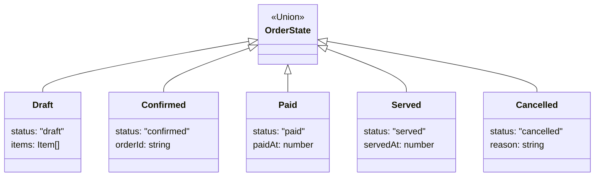

# 第67章：State ② TypeScriptの定番：判別Unionで型安全に（まずこれ）🧠

## ねらい🎯

* 「状態（State）」を **判別Union（discriminated union）** で表して、**不正な状態遷移を型で止める** 感覚をつかむ🛡️
* `switch` の **網羅チェック（exhaustiveness checking）** を入れて、将来の拡張で “case 書き忘れ事故” を防ぐ✅ ([TypeScript][1])

---

## 1) Stateを“判別Union”で表すと何が嬉しいの？🍰

Stateパターンって「状態によってできることが変わる」やつだよね🚦
TypeScriptでは、**状態ごとに形（プロパティ）を変えられる**のが最強ポイント💪

* `status`（または `type`）みたいな **“固定のタグ”** を持たせる
* そのタグで `switch` すると、TSが中身を自動で絞ってくれる（型の絞り込み）🧠✨
* さらに `never` を使うと、**状態追加したのに分岐を更新し忘れた**…をコンパイル時に検出できる✅ ([TypeScript][1])

---

## 2) ハンズオン題材：カフェ注文の状態🚦☕


「注文」はこんな流れを想像しよう🎀
`draft（下書き）→ confirmed（確定）→ paid（支払い済み）→ served（提供済み）`
途中で `cancelled（キャンセル）` に行ける感じ🍩

---

## 3) まずは“状態”の型を作ろう✍️

ポイントはこれ👇

* **状態ごとに必要な情報だけ持つ**
* optional（`?`）だらけにしない（“なんでも入る箱”になると弱い😵）

```ts
type Item = {
  sku: string;
  name: string;
  price: number;
  qty: number;
};

type Draft = {
  status: "draft";
  items: Item[];
};

type Confirmed = {
  status: "confirmed";
  items: Item[];
  orderId: string;
};

type Paid = {
  status: "paid";
  items: Item[];
  orderId: string;
  paidAt: number; // Date.now()
};

type Served = {
  status: "served";
  items: Item[];
  orderId: string;
  paidAt: number;
  servedAt: number; // Date.now()
};

type Cancelled = {
  status: "cancelled";
  items: Item[];
  reason: string;
};

type OrderState = Draft | Confirmed | Paid | Served | Cancelled;
```



---

## 4) “イベント（遷移の入力）”もUnionにする📩✨

状態を変えるきっかけ＝イベント（操作）だよね🎮
ここもUnionにすると、**できる操作の種類が固定されて事故りにくい**🙆‍♀️

```ts
type OrderEvent =
  | { type: "ADD_ITEM"; item: Item }
  | { type: "REMOVE_ITEM"; sku: string }
  | { type: "CONFIRM" }
  | { type: "PAY" }
  | { type: "SERVE" }
  | { type: "CANCEL"; reason: string };
```

---

## 5) 遷移関数（reducer的なやつ）を1本にまとめる🧁

ここがこの章のメイン🎉
`transition(state, event)` が **次の state を返す** だけにする（なるべく純粋に）✨

不正遷移は、戻り値で「失敗」を返すようにしておくと安全🧯
（`Result` もUnionでOK👌）

```ts
type Result<T> = { ok: true; value: T } | { ok: false; error: string };

const ok = <T>(value: T): Result<T> => ({ ok: true, value });
const err = (error: string): Result<never> => ({ ok: false, error });

function assertNever(x: never): never {
  // ここに来たら「switchの書き忘れ」か「想定外データ」だよ！🚨
  throw new Error(`Unexpected: ${JSON.stringify(x)}`);
}

function transition(state: OrderState, event: OrderEvent): Result<OrderState> {
  switch (state.status) {
    case "draft": {
      switch (event.type) {
        case "ADD_ITEM":
          return ok({ ...state, items: [...state.items, event.item] });

        case "REMOVE_ITEM":
          return ok({ ...state, items: state.items.filter((x) => x.sku !== event.sku) });

        case "CONFIRM":
          return ok({
            status: "confirmed",
            items: state.items,
            orderId: `o_${Date.now()}`,
          });

        case "CANCEL":
          return ok({ status: "cancelled", items: state.items, reason: event.reason });

        case "PAY":
        case "SERVE":
          return err("下書き状態では支払い/提供できません🥲");

        default:
          return assertNever(event);
      }
    }

    case "confirmed": {
      switch (event.type) {
        case "PAY":
          return ok({
            status: "paid",
            items: state.items,
            orderId: state.orderId,
            paidAt: Date.now(),
          });

        case "CANCEL":
          return ok({ status: "cancelled", items: state.items, reason: event.reason });

        case "ADD_ITEM":
        case "REMOVE_ITEM":
          return err("確定後は商品を編集できません🙅‍♀️");

        case "CONFIRM":
          return err("すでに確定済みです🙂");

        case "SERVE":
          return err("先に支払いが必要です💳");

        default:
          return assertNever(event);
      }
    }

    case "paid": {
      switch (event.type) {
        case "SERVE":
          return ok({
            status: "served",
            items: state.items,
            orderId: state.orderId,
            paidAt: state.paidAt,
            servedAt: Date.now(),
          });

        case "CANCEL":
          return err("支払い後のキャンセルは別手続き（返金など）が必要です🧾");

        case "ADD_ITEM":
        case "REMOVE_ITEM":
        case "CONFIRM":
        case "PAY":
          return err("支払い後はその操作はできません🙅‍♀️");

        default:
          return assertNever(event);
      }
    }

    case "served": {
      // 提供済みは基本 “変更なし”
      return err("提供済みの注文は変更できません🍽️");
    }

    case "cancelled": {
      return err("キャンセル済みの注文は変更できません🧊");
    }

    default:
      return assertNever(state);
  }
}
```

## ✅ 網羅チェックが効く理由（超だいじ）🧠

`assertNever(event)` や `assertNever(state)` は、**全部のケースを処理していたら到達できない**ので `never` になるはず。
もし新しい状態やイベントを追加して `switch` に `case` を足し忘れると、**`never` じゃなくなってコンパイルエラー**になるよ✅ ([TypeScript][1])

---

## 6) もう一段おしゃれ：`satisfies never` で1行網羅チェック✨

`never代入` の代わりに、`satisfies` を使って **1行で網羅チェック**する書き方もあるよ🪄
`satisfies` 自体はTSの機能で、型の条件を満たすかをチェックしつつ推論情報を保てるやつ💡 ([TypeScript][2])

例（イメージ）👇

```ts
function exhaustive(x: never): never {
  throw new Error(`Unexpected: ${x}`);
}

// こんな書き方もできる（default節で）
throw new Error(`Unexpected event: ${event satisfies never}`);
```

この “`satisfies never`” のノリは実例として紹介されているよ📌 ([Zenn][3])

---

## 7) テストで「安全」を体感しよう🧪🎉

「できる操作」と「できない操作」をテストにすると、設計が一気に安心になるよ💗

```ts
import { describe, it, expect } from "vitest";

describe("transition()", () => {
  it("draft -> confirmed できる✅", () => {
    const s0 = { status: "draft", items: [] } as const;
    const r = transition(s0, { type: "CONFIRM" });
    expect(r.ok).toBe(true);
    if (r.ok) {
      expect(r.value.status).toBe("confirmed");
    }
  });

  it("draft で PAY はできない❌", () => {
    const s0 = { status: "draft", items: [] } as const;
    const r = transition(s0, { type: "PAY" });
    expect(r.ok).toBe(false);
  });

  it("confirmed -> paid -> served の流れ🍰", () => {
    const s1: OrderState = { status: "confirmed", items: [], orderId: "o_1" };
    const r1 = transition(s1, { type: "PAY" });
    expect(r1.ok).toBe(true);

    if (!r1.ok) return;
    const r2 = transition(r1.value, { type: "SERVE" });
    expect(r2.ok).toBe(true);
    if (r2.ok) expect(r2.value.status).toBe("served");
  });
});
```

---

## 8) “ありがち事故”と回避テク💥🛟

* **状態を optional だらけにする**
  → 「このプロパティある前提で使っちゃった😇」が起きやすい
  → ✅ **状態ごとに型を分ける**（Unionで分岐！）
* **`status` の文字列がブレる**（`Draft`/`draft` 混在とか）
  → ✅ “小文字固定”などルール決める📏
* **遷移関数の中で I/O（通信・DB・UI）をやり始める**
  → ✅ 遷移はなるべく “状態変換だけ” に寄せる（テストしやすさ爆上がり🚀）

---

## 9) AIプロンプト例🤖💬（コピペOK）

```text
次のOrderState / OrderEventの判別Unionがあります。
1) 正しい状態遷移表（どの状態でどのイベントがOK/NGか）をMarkdownで作って
2) transition(state,event) を網羅チェックつき（never）で実装して
3) NG遷移は Result で返す（ok:false,error）
4) テストケースを「OK系3つ + NG系3つ」提案して
```

```text
この transition 実装で、
- switchのネストが読みづらい部分をリファクタ案にして（関数分割）
- ただし「GoFのための独自クラス追加」は禁止
- 網羅チェック（never）は残して
```

---

## まとめ🎀✅

* Stateは **判別Union** がまず最強：型で「ありえない状態」を消せる🧠✨ ([TypeScript][1])
* `never` の網羅チェックで、拡張時の “case漏れ” をコンパイルで止められる✅ ([TypeScript][1])
* `satisfies` を知ってると、チェックの書き味がさらに良くなる🪄 ([TypeScript][2])

ちなみに本日時点（2026-02-05）で `typescript` パッケージの Latest は **5.9.3** だよ📦✨ ([NPM][4])

[1]: https://www.typescriptlang.org/docs/handbook/2/narrowing.html "TypeScript: Documentation - Narrowing"
[2]: https://www.typescriptlang.org/docs/handbook/release-notes/typescript-4-9.html "TypeScript: Documentation - TypeScript 4.9"
[3]: https://zenn.dev/nkzn/articles/exhaustive-check-with-satisfies "TypeScriptのexhaustiveness checkをsatisfiesで簡単に書く"
[4]: https://www.npmjs.com/package/typescript?activeTab=versions&utm_source=chatgpt.com "typescript"
