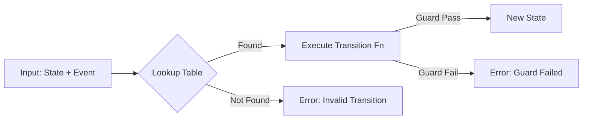

# 第68章：State ③ まとめ：状態機械の考え方（軽く）📋

* ねらい🎯：**状態遷移表（ステートマシン表）**を作って、**コードとズレない**ように運用できるようになる
* 学ぶこと📌：状態・イベント・遷移・ガード条件（禁止/許可ルール）／**網羅チェック**（never）／**遷移テーブル**（object）で管理するコツ

---

## 1) 状態機械ってなに？🤔💡\n\n\n

「**いまの状態**」と「**起きたイベント**」で、
「**次にどうなるか**」が決まるルール表のことだよ〜📋✨

* 状態（State）🧊：いまの状況（例：下書き、確定、支払い済み…）
* イベント（Event）⚡：起きたこと（例：確定ボタン押した、支払った…）
* 遷移（Transition）🔁：状態が変わること（例：下書き → 確定）
* ガード（Guard）🛡️：**条件を満たさないと遷移禁止**（例：商品0件なら確定できない）

TypeScript は **判別 Union（discriminated union）** と **制御フロー解析による絞り込み**が強いから、State パターンは「まず Union で書く」が超相性いいよ✨ ([TypeScript][1])

---

## 2) まず「状態遷移表」を書こう✍️📋\n\n\n

題材：カフェ注文 ☕🧾
状態：`draft`（下書き）→ `confirmed`（確定）→ `paid`（支払い済み）／`cancelled`（キャンセル）

イベント：`ADD_ITEM`（商品追加）／`CONFIRM`（確定）／`PAY`（支払い）／`CANCEL`（キャンセル）

## 状態遷移表（例）📌

| 今の状態      | イベント     | 次の状態      | ガード条件🛡️         | メモ              |
| --------- | -------- | --------- | ---------------- | --------------- |
| draft     | ADD_ITEM | draft     | なし               | 下書きに商品を足す       |
| draft     | CONFIRM  | confirmed | items.length > 0 | 0件なら禁止          |
| draft     | PAY      | ❌         | —                | 確定前に支払いは不可      |
| draft     | CANCEL   | cancelled | なし               | 理由つきでキャンセル      |
| confirmed | ADD_ITEM | ❌         | —                | 確定後は編集不可        |
| confirmed | CONFIRM  | ❌         | —                | 二重確定禁止          |
| confirmed | PAY      | paid      | paymentId が空でない  | 支払い情報必須         |
| confirmed | CANCEL   | cancelled | なし               | 確定後キャンセルOK      |
| paid      | （全部）     | ❌         | —                | 支払い済みは固定にする（例）  |
| cancelled | （全部）     | ❌         | —                | キャンセル後は固定にする（例） |

---

## 3) 表→コードへ：2つの書き方 🧩✨\n\n\n

## A) switch で書く（網羅チェックが強い）🧠

* TypeScript が **状態/イベントの型をきれいに絞り込む**
* `never` を使うと「書き忘れ」をコンパイルで止められる✅ ([TypeScript][2])

## B) 遷移テーブル（object）で書く（表と相性バツグン）📋➡️🧠

* 状態遷移表そのものを **コードの辞書**にする感じ
* `satisfies` を使うと「形が合ってるか」だけ検査しつつ、推論のうまみも残せる🍯✨ ([TypeScript][3])

この章では **B（遷移テーブル）** をメインにいくよ〜🙌💕



---

## 4) ハンズオン🛠️：遷移テーブルで「禁止遷移はエラー」にする🔥\n\n\n

## 4-1) 型を作る（State / Event）🧊⚡

```ts
// --- 共通の型 ---
export type Item = {
  id: string;
  name: string;
  price: number;
  qty: number;
};

// --- State（判別Union）---
export type OrderState =
  | { status: "draft"; items: Item[] }
  | { status: "confirmed"; items: Item[]; confirmedAt: number }
  | { status: "paid"; items: Item[]; confirmedAt: number; paidAt: number; paymentId: string }
  | { status: "cancelled"; items: Item[]; cancelledAt: number; reason: string };

// --- Event（判別Union）---
export type OrderEvent =
  | { type: "ADD_ITEM"; item: Item }
  | { type: "CONFIRM" }
  | { type: "PAY"; paymentId: string }
  | { type: "CANCEL"; reason: string };

// --- Result（成功/失敗を戻り値で）---
export type TransitionError =
  | { kind: "invalid_transition"; message: string }
  | { kind: "guard_failed"; message: string };

export type TransitionResult =
  | { ok: true; state: OrderState }
  | { ok: false; error: TransitionError };

const ok = (state: OrderState): TransitionResult => ({ ok: true, state });
const fail = (kind: TransitionError["kind"], message: string): TransitionResult => ({
  ok: false,
  error: { kind, message },
});

const now = () => Date.now();
```

---

## 4-2) 遷移テーブルの型（テーブルの形を固定）📌

ポイントはここ👇

* 状態キー（`draft` / `confirmed` …）を**必ず全部書かせる**
* イベントは「できるものだけ定義」して、無いものは **禁止遷移**にする❌

```ts
type OrderStatus = OrderState["status"];
type OrderEventType = OrderEvent["type"];

// 状態SとイベントEが来たら、次の状態 or エラーを返す関数
type TransitionFn<S extends OrderStatus, E extends OrderEventType> = (
  state: Extract<OrderState, { status: S }>,
  event: Extract<OrderEvent, { type: E }>
) => TransitionResult;

// 状態ごとの「イベント→処理」を持つテーブル
type TransitionTable = {
  [S in OrderStatus]: {
    [E in OrderEventType]?: TransitionFn<S, E>;
  };
};
```

---

## 4-3) 状態遷移表を「そのまま」コード化📋✨（satisfies で検査）

```ts
export const transitions = {
  draft: {
    ADD_ITEM: (state, event) => {
      return ok({ status: "draft", items: [...state.items, event.item] });
    },

    CONFIRM: (state) => {
      if (state.items.length === 0) {
        return fail("guard_failed", "商品が0件なので確定できないよ🥺");
      }
      return ok({ status: "confirmed", items: state.items, confirmedAt: now() });
    },

    CANCEL: (state, event) => {
      return ok({ status: "cancelled", items: state.items, cancelledAt: now(), reason: event.reason });
    },
  },

  confirmed: {
    PAY: (state, event) => {
      if (event.paymentId.trim() === "") {
        return fail("guard_failed", "paymentId が空だと支払いできないよ🥺");
      }
      return ok({
        status: "paid",
        items: state.items,
        confirmedAt: state.confirmedAt,
        paidAt: now(),
        paymentId: event.paymentId,
      });
    },

    CANCEL: (state, event) => {
      return ok({ status: "cancelled", items: state.items, cancelledAt: now(), reason: event.reason });
    },
  },

  paid: {
    // ここは「固定」とする例：あえて何も書かない（= 全イベント禁止）
  },

  cancelled: {
    // ここも固定：全イベント禁止
  },
} satisfies TransitionTable;
```

`satisfies` は「型に合ってるか検査」しつつ、オブジェクトの推論を壊しにくい便利ワザだよ✨ ([TypeScript][3])

---

## 4-4) 実行関数 transition（禁止遷移はエラー）🚫➡️🧾

```ts
export function transition(state: OrderState, event: OrderEvent): TransitionResult {
  const handler = transitions[state.status][event.type] as
    | ((s: any, e: any) => TransitionResult)
    | undefined;

  if (!handler) {
    return fail(
      "invalid_transition",
      `状態「${state.status}」ではイベント「${event.type}」はできないよ🚫`
    );
  }

  return handler(state as any, event as any);
}
```

これで「表にない遷移」は全部エラーになるよ〜🙌✨

---

## 5) テストで「表とコードのズレ」を守る🧪✅

最低限、**代表ケース＋禁止ケース**を押さえると強い💪

```ts
import test from "node:test";
import assert from "node:assert/strict";
import { transition, type OrderState } from "./stateMachine";

test("draft + ADD_ITEM => draft（商品が増える）🧁", () => {
  const s0: OrderState = { status: "draft", items: [] };

  const r = transition(s0, { type: "ADD_ITEM", item: { id: "1", name: "Latte", price: 500, qty: 1 } });

  assert.equal(r.ok, true);
  if (r.ok) {
    assert.equal(r.state.status, "draft");
    assert.equal(r.state.items.length, 1);
  }
});

test("draft + CONFIRM（商品0件）=> guard_failed 🛡️", () => {
  const s0: OrderState = { status: "draft", items: [] };

  const r = transition(s0, { type: "CONFIRM" });

  assert.equal(r.ok, false);
  if (!r.ok) {
    assert.equal(r.error.kind, "guard_failed");
  }
});

test("draft + PAY => invalid_transition 🚫", () => {
  const s0: OrderState = { status: "draft", items: [] };

  const r = transition(s0, { type: "PAY", paymentId: "p_123" });

  assert.equal(r.ok, false);
  if (!r.ok) {
    assert.equal(r.error.kind, "invalid_transition");
  }
});

test("confirmed + PAY => paid 💳✨", () => {
  const s1: OrderState = {
    status: "confirmed",
    items: [{ id: "1", name: "Latte", price: 500, qty: 1 }],
    confirmedAt: 111,
  };

  const r = transition(s1, { type: "PAY", paymentId: "p_123" });

  assert.equal(r.ok, true);
  if (r.ok) {
    assert.equal(r.state.status, "paid");
    assert.equal(r.state.paymentId, "p_123");
  }
});
```

---

## 6) よくあるつまずき💡😵‍💫

## ① 状態とイベントの「名前」がブレる🌀

* `status` と `type` は **短く固定**（例：`draft` / `confirmed`、`PAY` など）
* 「同じ意味の言葉」が増えると、表もコードも事故る💥

## ② ガード条件の置き場所が迷子🤹‍♀️

* 迷ったらこの方針がラク👇

  * **遷移できるか**＝ガード（transition の中）🛡️
  * **計算**＝別関数（純粋関数）🧠
  * **I/O**＝外側（DB/通信）🌍

## ③ Union がうまく絞り込まれないことがある🥲

型の形が「かぶってる」と、絞り込みが崩れやすいことがあるよ。
だからこそ **判別キー（status/type）をユニークにして、分岐条件を明確に**が大事✨ ([GitHub][4])

---

## 7) AIプロンプト例🤖💬

```text
次の状態遷移表（state machine）を、TypeScriptの判別Unionと遷移テーブルで実装して。
- 禁止遷移は { ok:false, error:{kind:"invalid_transition", message:string} } を返す
- ガード失敗は { ok:false, error:{kind:"guard_failed", message:string} } を返す
- satisfies を使って遷移テーブルの形を検査したい
- 代表テストも4本だけ提案して

（ここに状態遷移表を貼る）
```

---

## 8) ミニ演習📝✨（5〜10分）

1. `confirmed` にイベント `EDIT_ITEM`（数量変更）を追加してみよう✏️

* ただし **確定後編集OK** にする代わりに、`paid` は編集不可のままにする

2. ガードを1つ追加しよう🛡️

* 例：合計金額が 0 以下なら `CONFIRM` 禁止

---

## 9) チェックリスト✅🎉

* [ ] 状態は `status` で判別できる（Union）🧊
* [ ] イベントは `type` で判別できる（Union）⚡
* [ ] 状態遷移表が先にある📋
* [ ] テーブルにない遷移は必ずエラー🚫
* [ ] ガード失敗と禁止遷移が区別されてる🛡️
* [ ] 代表テストで主要ルートが守られてる🧪

[1]: https://www.typescriptlang.org/docs/handbook/2/narrowing.html?utm_source=chatgpt.com "Documentation - Narrowing"
[2]: https://www.typescriptlang.org/docs/handbook/unions-and-intersections.html?utm_source=chatgpt.com "Handbook - Unions and Intersection Types"
[3]: https://www.typescriptlang.org/docs/handbook/release-notes/typescript-4-9.html?utm_source=chatgpt.com "Documentation - TypeScript 4.9"
[4]: https://github.com/microsoft/TypeScript/issues/63012?utm_source=chatgpt.com "Type Narrowing in Discriminated Unions · Issue #63012"
