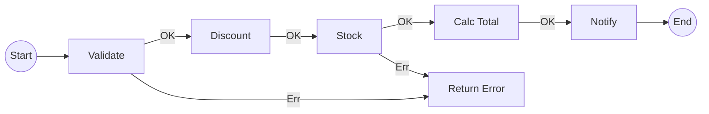

# 第69章：Chain of Responsibility ① “順番に流す”処理が欲しい⛓️

## ねらい🎯

* 「前処理が増えすぎて、1つの関数がゴチャつく問題」を説明できる😊
* “小さな処理を順番に流す”形にして、追加・削除が怖くなくなる🙌
* 失敗したら途中で止める（早期リターン）を、きれいにできる🛑✨

---

## 学ぶこと📌

### 1) ありがちなつらさ：前処理が“寄せ鍋”になる🍲😵\n\n\n

注文確定みたいな処理って、だいたいこうなりがち👇

* 入力チェック✅
* 割引適用🏷️
* 在庫チェック📦
* 合計計算💰
* 通知📣
* ログ📝

最初は1個ずつ足していくから、気づいたら **巨大関数＆分岐地獄** に…🥲

### 2) Chain of Responsibility（責務の連鎖）って？🧠⛓️

**“同じ入口”に対して、複数の処理を順番に通す** パターンだよ✨
各ステップ（Handler）は

* 自分の仕事をする
* 次へ渡す（続行）
* ここで止める（エラーなど）
  のどれかを選ぶ感じ👍

### 3) 身近な実例：ミドルウェア（Middleware）🍩\n\n\n

この考え方、実はサーバ開発では超おなじみ！

* **Express** は「ミドルウェア関数を順番に呼ぶ」モデルがど真ん中だよ📣 ([Express][1])
* しかも **Express 5** では、`async` なミドルウェアが `Promise` で失敗したとき、エラー処理へ自動で流してくれる（`next(err)` を毎回書かなくても良くなる）✨ ([Express][2])
* **Koa** もミドルウェア中心で、`(ctx, next)` の形で “次へ進む” を明示するスタイルだよ🧁 ([Docs4dev][3])
  （この「次へ渡す」感覚が、Chainの理解にめっちゃ効く！）

---

## ハンズオン🛠️：カフェ注文の“前処理”をチェーン化しよう☕🧾

ここでは **クラス増やさず**、**関数＋配列**でいくよ💪✨
（TypeScriptの素直な書き方でOK！）

---

## 1. まずは“チェーン化しない”例（つらさ体験）😵‍💫

「注文確定（placeOrder）」に全部詰め込むと、こうなりがち👇

```ts
type PlaceOrderInput = {
  userId: string;
  items: Array<{ sku: string; qty: number }>;
  couponCode?: string;
};

type PlaceOrderResult =
  | { ok: true; orderId: string; total: number }
  | { ok: false; message: string };

export async function placeOrder_bad(input: PlaceOrderInput): Promise<PlaceOrderResult> {
  // 1) validate
  if (!input.userId) return { ok: false, message: "userIdが空だよ🥲" };
  if (input.items.length === 0) return { ok: false, message: "商品がないよ🥲" };

  // 2) discount
  let discountRate = 0;
  if (input.couponCode === "WELCOME") discountRate = 0.1;
  if (input.couponCode === "VIP") discountRate = 0.2;

  // 3) stock check（仮）
  for (const it of input.items) {
    const stock = await fakeGetStock(it.sku);
    if (stock < it.qty) return { ok: false, message: `在庫足りないよ: ${it.sku}📦` };
  }

  // 4) total（仮）
  const subtotal = input.items.reduce((sum, it) => sum + fakeGetPrice(it.sku) * it.qty, 0);
  const total = Math.floor(subtotal * (1 - discountRate));

  // 5) notify（仮）
  await fakeNotify(input.userId, total);

  return { ok: true, orderId: cryptoRandomId(), total };
}

async function fakeGetStock(_sku: string) { return 10; }
function fakeGetPrice(_sku: string) { return 500; }
async function fakeNotify(_userId: string, _total: number) { /* ... */ }
function cryptoRandomId() { return Math.random().toString(16).slice(2); }
```

👀 いまは読めるけど…
「割引の種類が増える」「在庫チェックが複雑化」「通知が複数になる」
みたいに成長すると、すぐ地獄😇

---

## 2. チェーンの土台：Context（処理の持ち物）を作る🧺✨


チェーンは「バケツリレー」みたいなもの🏃‍♀️🏃‍♂️
バケツ＝Context（処理の途中経過）を次へ渡すよ！

```ts
type OrderItem = { sku: string; qty: number };

type OrderContext = {
  input: {
    userId: string;
    items: OrderItem[];
    couponCode?: string;
  };

  // 途中で計算して埋めていく場所🧩
  discountRate: number;      // 例: 0.1
  subtotal: number;          // 割引前合計
  total: number;             // 最終合計

  // デバッグ用：どこまで通った？🧭
  trace: string[];
};

type AppError =
  | { type: "validation"; message: string }
  | { type: "stock"; sku: string; message: string }
  | { type: "unknown"; message: string };

type Result<T> = { ok: true; value: T } | { ok: false; error: AppError };

const ok = <T>(value: T): Result<T> => ({ ok: true, value });
const err = (error: AppError): Result<never> => ({ ok: false, error });
```

✅ ポイント

* **“途中経過”をContextに集める** と、各ステップがスッキリするよ😌
* エラーは `AppError` で種類分けして、止め方を統一🛑✨



---

## 3. Step（ステップ）＝小さな処理を定義する🧱\n\n\n

今回はまず、分かりやすく **直列チェーン** にするね！

```ts
type Step = (ctx: OrderContext) => Promise<Result<OrderContext>>;

// 直列に上から順に実行、失敗したらそこで終了🛑
async function runChain(initial: OrderContext, steps: Step[]): Promise<Result<OrderContext>> {
  let ctx = initial;

  for (const step of steps) {
    const r = await step(ctx);
    if (!r.ok) return r;
    ctx = r.value;
  }

  return ok(ctx);
}
```

---

## 4. ステップを作る（小さく！）✂️✨

## 4-1) 入力チェック✅

```ts
const validateInput: Step = async (ctx) => {
  ctx.trace.push("validateInput✅");

  if (!ctx.input.userId) return err({ type: "validation", message: "userIdが空だよ🥲" });
  if (ctx.input.items.length === 0) return err({ type: "validation", message: "商品がないよ🥲" });

  for (const it of ctx.input.items) {
    if (it.qty <= 0) return err({ type: "validation", message: `qtyが変だよ: ${it.sku}` });
  }

  return ok(ctx);
};
```

## 4-2) 割引決定🏷️

```ts
const decideDiscount: Step = async (ctx) => {
  ctx.trace.push("decideDiscount🏷️");

  const code = ctx.input.couponCode;
  const rate =
    code === "WELCOME" ? 0.1 :
    code === "VIP"     ? 0.2 :
    0;

  return ok({ ...ctx, discountRate: rate });
};
```

## 4-3) 小計計算💰

```ts
function getPrice(sku: string): number {
  // 仮：本当はDB/外部APIとか
  return sku.startsWith("COF") ? 600 : 500;
}

const calcSubtotal: Step = async (ctx) => {
  ctx.trace.push("calcSubtotal💰");

  const subtotal = ctx.input.items.reduce((sum, it) => sum + getPrice(it.sku) * it.qty, 0);
  return ok({ ...ctx, subtotal });
};
```

## 4-4) 在庫チェック📦（失敗したら止める）

```ts
async function getStock(_sku: string): Promise<number> {
  return 10; // 仮
}

const checkStock: Step = async (ctx) => {
  ctx.trace.push("checkStock📦");

  for (const it of ctx.input.items) {
    const stock = await getStock(it.sku);
    if (stock < it.qty) {
      return err({ type: "stock", sku: it.sku, message: `在庫不足: ${it.sku}📦` });
    }
  }

  return ok(ctx);
};
```

## 4-5) 合計計算🧾✨

```ts
const calcTotal: Step = async (ctx) => {
  ctx.trace.push("calcTotal🧾");

  const total = Math.floor(ctx.subtotal * (1 - ctx.discountRate));
  return ok({ ...ctx, total });
};
```

## 4-6) 通知📣（最後にやると気持ちいい）

```ts
async function notifyUser(_userId: string, _total: number): Promise<void> {
  // 仮：通知送信
}

const notify: Step = async (ctx) => {
  ctx.trace.push("notify📣");

  await notifyUser(ctx.input.userId, ctx.total);
  return ok(ctx);
};
```

---

## 5. チェーンを組み立てて実行する🎬✨\n\n\n

```ts
export async function placeOrder_chain(input: OrderContext["input"]) {
  const initial: OrderContext = {
    input,
    discountRate: 0,
    subtotal: 0,
    total: 0,
    trace: [],
  };

  const steps: Step[] = [
    validateInput,
    decideDiscount,
    checkStock,
    calcSubtotal,
    calcTotal,
    notify,
  ];

  const r = await runChain(initial, steps);

  if (!r.ok) {
    return {
      ok: false as const,
      error: r.error,
      trace: initial.trace, // 途中までのログが残るのがうれしい🧭
    };
  }

  return {
    ok: true as const,
    total: r.value.total,
    trace: r.value.trace,
  };
}
```

🎉 ここでの気持ちよさ

* ステップを **上から読むだけで処理の流れが分かる** 😍
* 追加は `steps` に1個足すだけ✨
* 失敗は `Result` で **途中停止が一貫** 🛑

---

## 6. この章の“実務っぽい”つながり🍩🧠

* サーバでは「ミドルウェアの連鎖」がまさにChainだよ！

  * Expressはミドルウェアを順に通す設計が中心📣 ([Express][1])
  * Express 5は `Promise` を返すミドルウェアのエラー伝播が改善されて、`async/await` で書きやすくなってるよ✨ ([Express][4])
* 非同期処理は今どき `Promise` / `async/await` が基本、という流れも強いよ🧁 ([MDN Web Docs][5])

---

## AIプロンプト例🤖💬

```text
Chain of Responsibility を TypeScript でやりたいです。
- 関数配列でミドルウェア風にしたい（クラス増やさない）
- context をバケツリレーで渡したい
- 途中で止める時は Result（ok/err）で統一したい
題材: カフェ注文（validate → discount → stock → total → notify）
ステップの責務が大きすぎる所があれば分割案もください
```

---

## つまずき回避💡

* **ステップがデカくなったら負け😇**
  → “1ステップ=1つの理由で変更される” くらいまで刻む✂️
* **順番依存が増えたら、Contextの項目にコメント入れる🧷**
  例：「`subtotal` は `calcSubtotal` 後に有効」みたいに✨
* **どこで止まったか分からない問題**
  → `trace` は神🧭（この章の実装、地味に超効く！）

---

## ミニ演習🎓✨

1. `couponCode` が `"BAN"` のとき、**必ず失敗して止める** ステップ `rejectBannedCoupon` を追加してみてね🛑🚫
2. `notify` を最後じゃなくて途中に入れたら、どんな事故が起きそう？を想像してメモ📝（副作用の位置、大事！）

---

## まとめ🎉

* Chain of Responsibility は「処理の流れを、**小さい部品の列**にする」考え方⛓️
* TypeScriptでは **関数配列＋Context** がいちばん自然で学びやすい🧁
* 失敗は `Result` で統一すると、途中停止が気持ちよくなる🛑✨

次の第70章では、このチェーンを **“ミドルウェアっぽく（nextでつなぐ）”** したり、もっと読みやすく組み立てる方向へ進むよ〜🍡💨

[1]: https://expressjs.com/en/guide/using-middleware.html?utm_source=chatgpt.com "Using middleware"
[2]: https://expressjs.com/en/guide/writing-middleware.html?utm_source=chatgpt.com "Writing middleware for use in Express apps"
[3]: https://www.docs4dev.com/docs/koa/latest/guide.md.html?utm_source=chatgpt.com "Koa"
[4]: https://expressjs.com/en/guide/error-handling.html?utm_source=chatgpt.com "Error handling"
[5]: https://developer.mozilla.org/en-US/docs/Learn_web_development/Extensions/Server-side/Express_Nodejs/Introduction?utm_source=chatgpt.com "Express/Node introduction - Learn web development | MDN"
