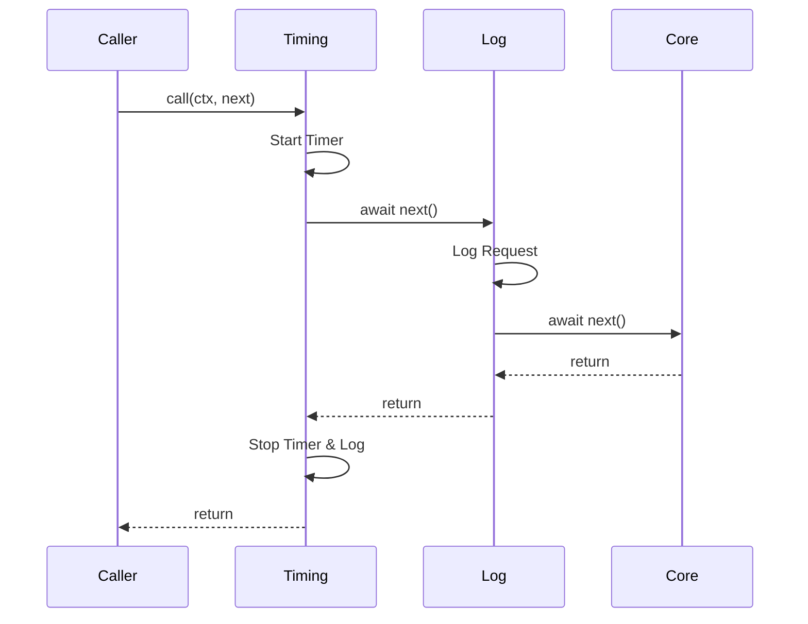

# 第70章：Chain ② TypeScript定番：関数配列＝ミドルウェア🧁

## ねらい🎯

前処理・検証・割引・通知みたいな「順番に流したい処理」を、**関数の配列**でキレイに組めるようになるよ✨

## この章でできるようになること✅

* 処理を「小さな関数」に分けて、配列で順番に実行できる🧩
* 途中で止めるルールを統一できる🛑
* `reduce` 版と、読みやすい版の両方が分かる🌀
* テストで「止まる」「順番」「ログ」を確認できる🧪

---

## 1. まず困りごと😵‍💫\n\n\n

やりがちなのが、1つの関数に全部詰め込むパターン👇

```ts
async function placeOrder(input: unknown) {
  // 検証
  if (!input) throw new Error("invalid");
  // 在庫チェック
  // 割引
  // 税計算
  // 決済
  // 通知
  // ログ
  // ...増える増える…
}
```

こうなるとつらいポイントが増えるよね😭

* 手順が長くて読めない📜
* 途中で止めたい条件がバラバラ🧨
* 1工程だけ差し替えたいのに怖い😱
* テストが書きにくい🧪💦

---

## 2. 解決アイデア💡

「処理の列」を **関数配列**として持って、

* 1個ずつ順番に実行する➡️
* 失敗したらそこで止める🛑
* 必要ならログで見える化👀

…これが **ミドルウェアっぽいChain** の気持ちよさだよ🍩✨

---

## 3. 直列パイプラインの基本形🧁\n\n\n

いちばん素直で、読みやすくて、実務でも超使える形✨

## 3.1 途中で止めるためのResult型🧯\n\n\n

「成功/失敗」を戻り値で統一するよ👇

```ts
export type Result<T> =
  | { ok: true; value: T }
  | { ok: false; error: string };

export const ok = <T>(value: T): Result<T> => ({ ok: true, value });
export const err = <T = never>(error: string): Result<T> => ({ ok: false, error });
```

## 3.2 Stepの型とrunPipeline🧠

「入力（ctx）を受けて、Resultで返す関数」がStep✨

```ts
export type Step<T> = (ctx: T) => Result<T> | Promise<Result<T>>;

export async function runPipeline<T>(steps: Step<T>[], initial: T): Promise<Result<T>> {
  let current = ok(initial);

  for (const step of steps) {
    // どこかで失敗してたら、その時点で止める🛑
    if (!current.ok) return current;

    current = await step(current.value);
  }

  return current;
}
```

---

## 4. ハンズオン題材☕🧾

「注文を確定するまで」をチェーン化してみよう✨

## 4.1 データ型🧩

```ts
export type MemberRank = "guest" | "silver" | "gold";

export type OrderItem = {
  id: string;
  name: string;
  price: number;
  qty: number;
};

export type Order = {
  items: OrderItem[];
  memberRank: MemberRank;
  couponCode?: string;
};

export type OrderCtx = {
  order: Order;
  subtotal: number;
  discount: number;
  tax: number;
  total: number;
  logs: string[];
};
```

## 4.2 Stepを小さく作る🔧

## ① 検証ステップ✅

```ts
import { ok, err, type Step } from "./pipeline";

export const validateItems: Step<OrderCtx> = (ctx) => {
  if (ctx.order.items.length === 0) return err("商品が入ってないよ🥺");
  return ok({ ...ctx, logs: [...ctx.logs, "validateItems✅"] });
};
```

## ② 小計ステップ💰

```ts
import { ok, type Step } from "./pipeline";

export const calcSubtotal: Step<OrderCtx> = (ctx) => {
  const subtotal = ctx.order.items.reduce((sum, it) => sum + it.price * it.qty, 0);
  return ok({ ...ctx, subtotal, logs: [...ctx.logs, "calcSubtotal💰"] });
};
```

## ③ 割引ステップ🎟️

```ts
import { ok, type Step } from "./pipeline";

const rankRate = (rank: "guest" | "silver" | "gold") => {
  if (rank === "gold") return 0.1;
  if (rank === "silver") return 0.05;
  return 0;
};

export const applyMemberDiscount: Step<OrderCtx> = (ctx) => {
  const rate = rankRate(ctx.order.memberRank);
  const discount = Math.floor(ctx.subtotal * rate);
  return ok({ ...ctx, discount, logs: [...ctx.logs, `applyMemberDiscount🎟️(${rate})`] });
};
```

## ④ 税と合計ステップ🧾

```ts
import { ok, type Step } from "./pipeline";

export const calcTaxAndTotal: Step<OrderCtx> = (ctx) => {
  const taxable = ctx.subtotal - ctx.discount;
  const tax = Math.floor(taxable * 0.1);
  const total = taxable + tax;
  return ok({ ...ctx, tax, total, logs: [...ctx.logs, "calcTaxAndTotal🧾"] });
};
```

## 4.3 実行してみる🚀

```ts
import { runPipeline } from "./pipeline";
import { validateItems } from "./steps/validateItems";
import { calcSubtotal } from "./steps/calcSubtotal";
import { applyMemberDiscount } from "./steps/applyMemberDiscount";
import { calcTaxAndTotal } from "./steps/calcTaxAndTotal";
import type { OrderCtx } from "./types";

const initial: OrderCtx = {
  order: {
    memberRank: "gold",
    items: [{ id: "latte", name: "カフェラテ", price: 520, qty: 2 }],
  },
  subtotal: 0,
  discount: 0,
  tax: 0,
  total: 0,
  logs: [],
};

const steps = [validateItems, calcSubtotal, applyMemberDiscount, calcTaxAndTotal];

const result = await runPipeline(steps, initial);

if (result.ok) {
  console.log("合計:", result.value.total);
  console.log(result.value.logs.join(" -> "));
} else {
  console.log("失敗:", result.error);
}
```

---

## 5. reduceで書くパイプライン🌀

「reduceで書ける？」って聞かれがちなので、ちゃんと載せるよ😆
ただし、**読みやすさは for..of のほうが勝ち**になりがち！

```ts
import { ok, type Result, type Step } from "./pipeline";

export function runPipelineWithReduce<T>(steps: Step<T>[], initial: T): Promise<Result<T>> {
  return steps.reduce(
    async (accP, step) => {
      const acc = await accP;
      if (!acc.ok) return acc;
      return step(acc.value);
    },
    Promise.resolve(ok(initial)),
  );
}
```

---

## 6. next()型ミドルウェアのイメージ🧅


「前後に挟みたい」時に強いのが `next()` スタイル✨
（Webだと GitHub 上の色んなフレームワークでもおなじみの考え方だよ〜📣）

`next()` を呼ぶと次へ進む、呼ばないと止まる、って発想👣
この「止められる」がChainっぽさだね🛑
`next()` の考え方はExpressの説明でも出てくるよ。([Express][1])



## 6.1 composeの最小版🧩

```ts
export type Middleware<C> = (ctx: C, next: () => Promise<void>) => Promise<void>;

export function compose<C>(middlewares: Middleware<C>[]) {
  return async (ctx: C) => {
    let index = -1;

    const dispatch = async (i: number): Promise<void> => {
      if (i <= index) throw new Error("next() called multiple times 😵");
      index = i;

      const fn = middlewares[i];
      if (!fn) return;

      await fn(ctx, () => dispatch(i + 1));
    };

    await dispatch(0);
  };
}
```

## 6.2 例：計測ミドルウェア⏱️

```ts
import type { Middleware } from "./compose";
import type { OrderCtx } from "./types";

export const withTiming: Middleware<OrderCtx> = async (ctx, next) => {
  const start = Date.now();
  await next();
  const ms = Date.now() - start;
  ctx.logs.push(`withTiming⏱️ ${ms}ms`);
};
```

---

## 7. 途中で止める条件を統一しよう🛑

おすすめはこの2つだけ覚えればOK✨

* 直列パイプラインなら **Resultで止める**（この章のメイン）✅
* next型なら **nextを呼ばない**（止めるルールを決める）🧅

「途中で止める」を if で好き勝手にやりだすと、すぐカオスになるよ〜😭

---

## 8. テストで安心を作る🧪\n\n\n

Nodeには標準のテスト機能 `node:test` があって、Node 20で安定扱いになった流れがあるよ。([Node.js][2])

## 8.1 テスト例✅

```ts
import test from "node:test";
import assert from "node:assert/strict";
import { runPipeline } from "./pipeline";
import { validateItems } from "./steps/validateItems";
import { calcSubtotal } from "./steps/calcSubtotal";
import { applyMemberDiscount } from "./steps/applyMemberDiscount";
import { calcTaxAndTotal } from "./steps/calcTaxAndTotal";
import type { OrderCtx } from "./types";

test("成功すると合計が計算される🎉", async () => {
  const initial: OrderCtx = {
    order: { memberRank: "gold", items: [{ id: "latte", name: "ラテ", price: 500, qty: 2 }] },
    subtotal: 0,
    discount: 0,
    tax: 0,
    total: 0,
    logs: [],
  };

  const steps = [validateItems, calcSubtotal, applyMemberDiscount, calcTaxAndTotal];
  const result = await runPipeline(steps, initial);

  assert.equal(result.ok, true);
  if (result.ok) {
    assert.equal(result.value.subtotal, 1000);
    assert.ok(result.value.total > 0);
    assert.deepEqual(result.value.logs[0], "validateItems✅");
  }
});

test("商品が空なら途中で止まる🛑", async () => {
  const initial: OrderCtx = {
    order: { memberRank: "guest", items: [] },
    subtotal: 0,
    discount: 0,
    tax: 0,
    total: 0,
    logs: [],
  };

  const steps = [validateItems, calcSubtotal, applyMemberDiscount, calcTaxAndTotal];
  const result = await runPipeline(steps, initial);

  assert.equal(result.ok, false);
  if (!result.ok) {
    assert.match(result.error, /商品が入ってない/);
  }
});
```

---

## 9. よくあるつまずきポイント💡

* **Stepの形がバラバラ**になる😵
  👉 `(ctx)=>Result` に揃えるだけで世界が平和🕊️
* **ctxを破壊的に更新**するか、**コピーして返す**かが混ざる🌀
  👉 どっちでもいいけど、混ぜないのが大事！
* **順番依存**が隠れる🙈
  👉 配列の上にコメントで「なぜこの順？」を書くだけで神✨
* next型で **next()を2回呼ぶ**💥
  👉 composeで検知して落とす（上の実装みたいに）

---

## 10. AIプロンプト例🤖💬

```text
長い関数を「関数配列のpipeline」に分割したいです。
- 1ステップの責務が小さくなるように分割
- Step型は (ctx)=>Result<ctx> に統一
- 途中で止める条件もResultで統一
- ついでにテストケースも提案して
対象コード: <ここに貼る>
```

```text
このpipelineのsteps配列の順番をレビューして。
- 依存関係（どの値がどのステップで作られるか）
- 途中停止の条件
- 追加しやすい拡張ポイント
も指摘して。
```

---

## 11. メモ📝✨

* TypeScriptの最新安定版は 5.9.3（2025-10-01時点でLatest表記）だよ。([GitHub][3])
* Node.jsは 24 がActive LTS、25 がCurrent という位置づけになってるよ。([Node.js][4])
* 「パイプ演算子 `|>`」は提案はあるけど、まだ標準として使える前提じゃないから、今回みたいに関数合成でやるのが安全✨([GitHub][5])

[1]: https://expressjs.com/en/guide/using-middleware.html?utm_source=chatgpt.com "Using middleware"
[2]: https://nodejs.org/en/blog/announcements/v20-release-announce?utm_source=chatgpt.com "Node.js 20 is now available!"
[3]: https://github.com/microsoft/typescript/releases "Releases · microsoft/TypeScript · GitHub"
[4]: https://nodejs.org/en/about/previous-releases?utm_source=chatgpt.com "Node.js Releases"
[5]: https://github.com/tc39/proposals?utm_source=chatgpt.com "tc39/proposals: Tracking ECMAScript Proposals"
