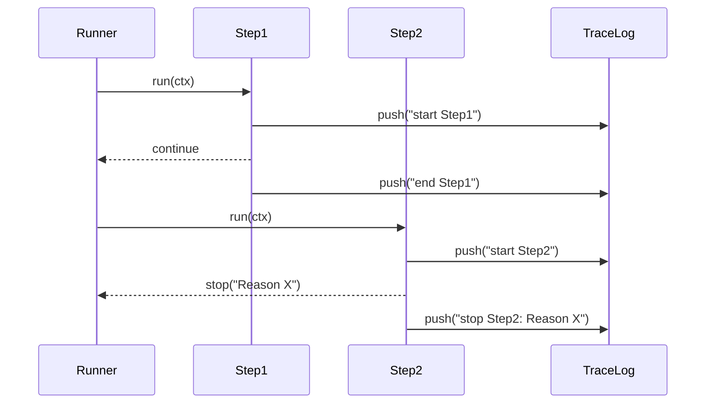

# 第71章：Chain ③ まとめ：責務の境界が見えると強い👀✨

## 今日のゴール🎯

* Chain（責務の連鎖）を **「実務で壊れにくい形」** にまとめられるようになる🧱
* 特にここ👇を押さえる

  * **責務の境界**（1ステップ＝1つの仕事）✂️
  * **順番依存**（“なぜこの順番？”が説明できる）🧭
  * **途中で止める**（NGなら即ストップ🛑）
  * **可視化ログ**（チェーンの流れが追える🔎）

> 参考：本日時点では TypeScript 5.9 系のリリースノートが更新されています。([TypeScript][1])
> Node 側は v24 が Active LTS として案内されています。([Node.js][2])
> （テストは Node の組み込み test runner も使えます🧪）([Node.js][3])

---

## 1) Chainが“強い”のは、境界が見えるから👀✨

Chain は「処理を順番に並べる」だけじゃなくて、**境界をくっきりさせる**のが本体です🧼

* ✅ 1ステップは **小さく**（1〜20行くらいが目安）🧩
* ✅ 入力（ctx）と出力（continue/stop）が **同じ形** 🍱
* ✅ 「どこで止まる可能性があるか」が **見える** 🛑
* ✅ 追加/削除が **配列の編集**で済む📚

---

## 2) “順番依存”はChain最大の落とし穴⚠️（だからルール化する）

Chainは便利だけど、順番が重要なときに「なんとなく並べた」だと事故ります😵‍💫

## よくある順番依存の例🍰

* 先に **validate** してからでないと、後続が前提を満たさない
* **割引**→**税**→**合計** みたいに、計算順が意味を持つ
* **権限チェック**を後ろに置いて「不要な処理を先に走らせちゃう」💸

## 順番依存を安全にするコツ🧠

* ステップ名を “理由が伝わる名前” にする（`authorizeBeforeDiscount` みたいに）📝
* 「順番が大事」なものは **テストで固定**する🧪
* チェーンの流れを **ログで可視化**する🔎

---

## 3) “途中で止める”を設計に組み込む🛑（NGは早く返す）

Chain は「最後まで回す」より、**早期停止**が気持ちいいです😆✨
たとえば「権限NG」「在庫NG」「入力不正」は、そこで止めたいですよね。

ここでは **StepOutcome** を返すだけのシンプル設計でいきます🍙
（独自クラスを増やさず、型と関数で📌）

---

## 4) 可視化ログで“デバッグ地獄”を回避する🔍📣


Chainは「どのステップで何が起きた？」が分からなくなると辛い😭
だから最初から **trace（足跡）** を残します🐾



* ✅ step開始/終了/停止が分かる
* ✅ どこで止まったか一発で分かる
* ✅ 後から “順番依存” の理由づけにも使える🧭

---

## ハンズオン🛠️：注文確定チェーンを「止められる＆見える化」する☕🧾

## 仕様（ミニ）📦

* validate（入力検証）
* authorize（権限チェック：admin 以外は高額注文を止める）🛑
* applyDiscount（割引）
* calcTotal（合計）
* notify（通知っぽいログ）

---

## 実装例（最小・実務寄り）✨

```ts
// chain.ts

export type Stop = { type: "stop"; reason: string };
export type Continue = { type: "continue" };
export type StepOutcome = Stop | Continue;

export type TraceEntry =
  | { at: "start"; step: string; timeMs: number }
  | { at: "end"; step: string; timeMs: number }
  | { at: "stop"; step: string; reason: string; timeMs: number };

export type Step<Ctx> = (ctx: Ctx) => StepOutcome | Promise<StepOutcome>;

export async function runChain<Ctx extends { trace: TraceEntry[] }>(
  ctx: Ctx,
  steps: Array<{ name: string; run: Step<Ctx> }>
): Promise<StepOutcome> {
  for (const s of steps) {
    const t0 = Date.now();
    ctx.trace.push({ at: "start", step: s.name, timeMs: t0 });

    const out = await s.run(ctx);

    const t1 = Date.now();
    if (out.type === "stop") {
      ctx.trace.push({ at: "stop", step: s.name, reason: out.reason, timeMs: t1 });
      return out;
    }

    ctx.trace.push({ at: "end", step: s.name, timeMs: t1 });
  }
  return { type: "continue" };
}

export function formatTrace(trace: TraceEntry[]): string {
  return trace
    .map((e) => {
      if (e.at === "stop") return `🛑 ${e.step} STOP: ${e.reason}`;
      if (e.at === "start") return `▶️ ${e.step}`;
      return `✅ ${e.step}`;
    })
    .join("\n");
}
```

```ts
// orderPipeline.ts

import { StepOutcome, runChain, formatTrace, TraceEntry } from "./chain.js";

type Role = "user" | "admin";

type Line = { name: string; price: number; qty: number };

export type OrderCtx = {
  trace: TraceEntry[];
  role: Role;
  lines: Line[];
  discountRate: number; // 0.1 = 10%
  total: number;
  logs: string[];
};

const cont = (): StepOutcome => ({ type: "continue" });
const stop = (reason: string): StepOutcome => ({ type: "stop", reason });

// 1) validate ✅
const validate = (ctx: OrderCtx): StepOutcome => {
  if (ctx.lines.length === 0) return stop("商品が空だよ😢");
  if (ctx.lines.some((x) => x.qty <= 0)) return stop("数量が不正だよ😵");
  if (ctx.lines.some((x) => x.price < 0)) return stop("価格が不正だよ😵‍💫");
  return cont();
};

// 2) authorize 🛡️（例：高額注文は admin だけ）
const authorizeHighPrice = (ctx: OrderCtx): StepOutcome => {
  const raw = ctx.lines.reduce((sum, x) => sum + x.price * x.qty, 0);
  const limit = 5000;

  if (raw > limit && ctx.role !== "admin") {
    return stop(`高額注文(${raw}円)はadminだけだよ⚠️`);
  }
  return cont();
};

// 3) applyDiscount 🧁
const applyDiscount = (ctx: OrderCtx): StepOutcome => {
  // validate/authorize を通った前提で進む（順番依存ポイント！🧭）
  const raw = ctx.lines.reduce((sum, x) => sum + x.price * x.qty, 0);
  const discounted = Math.round(raw * (1 - ctx.discountRate));
  ctx.total = discounted;
  return cont();
};

// 4) calcTotal 🧾（例として“ここでは”追加計算がある想定）
const calcTotal = (ctx: OrderCtx): StepOutcome => {
  // 例：梱包料を足す（固定）
  ctx.total += 120;
  return cont();
};

// 5) notify 📣（外部I/Oはしないで logs に残すだけ）
const notify = (ctx: OrderCtx): StepOutcome => {
  ctx.logs.push(`📩 注文確定！合計: ${ctx.total}円`);
  return cont();
};

export async function placeOrder(ctx: OrderCtx) {
  const steps = [
    { name: "validate", run: validate },
    { name: "authorizeHighPrice", run: authorizeHighPrice },
    { name: "applyDiscount", run: applyDiscount },
    { name: "calcTotal", run: calcTotal },
    { name: "notify", run: notify },
  ] satisfies Array<{ name: string; run: (ctx: OrderCtx) => StepOutcome | Promise<StepOutcome> }>;

  const out = await runChain(ctx, steps);

  return {
    outcome: out,
    traceText: formatTrace(ctx.trace),
    logs: ctx.logs,
    total: ctx.total,
  };
}
```

---

## 5) ここが“まとめのキモ”💡（レビュー観点👀）

## ✅ 責務の境界チェックリスト🧼

* そのステップ、**「何をするか」1文で言える？**（言えないなら分割✂️）
* そのステップ、**他のステップの仕事を盗ってない？**🕵️
* ステップが失敗したとき、**理由が文字列で説明できる？**🛑

## ✅ 順番依存チェックリスト🧭

* 「なぜこの順番？」をコメント or テストで固定した？🧪
* “順番が大事な場所”に、**可視化ログ**がある？🔎
* 重要な前提（validate済みなど）があるなら、**前段で止められる**ようになってる？🛑

---

## 6) テスト🧪（止まる場所＆順番を守る）

Node の組み込み test runner（`node:test`）は依存追加なしで使えます🧪([Node.js][4])

```ts
// orderPipeline.test.ts
import test from "node:test";
import assert from "node:assert/strict";
import { placeOrder, OrderCtx } from "./orderPipeline.js";

function baseCtx(partial: Partial<OrderCtx> = {}): OrderCtx {
  return {
    trace: [],
    role: "user",
    lines: [{ name: "Latte", price: 600, qty: 1 }],
    discountRate: 0.1,
    total: 0,
    logs: [],
    ...partial,
  };
}

test("権限NGなら途中で止まる🛑", async () => {
  const ctx = baseCtx({
    role: "user",
    lines: [{ name: "PartySet", price: 3000, qty: 2 }], // raw=6000 > limit
  });

  const r = await placeOrder(ctx);
  assert.equal(r.outcome.type, "stop");
  assert.match(r.traceText, /authorizeHighPrice/);
});

test("問題なければ最後まで進む✅", async () => {
  const ctx = baseCtx({
    role: "admin",
    lines: [{ name: "PartySet", price: 3000, qty: 2 }],
  });

  const r = await placeOrder(ctx);
  assert.equal(r.outcome.type, "continue");
  assert.ok(r.logs.some((x) => x.includes("注文確定")));
  assert.ok(r.total > 0);
});

test("順番が変わると困る場所を守る🧭", async () => {
  const ctx = baseCtx({
    role: "admin",
    lines: [{ name: "Latte", price: 600, qty: 1 }],
    discountRate: 0.5,
  });

  const r = await placeOrder(ctx);

  // trace の先頭付近をざっくり確認（厳密にやりたい場合は配列で見る）
  const lines = r.traceText.split("\n");
  assert.equal(lines[0], "▶️ validate");
  assert.equal(lines[1], "✅ validate");
});
```

---

## 7) つまずき回避💡（ありがち事故あるある😇）

* **ステップが巨大化**：便利だから全部入れてしまう → すぐ読めなくなる📛
  → 「1ステップ＝1文」ルールに戻す✂️
* **“なんとなく順番”**：あとで人が変える → 静かに壊れる😱
  → テストで順番固定🧪＋traceで可視化🔎
* **止め方がバラバラ**：例外・return・フラグが混在 → 追跡不能🌀
  → StepOutcome に統一🍱

---

## 8) AIプロンプト例🤖💬（可視化ログ＆レビュー用）

```text
次のTypeScriptのChain（関数配列パイプライン）に、デバッグしやすい可視化ログ（開始/終了/停止）を入れてください。
制約:
- 余計な独自クラスを増やさない（型と関数中心）
- 途中停止の理由が分かるように
- テストで「止まる場所」と「順番依存」を守れるように
出力:
1) 改善方針
2) 最小コード
3) テスト案（node:test or vitest どちらでもOK）
```

---

## 9) 仕上げミニ演習🎓✨

## 演習A：途中停止ステップをもう1個追加🛑

* 例：「在庫が足りない」なら stop
* stop理由に「どの商品が不足か」を入れる📦

## 演習B：traceを“見やすい1行ログ”にする🧾

* `▶️ validate (t=...)` みたいに時間も表示⏱️
* どのステップが遅いか見えるようにする🐢➡️🐇

## 演習C：順番依存の“理由コメント”を1行で残す🧭

* `// authorize は重い処理の前に置く（無駄実行を防ぐ）` みたいに✍️

---

[1]: https://www.typescriptlang.org/docs/handbook/release-notes/typescript-5-9.html?utm_source=chatgpt.com "Documentation - TypeScript 5.9"
[2]: https://nodejs.org/en/about/previous-releases?utm_source=chatgpt.com "Node.js Releases"
[3]: https://nodejs.org/api/test.html?utm_source=chatgpt.com "Test runner | Node.js v25.6.0 Documentation"
[4]: https://nodejs.org/en/learn/test-runner/introduction?utm_source=chatgpt.com "Discovering Node.js's test runner"
