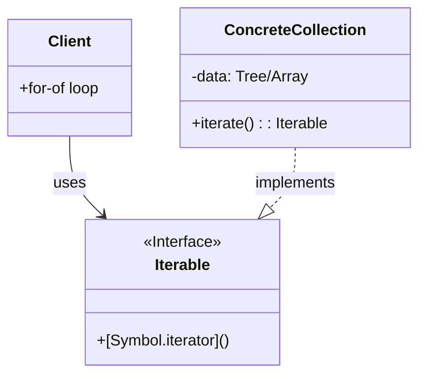

# 第72章：Iterator ① “順番に取り出す”を統一する🔁

## ねらい🎯

* 「走査（ループ）の書き方」があちこちに散らばって辛くなる理由を体感する😵‍💫
* Iteratorの発想＝**“取り出し方（順番）を1か所に閉じる”**が言えるようになる🧠✨
* TypeScriptではまず **`for..of` + Iterable** で気持ちよく整える🌿 ([MDN Web Docs][1])

---

## 1. ありがちな“つらさ”あるある😵‍💫🌀


たとえば「メニュー（カテゴリ→商品）」みたいな**木構造🌳**を扱うとき、

* 画面A：一覧表示したい👀
* 画面B：合計金額を出したい🧾
* 画面C：高い商品だけ探したい🔎

ってなると、**毎回どこかで“木をたどるコード”**を書き始めちゃう…💥

その結果👇

* 同じDFS（深さ優先）っぽい再帰が3回コピペされる✂️
* 途中で「順番を変えたい（BFSにしたい）」ってなると全滅😇
* ちょっとしたバグ修正が全部の箇所に必要になって地獄🔥

---

## 2. Iteratorってなに？（超ざっくり）🍡


Iteratorの気持ちよさはこれ👇

> **“集め方（内部構造）”を隠して、外からは「順番に取り出せる」だけ見せる** 🎁


TypeScript/JavaScriptの世界では、だいたいこう理解でOK✅

* **Iterable**：`for..of` で回せるやつ（= `[Symbol.iterator]()` を持つ）
* **Iterator**：`next()` で「次の値」を返していくやつ
* `for..of` は内部で `[Symbol.iterator]()` → `next()` を繰り返してる🔁 ([MDN Web Docs][1])

つまり最初の一歩はこれだけでOK👇
✅ **「走査したいものを Iterable として提供する」**（中身は隠す）



---

## 3. まず“つらいコード”をわざと作る🛠️😵‍💫


木構造メニューを題材にするよ☕🍰

```ts
// menu.ts
export type MenuItem = {
  kind: "item";
  id: string;
  price: number;
};

export type MenuGroup = {
  kind: "group";
  name: string;
  children: MenuNode[];
};

export type MenuNode = MenuItem | MenuGroup;

export const menu: MenuNode = {
  kind: "group",
  name: "ALL",
  children: [
    { kind: "item", id: "coffee", price: 450 },
    {
      kind: "group",
      name: "sweets",
      children: [
        { kind: "item", id: "cake", price: 520 },
        { kind: "item", id: "cookie", price: 280 },
      ],
    },
  ],
};
```

## ❌ つらさ例：用途ごとに“木の走査”を書いちゃう😇

```ts
import { MenuNode, MenuItem } from "./menu.js";

// 一覧表示用：DFS再帰
export function printAllItems(root: MenuNode) {
  const items: MenuItem[] = [];

  const walk = (node: MenuNode) => {
    if (node.kind === "item") {
      items.push(node);
      return;
    }
    for (const child of node.children) walk(child);
  };

  walk(root);

  for (const item of items) {
    console.log(item.id, item.price);
  }
}

// 合計用：またDFS再帰（コピペの香り…）
export function sumAllPrices(root: MenuNode): number {
  let sum = 0;

  const walk = (node: MenuNode) => {
    if (node.kind === "item") {
      sum += node.price;
      return;
    }
    for (const child of node.children) walk(child);
  };

  walk(root);
  return sum;
}
```

**これ、絶対増えるやつ**です🌀（検索・フィルタ・検証…でどんどん増殖）

---

## 4. 改善：走査を“1か所に閉じる”🎯✨


ポイントは超シンプル👇
✅ **「木構造 → 商品を順番に取り出せる Iterable」に変換する関数を1個だけ作る**

## 4-1. まずは配列でOK（配列は最初からIterable）🧁

配列は `for..of` できる＝Iterable なので、最初はこれで全然OKだよ✨ ([TypeScript][2])

```ts
import { MenuNode, MenuItem } from "./menu.js";

function collectItemsDFS(root: MenuNode, out: MenuItem[] = []): MenuItem[] {
  if (root.kind === "item") {
    out.push(root);
    return out;
  }
  for (const child of root.children) {
    collectItemsDFS(child, out);
  }
  return out;
}

// ✅ “外に見せる”のは Iterable だけ
export function iterateMenuItems(root: MenuNode): Iterable<MenuItem> {
  return collectItemsDFS(root); // いまは配列で返す（次章でパワーアップ💪）
}
```

## 4-2. 使う側は“全部同じループ”になる🎉

```ts
import { menu } from "./menu.js";
import { iterateMenuItems } from "./iterate.js";

// 一覧
for (const item of iterateMenuItems(menu)) {
  console.log(item.id, item.price);
}

// 合計
let sum = 0;
for (const item of iterateMenuItems(menu)) {
  sum += item.price;
}
console.log("sum =", sum);

// 高いものだけ
const expensive = [];
for (const item of iterateMenuItems(menu)) {
  if (item.price >= 500) expensive.push(item.id);
}
console.log(expensive);
```

🎊 これで「木のたどり方」は iterateMenuItems の中だけ！
呼び出し側は **“順番に取り出す”だけ**に集中できる✨

---

## 5. Iteratorの“本領”：順番を変えても利用側が壊れない🔁🧠


たとえば「順番をBFS（幅優先）に変えたい！」ってなっても…

利用側は一切変えずに、中だけ差し替えられるのが気持ちいい🎯

```ts
import { MenuNode, MenuItem } from "./menu.js";

function collectItemsBFS(root: MenuNode): MenuItem[] {
  const out: MenuItem[] = [];
  const queue: MenuNode[] = [root];

  while (queue.length > 0) {
    const node = queue.shift()!;
    if (node.kind === "item") {
      out.push(node);
    } else {
      queue.push(...node.children);
    }
  }
  return out;
}

export function iterateMenuItems(root: MenuNode): Iterable<MenuItem> {
  return collectItemsBFS(root); // ←ここだけ変える
}
```

✅ **呼び出し側は同じ `for..of`** のまま！
「順番」の変更が“局所”で済むのがIteratorの嬉しさだよ🎁✨

---

## 6. つまずき回避💡（ここ超大事！）


## ✅ `for..in` と `for..of` を混ぜない🧯

* `for..of`：**値**を順番に取り出す（Iterable向け）🔁 ([MDN Web Docs][1])
* `for..in`：主に**キー**を回す（オブジェクト向け）🗝️
  「順番の統一」をしたいなら基本 `for..of` 側で揃えるのがラク✨

## ✅ Objectは基本Iterableじゃない🙅‍♀️

* `Object` はそのまま `for..of` できない
* でも `Object.entries(obj)` は配列を返すから `for..of` OK（必要なときだけね）
  （ここで“順番に依存しない設計”に寄せるのも大事🧠）

## ✅ Map/Setは最初からIteratorが強い🗺️

* `Map` は **挿入順で**回せる（`keys/values/entries`） ([MDN Web Docs][3])
  「順序つき辞書」っぽく使いたいときに便利だよ✨

---

## 7. ちいさなテスト案🧪✅（順番が仕様になる！）


Iteratorは「順番」が価値なので、**順番のテスト**を1本入れると安心💕

例：取り出した `id` の並びを固定で確認する

```ts
import { menu } from "./menu.js";
import { iterateMenuItems } from "./iterate.js";

const ids = [...iterateMenuItems(menu)].map((x) => x.id);
const expected = ["coffee", "cake", "cookie"];

if (JSON.stringify(ids) !== JSON.stringify(expected)) {
  throw new Error(`order mismatch: ${JSON.stringify(ids)}`);
}
```

「ちゃんと落ちる」だけでも、学習の段階では強いよ💪✨

（ちなみに、Nodeの組み込みテストランナー `node:test` は安定版になってるので、後で本格化もできるよ🧪🎉）([Node.js][4])

---

## 8. AIプロンプト例🤖💬

```text
Iteratorがないと辛くなる「走査コードの重複」例を、木構造（カテゴリ→商品）で作って。
次に、走査を1か所に閉じるリファクタ案を3つ出して：
1) 配列を返す（まずはこれ）
2) Iterableを返す設計（型も）
3) 次章用のジェネレータ案（チラ見せでOK）
それぞれのメリット/デメリットも短く教えて。
```

---

## 9. まとめ🎉✨

* Iteratorの第一歩は「**走査を1か所に閉じる**」こと🔒
* TypeScriptではまず **Iterable（= `for..of` できる形）を返す**のが超ラク🌿 ([MDN Web Docs][1])
* “順番を変えたくなった時”に、呼び出し側を変えずに済むのが最高🎁🔁

次の章では、いよいよ **`Symbol.iterator` とジェネレータ（`function*`）** で「自前Iterable」をスマートに作るよ✨ ([MDN Web Docs][5])

[1]: https://developer.mozilla.org/en-US/docs/Web/JavaScript/Reference/Statements/for...of?utm_source=chatgpt.com "for...of - JavaScript | MDN - MDN Web Docs"
[2]: https://www.typescriptlang.org/docs/handbook/iterators-and-generators.html?utm_source=chatgpt.com "Documentation - Iterators and Generators"
[3]: https://developer.mozilla.org/en-US/docs/Web/JavaScript/Reference/Global_Objects/Map?utm_source=chatgpt.com "Map - JavaScript - MDN Web Docs - Mozilla"
[4]: https://nodejs.org/ja/blog/announcements/v20-release-announce?utm_source=chatgpt.com "Node.js 20 is now available!"
[5]: https://developer.mozilla.org/en-US/docs/Web/JavaScript/Reference/Global_Objects/Symbol/iterator?utm_source=chatgpt.com "Symbol.iterator - JavaScript - MDN Web Docs"
