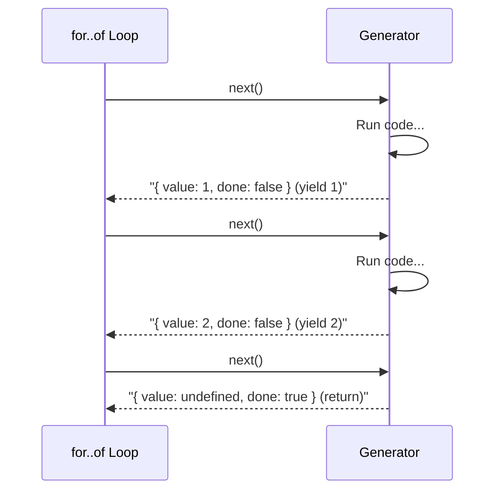

# 第73章：Iterator ② TypeScript標準：`Symbol.iterator` とジェネレータ✨

## ねらい🎯

* 自分のデータ構造を **`for..of` で回せる** ようになる🔁
* `Symbol.iterator` の役割を「一言」で言える🗣️
* **ジェネレータ（`function*` / `yield`）** で DFS（深さ優先）イテレータを書ける🌳✨

---

## まず超ざっくり：Iterator / Iterableってなに？🔁


* **Iterable（反復可能）**：`for..of` で回せるもの
  → 条件：`[Symbol.iterator]()` を持っていて、**Iterator** を返す([MDN Web Docs][1])
* **Iterator（反復子）**：`next()` を持つもの
  → `next()` は `{ value, done }` を返す（done が true になったら終わり）([MDN Web Docs][1])

イメージはこんな感じ👇

* `Iterable`（入口）: 「イテレータちょうだい！」→ `[Symbol.iterator]()`
* `Iterator`（本体）: 「次！」→ `next()` → `{ value, done }`

---

## TypeScriptの型：`Iterable<T>` / `Iterator<T>` / `IterableIterator<T>`🧠


TypeScript にはちゃんと型が用意されてるよ〜✨([TypeScript][2])

* `Iterable<T>`：`[Symbol.iterator](): Iterator<T>` を持つ
* `Iterator<T>`：`next(): IteratorResult<T>` を持つ
* `IterableIterator<T>`：**IterableでもありIteratorでもある**（両方できる）
  → ジェネレータがまさにこれ！って感じ💡([Microsoft for Developers][3])

---

## 最新メモ（2026年2月時点）🗞️✨

* `typescript` の npm の latest は **5.9.3**（少なくとも 2025-09 頃の公開で最新として表示）([npm][4])
* 公式ブログでは **TypeScript 6.0 が “橋渡し（移行）”** 的な位置づけだと説明されてるよ（7.0 への準備）([Microsoft for Developers][5])

> つまり「Iterator と generator の基本」は今のTSでもド真ん中で使える知識だよ👍✨

---

## ジェネレータ入門：`function*` と `yield`✨


ジェネレータは **「途中で止まって、また続きから再開できる関数」** だよ〜🧁

```ts
function* range(from: number, to: number): IterableIterator<number> {
  for (let i = from; i <= to; i++) {
    yield i; // ここで一旦止まって値を返す
  }
}

for (const n of range(3, 5)) {
  console.log(n); // 3, 4, 5
}
```

ポイント💡

* `yield x`：値 x を1個返して一時停止
* `yield* iterable`：**別の iterable を丸ごと委譲**（再帰と相性よすぎ）✨



---

## ハンズオン🛠️：木構造（メニュー）をDFSで `yield` する🌳🔁


## 1) 木の型を「判別Union」で用意する🧩

クラス増やさず、型と配列でいくよ〜💖

```ts
export type MenuNode =
  | {
      type: "item";
      id: string;
      name: string;
      price: number;
    }
  | {
      type: "group";
      name: string;
      children: MenuNode[];
    };
```

## 2) サンプル木（カフェメニュー）☕🍰

```ts
export const menu: MenuNode = {
  type: "group",
  name: "root",
  children: [
    {
      type: "group",
      name: "drinks",
      children: [
        { type: "item", id: "coffee", name: "Coffee", price: 450 },
        { type: "item", id: "latte", name: "Latte", price: 520 },
      ],
    },
    {
      type: "group",
      name: "foods",
      children: [{ type: "item", id: "cake", name: "Cheesecake", price: 600 }],
    },
  ],
};
```

## 3) DFSジェネレータを書く（今回の主役）✨

「今のノードを返す → 子を順にたどる」だけ！


```ts
export function* dfs(node: MenuNode): IterableIterator<MenuNode> {
  yield node;

  if (node.type === "group") {
    for (const child of node.children) {
      yield* dfs(child); // 子の列挙を丸ごと委譲✨
    }
  }
}
```

## 4) `Symbol.iterator` を生やして `for..of` できる形にする🎁


`for..of` は **Iterable** を要求するので、入口（`[Symbol.iterator]`）を作るよ〜([MDN Web Docs][1])

```ts
export function asDfsIterable(root: MenuNode): Iterable<MenuNode> {
  return {
    [Symbol.iterator]() {
      return dfs(root);
    },
  };
}
```

## 5) 使ってみる（`for..of` が気持ちいい）🎉

```ts
import { asDfsIterable, menu } from "./menu";

for (const node of asDfsIterable(menu)) {
  if (node.type === "item") {
    console.log(node.id, node.price);
  }
}
```

---

## “for..of できる”と何が嬉しいの？🎁✨


* 呼び出し側が **走査の都合（DFS/BFS/フィルタ）を知らなくていい**
* `for..of` だけじゃなく、`Array.from()` やスプレッド（`[...iterable]`）にも乗れる
  ※ これらは iterable を使う代表例だよ〜([MDN Web Docs][1])

```ts
const all = [...asDfsIterable(menu)]; // 配列化できる✨
const items = all.filter((n) => n.type === "item");
```

---

## ミニテスト🧪（順番が合ってるかチェック）

DFS は「親→子→孫…」の順。順番こそが仕様になることあるので、テストで守るの大事だよ💪✨

```ts
import { describe, it, expect } from "vitest";
import { asDfsIterable, menu } from "./menu";

describe("dfs order", () => {
  it("visits nodes in depth-first pre-order", () => {
    const ids = [...asDfsIterable(menu)]
      .filter((n) => n.type === "item")
      .map((n) => n.id);

    expect(ids).toEqual(["coffee", "latte", "cake"]);
  });
});
```

---

## つまずきポイント集💥（ここ超あるある！）

## 1) 「`Symbol.iterator` が無い」と怒られる😵

TypeScript は「反復可能」って判断するために `Symbol.iterator` の型情報が必要だよ〜。
`lib` 設定が足りないと、`for..of` したいのに型が揃わないことがある💦([Stack Overflow][6])

対策例（雰囲気）👇

```json
{
  "compilerOptions": {
    "target": "ES2022",
    "lib": ["ES2022", "DOM", "DOM.Iterable"],
    "strict": true
  }
}
```

## 2) 低いターゲット（ES5）で `for..of` / スプレッドが微妙になる🤔

古いターゲットに落とすときは `downlevelIteration` が関係してくるよ〜。
これをONにすると、ES2015 の iteration protocol（`Symbol.iterator`）をより正しく扱う方向になる（※実行時に `Symbol.iterator` 実装がある前提）([TypeScript][7])

---

## ミニ演習📝✨（手を動かすやつ）

## 演習1：最初のN個だけ取る `take` を作ろう🍪

ヒント：`for..of` で回して `break`！

```ts
export function take<T>(iterable: Iterable<T>, n: number): T[] {
  const out: T[] = [];
  if (n <= 0) return out;

  for (const x of iterable) {
    out.push(x);
    if (out.length >= n) break;
  }
  return out;
}
```

## 演習2：木から「このidの商品」を探す `findItemById` 🔎

ヒント：DFSで全部なめればOK！

## 演習3：`yield*` を使わずに DFS を書いてみよう（スタック版）🧠

ヒント：配列をスタックとして使う（`push` / `pop`）

---

## AIプロンプト例🤖💬（コピペOK）

```text
次の型の木構造を TypeScript で DFS 走査したいです。
- クラスを増やしすぎず、判別Union + ジェネレータ中心で
- for..of で回せる Iterable を返す形にして
- 走査順（親→子→孫…）がテストで保証できるようにして

型：
type MenuNode =
  | { type:"item"; id:string; name:string; price:number }
  | { type:"group"; name:string; children:MenuNode[] };

要望：
1) dfs(node) を generator で
2) asDfsIterable(root) を Symbol.iterator で
3) vitest の最小テストも
```

---

## まとめ✅🎀

* `for..of` で回せる条件は **`[Symbol.iterator]()` があること**([MDN Web Docs][1])
* ジェネレータ（`function*`）は **Iteratorを作る最短ルート**✨([TypeScript][2])
* 木構造は **`yield*` + 再帰** がめちゃ相性いい🌳💕

[1]: https://developer.mozilla.org/en-US/docs/Web/JavaScript/Reference/Iteration_protocols?utm_source=chatgpt.com "Iteration protocols - JavaScript - MDN Web Docs - Mozilla"
[2]: https://www.typescriptlang.org/docs/handbook/iterators-and-generators.html?utm_source=chatgpt.com "Documentation - Iterators and Generators"
[3]: https://devblogs.microsoft.com/typescript/announcing-typescript-5-6/?utm_source=chatgpt.com "Announcing TypeScript 5.6"
[4]: https://www.npmjs.com/package/typescript?utm_source=chatgpt.com "typescript"
[5]: https://devblogs.microsoft.com/typescript/progress-on-typescript-7-december-2025/?utm_source=chatgpt.com "Progress on TypeScript 7 - December 2025"
[6]: https://stackoverflow.com/questions/50234481/typescript-2-8-3-type-must-have-a-symbol-iterator-method-that-returns-an-iterato?utm_source=chatgpt.com "TypeScript 2.8.3 Type must have a Symbol.iterator method ..."
[7]: https://www.typescriptlang.org/tsconfig/downlevelIteration.html?utm_source=chatgpt.com "TSConfig Option: downlevelIteration"
