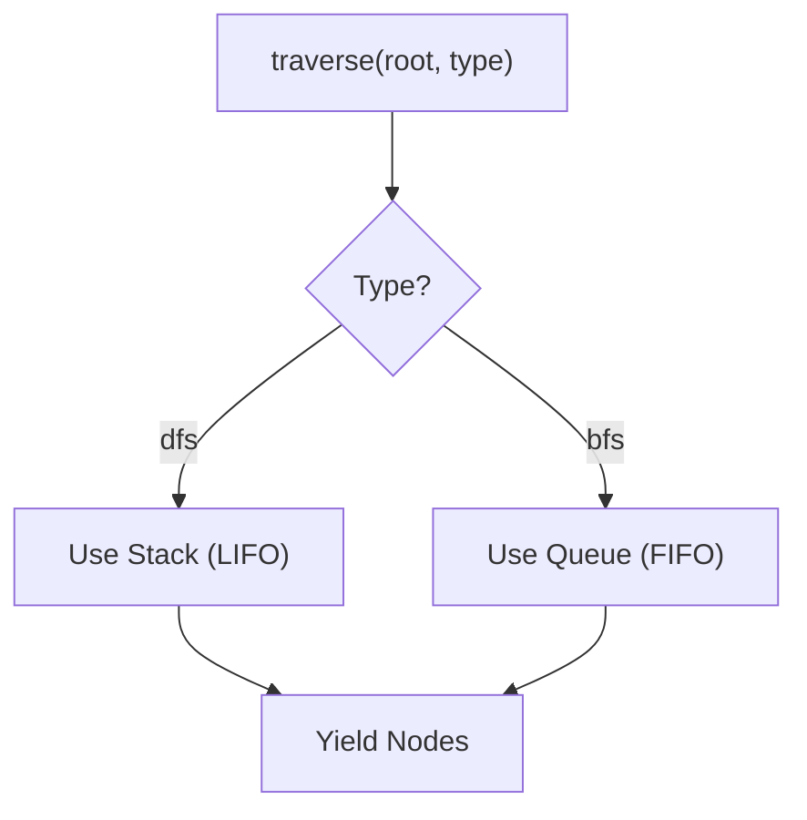

# 第74章：Iterator ③ まとめ：APIが“for..ofできる”だけで嬉しい🎁

* ねらい🎯：**利用側がシンプルになる価値**を体感する
* 学ぶこと📌：**順番（DFS/BFS）を差し替えられるIterable API**の作り方
* ハンズオン🛠️：同じデータで **DFS/BFS** を切り替えて走査する
* つまずき回避💡：**順序もテスト**して「仕様」にする

---

## 1) “for..ofできるAPI”が嬉しい理由😊✨

`for..of` って、使う側から見るとこんな感じ👇

* 「配列っぽく」読める 📚
* `break` で止められる 🛑
* 必要なら `[...]` で配列化できる 🧺
* Map/Setにそのまま流し込めることも多い 🗺️✨

この“気持ちよさ”の正体は、**Iterable（反復可能）**っていう約束です。
JavaScriptは `for..of` のときに **`[Symbol.iterator]()` を探して**、そこから取ってきた Iterator を回します。([MDN Web Docs][1])

---

## 2) Iterable / Iterator の超ざっくり復習🧠🍡

* **Iterable**：`[Symbol.iterator]()` を持っていて、**Iteratorを返せる**もの
* **Iterator**：`next()` を持っていて、`{ value, done }` を返せるもの

そして **ジェネレータ**（`function*`）は便利で、
「Iteratorを作る」＋「Iterableにもなる」を一気に満たせます✨([MDN Web Docs][2])

---

## 3) まずは最小：ジェネレータで “for..ofできる” を作る🎁

```ts
function* range(from: number, to: number) {
  for (let n = from; n <= to; n++) {
    yield n;
  }
}

for (const n of range(1, 5)) {
  console.log(n); // 1,2,3,4,5
}
```

この時点で、もう **APIの顔がキレイ**✨
「配列を返す」よりも、**必要な分だけ順番に出せる**ので、データが大きくても扱いやすいです🧡

---

## 4) 本題：同じ木構造を DFS / BFS で差し替える🌳🔁

ここでは、Compositeで出てきそうな「メニューの木」を題材にします☕🍰
**クラスを増やさず**、判別Unionでいきます🧩

## データ型（判別Union）📦

```ts
export type MenuNode =
  | { type: "group"; name: string; children: MenuNode[] }
  | { type: "item"; name: string; price: number };
```

---

## 5) DFS / BFS を “標準のやり方” で実装する✨

ポイントはこれ👇

* DFS：**スタック（LIFO）** 🥞
* BFS：**キュー（FIFO）** 🧺




## traversal.ts（DFS/BFS/切替API）🧁

```ts
export type MenuNode =
  | { type: "group"; name: string; children: MenuNode[] }
  | { type: "item"; name: string; price: number };

export type TraversalOrder = "dfs" | "bfs";

/**
 * DFS（深さ優先）: stack で実装
 * ※ children を逆順に積むと「左→右」っぽい見た目順になりやすい✨
 */
export function* dfs(root: MenuNode): Generator<MenuNode> {
  const stack: MenuNode[] = [root];

  while (stack.length > 0) {
    const node = stack.pop()!;
    yield node;

    if (node.type === "group") {
      for (let i = node.children.length - 1; i >= 0; i--) {
        stack.push(node.children[i]);
      }
    }
  }
}

/**
 * BFS（幅優先）: queue を shift せず index で回す（速い＆安定）🚀
 */
export function* bfs(root: MenuNode): Generator<MenuNode> {
  const queue: MenuNode[] = [root];

  for (let i = 0; i < queue.length; i++) {
    const node = queue[i];
    yield node;

    if (node.type === "group") {
      queue.push(...node.children);
    }
  }
}

/**
 * “順番の差し替え” ができる API 🎛️
 * 呼び出し側は traverse(menu, "dfs") のみでOK✨
 */
export function traverse(root: MenuNode, order: TraversalOrder): Iterable<MenuNode> {
  return order === "dfs" ? dfs(root) : bfs(root);
}
```

`dfs(...)` / `bfs(...)` はジェネレータなので、**そのまま for..of できる**のが最高です✨([MDN Web Docs][2])

---

## 6) 使う側がどれだけラクになるか体験しよ〜🎉

## サンプルデータ☕

```ts
import { traverse, type MenuNode } from "./traversal";

const menu: MenuNode = {
  type: "group",
  name: "☕ Cafe Menu",
  children: [
    { type: "item", name: "Americano", price: 420 },
    {
      type: "group",
      name: "Latte",
      children: [
        { type: "item", name: "Cafe Latte", price: 520 },
        { type: "item", name: "Soy Latte", price: 570 },
      ],
    },
    { type: "item", name: "Tea", price: 450 },
  ],
};

// BFSで「上から順に」見たい👀
for (const node of traverse(menu, "bfs")) {
  console.log(node.name);
}
```

## 配列化も一瞬🧺

```ts
import { dfs, type MenuNode } from "./traversal";

const names = (it: Iterable<MenuNode>) => [...it].map((n) => n.name);

console.log(names(dfs(menu)));
```

**“APIがIterableを返す”** だけで、使い道が一気に増えます🎁✨

---

## 7) 順番は “仕様” にしよう：テストで守る🧪💎

「DFSとBFS、順番が合ってるよね？」をテストで固定します✅
テストは **Vitest** が今どきの定番で、設定も軽いです🧁([vitest.dev][3])

## traversal.test.ts ✅

```ts
import { describe, it, expect } from "vitest";
import { dfs, bfs, type MenuNode } from "./traversal";

const menu: MenuNode = {
  type: "group",
  name: "☕ Cafe Menu",
  children: [
    { type: "item", name: "Americano", price: 420 },
    {
      type: "group",
      name: "Latte",
      children: [
        { type: "item", name: "Cafe Latte", price: 520 },
        { type: "item", name: "Soy Latte", price: 570 },
      ],
    },
    { type: "item", name: "Tea", price: 450 },
  ],
};

const names = (it: Iterable<MenuNode>) => [...it].map((n) => n.name);

describe("traversal order", () => {
  it("dfs visits depth-first", () => {
    expect(names(dfs(menu))).toEqual([
      "☕ Cafe Menu",
      "Americano",
      "Latte",
      "Cafe Latte",
      "Soy Latte",
      "Tea",
    ]);
  });

  it("bfs visits breadth-first", () => {
    expect(names(bfs(menu))).toEqual([
      "☕ Cafe Menu",
      "Americano",
      "Latte",
      "Tea",
      "Cafe Latte",
      "Soy Latte",
    ]);
  });
});
```

これで、将来コードを触っても **順番が壊れたらすぐ気づける**🎉

---

## 8) つまずきポイント集💡（ここハマりがち！）

* **BFSで `shift()` を使う**
  → 小さいうちはOKだけど、要素が増えると遅くなりがち😵
  → だから今回みたいに **indexで回す**のが安定✅
* **DFSで順番が思ったのと違う**
  → stackはLIFOなので、`children` をそのまま push すると順序が逆になりやすい😮
  → **逆順に積む**と自然な表示順になりやすい✨
* **走査中に木をいじる（childrenを追加/削除）**
  → 仕様がぶれやすいので、まずは「走査中は構造固定」がおすすめ🔒

---

## 9) AIプロンプト例🤖💬（コピペOK）

```text
次のTypeScriptコードのIterator（dfs/bfs）について質問です。
- 走査順（期待される順序）を文章で仕様化して
- 仕様を守れているかチェックするVitestテストを提案して
- bfsでshiftを使わない実装に直す案も出して

コード:
<ここに traversal.ts を貼る>
```

---

## 10) まとめ🎁✨

* **Iterableを返す**だけで、利用側が `for..of` でスッキリ読める
* **ジェネレータ（function*)** を使うと、Iterable/Iterator を自然に満たせる([MDN Web Docs][2])
* DFS/BFSみたいな **“順番の差し替え”** は、実装よりも **APIの形**が価値になる😊
* 順番は仕様なので、**テストで固定**すると安心🧪

[1]: https://developer.mozilla.org/en-US/docs/Web/JavaScript/Reference/Global_Objects/Symbol/iterator?utm_source=chatgpt.com "Symbol.iterator - JavaScript - MDN Web Docs"
[2]: https://developer.mozilla.org/en/docs/Web/JavaScript/Guide/Iterators_and_Generators?utm_source=chatgpt.com "Iterators and generators - JavaScript - MDN Web Docs"
[3]: https://vitest.dev/?utm_source=chatgpt.com "Vitest | Next Generation testing framework"
