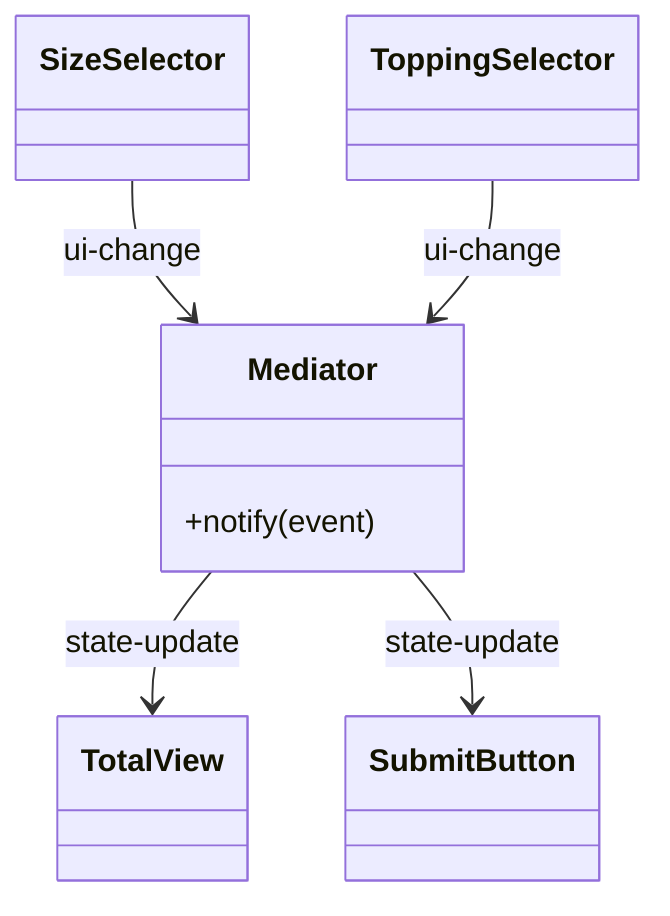

# 第75章：Mediator ① 部品同士が直接しゃべりすぎ問題🕊️

## ねらい🎯

* UIの部品（ボタン・入力・表示など）が **相互参照だらけ** になってつらい…を説明できる😵‍💫
* **Mediator（仲介役）** に「やり取りのルール」を集めて、密結合をほどける✨
* TypeScriptで「イベント中心」にサクッと書けるようになる📣

---

## 1. まず何がつらいの？😇（部品が“直接”しゃべりすぎ）

UIって、部品が増えるほど「Aが変わったらB更新」「Bが変わったらC更新」みたいな連鎖が増えるよね💦
ここで部品同士が直接つながり始めると、すぐこうなる👇

* どの変更がどこに影響するか追えない🌀
* 追加ルールのたびにあちこち修正が必要🔧
* 循環参照っぽくなって破綻しやすい😵
* テストが書きにくい（部品のセットが巨大）🧪💥

---

## 2. ダメになりがちな例（相互参照スパゲッティ🍝）

「サイズ選択」「トッピング」「合計表示」「注文ボタン」が直接呼び合うイメージ👇

```ts
// それぞれが互いの存在を知ってるのが地獄の始まり😇
sizeSelector.onChange = (size) => {
  toppingSelector.updateAvailable(size);
  totalView.update(calcTotal(size, toppingSelector.selected));
};

toppingSelector.onChange = () => {
  totalView.update(calcTotal(sizeSelector.value, toppingSelector.selected));
  submitButton.setEnabled(toppingSelector.selected.length > 0);
};

submitButton.onClick = () => {
  sizeSelector.disable();
  toppingSelector.disable();
  totalView.showDone();
};
```

「新ルール追加（例：Lサイズの時だけトッピング割引）」みたいなのが来ると、どこへ足すのが正解か迷子になりがち🫠

---

## 3. Mediatorって何？🕊️（“会話”を仲介役に集約）

Mediatorは **部品（Colleague）同士が直接やり取りしない** ためのパターン✨
代わりに「仲介役（Mediator）」が、こうする👇

* 部品は **Mediatorにだけ** 伝える📨
* Mediatorが **ルール** に従って、必要な部品へ指示する🧠
* ルールが1箇所に集まるから、変更が追いやすい👀


図にするとこう💡

* 悪い：部品同士が線だらけ🕸️
  `A ↔ B ↔ C ↔ D …`

* 良い：Mediatorに集約🌟
  `A → Mediator ← B`
  `C ← Mediator → D`



---

## 4. TypeScriptで“イベント中心Mediator”が超ラク📣✨

ここでは **EventTarget** を「仲介役の中心（イベントハブ）」として使うよ✅
EventTargetはイベントを受け取り、`addEventListener` で購読できる標準の仕組みだよ。([MDNウェブドキュメント][1])
そして `dispatchEvent()` でイベントを送ると、リスナーは **同期的に** 呼ばれる（その場で反応する）よ。([MDNウェブドキュメント][2])

イベントにデータ（payload）を載せたいときは **CustomEvent** が便利！`detail` に好きな値を入れられるよ。([MDNウェブドキュメント][3])

> 補足🍀：Node.jsでもEventTargetが用意されていて、標準イベント的に扱えるよ。([nodejs.org][4])

---

## 5. ハンズオン🛠️：カフェ注文フォームをMediatorで整理する☕🧁

## 題材👩‍🍳

* サイズ：S / M / L
* トッピング：whip / choco / caramel
* ルール例：

  * **Sサイズでは caramel を選べない**🚫
  * 合計は「サイズ基本料金 + トッピング料金」💰
  * 注文したらボタン無効化🔒

---

## 5-1. まずはイベント名とpayloadを型で固定する🧷

「イベント名の乱立」を防ぐ小ワザだよ（これだけで事故減る✨）

```ts
type Size = "S" | "M" | "L";
type Topping = "whip" | "choco" | "caramel";

type EventMap = {
  // UI → Mediator（部品からの通知📨）
  "ui:size-changed": { size: Size };
  "ui:topping-toggled": { topping: Topping; checked: boolean };
  "ui:submit-clicked": {};

  // Mediator → UI（結果の反映📣）
  "state:available-toppings": { list: readonly Topping[] };
  "state:total-changed": { total: number };
  "state:submit-enabled": { enabled: boolean };
  "state:error": { message: string };
};

type EventName = keyof EventMap;

// 型付きで on / emit できる小ヘルパー🧁（クラス増やさない！）
const on = <K extends EventName>(
  target: EventTarget,
  type: K,
  handler: (detail: EventMap[K]) => void
) => {
  target.addEventListener(type as string, (ev) => {
    handler((ev as CustomEvent<EventMap[K]>).detail);
  });
};

const emit = <K extends EventName>(
  target: EventTarget,
  type: K,
  detail: EventMap[K]
) => {
  target.dispatchEvent(new CustomEvent(type as string, { detail }));
};
```

※ TypeScriptのDOM型定義には `CustomEvent<T>`（detailがTになる）が入ってるので、こういう型付けができるよ🧠✨ ([Chromium Go Source][5])

---

## 5-2. Mediator本体（ルールをここに集約🕊️）

ここが今日の主役🌟
**部品は互いを知らない**、ルールはここに集める！

```ts
type UiPorts = {
  setAvailableToppings: (list: readonly Topping[]) => void;
  setTotal: (total: number) => void;
  setSubmitEnabled: (enabled: boolean) => void;
  showError?: (message: string) => void;
};

export const createOrderFormMediator = (ports: UiPorts) => {
  const bus = new EventTarget(); // これが“調停の中心”📣

  const basePrice: Record<Size, number> = { S: 400, M: 500, L: 600 };
  const toppingPrice: Record<Topping, number> = { whip: 50, choco: 70, caramel: 80 };

  const availableBySize: Record<Size, readonly Topping[]> = {
    S: ["whip", "choco"],              // caramel は不可🚫
    M: ["whip", "choco", "caramel"],
    L: ["whip", "choco", "caramel"],
  };

  let size: Size = "M";
  let toppings = new Set<Topping>();
  let submitEnabled = true;

  const recalc = () => {
    let total = basePrice[size];
    for (const t of toppings) total += toppingPrice[t];

    ports.setTotal(total);
    emit(bus, "state:total-changed", { total });
  };

  const syncAvailable = () => {
    const list = availableBySize[size];

    // サイズ変更で“選べなくなったトッピング”を外す🧹
    const allowed = new Set(list);
    let changed = false;

    for (const t of [...toppings]) {
      if (!allowed.has(t)) {
        toppings.delete(t);
        changed = true;
      }
    }

    ports.setAvailableToppings(list);
    emit(bus, "state:available-toppings", { list });

    if (changed) recalc();
  };

  // --- UIイベントを受けて、ルールで調停する🕊️ ---

  on(bus, "ui:size-changed", ({ size: next }) => {
    size = next;
    syncAvailable();
    recalc();
  });

  on(bus, "ui:topping-toggled", ({ topping, checked }) => {
    const allowed = availableBySize[size].includes(topping);
    if (!allowed) {
      ports.showError?.(`このサイズでは ${topping} は選べません🥲`);
      emit(bus, "state:error", { message: `invalid topping: ${topping}` });
      return;
    }

    if (checked) toppings.add(topping);
    else toppings.delete(topping);

    recalc();
  });

  on(bus, "ui:submit-clicked", () => {
    submitEnabled = false;
    ports.setSubmitEnabled(false);
    emit(bus, "state:submit-enabled", { enabled: false });
  });

  // 初期同期✨
  syncAvailable();
  recalc();
  ports.setSubmitEnabled(submitEnabled);

  // UIが呼ぶ“入口”だけ公開（部品はここだけ使う！）🚪
  return {
    changeSize: (s: Size) => emit(bus, "ui:size-changed", { size: s }),
    toggleTopping: (t: Topping, checked: boolean) =>
      emit(bus, "ui:topping-toggled", { topping: t, checked }),
    submit: () => emit(bus, "ui:submit-clicked", {}),
  };
};
```

---

## 5-3. UI部品は「Mediatorを呼ぶだけ」になる✨

UI側は “他部品” を触らず、Mediatorに通知するだけ📨

```ts
import { createOrderFormMediator } from "./mediator";

const asSize = (v: string): "S" | "M" | "L" => (v === "S" || v === "M" || v === "L" ? v : "M");
const isTopping = (v: string): v is "whip" | "choco" | "caramel" =>
  v === "whip" || v === "choco" || v === "caramel";

// ここはDOMでもReactでも同じ発想でOK👌（portsに繋ぐだけ）
const mediator = createOrderFormMediator({
  setAvailableToppings: (list) => console.log("available:", list),
  setTotal: (total) => console.log("total:", total),
  setSubmitEnabled: (enabled) => console.log("submit enabled:", enabled),
  showError: (message) => console.log("error:", message),
});

// “部品”は mediator しか知らない🕊️
mediator.changeSize(asSize("S"));
mediator.toggleTopping("caramel", true); // → エラーになる🥲
mediator.toggleTopping("whip", true);    // → 合計更新✨
mediator.submit();                       // → ボタン無効化🔒
```

---

## 6. ここが嬉しい🎁（Mediatorの勝ちポイント）

* ルールが **1箇所に集まる** → 変更が追いやすい👀✨
* UI部品が **他部品を知らない** → 再利用しやすい🔁
* テストが **ports差し替え** で超ラク🧪🎉

---

## 7. ミニテスト案🧪（“portsをモック”で確認できる）

「画面がなくても」ロジックだけ検証できるのが気持ちいいやつ💕

```ts
import { describe, it, expect, vi } from "vitest";
import { createOrderFormMediator } from "./mediator";

describe("Mediator", () => {
  it("Sサイズにすると caramel が選べなくなる🚫", () => {
    const ports = {
      setAvailableToppings: vi.fn(),
      setTotal: vi.fn(),
      setSubmitEnabled: vi.fn(),
      showError: vi.fn(),
    };

    const m = createOrderFormMediator(ports);
    m.changeSize("S");

    expect(ports.setAvailableToppings).toHaveBeenLastCalledWith(["whip", "choco"]);
  });

  it("選べないトッピングを選ぶとエラーになる🥲", () => {
    const ports = {
      setAvailableToppings: vi.fn(),
      setTotal: vi.fn(),
      setSubmitEnabled: vi.fn(),
      showError: vi.fn(),
    };

    const m = createOrderFormMediator(ports);
    m.changeSize("S");
    m.toggleTopping("caramel", true);

    expect(ports.showError).toHaveBeenCalled();
  });
});
```

---

## 8. つまずき回避💡（Mediatorあるある）

* **Mediatorが巨大化**（神クラス化👑）しがち
  → ルールを「注文計算」「入力制御」みたいに小さく分けて、関数で整理しよ✂️✨
* **イベントが無限ループ**しがち♾️
  → 命名を `ui:*` と `state:*` に分けると事故りにくい👍
* `dispatchEvent()` は **同期** で呼ばれる
  → 「この通知で何が起きるか」を追いやすい反面、連鎖が長いと読みにくい😵‍💫（ログ入れると神✨）([MDNウェブドキュメント][2])

---

## 9. AIプロンプト例🤖💬（コピペOK）

```text
次のUI部品の相互依存がつらいです。Mediator（イベント中心）で整理したい。
- 部品: サイズ選択 / トッピング / 合計表示 / 注文ボタン
- ルール: Sではcaramel不可、合計計算、注文後は操作不可
お願い:
1) “悪い依存”がどこで起きるか図にして
2) EventTarget + CustomEvent を使う最小のMediator案
3) イベント名(ui:*/state:*)とpayload型の提案
4) つまずきポイントと回避策
```

---

## 10. 理解チェック✅🎓

* 「部品が直接しゃべりすぎ」の何がつらい？（2つ言える？）😵‍💫
* どこに「ルール」を集めるのがMediator？🕊️
* `CustomEvent.detail` に何を入れてる？📦 ([MDNウェブドキュメント][3])

---

次の章では、この“イベント中心Mediator”と「Observerとの違い」をスパッと整理して、使い分けができるようにするよ📣🧠

[1]: https://developer.mozilla.org/ja/docs/Web/API/EventTarget?utm_source=chatgpt.com "EventTarget - Web API | MDN"
[2]: https://developer.mozilla.org/en-US/docs/Web/API/EventTarget/dispatchEvent?utm_source=chatgpt.com "EventTarget: dispatchEvent() method - Web APIs | MDN"
[3]: https://developer.mozilla.org/ja/docs/Web/API/CustomEvent/CustomEvent?utm_source=chatgpt.com "CustomEvent() コンストラクター - Web API - MDN Web Docs"
[4]: https://nodejs.org/api/events.html?utm_source=chatgpt.com "Events | Node.js v25.5.0 Documentation"
[5]: https://chromium.googlesource.com/devtools/devtools-frontend/%2B/f18c0ac2f735bd0b1385398c7e52b8ba01a5d796/node_modules/typescript/lib/lib.dom.d.ts?utm_source=chatgpt.com "node_modules/typescript/lib/lib.dom.d.ts"
