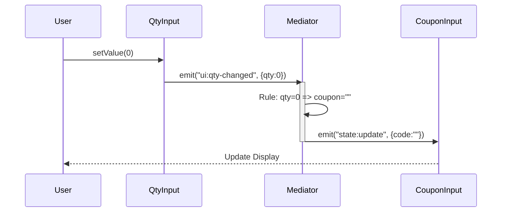

# 第76章：Mediator ② TypeScript定番：イベント中心（Observerと親戚）📣

## ねらい🎯

* 「ObserverとMediator、何が違うの？」を一言で言えるようになる✨
* UIみたいに“部品同士が絡み合う”場面で、絡まりをほどく設計ができるようになる🧶➡️🧼
* TypeScriptで**イベント中心**にMediatorを組めるようになる（余計な独自クラス増やさない）💖

---

## 学ぶこと📌


* **Observer**：通知（発行→購読）の仕組み。発行側は「誰**UI部品が“誰に影響するか”を知らなくてよくなる**＝変更がラク🎉



* **Mediator**：通知を受けて、**“調停ルール”を実行する司令塔**（Aが変わったらBをこう更新…みたいなルールを持つ）🕹️
* TypeScriptでは **EventTarget / CustomEvent** を使って“イベント中心”にまとめるのが自然🌸
  ※ `dispatchEvent()` はリスナーを**同期的**に呼び出す仕様なので、テストもしやすいよ✅ ([MDNウェブドキュメント][1])

---

## 1) ObserverとMediatorの違い（超ざっくり）🍡✨


## Observer（通知の配達係）📮

* 「注文が確定したよ！」みたいなイベントを投げる
* 受け取った側（購読側）が、それぞれ勝手に動く
* 発行側は「誰が何をするか」を知らない

## Mediator（交通整理のお姉さん）🚦👩‍✈️

* Aが変わったら、Bをこうする
* Bが変わったら、Cをこうする
* つまり、**“相互作用のルール”をまとめて持つ**✨


**よくある現場あるある**👇😵

* コンポーネントAがBを直接触る
* BがCも触る
* いつの間にか相互参照だらけで変更が怖い…💥

Mediatorはこれを
✅「部品 →（イベント）→ Mediator →（更新）→ 他部品」
にして、絡まりを減らすよ🧼✨

---

## 2) 今回の題材：注文フォームの“UI地獄”を救う☕🧁


フォームにありがちな依存関係👇💫

* サイズ変更（S/M/L）で単価が変わる📏
* 数量が0なら、送信ボタンは無効にする🚫
* クーポンが入力されたら、条件を満たす時だけ割引する🎟️
* 合計は常に再計算して表示したい🧾

これ、各部品が直接しゃべり始めると一瞬でカオス😇
→ **Mediatorに「ルール」を集約**しよう🕊️✨

---

## 3) TypeScriptの定番アプローチ：EventTargetで“イベント駆動Mediator”📣🧠


## ここがポイント💡

* 部品（サイズ/数量/クーポン）は **イベントを出すだけ**（＝「変わったよ！」）
* Mediatorは **イベントを聞いて、調停ルールで更新する**（＝「じゃあこうしよ！」）

`EventTarget` はブラウザのWeb標準だし、Node.jsでも `EventTarget` / `Event` が提供されてるよ📦
（Node.jsでは `EventTarget` が v15.0.0 からグローバル、v15.4.0 でexperimental解除） ([nodejs.org][2])
`CustomEvent` も Node.js で安定化してきてる（v20.13.0 / v22.1.0 でstable、v23.0.0でexperimental扱い終了） ([nodejs.org][2])

> ちなみにNode.jsの `EventTarget` はDOMの `EventTarget` と違って、階層伝播（バブリング等）の概念がないのが大きな違いだよ📝 ([nodejs.org][2])
> （今回みたいな“部品間の調停”にはむしろ分かりやすくてOK👌）

---

## 4) 最小実装：Mediatorで“調停ルール”を1か所に集約🕊️✨

下のコードは「UI部品っぽいもの」を**クラス増やさず**、関数＋EventTargetで作ってるよ🎀
（本物のDOMに置き換えても考え方は同じ！）

```ts
// 例: 注文フォームの“部品”同士が直接しゃべらないようにするMediator 🕊️

type Size = "S" | "M" | "L";

type State = Readonly<{
  size: Size;
  qty: number;
  couponCode: string; // 入力されたクーポン
  total: number;      // 計算結果
  canSubmit: boolean; // 送信可能？
}>;

const PRICE: Record<Size, number> = { S: 380, M: 450, L: 520 };

function calcTotal(size: Size, qty: number, couponCode: string): number {
  const base = PRICE[size] * qty;
  const discount = couponCode.trim() === "" ? 0 : Math.min(100, base); // 例: 最大100円引き
  return Math.max(0, base - discount);
}

// ✅ “イベント名”を固定して、タイポ事故を減らす
const EVT = {
  sizeChanged: "ui:size-changed",
  qtyChanged: "ui:qty-changed",
  couponChanged: "ui:coupon-changed",
} as const;

type UiEventName = typeof EVT[keyof typeof EVT];

function emit<T>(target: EventTarget, type: UiEventName, detail: T) {
  target.dispatchEvent(new CustomEvent(type, { detail }));
}

function on<T>(target: EventTarget, type: UiEventName, handler: (detail: T) => void) {
  target.addEventListener(type, (e) => handler((e as CustomEvent).detail as T));
}

/** 部品（っぽいもの）：イベントを出すだけ 🧩 */
function createSizeSelect() {
  const bus = new EventTarget();
  let value: Size = "M";
  return {
    bus,
    getValue: () => value,
    setValue: (next: Size) => {
      value = next;
      emit(bus, EVT.sizeChanged, { size: next });
    },
  };
}

function createQtyInput() {
  const bus = new EventTarget();
  let value = 1;
  return {
    bus,
    getValue: () => value,
    setValue: (next: number) => {
      value = Math.max(0, Math.floor(next));
      emit(bus, EVT.qtyChanged, { qty: value });
    },
  };
}

function createCouponInput() {
  const bus = new EventTarget();
  let value = "";
  return {
    bus,
    getValue: () => value,
    setValue: (next: string) => {
      value = next;
      emit(bus, EVT.couponChanged, { code: value });
    },
  };
}

/** “表示”は関数で十分（ここではconsoleに寄せる）🖥️ */
function render(state: State) {
  console.log(
    `🧾 size=${state.size} qty=${state.qty} coupon="${state.couponCode}" total=${state.total} canSubmit=${state.canSubmit}`
  );
}

/** ✅ Mediator本体：調停ルールをここに集約 🕊️ */
function wireOrderFormMediator(args: {
  size: ReturnType<typeof createSizeSelect>;
  qty: ReturnType<typeof createQtyInput>;
  coupon: ReturnType<typeof createCouponInput>;
  onRender: (state: State) => void;
}) {
  let state: State = {
    size: args.size.getValue(),
    qty: args.qty.getValue(),
    couponCode: args.coupon.getValue(),
    total: 0,
    canSubmit: false,
  };

  // 初期計算
  state = recompute(state);
  args.onRender(state);

  // ---- 調停ルール（例） ----
  // ルール① qty=0なら送信不可＆クーポンは空にする
  // ルール② size/qty/couponが変わったら合計再計算
  // ルール③ canSubmit は qty>0 で true

  const unsubscribers: Array<() => void> = [];

  const subscribe = <T>(bus: EventTarget, type: UiEventName, fn: (d: T) => void) => {
    const handler = (e: Event) => fn((e as CustomEvent).detail as T);
    bus.addEventListener(type, handler);
    unsubscribers.push(() => bus.removeEventListener(type, handler));
  };

  subscribe<{ size: Size }>(args.size.bus, EVT.sizeChanged, ({ size }) => {
    state = recompute({ ...state, size });
    args.onRender(state);
  });

  subscribe<{ qty: number }>(args.qty.bus, EVT.qtyChanged, ({ qty }) => {
    // ルール①
    const couponCode = qty === 0 ? "" : state.couponCode;
    state = recompute({ ...state, qty, couponCode });
    args.onRender(state);
  });

  subscribe<{ code: string }>(args.coupon.bus, EVT.couponChanged, ({ code }) => {
    // qty=0 のときはクーポン意味ないので無視（または消す）
    const couponCode = state.qty === 0 ? "" : code;
    state = recompute({ ...state, couponCode });
    args.onRender(state);
  });

  return {
    getState: () => state,
    dispose: () => unsubscribers.forEach((u) => u()),
  };
}

function recompute(s: Omit<State, "total" | "canSubmit">): State {
  const canSubmit = s.qty > 0;
  const total = calcTotal(s.size, s.qty, s.couponCode);
  return { ...s, canSubmit, total };
}

// ---- 使ってみる（“部品”はMediator経由で連携）🎬 ----
const size = createSizeSelect();
const qty = createQtyInput();
const coupon = createCouponInput();

const mediator = wireOrderFormMediator({ size, qty, coupon, onRender: render });

size.setValue("L");        // サイズ変更📏
coupon.setValue("SAVE");   // クーポン🎟️
qty.setValue(0);           // qty=0で送信不可＆クーポン消える🚫
qty.setValue(2);           // 復活✨
coupon.setValue("SAVE");   // 再入力🎟️

console.log("✅ final:", mediator.getState());
```

---

## 5) ここが“Mediatorっぽい”ポイント🕊️💖


## ✅ 部品は「イベントを出すだけ」🎈

* `size.setValue(...)` は `ui:size-changed` を投げるだけ
* `qty.setValue(...)` は `ui:qty-changed` を投げるだけ

## ✅ ルールはMediatorに閉じる📦

* 「qty=0ならクーポン消す」みたいな**調停ルール**はMediatorが持つ
* 部品同士が直接参照しないから、変更が怖くなくなる😌✨

---

## 6) テストが楽になる理由🧪🎉


`dispatchEvent()` はリスナーを**同期的**に呼ぶから、
「setter呼ぶ → すぐstate検査」みたいにテストが書きやすいよ✅ ([MDNウェブドキュメント][1])

例：テストで確認したいこと（アイデア）💡

* qty=0 にしたら `canSubmit=false` になる？🚫
* qty=0 にしたら `couponCode=""` にされる？🧼
* sizeを変えたら total が変わる？📈
* coupon入力で割引が反映される？🎟️

---

## 7) つまずき回避💡（あるある）😵‍💫➡️😌

* **Mediatorが神クラス化**しそう…👻
  → ルールが増えたら「画面単位」「機能単位」でMediatorを分割しよ✂️✨
  （例：`PricingMediator` / `ValidationMediator` みたいに）

* **イベント名が散らかる**🌀
  → `EVT` みたいに `as const` で固定して、命名規約を作る📛✨

* **どこで何が起きたか追えない**🔍
  → Mediatorにログポイントを置く（章77でさらにやるよ😉）

* **Nodeとブラウザで差**が気になる🧠
  → Nodeの `EventTarget` はDOMと違い、伝播の概念がない（今回の用途ならOK！） ([nodejs.org][2])
  → `CustomEvent` も Node.js 側で安定化してきてるよ ([nodejs.org][2])

---

## 8) AIプロンプト例🤖💬（コピペOK）

```text
あなたはTypeScriptの先生です。
以下の“UI部品間ルール”を、ObserverではなくMediatorで整理したいです。

要件:
- Aが変わったらBをこうする、の調停ルールが複数ある
- TypeScriptでEventTarget/CustomEvent中心に（独自クラス増やしすぎない）
- イベント名、payload設計、Mediatorの責務境界もレビューしてほしい
- テスト観点（境界ケース）も出して

題材:
- サイズ/数量/クーポン/合計/送信可否
- 例: qty=0なら送信不可＆クーポン消去
```

---

## まとめ🌸🎀

* **Observer**は「通知の仕組み」📣
* **Mediator**は「通知を受けて“調停ルール”を実行する司令塔」🕊️
* TypeScriptでは **EventTarget +（必要なら）CustomEvent** を中心にすると、イベント駆動でスッキリ整理できるよ✨ ([nodejs.org][2])

[1]: https://developer.mozilla.org/ja/docs/Web/API/EventTarget/dispatchEvent "EventTarget: dispatchEvent() メソッド - Web API | MDN"
[2]: https://nodejs.org/api/events.html "Events | Node.js v25.6.0 Documentation"
