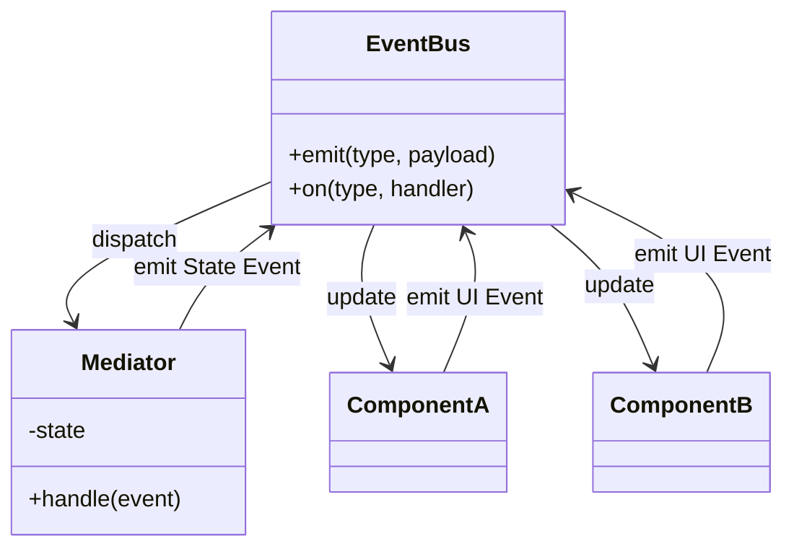

# 第77章：Mediator ③ まとめ：画面ロジックが整理される✨

## 今日のゴール🎯

* **Mediatorを入れるとUIの変更が“局所化”する**理由を説明できる🙂
* **「イベントで通知」＋「調停ルールで整える」**の形にできる📣🕊️
* **ログで“何が起きたか追える”**ようにできる🔍✨

---

## 1) まとめ：MediatorがUIに効くポイント💡


UIって、だいたいこうなりがち👇

* Aの入力が変わる
  → Bの表示が変わる
  → Cの入力が無効になる
  → Dの合計が再計算される
  → Eのボタンが押せたり押せなかったり…😵‍💫

これを**各コンポーネント同士が直接やり始める**と、すぐ地獄になるよね…🔥
Mediatorを挟むとこうなる👇

* 各コンポーネントは **「イベントを出す」だけ**📣
* ルールは **Mediatorがまとめて判断**🧠
* 状態更新・再計算・有効/無効の制御が **1か所に集まる**🏠✨

> “通知（Observer）”は「知らせる」まで。
> “調停（Mediator）”は「知らせる」＋「ルールで整える」までやる、ってイメージ！

---

## 2) ObserverとMediatorの違い（超短く）📣🕊️


* **Observer**：発行→購読へ「知らせる」
* **Mediator**：発行→仲介者へ「知らせる」→仲介者が「誰に何をさせるか決める」

UIは「Aが変わったらBこうしてCこうして…」が多いから、**Mediatorが相性良い**んだよね✨

---

## 3) “絡まりUI”を図にするとこう😵

**Mediatorなし（コンポーネント同士が直結）**

* DrinkSelect → SizeSelect
* DrinkSelect → TotalView
* CouponInput → TotalView
* SizeSelect → SubmitButton
* TotalView → SubmitButton
  …みたいに矢印が増殖して、変更が怖くなる🫠

**Mediatorあり（矢印がスッキリ）**

* DrinkSelect → Mediator
* SizeSelect → Mediator
* CouponInput → Mediator
* Mediator → TotalView / SubmitButton / SizeSelect …
  「ルールの矢印」が**Mediatorに集約**される✨




---

## 4) ハンズオン🛠️：EventTarget中心の“軽いMediator”

TypeScriptは今だと **5.9 のリリースノートが 2026-02-03 更新**になっていて、教材の前提としても安心感あるよ🙆‍♀️✨ ([TypeScript][1])
で、イベント周りは **Web標準の `EventTarget` / `CustomEvent`** が使えるのがめちゃ便利！
`EventTarget` はブラウザ標準だし、Node.js側も互換実装が用意されてるよ。([MDNウェブドキュメント][2])
さらに `CustomEvent` も Node.js では安定化されてきていて、テストでも扱いやすくなってる（バージョン履歴つきで載ってる）よ。([nodejs.org][3])

---

### 4-1) まずは「イベント型」を決める📦


イベント名とpayload（detail）を**先に型で固定**すると、UIの事故が減るよ✨

```ts
// UI -> Mediator に投げるイベント（UI側は「起きた事実」を投げるだけ）
type UiEvents = {
  "ui:drinkChanged": { drinkId: string };
  "ui:sizeChanged": { size: "S" | "M" | "L" };
  "ui:couponChanged": { code: string };
};

// Mediator -> UI に返すイベント（UI側は「表示更新」に専念できる）
type MediatorEvents = {
  "m:orderUpdated": { total: number; valid: boolean };
  "m:sizeOptionsUpdated": { enabled: Array<"S" | "M" | "L"> };
  "m:submitEnabled": { enabled: boolean };
};

type AppEvents = UiEvents & MediatorEvents;
```

---

### 4-2) `EventTarget` を型安全に使う“小さなヘルパー”🧩

独自クラスは増やさず、**関数で薄く包む**だけ🙆‍♀️

```ts
function on<K extends keyof AppEvents>(
  bus: EventTarget,
  type: K,
  handler: (detail: AppEvents[K]) => void
) {
  bus.addEventListener(String(type), (e) => {
    const ce = e as CustomEvent<AppEvents[K]>;
    handler(ce.detail);
  });
}

function emit<K extends keyof AppEvents>(
  bus: EventTarget,
  type: K,
  detail: AppEvents[K]
) {
  bus.dispatchEvent(new CustomEvent(String(type), { detail }));
}
```

---

### 4-3) “調停役”＝Mediator本体を作る🕊️🧠


ポイントはこれ👇

* UIは **UIイベントを投げるだけ**
* Mediatorが **状態を持つ**（最小限）
* ルールがここに集まる（=整理される✨）

```ts
type OrderState = {
  drinkId: string;
  size: "S" | "M" | "L";
  couponCode: string;
};

type Pricing = (s: OrderState) => number;
type Validate = (s: OrderState) => { valid: boolean; sizeEnabled: Array<"S" | "M" | "L"> };

export function createOrderMediator(params: {
  bus: EventTarget;
  pricing: Pricing;
  validate: Validate;
  log?: (msg: string, data?: unknown) => void;
}) {
  const { bus, pricing, validate } = params;
  const log = params.log ?? (() => {});

  // 最小の状態（UIが直接いじらないのがコツ✨）
  const state: OrderState = {
    drinkId: "coffee",
    size: "M",
    couponCode: "",
  };

  const publish = () => {
    const v = validate(state);
    const total = pricing(state);

    emit(bus, "m:sizeOptionsUpdated", { enabled: v.sizeEnabled });
    emit(bus, "m:submitEnabled", { enabled: v.valid });
    emit(bus, "m:orderUpdated", { total, valid: v.valid });

    log("publish", { state: { ...state }, total, valid: v.valid, sizeEnabled: v.sizeEnabled });
  };

  // UIイベントを受けて、ルールで調停する🕊️
  on(bus, "ui:drinkChanged", ({ drinkId }) => {
    log("ui:drinkChanged", { drinkId });
    state.drinkId = drinkId;

    // 例：ドリンク変更でサイズを既定に戻す、みたいなルールもここに置ける✨
    state.size = "M";
    publish();
  });

  on(bus, "ui:sizeChanged", ({ size }) => {
    log("ui:sizeChanged", { size });
    state.size = size;
    publish();
  });

  on(bus, "ui:couponChanged", ({ code }) => {
    log("ui:couponChanged", { code });
    state.couponCode = code.trim();
    publish();
  });

  // 初期描画用に一回流す🎬
  publish();

  return {
    // UIが状態を直接触らないために、参照だけ渡す（コピーでOK）
    getState: () => ({ ...state }),
  };
}
```

---

### 4-4) UI側（コンポーネント）は“薄く”なる🎀

UIは「変更を通知」して「結果を描画」するだけに寄せる✨

```ts
// バスは1つだけ（EventTargetはWeb標準のイベント受け口）:contentReference[oaicite:3]{index=3}
const bus = new EventTarget();

// 例：ざっくりの価格計算（本物はもっと複雑でもOK）
const pricing = (s: { drinkId: string; size: "S" | "M" | "L"; couponCode: string }) => {
  const base = s.drinkId === "latte" ? 520 : 420;
  const sizeAdd = s.size === "L" ? 120 : s.size === "S" ? -50 : 0;
  const coupon = s.couponCode === "OFF50" ? -50 : 0;
  return Math.max(0, base + sizeAdd + coupon);
};

// 例：バリデーション＆サイズ制御
const validate = (s: { drinkId: string; size: "S" | "M" | "L"; couponCode: string }) => {
  const sizeEnabled: Array<"S" | "M" | "L"> =
    s.drinkId === "latte" ? ["M", "L"] : ["S", "M", "L"]; // 例：latteはSなし

  const valid = sizeEnabled.includes(s.size) && (s.couponCode === "" || s.couponCode.length <= 10);
  return { valid, sizeEnabled };
};

createOrderMediator({
  bus,
  pricing,
  validate,
  log: (msg, data) => console.log("[Mediator]", msg, data),
});

// UIの「入力イベント」→ busへ流すだけ📣
function onDrinkSelectChanged(drinkId: string) {
  emit(bus, "ui:drinkChanged", { drinkId });
}
function onSizeSelectChanged(size: "S" | "M" | "L") {
  emit(bus, "ui:sizeChanged", { size });
}
function onCouponChanged(code: string) {
  emit(bus, "ui:couponChanged", { code });
}

// UIの「表示更新」← busから受け取るだけ🎨
on(bus, "m:orderUpdated", ({ total, valid }) => {
  console.log("TotalView:", total, "valid?", valid);
});
on(bus, "m:sizeOptionsUpdated", ({ enabled }) => {
  console.log("SizeSelect enabled:", enabled);
});
on(bus, "m:submitEnabled", ({ enabled }) => {
  console.log("SubmitButton enabled:", enabled);
});
```

ここまでで体感できるはず👇
**UI部品が“誰に影響するか”を知らなくてよくなる**＝変更がラク🎉

---

## 5) ログで追えると、デバッグが超ラク🔍✨


Mediatorは**ルールの中心**だから、ログが効く！

おすすめはこの2つ👇

* **「受け取ったUIイベント」ログ**（ui:〜）
* **「公開した結果」ログ**（publishでまとめて）

上の実装みたいに `publish()` でまとめて吐くと、
「操作 → 結果」が1セットで追えるよ🙂

---

## 6) Mediatorが“神”になりそうなときの分割案🐘➡️🐣


Mediatorは便利すぎて、放っておくと巨大化しがち…！😱
そうなりそうなら、分け方はこのへんが鉄板👇

* **関心ごと別に分割**

  * `PricingMediator`（価格・割引）
  * `ValidationMediator`（入力妥当性）
  * `UiStateMediator`（表示状態）
* **画面（機能）別に分割**

  * 注文画面
  * 決済画面
  * 履歴画面
* **ルールをStrategyに逃がす**（「ルールの差し替え」が増えたら）⚙️

> コツ：Mediatorは「交通整理」。
> “計算そのもの”や“業務ルールの中身”は、別の関数に逃がすと太りにくい✨

---

## 7) 仕上げチェックリスト✅

* UI部品が **他の部品を直接呼んでない**？（参照してない？）👀
* UIは **イベントを投げるだけ**になってる？📣
* ルール（AのときB…）が **Mediatorに集まってる**？🕊️
* 「操作→結果」が **ログで追える**？🔍
* Mediatorが太ったら **分割の筋**が見える？🐣

---

## 8) ハンズオン課題🧁

1. ルール追加：`couponCode` が `"VIP"` のときだけ **Lサイズを解放**してみよう👑
2. バグ仕込み：Mediatorなし版（直結）を自分で1回書いて、変更が怖いのを体験しよう😵
3. 図にする：

   * 「入力イベント」
   * 「Mediatorの判断」
   * 「UIへの反映」
     を矢印で紙に書く（手書きでOK）✍️✨

---

## 9) AIプロンプト例🤖💬

```text
あなたはTypeScriptの先生です。
EventTarget / CustomEvent を使って、MediatorでUIロジックを整理したいです。

要件:
- UI部品同士は直接参照しない
- UIはイベント送信、表示更新はMediatorからのイベントで行う
- Mediatorが太りそうなら分割案も出す
- ルール変更（例: ドリンクでサイズ制限）が増えても破綻しない構成

出力:
1) イベント設計（名前とpayload）
2) Mediatorの責務と境界
3) 最小コード
4) ログ設計
5) つまずきやすい点と回避策
```

[1]: https://www.typescriptlang.org/docs/handbook/release-notes/typescript-5-9.html?utm_source=chatgpt.com "Documentation - TypeScript 5.9"
[2]: https://developer.mozilla.org/en-US/docs/Web/API/EventTarget?utm_source=chatgpt.com "EventTarget - Web APIs | MDN"
[3]: https://nodejs.org/api/events.html?utm_source=chatgpt.com "Events | Node.js v25.5.0 Documentation"
