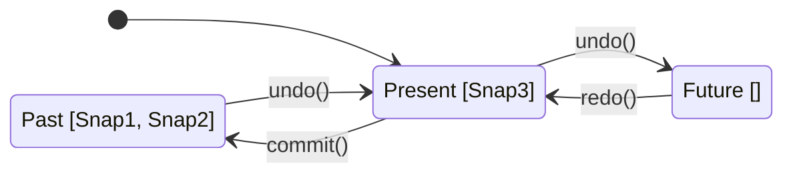

# 第78章：Memento ① 状態をスナップショットで戻したい📸

## ねらい🎯

* Undo/Redo（戻る／進む）の考え方をつかむ🔁✨
* 「状態を保存して、あとで復元する」って何をやってるのか説明できるようになる🧠💡
* TypeScriptでは **標準の `structuredClone()` と配列** で素直に作れる感覚を身につける🧁

---

## 1) Mementoってなに？🧳✨

Memento（メメント）はひとことで言うと…

* **今の状態を「スナップショット📸」として保存して**
* **あとでそのスナップショットに戻す**（Undo）
* 必要なら **進む**（Redo）もできる

という仕組みだよ〜😊✨


GoFの登場人物で言うとこんな感じ👇（でもTSではクラスにこだわらなくてOK🙆‍♀️）

* **Originator**：状態を持ってる人（＝編集画面の「今の注文」）
* **Memento**：状態の保存物（＝注文のスナップショット📸）
* **Caretaker**：保存を管理する人（＝履歴を持つ配列🗂️）



---

## 2) まず大事：状態は「プレーンなデータ」に寄せる🧼✨

Undo/Redoにめちゃ相性いい状態はこれ👇

* オブジェクトリテラル（ `{}` ）
* 配列（ `[]` ）
* number/string/boolean など
* Map/Set/Date などもOKなことが多い（でも学習はまずシンプルに🍰）

`structuredClone()` は **structured clone algorithm** で深いコピー（deep clone）を作ってくれるよ📦✨

* 循環参照（ぐるぐる参照）も扱える👍（内部で訪問済み参照を管理してる） ([MDNウェブドキュメント][1])
* ただし **関数やDOMノードはクローンできない**（`DataCloneError`）とか、**プロトタイプチェーンは複製されない**など制約もあるよ⚠️ ([MDNウェブドキュメント][1])
  だから「状態＝プレーンなデータ」が強いの🥰

---

## 3) なんで “深いコピー” が必要？（浅いコピー事故😇）

例えばこういう事故👇
「スナップショット取ったのに、あとで配列をいじったら過去まで変わっちゃう…！」💥

```ts
const snapshot1 = { items: [{ id: "coffee", qty: 1 }] };

// 浅いコピーっぽいことをすると…（例）
const snapshot2 = { ...snapshot1 };

// itemsの中身は同じ参照のまま…😇
snapshot2.items[0].qty = 99;

console.log(snapshot1.items[0].qty); // 99 ←過去が壊れる💥
```

こういう「過去が壊れる問題」を避けたいから、学習段階では **丸ごと深いコピーで保存📸** がラクで強いよ💪✨
`structuredClone()` は deep clone を作ってくれる（しかも循環参照もOK）([MDNウェブドキュメント][2])

---

## 4) ハンズオン🛠️：カフェ注文エディタのUndo/Redo☕🧁🔁

## 4-1) 型（状態）を用意する📌

```ts
type LineItem = Readonly<{
  itemId: string;
  qty: number;
}>;

type OrderDraft = Readonly<{
  items: ReadonlyArray<LineItem>;
  note: string;
}>;
```

ポイント💡

* `Readonly` にしておくと「うっかり破壊的変更」しにくくなるよ🧊✨
* 更新は “新しい状態を作って返す” が基本！

---

## 4-2) 状態更新は「新しいオブジェクトを返す関数」で🧁

```ts
function addItem(state: OrderDraft, itemId: string): OrderDraft {
  const existing = state.items.find(x => x.itemId === itemId);
  if (!existing) {
    return { ...state, items: [...state.items, { itemId, qty: 1 }] };
  }
  return {
    ...state,
    items: state.items.map(x =>
      x.itemId === itemId ? { ...x, qty: x.qty + 1 } : x
    ),
  };
}

function removeItem(state: OrderDraft, itemId: string): OrderDraft {
  return { ...state, items: state.items.filter(x => x.itemId !== itemId) };
}

function setNote(state: OrderDraft, note: string): OrderDraft {
  return { ...state, note };
}
```

---

## 4-3) いよいよMemento：スナップショットを保存して戻す📸🗂️

ここが主役✨

* `past`：戻る用（Undo）
* `future`：進む用（Redo）
* `commit`：変更を確定する（確定時に「直前状態」を保存）
* `undo/redo`：スナップショットを入れ替えるだけ

```ts
type History<T> = {
  past: T[];
  future: T[];
  present: T;
};

function createHistory<T>(initial: T): History<T> {
  return { past: [], future: [], present: initial };
}

function commit<T>(h: History<T>, next: T): void {
  // 「今」をスナップショットとしてpastへ📸
  h.past.push(structuredClone(h.present));
  h.present = next;
  // 新しい編集が入ったら、redo（future）は捨てる🗑️
  h.future.length = 0;
}

function undo<T>(h: History<T>): void {
  const prev = h.past.pop();
  if (!prev) return; // もう戻れない
  h.future.push(structuredClone(h.present));
  h.present = prev;
}

function redo<T>(h: History<T>): void {
  const next = h.future.pop();
  if (!next) return; // もう進めない
  h.past.push(structuredClone(h.present));
  h.present = next;
}
```

`structuredClone()` は deep clone を作る標準APIで、ブラウザでも広く使える状態になってるよ📦✨ ([MDNウェブドキュメント][2])
さらに Node.js でもグローバル関数として用意されてる（v17.0.0で追加）よ🧰 ([Medium][3])

---

## 4-4) 動かしてみよう🎉

```ts
const initial: OrderDraft = { items: [], note: "" };
const h = createHistory<OrderDraft>(initial);

commit(h, addItem(h.present, "coffee"));
commit(h, addItem(h.present, "cake"));
commit(h, setNote(h.present, "氷少なめでお願いします🧊"));

console.log("NOW", h.present);

undo(h);
console.log("UNDO", h.present);

undo(h);
console.log("UNDO", h.present);

redo(h);
console.log("REDO", h.present);
```

---

## 5) つまずきポイント集💡😵‍💫

## ✅ Undoの“保存タイミング”どっち？

* **変更を適用する前の状態**を保存すると分かりやすい📸
  この例では `commit()` が「今を保存してから next を present にする」形だよ✨

## ✅ 新しい編集をしたらRedoは捨てる🗑️

* Undoして過去に戻ったあとに別ルートの編集をしたら、未来は別世界になるよね🌍💥
  だから `commit()` で `future.length = 0` してる！

## ✅ `structuredClone` でクローンできないものが混ざるとエラー⚠️

* 関数やDOMノードはダメ🙅‍♀️（`DataCloneError`） ([MDNウェブドキュメント][1])
* プロトタイプチェーンは複製されない（クラスのインスタンスを雑に入れると「思ったのと違う」になりやすい） ([MDNウェブドキュメント][1])
  → だから状態はプレーンデータが最強🧼✨

---

## 6) ミニ演習✍️（ちょい足しで実務っぽく🎀）

1. 履歴が増えすぎないように上限をつけよう（例：100件）🧯
2. `canUndo / canRedo` を作ってボタン活性制御っぽくしよう🔘✨

（ヒント：`h.past.length > 0` と `h.future.length > 0` だよ😊）

---

## 7) テスト観点🧪✨（最低これだけ押さえたい！）

* Undoできないときに落ちない（`past` が空）
* Redoできないときに落ちない（`future` が空）
* Undo → 新規commit したら Redo が消える🗑️
* **深いコピー**になっていて「過去が壊れない」📸（ネスト配列があると差が出る！）
* 連続Undo/Redoで present が期待通りに遷移する🔁

---

## 8) AIプロンプト例🤖💬（コピペ用）

```text
カフェ注文の編集状態（items配列＋note文字列）にUndo/Redoを付けたいです。
制約:
- 状態はプレーンなデータ（オブジェクト/配列/プリミティブ）で持つ
- 破壊的変更はしない（immutable更新）
- GoFのためだけの独自クラス乱立はしない
- structuredClone() と配列(past/future)で最小実装
出力:
1) 型定義
2) add/remove/note更新の関数（immutable）
3) commit/undo/redo の最小コード
4) 境界ケース（redo破棄など）
5) テスト観点
```

[1]: https://developer.mozilla.org/en-US/docs/Web/API/Web_Workers_API/Structured_clone_algorithm "The structured clone algorithm - Web APIs | MDN"
[2]: https://developer.mozilla.org/en-US/docs/Web/API/Window/structuredClone "Window: structuredClone() method - Web APIs | MDN"
[3]: https://webreflection.medium.com/surviving-the-structured-clone-algorithm-130608b69f47 "Surviving the Structured Clone algorithm | by Andrea Giammarchi | Medium"
