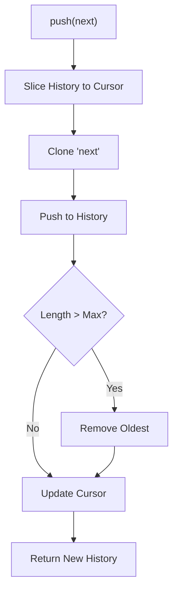

# 第79章：Memento ② TypeScript定番：immutable状態＋履歴配列🗂️

## ねらい🎯

* **Undo/Redo（戻す・進む）**を、TypeScriptらしく **「状態スナップショット＋履歴配列＋index」** で実装できるようになる💪
* 「オレオレMementoクラス」を作らずに、**標準の配列・スプレッド・structuredClone**中心で組めるようになる🧁

---

## 1) MementoをTSでやるとこうなるよ🧠📸

Mementoって、ざっくり言うと👇

* ある時点の状態を **スナップショット（写真📸）**として保存しておいて
* あとで **その写真に戻す（Undo）** / **先の写真へ進む（Redo）**
  って感じ！

TypeScriptでは、クラスを盛らずに **これだけ**で成立しがち👇

* `history: State[]`（状態の配列）
* `index: number`（いまどの状態を見てるか）
* `push / undo / redo`（操作関数）


---

## 2) “immutable（不変）”が超大事🧊✨

Undo/Redoで一番やばい事故はこれ👇😇

* 「過去のスナップショット」だと思ってたのに、**あとから変更されて一緒に変わってた**

なので基本方針はこれ👇

* 状態は **毎回コピーして新しいオブジェクトとして作る**（スプレッドとか）
* そして履歴には **その“新しい状態”を積む**

学習中はさらに安全策として、保存時に **structuredCloneで丸ごとコピー**しておくと事故が減るよ🛡️
`structuredClone` は **Web標準**で、`Map`/`Set`/`Date` なども扱える一方、**関数やDOMノード等はクローンできない**などの制約があるよ📌 ([GitHub][1])
Node.jsでも `structuredClone` は **グローバル関数として用意**されてるよ📦 ([nodejs.org][2])

---

## 3) まずは履歴エンジンを“型＋関数”で作ろう🧁🧰

ここが第79章の本体！
「状態の型 `T`」をそのまま扱える **汎用の履歴**を作るよ✨

ポイントは3つだけ👇

1. **push**：新しい状態を積む（UndoしてたらRedo側は捨てる🗑️）
2. **undo**：`index` を1つ戻す
3. **redo**：`index` を1つ進める

```ts
// 履歴の最小データ構造（クラス不要）
export type History<T> = Readonly<{
  states: ReadonlyArray<T>;
  index: number; // 現在位置（0〜states.length-1）
}>;

export function createHistory<T>(initial: T): History<T> {
  return { states: [initial], index: 0 };
}

export function current<T>(h: History<T>): T {
  return h.states[h.index]!;
}

export function canUndo<T>(h: History<T>): boolean {
  return h.index > 0;
}

export function canRedo<T>(h: History<T>): boolean {
  return h.index < h.states.length - 1;
}

/**
 * push: 新しい状態を履歴へ
 * - Undo後にpushしたら、未来（redo）は捨てる
 * - max を指定したら古い履歴を切り捨て（メモリ節約）
 */
export function push<T>(
  h: History<T>,
  next: T,
  options?: { max?: number; clone?: (v: T) => T }
): History<T> {
  const clone = options?.clone ?? ((v: T) => v);

  // 未来を捨てる（redo破棄）
  const trimmed = h.states.slice(0, h.index + 1);

  // 事故防止にクローンして積む（学習中おすすめ）
  const newStates = [...trimmed, clone(next)];

  // max指定があれば古い分を削る
  const max = options?.max;
  if (max && newStates.length > max) {
    const cut = newStates.length - max;
    return {
      states: newStates.slice(cut),
      index: newStates.length - 1 - cut,
    };
  }

  return { states: newStates, index: newStates.length - 1 };
}

export function undo<T>(h: History<T>): History<T> {
  if (!canUndo(h)) return h;
  return { ...h, index: h.index - 1 };
}

export function redo<T>(h: History<T>): History<T> {
  if (!canRedo(h)) return h;
  return { ...h, index: h.index + 1 };
}
```

## ✅ ここでの大事ポイント（超よく出るやつ）🧠

* **Undo後に編集したらRedoは捨てる**：これを忘れると「未来が分岐してカオス」になる🌪️
* `max` を付けると、履歴が無限に増えなくて安心🧯



---

## 4) カフェ注文の“編集”に繋げよう☕🧾✨

題材はシンプルに👇

* `Order`（注文）
* `addItem` / `removeItem` は **必ず新しいOrderを返す**（破壊的変更しない🧊）

```ts
export type OrderItem = Readonly<{
  id: string;
  name: string;
  price: number;
  qty: number;
}>;

export type Order = Readonly<{
  items: ReadonlyArray<OrderItem>;
}>;

export function addItem(order: Order, item: Omit<OrderItem, "qty">): Order {
  const existing = order.items.find((x) => x.id === item.id);

  if (!existing) {
    return {
      ...order,
      items: [...order.items, { ...item, qty: 1 }],
    };
  }

  return {
    ...order,
    items: order.items.map((x) =>
      x.id === item.id ? { ...x, qty: x.qty + 1 } : x
    ),
  };
}

export function removeItem(order: Order, id: string): Order {
  const existing = order.items.find((x) => x.id === id);
  if (!existing) return order;

  if (existing.qty <= 1) {
    return { ...order, items: order.items.filter((x) => x.id !== id) };
  }

  return {
    ...order,
    items: order.items.map((x) =>
      x.id === id ? { ...x, qty: x.qty - 1 } : x
    ),
  };
}
```

---

## 5) 履歴と合体！Undo/Redoできる“編集ループ”🎮🔁

学習中の事故防止として、`push` に `clone` を渡して **保存時にstructuredClone**する例👇
（※クローンできない値が混ざると例外になるから、状態は“素直なデータ”にしてね📌） ([GitHub][1])

```ts
import { createHistory, current, push, undo, redo, type History } from "./history";

let h: History<Order> = createHistory({ items: [] });

// 追加
h = push(h, addItem(current(h), { id: "coffee", name: "コーヒー", price: 450 }), {
  clone: structuredClone, // Nodeでも使えるよ📦
});

h = push(h, addItem(current(h), { id: "cookie", name: "クッキー", price: 200 }), {
  clone: structuredClone,
});

// Undo（戻る）
h = undo(h);

// Redo（進む）
h = redo(h);

// Undoした後に別の編集をpushすると…
// 未来（Redo）は捨てられる🗑️
h = undo(h);
h = push(h, removeItem(current(h), "coffee"), { clone: structuredClone });
```

---

## 6) テストで境界ケースを固めよう🧪✅

Undo/Redoは **境界ケース**が命！

* 0回目より前にUndoできない
* 最後より先にRedoできない
* Undo後のpushでRedoが捨てられる

Nodeの `node:test` は **安定版（stable）**として使えるよ（Node v20で安定化、`node:test`で書ける）🧪 ([nodejs.org][3])
（Vitestも人気で、4.x系が出てるよ🧁） ([MDNウェブドキュメント][4])

```ts
// history.test.ts
import test from "node:test";
import assert from "node:assert/strict";
import { createHistory, push, undo, redo, current } from "./history";

test("undo/redo basics", () => {
  const h0 = createHistory(0);
  const h1 = push(h0, 1);
  const h2 = push(h1, 2);

  assert.equal(current(h2), 2);

  const hUndo = undo(h2);
  assert.equal(current(hUndo), 1);

  const hRedo = redo(hUndo);
  assert.equal(current(hRedo), 2);
});

test("cannot undo past the beginning", () => {
  const h0 = createHistory("A");
  const hUndo = undo(h0);
  assert.equal(current(hUndo), "A");
});

test("push after undo discards redo future", () => {
  const h0 = createHistory(0);
  const h1 = push(h0, 1);
  const h2 = push(h1, 2);

  const hUndo = undo(h2);      // current = 1
  const hNew = push(hUndo, 99); // 未来(2)を捨てる

  assert.equal(current(hNew), 99);

  const hRedo = redo(hNew); // もう進めない（99が最後）
  assert.equal(current(hRedo), 99);
});
```

---

## 7) よくあるつまずき集😵‍💫🩹

## つまずき①：Undoしたのに状態が変わらない（または全部一緒に変わる）😇

* だいたい **どこかでミューテート（破壊的変更）**してる
* 学習中は `push(..., { clone: structuredClone })` を付けると原因が炙り出しやすい🔥 ([GitHub][1])

## つまずき②：Redoが変な未来に行く🌀

* **Undo後にpushしたら、Redo側は必ず捨てる**（分岐を許さない設計）🗑️

## つまずき③：履歴が重くてメモリが心配🐘

* `push` の `max` を使って **最大履歴数を制限**しよ✅
* 状態が巨大なら、次章（第80章）でやる **Command方式（差分）**も検討だよ💪

---

## 8) AIに頼むならここが強い🤖💡（コピペOK）

```text
TypeScriptでUndo/Redoを作りたいです。
要件:
- 状態はimmutable（破壊的変更なし）
- 履歴は states配列 + index
- undo/redo/push（undo後pushでredo破棄）
- 境界ケース（先頭undo/末尾redo/max制限）も考慮
出力:
1) 最小コード
2) 境界ケースのテスト案
3) よくあるバグと対策
```

---

## 9) 理解チェック✅🎀

* [ ] Undo後に編集したら **Redoは捨てる**って説明できる？🗑️
* [ ] `states[]` と `index` の役割を言える？🧭
* [ ] 状態をミューテートすると何が壊れるか言える？😇
* [ ] `max` で履歴を切る理由を言える？🐘➡️🧁

---

## ミニ演習🛠️✨

1. `max: 30` を付けて、31回pushしたら一番古い状態が捨てられるのをテストしてみよ📉
2. `Order` に `note: string` を追加して、メモ編集でもUndo/Redoできるようにしてみよ📝
3. わざと `order.items.push(...)` みたいな破壊的変更を入れて、Undoが壊れるのを観察してみよ👀💥（学びが深い！）

[1]: https://github.com/microsoft/typescript/releases "Releases · microsoft/TypeScript · GitHub"
[2]: https://nodejs.org/api/globals.html "Global objects | Node.js v25.6.0 Documentation"
[3]: https://nodejs.org/api/test.html "Test runner | Node.js v25.6.0 Documentation"
[4]: https://developer.mozilla.org/ja/docs/Web/API/Web_Workers_API/Structured_clone_algorithm "構造化複製アルゴリズム - Web API | MDN"
