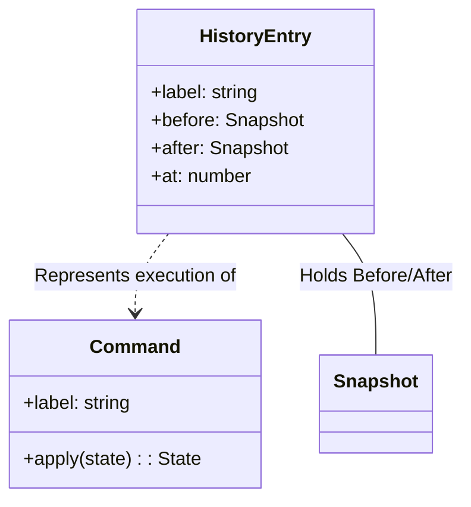

# 第80章：Memento ③ まとめ：Commandと組むと超強い💪

* ねらい🎯：Undo/Redoを「壊れにくく」「増やしやすく」「説明しやすく」作れるようになる
* 学ぶこと📌：

  1. **Memento方式**と**Command方式**の違い（メリデメ）
  2. **Command×Mementoの合体**で“最強になりがち”な理由
  3. TypeScriptらしい最小実装（独自クラス地獄なし）
  4. テスト観点（境界ケース）🧪

---

## 1) まず結論：Command×Mementoは「意図」と「状態」を両方持てる🪄

* **Command**：何をしたか（意図）＝「トッピング追加」「数量変更」みたいな操作ログ🍩
* **Memento**：その結果どうなったか（状態）＝「注文のスナップショット」📸


この2つを組むと…

* 操作履歴が**人間に説明しやすい**（レビューやUIの履歴表示が楽）👀✨
* Undo/Redoが**安全**（“逆操作”を頑張って書かなくていい場面が増える）🧯
* 途中から要件が増えても、設計が**育てやすい**🌱



---

## 2) Undo/Redoの3つの作り方（比較メモ）📝


| 方式                | どう作る？                 | 強み💚             | 弱み💔             | 向いてる場面             |
| ----------------- | --------------------- | ---------------- | ---------------- | ------------------ |
| Mementoだけ📸       | 状態のスナップショットを積む        | 実装が簡単・壊れにくい      | メモリ食う/大きい状態は重い   | 小〜中規模のUI状態、フォーム編集  |
| Commandだけ🎮       | do/undo（逆操作）を積む       | メモリ軽い・操作が意味として残る | undo設計がむずい・漏れやすい | 操作が明確で逆操作が書きやすい    |
| Command×Memento💪 | Commandで意図、Mementoで状態 | 説明しやすい+壊れにくい     | 実装は少し増える         | 「UI履歴も欲しい」「逆操作が複雑」 |

---

## 3) 重要ポイント：TypeScriptでは「状態は不変（immutable）」が相性最高🧊✨

Mementoは「過去の状態を持つ」から、途中で昔の状態が書き換わると事故る💥
なので **“更新はコピーで作る”** が超相性いいよ🧡

そして、スナップショット作成に困ったら **`structuredClone()`** が便利！

* `structuredClone()` は値をディープコピーできて、主要環境で広く使えるよ。([MDNウェブドキュメント][1])
* 中では「構造化複製アルゴリズム」が動いてて、循環参照なども無限ループにならないよう工夫されてるよ。([MDNウェブドキュメント][2])
* Node.js側でもグローバルに `structuredClone` が用意されてるよ。([nodejs.org][3])

（ちなみにTypeScript側の新しさとしては、5.9のリリースノートが継続更新されてるよ。([nodejs.org][3])）

---

## 4) ハンズオン🛠️：カフェ注文のUndo/Redoを「Command×Memento」で作る☕🧁

## 今回の設計（最小）🧩

* **Command**：`label` と `apply(state)` を持つ（操作の意図）🎮
* **Memento**：`before/after` のスナップショット（状態）📸
* Undo/Redoは **状態を差し戻すだけ** にする（逆操作を頑張らない！）🧯

## 4-1) 型と状態🧾


```ts
type Item = {
  id: string;
  name: string;
  price: number;
  qty: number;
};

type OrderState = {
  items: Item[];
  note?: string;
  coupon?: { code: string; percentOff: number } | null;
};

type Command<S> = {
  label: string;                 // UIに出す用（人間向け）✨
  apply: (state: S) => S;        // “次の状態”を返す（不変更新）🧊
};

type HistoryEntry<S> = {
  label: string;
  before: S;
  after: S;
  at: number;                    // いつやったか（UI用）🕒
};
```

## 4-2) Undo/Redoエンジン（関数でOK）🔁


ポイントはこれ👇

* 新しい操作をしたら **redo側の履歴は捨てる**（一般的な動作）🧹
* `before/after` を持ってるので、undo/redoは **代入だけ** で済む💡

```ts
function createUndoRedo<S>(initial: S, snapshot: (s: S) => S) {
  let state = snapshot(initial);
  let history: HistoryEntry<S>[] = [];
  let cursor = 0; // 0..history.length（cursorは「次にredoで進む位置」）

  function canUndo() {
    return cursor > 0;
  }
  function canRedo() {
    return cursor < history.length;
  }

  function doCommand(cmd: Command<S>) {
    // undo後に新規操作が来たら、redo分を破棄🧹
    if (cursor < history.length) {
      history = history.slice(0, cursor);
    }

    const before = snapshot(state);
    const after = snapshot(cmd.apply(before));

    history.push({ label: cmd.label, before, after, at: Date.now() });
    cursor = history.length;
    state = after;
  }

  function undo() {
    if (!canUndo()) return;
    const entry = history[cursor - 1];
    state = snapshot(entry.before);
    cursor -= 1;
  }

  function redo() {
    if (!canRedo()) return;
    const entry = history[cursor];
    state = snapshot(entry.after);
    cursor += 1;
  }

  function getState() {
    return snapshot(state);
  }

  function getHistory() {
    return history.map((h, i) => ({
      index: i + 1,
      label: h.label,
      done: i < cursor, // UIで「ここまで適用済み」を出せる✨
      at: h.at,
    }));
  }

  return { doCommand, undo, redo, canUndo, canRedo, getState, getHistory };
}
```

## 4-3) “操作”をCommandとして用意（独自クラスなし）🍩

```ts
function addItem(item: Item): Command<OrderState> {
  return {
    label: `追加: ${item.name} x${item.qty}`,
    apply: (s) => ({
      ...s,
      items: [...s.items, item],
    }),
  };
}

function changeQty(itemId: string, qty: number): Command<OrderState> {
  return {
    label: `数量変更: ${itemId} -> ${qty}`,
    apply: (s) => ({
      ...s,
      items: s.items.map((it) => (it.id === itemId ? { ...it, qty } : it)),
    }),
  };
}

function applyCoupon(code: string, percentOff: number): Command<OrderState> {
  return {
    label: `クーポン適用: ${code} (${percentOff}%OFF)`,
    apply: (s) => ({
      ...s,
      coupon: { code, percentOff },
    }),
  };
}
```

## 4-4) 使ってみる（イメージ）🎉

```ts
const initial: OrderState = { items: [], note: "", coupon: null };

// スナップショット関数📸（迷ったらstructuredClone）
const snapshot = <T,>(x: T) => structuredClone(x);

const store = createUndoRedo(initial, snapshot);

store.doCommand(addItem({ id: "latte", name: "カフェラテ", price: 500, qty: 1 }));
store.doCommand(addItem({ id: "cake", name: "チーズケーキ", price: 450, qty: 1 }));
store.doCommand(changeQty("latte", 2));
store.doCommand(applyCoupon("STUDENT", 10));

console.log(store.getHistory()); // UIの履歴表示に使える✨
console.log(store.getState());   // 現在状態

store.undo(); // クーポン戻る📸
store.undo(); // 数量戻る📸
store.redo(); // 数量進む📸
```

---

## 5) 「Commandだけ」より強い理由（ここが第80章の芯！）💪✨


## ✅ (A) 逆操作が難しい操作でも、Undoが“確実”になる🧯

例：

* 「自動で最安割引を再計算」
* 「丸め処理」「税計算」「複数項目連動」
  …こういうの、undo関数を手で書くと漏れやすい😵‍💫

→ **before/afterスナップショット**なら、戻すのは代入だけ📸✨

## ✅ (B) でもCommandがあるから“何をしたか”が残る📝

* 履歴UI：「追加: カフェラテ」「数量変更」って出せる
* 監査ログ/分析：「どの操作が多い？」が見える
* バグ報告が楽：「この操作の後に壊れる」って説明できる

---

## 6) つまずき回避💡（ここ超大事！）

## つまずき1：状態をミューテートして過去まで変わる😱

* `items.push(...)` とかやると、昔のスナップショットが同じ参照だった場合に事故💥
* **更新は必ずコピー**（`...` と `map` と配列コピー）で🧊✨

## つまずき2：スナップショットが重い🐢

* 状態が巨大（数万要素）になってきたら、毎回丸ごとは重い
  対策案👇

1. **小さい状態だけUndo対象**にする（UI入力中だけ、とか）🎯
2. **間引き**（N回に1回だけスナップショット）🪓
3. **チェックポイント＋Command**（数回分はCommandで巻き戻し、節目はMemento）📌

## つまずき3：外部I/OをUndoしようとして地獄🌋


* API送信、DB保存、メール送信…は基本Undoできないことが多い
* Undoは「画面内の状態」中心にして、外部は別扱いにするのが安全🧯

---

## 7) テスト観点🧪（Node標準テストでもOK！）

Nodeにはテストランナーが標準であって、`node:test` や `node --test` が使えるよ。([nodejs.org][3])
（教材の前章でテスト環境を作ってる前提なら、それに合わせてもOK🙆‍♀️）

## 最低限おさえるテスト✅

* do→undoで元に戻る
* undo→redoで戻る
* undoした後に新規doしたら、redoは消える
* canUndo/canRedo が正しく変わる

```ts
import test from "node:test";
import assert from "node:assert/strict";

test("do -> undo -> redo", () => {
  const initial: OrderState = { items: [], coupon: null, note: "" };
  const snapshot = <T,>(x: T) => structuredClone(x);

  const store = createUndoRedo(initial, snapshot);

  store.doCommand(addItem({ id: "latte", name: "ラテ", price: 500, qty: 1 }));
  store.doCommand(changeQty("latte", 2));

  assert.equal(store.getState().items.find((x) => x.id === "latte")?.qty, 2);

  store.undo();
  assert.equal(store.getState().items.find((x) => x.id === "latte")?.qty, 1);

  store.redo();
  assert.equal(store.getState().items.find((x) => x.id === "latte")?.qty, 2);
});

test("redo is cleared after new command", () => {
  const initial: OrderState = { items: [], coupon: null, note: "" };
  const snapshot = <T,>(x: T) => structuredClone(x);

  const store = createUndoRedo(initial, snapshot);

  store.doCommand(addItem({ id: "a", name: "A", price: 100, qty: 1 }));
  store.doCommand(addItem({ id: "b", name: "B", price: 100, qty: 1 }));

  store.undo(); // Bを戻す
  assert.equal(store.canRedo(), true);

  store.doCommand(addItem({ id: "c", name: "C", price: 100, qty: 1 })); // 新規操作
  assert.equal(store.canRedo(), false); // redoは消える
});
```

---

## 8) AIプロンプト例🤖💬（そのままコピペOK）

```text
Undo/RedoをTypeScriptで実装したいです。
- Command方式（do/undo）だけ
- Memento方式（状態スナップショット）だけ
- Command×Memento（意図＋状態）ハイブリッド
この3案を、同じ題材（カフェ注文）で比較してください。

制約：
- 余計な独自クラスを増やさない（型＋関数中心）
- 状態は不変更新（immutable）で
- redo消去などの境界ケースも含める
出力：
1) 方式ごとのメリデメ
2) 最小コード例
3) テスト観点（必須ケース）
4) どの条件でどれを選ぶかの判断基準
```

---

## まとめ🎀✨

* **Memento**は「戻せる」最短ルート📸
* **Command**は「何をしたか」を残せる🎮
* **Command×Memento**は **“壊れにくいUndo/Redo” + “説明できる履歴”** が同時に手に入る最強寄りセット💪✨

[1]: https://developer.mozilla.org/en-US/docs/Web/API/Window/structuredClone?utm_source=chatgpt.com "Window: structuredClone() method - Web APIs | MDN"
[2]: https://developer.mozilla.org/en-US/docs/Web/API/Web_Workers_API/Structured_clone_algorithm?utm_source=chatgpt.com "The structured clone algorithm - Web APIs | MDN"
[3]: https://nodejs.org/api/test.html "Test runner | Node.js v25.6.0 Documentation"
