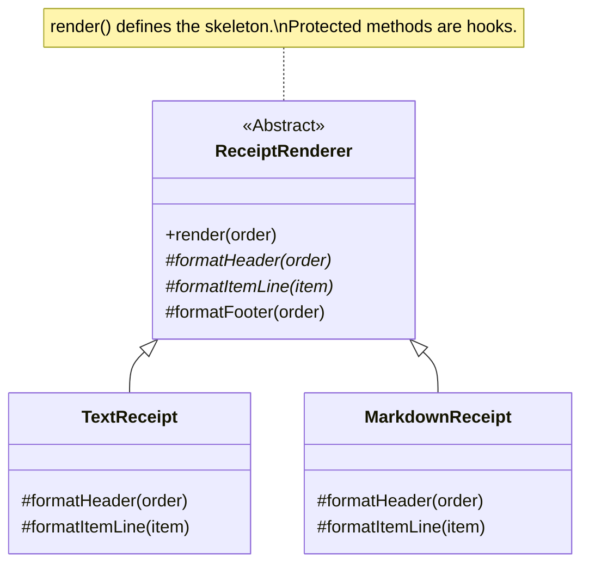

# 第81章：Template Method ① 手順は同じ、でも一部だけ違う🧁

## ねらい🎯

* 「共通の手順（骨組み）」は固定したまま、「一部だけ差し替える」発想をつかむ🧠✨
* コピペで増える分岐やループを減らして、バグの温床を片づける🧹💨
* TypeScriptでの“やりすぎない”Template Method（抽象クラス最小＆関数版）を使い分けできるようにする🌷

---

## 1. まず状況をつくる🍰「レシート出力、形式だけ変えたい！」

たとえばカフェ注文のレシートを出したい☕🧾
でも用途でちょっとだけ違う…！

* 📄 **テキストレシート**：見やすい行形式
* 📝 **Markdownレシート**：そのまま貼れる
* (将来) 📦 **JSONレシート**：ログ保存用

**共通の手順**はいつも同じ👇

1. ヘッダー出す
2. 明細を並べる
3. 合計を出す
4. フッター出す（任意）

でも「見た目」だけ違うのに、毎回ループや合計計算をコピペし始めると…
修正漏れが出やすい😵‍💫💥

---

## 2. Template Methodの正体🧁「骨組みを固定して、差分だけ穴あけする」

Template Methodはこういう設計👇

* 🧱 **骨組み（テンプレ）**：手順の順番・必須処理はここに固定
* 🪝 **フック（差分点）**：見た目や一部の処理だけを差し替え

イメージ🍩

* 「料理のレシピ」は固定🍳
* 「味付け」だけ変える（甘口/辛口）🌶️🍯




---

## 3. 2026の“現実ライン”メモ🧠📌（最新情報）

* TypeScriptは **5.9 系が最新**（npmのlatestは 5.9.3）で、抽象クラス・override など基本機能が普通に使えるよ🧩✨ ([TypeScript][1])
* Node.js は **v24 系が LTS（Latest LTS: v24.13.0）** なので、テストも標準で回しやすい🧪 ([nodejs.org][2])
* Node標準の `node:test` は **Stable** 扱いで、依存ゼロでテストできるよ🧪✨ ([nodejs.org][3])

---

## 4. ハンズオン🛠️：Template Method（抽象クラス最小）でレシートを統一する🧾✨

## 4.1 題材の型を用意する☕📦

```ts
export type OrderItem = {
  name: string;
  unitPrice: number;
  qty: number;
};

export type Order = {
  id: string;
  createdAt: Date;
  items: OrderItem[];
};

export const calcTotal = (order: Order): number =>
  order.items.reduce((sum, it) => sum + it.unitPrice * it.qty, 0);
```

---

## 4.2 骨組み（Template Method）を作る🧱🧁

ポイントはここ👇

* ✅ `render()` が “手順を固定する本体”
* ✅ 差分は `formatHeader` / `formatItemLine` / `formatFooter` で出す
* ✅ “差分じゃない処理”はベース側に寄せる（ループや合計計算）🧹

```ts
import { calcTotal, type Order, type OrderItem } from "./order";

export abstract class ReceiptRenderer {
  // ✅ Template Method：手順（順番）を固定する
  public render(order: Order): string {
    const lines: string[] = [];

    lines.push(this.formatHeader(order));
    lines.push(this.separator());

    for (const item of order.items) {
      lines.push(this.formatItemLine(item));
    }

    lines.push(this.separator());
    lines.push(this.formatTotalLine(calcTotal(order)));

    const footer = this.formatFooter(order);
    if (footer) {
      lines.push(this.separator());
      lines.push(footer);
    }

    return lines.join("\n");
  }

  // 🪝 差分点（必須）
  protected abstract formatHeader(order: Order): string;
  protected abstract formatItemLine(item: OrderItem): string;

  // 🪝 差分点（任意のフック）
  protected formatFooter(_order: Order): string | null {
    return null;
  }

  // ✅ 共通だけど、必要なら差し替え可能にしてもOK（差分が少ないなら）
  protected separator(): string {
    return "----------------";
  }

  protected formatTotalLine(total: number): string {
    return `TOTAL: ¥${total.toLocaleString("ja-JP")}`;
  }
}
```

🌟ここが気持ちいいポイント

* 明細を回す `for` と `calcTotal` は **1ヶ所だけ**🎯
* 形式が増えても、**「差分メソッド」だけ**増やせばOK🎀

---

## 4.3 形式A：テキストレシート📄🧾

```ts
import { ReceiptRenderer } from "./ReceiptRenderer";
import type { Order, OrderItem } from "./order";

export class TextReceiptRenderer extends ReceiptRenderer {
  protected formatHeader(order: Order): string {
    const date = order.createdAt.toLocaleString("ja-JP");
    return `Cafe Receipt  #${order.id}\n${date}`;
  }

  protected formatItemLine(item: OrderItem): string {
    const lineTotal = item.unitPrice * item.qty;
    return `${item.name} x${item.qty}  ¥${lineTotal.toLocaleString("ja-JP")}`;
  }

  protected formatFooter(): string {
    return "ご来店ありがとうございました☺️☕";
  }
}
```

---

## 4.4 形式B：Markdownレシート📝✨

```ts
import { ReceiptRenderer } from "./ReceiptRenderer";
import type { Order, OrderItem } from "./order";

export class MarkdownReceiptRenderer extends ReceiptRenderer {
  protected formatHeader(order: Order): string {
    const date = order.createdAt.toLocaleDateString("ja-JP");
    return `# 🧾 Cafe Receipt\n- id: \`${order.id}\`\n- date: ${date}`;
  }

  protected formatItemLine(item: OrderItem): string {
    const lineTotal = item.unitPrice * item.qty;
    return `- ${item.name} ×${item.qty} = **¥${lineTotal.toLocaleString("ja-JP")}**`;
  }

  // ちょい差分：区切り線だけMarkdownっぽく
  protected separator(): string {
    return "---";
  }

  protected formatFooter(): string | null {
    return "_Thanks! ☕✨_";
  }
}
```

---

## 4.5 使ってみる🌈

```ts
import { TextReceiptRenderer } from "./TextReceiptRenderer";
import { MarkdownReceiptRenderer } from "./MarkdownReceiptRenderer";
import type { Order } from "./order";

const order: Order = {
  id: "A-001",
  createdAt: new Date("2026-02-05T10:30:00"),
  items: [
    { name: "Latte", unitPrice: 520, qty: 1 },
    { name: "Scone", unitPrice: 380, qty: 2 },
  ],
};

console.log(new TextReceiptRenderer().render(order));
console.log("");
console.log(new MarkdownReceiptRenderer().render(order));
```

✅ どっちの形式でも「手順」は同じ
✅ 違いは “フック” の中だけ
→ だから修正漏れが減る💖

---

## 5. テスト🧪✨：「共通の手順が守られてる」安心感を作る

ここでは **Node標準の `node:test`** を使うよ（依存ゼロ）🧪 ([nodejs.org][3])
（TSを直接走らせる仕組みはプロジェクト次第なので、テストは“コンパイル後のJS”想定にしておくのが安全👌）

## 5.1 テスト例（出力に「合計」が必ず入る）

```ts
// dist にコンパイルされた JS を node --test で回す想定
import test from "node:test";
import assert from "node:assert/strict";

import { TextReceiptRenderer } from "../src/TextReceiptRenderer";
import { MarkdownReceiptRenderer } from "../src/MarkdownReceiptRenderer";

const order = {
  id: "T-100",
  createdAt: new Date("2026-02-05T10:30:00"),
  items: [
    { name: "Latte", unitPrice: 500, qty: 1 },
    { name: "Cookie", unitPrice: 200, qty: 3 },
  ],
};

test("TextReceipt: total line exists", () => {
  const out = new TextReceiptRenderer().render(order as any);
  assert.match(out, /TOTAL:/);
});

test("MarkdownReceipt: header and total exist", () => {
  const out = new MarkdownReceiptRenderer().render(order as any);
  assert.match(out, /# 🧾 Cafe Receipt/);
  assert.match(out, /TOTAL:/);
});
```

💡テストのコツ

* 「差分」より先に、**共通の約束（必ずTOTALがある等）**を守れてるかを見る👀✅
* 差分は“形式ごとの小さいテスト”でOK🎀

---

## 6. つまずきポイント回避💡⚠️

## 6.1 差分点が増えすぎる😵‍💫

* フックが10個とかになってきたら、Template Methodはしんどいサイン🚨
  👉 **Strategy（手順ごと差し替え）** を検討💡
  「差分が多い＝骨組みが本当に共通じゃない」可能性が高いよ🧠

## 6.2 継承ツリーが育ちすぎる🌳💥

* `ReceiptRenderer` → `XxxReceipt` が増えまくると迷子になりやすい
  👉 次の「関数版Template Method（継承なし）」が相性よいこと多い✨

---

## 7. TypeScriptらしい代替🧁➡️⚙️：関数でTemplate Method（継承なし）

「骨組みは固定、差分は引数のhooksで渡す」版だよ🪄
クラスを増やしにくい時に便利😊

```ts
import { calcTotal, type Order, type OrderItem } from "./order";

export type ReceiptHooks = {
  header: (order: Order) => string;
  itemLine: (item: OrderItem) => string;
  footer?: (order: Order) => string | null;
  separator?: () => string;
  totalLine?: (total: number) => string;
};

export function renderReceipt(order: Order, hooks: ReceiptHooks): string {
  const sep = hooks.separator ?? (() => "----------------");
  const totalLine = hooks.totalLine ?? ((t) => `TOTAL: ¥${t.toLocaleString("ja-JP")}`);

  const lines: string[] = [];
  lines.push(hooks.header(order));
  lines.push(sep());

  for (const item of order.items) lines.push(hooks.itemLine(item));

  lines.push(sep());
  lines.push(totalLine(calcTotal(order)));

  const footer = hooks.footer?.(order);
  if (footer) {
    lines.push(sep());
    lines.push(footer);
  }

  return lines.join("\n");
}
```

✨これの良さ

* 継承なしでスッキリ🧼
* 「テンプレの順番」は関数が守る✅
* 差分はhooksだけ増やせばOK🎀

---

## 8. まとめ✅🎉（この章で覚えること）

* 🧁 Template Method = **手順（骨組み）を固定**して、**差分だけ差し替える**
* 🧩 TypeScriptでは

  * 抽象クラス最小で書く版（GoFらしい）
  * 関数＋hooksで書く版（TSらしい）
    の2択を持てると強い💪✨
* 😵‍💫 差分が多くなったら、Template Methodに固執しない
  → Strategyへスイッチ検討⚙️🔁

---

## AIプロンプト例🤖💬（コピペOK）

```text
あなたはTypeScriptの先生です。
次の「共通フロー」を Template Method で整理してください。
- 骨組み（固定手順）
- 差分点（hook候補）
- TypeScriptでの最小実装（抽象クラス版 + 関数hooks版）
- 「差分が増えたとき」の分岐（Strategyに寄せる判断基準）

共通フロー: レシート出力（ヘッダー→明細→合計→フッター）
差分: 表示形式（テキスト / Markdown / JSON）
制約: オレオレ独自クラスを増やさず、標準的な書き方で
出力: 1) 設計 2) 最小コード 3) テスト案 4) 落とし穴
```

[1]: https://www.typescriptlang.org/download/?utm_source=chatgpt.com "How to set up TypeScript"
[2]: https://nodejs.org/en/about/previous-releases?utm_source=chatgpt.com "Node.js Releases"
[3]: https://nodejs.org/api/test.html?utm_source=chatgpt.com "Test runner | Node.js v25.6.0 Documentation"
