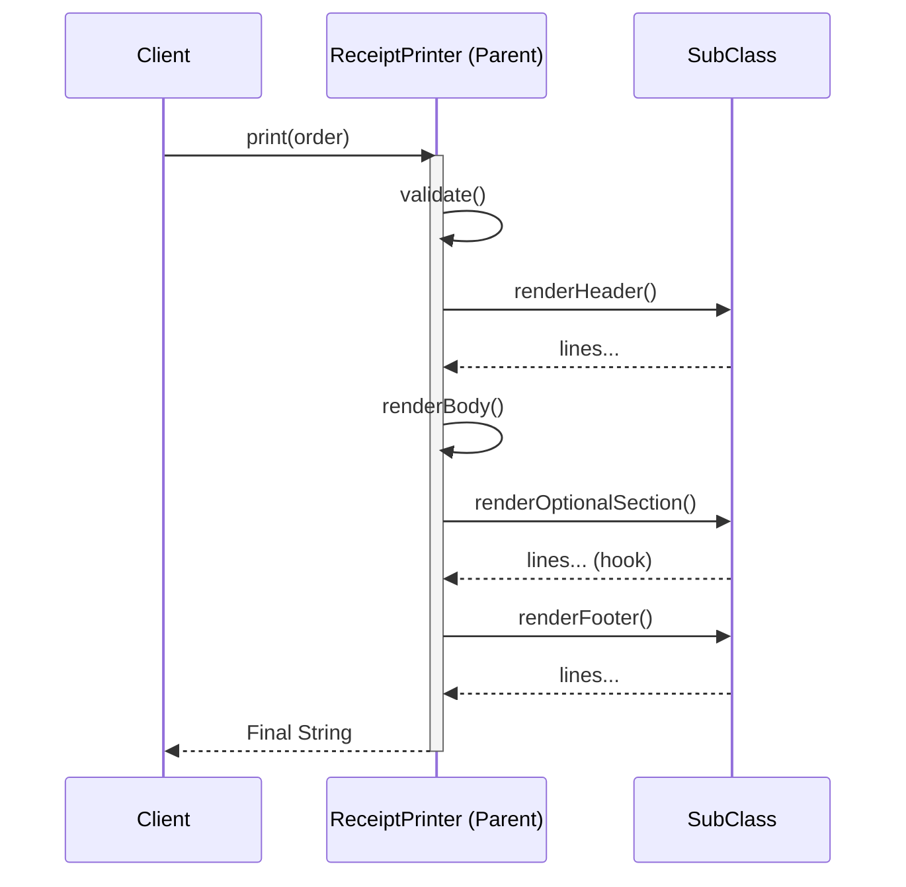

# 第82章：Template Method ② TypeScript定番：抽象クラスは最小限に🧩

## ねらい🎯

* 「手順（骨組み）は共通、差分だけ入れ替えたい」問題を、**最小の抽象クラス**でスッと解けるようになる😊
* 継承でゴチャつきがちな所を、**hook（任意の差し込み口）**でスッキリ保つコツがわかる✨
* ついでに `override` と `noImplicitOverride` で「うっかり上書きミス」を防げるようになる🛡️ ([TypeScript][1])

---

## 今日の結論💡（超ざっくり）

Template Method はこう👇

* **共通の流れ**を「親」が持つ
* **違う部分**だけ「子」が埋める
* TSでは「抽象クラスは小さく」「差分ポイントは少なく」「状態は持たない」が勝ち🏆

---

## 1) まずは“つらい例”😵‍💫（コピペ増殖）


「レシート出力」を 2種類作ったら…

* `validate`（入力チェック）
* 行の組み立て
* 合計計算
* フッター
  …が **両方にベタコピ**になりがち🥺💦

そして起きる事故👇

* 片方だけ税計算を直して、もう片方が古いまま😇
* 片方だけ空注文チェックが抜ける😇
* 仕様追加のたびに両方修正😇

これを「共通手順を1か所に固定」して事故を減らすのが Template Method 🧁✨

---

## 2) Template Method の形🍰


ポイントはこの3つだけ覚えればOK😊

* **template（手順メソッド）**：順番を固定する（ここが本体）
* **abstract（必須の差分）**：子が必ず実装する穴🧩
* **hook（任意の差し込み）**：必要な時だけ上書きする穴🎣（デフォルト実装あり）

TypeScriptの抽象クラス自体は公式に「抽象クラスは直接newできない」「抽象/具象どっちも持てる」って扱いだよ📘 ([TypeScript][2])




---

## 3) TypeScript流の“安全装備”🛡️（`override` 推し）


継承を使うときのあるある事故👇

* 親のメソッド名を変えたのに子が古い名前のまま（でも気づかない）😇
* タイポで別メソッドになってる😇

これを減らすのが `override` ＋ `noImplicitOverride` 🧠✨

* `noImplicitOverride: true` にすると、**上書きするとき `override` 必須**になるよ✅ ([TypeScript][1])

（2026年2月時点での TypeScript 最新版は npm 上 “5.9.2” が Latest 扱いだよ📦） ([npm][3])

---

## 4) ハンズオン🛠️：レシート出力を Template Method 化する☕🧾

## Step A：題材の型（シンプルでOK）😊

```ts
export type OrderItem = {
  name: string;
  unitPrice: number; // 税抜き想定でも税込み想定でもOK（今回は税込みで進める）
  qty: number;
};

export type Order = {
  id: string;
  createdAt: Date;
  items: OrderItem[];
};
```

---

## Step B：まず「共通の計算」と「フォーマット」を標準APIで用意🧰✨

* 金額フォーマットは `Intl.NumberFormat` が定番🪙（独自フォーマッタ作らなくてOK🙆‍♀️）

```ts
export const yen = new Intl.NumberFormat("ja-JP", {
  style: "currency",
  currency: "JPY",
});

export function totalOf(order: Order): number {
  return order.items.reduce((sum, it) => sum + it.unitPrice * it.qty, 0);
}
```

---

## Step C：Template Method（最小の抽象クラス）🧩✨

> ✅ ここが本章のメイン！
> 「骨組み＝print」は親に固定。差分だけ子へ。

```ts
import { Order, yen, totalOf } from "./order";

export abstract class ReceiptPrinter {
  // ✅ これが Template Method（順番を固定する）
  public print(order: Order): string {
    this.validate(order);

    const lines: string[] = [];
    lines.push(...this.renderHeader(order));
    lines.push(...this.renderBody(order));

    // 🎣 hook：必要な派生だけ差し込める（デフォルトは何もしない）
    lines.push(...this.renderOptionalSection(order));

    lines.push(...this.renderFooter(order));
    return lines.join("\n");
  }

  // ✅ 共通の前提チェック（親が守ると事故が減る）
  protected validate(order: Order): void {
    if (order.items.length === 0) {
      throw new Error("注文が空です🫠");
    }
    for (const it of order.items) {
      if (it.qty <= 0) throw new Error(`数量が不正です🫠: ${it.name}`);
      if (it.unitPrice < 0) throw new Error(`価格が不正です🫠: ${it.name}`);
    }
  }

  // ✅ bodyは「共通手順 + 差分」を混ぜやすい場所
  protected renderBody(order: Order): string[] {
    const lines: string[] = [];
    for (const it of order.items) {
      lines.push(this.renderLine(it.name, it.unitPrice, it.qty));
    }
    lines.push("----");
    lines.push(`TOTAL: ${yen.format(totalOf(order))}`);
    return lines;
  }

  // 🧩 必須の差分ポイント（最小限に絞るのがコツ）
  protected abstract renderHeader(order: Order): string[];
  protected abstract renderLine(name: string, unitPrice: number, qty: number): string;
  protected abstract renderFooter(order: Order): string[];

  // 🎣 任意の差し込み（hook）
  protected renderOptionalSection(_order: Order): string[] {
    return [];
  }
}
```

## ここでの“最小限”ポイント✅


* 抽象メソッドは **3つだけ**（Header / Line / Footer）
* 本体 `print` は短く、順番が読みやすい
* 親は状態（メンバ変数）を持たない → 事故りにくい💓

---

## Step D：派生クラス① シンプルレシート🧾✨

```ts
import { ReceiptPrinter } from "./receipt-printer";
import { Order, yen } from "./order";

export class SimpleReceiptPrinter extends ReceiptPrinter {
  protected override renderHeader(order: Order): string[] {
    return [
      "☕ Cafe Komiyamma",
      `Order: ${order.id}`,
      `Date: ${order.createdAt.toLocaleString("ja-JP")}`,
      "----",
    ];
  }

  protected override renderLine(name: string, unitPrice: number, qty: number): string {
    return `${name} x${qty}  ${yen.format(unitPrice * qty)}`;
  }

  protected override renderFooter(_order: Order): string[] {
    return ["----", "Thank you! 😊"];
  }
}
```

---

## Step E：派生クラス② ギフトレシート🎁（金額を隠す）


「手順は同じ。でも行の見せ方が違う」って、まさに Template Method 向き😍

```ts
import { ReceiptPrinter } from "./receipt-printer";
import { Order } from "./order";

export class GiftReceiptPrinter extends ReceiptPrinter {
  protected override renderHeader(order: Order): string[] {
    return [
      "🎁 Gift Receipt",
      `Order: ${order.id}`,
      `Date: ${order.createdAt.toLocaleString("ja-JP")}`,
      "----",
    ];
  }

  protected override renderLine(name: string, _unitPrice: number, qty: number): string {
    // ✅ 金額は出さない
    return `${name} x${qty}`;
  }

  protected override renderFooter(_order: Order): string[] {
    return ["----", "返品・交換はレジまで😊"];
  }
}
```

---

## Step F：hook を使って「任意セクション」を差し込む🎣✨


例えば「会員向けメッセージ」を **出す時だけ**出したい📣

```ts
import { ReceiptPrinter } from "./receipt-printer";
import { Order } from "./order";

export class MemberReceiptPrinter extends ReceiptPrinter {
  protected override renderHeader(order: Order): string[] {
    return ["💳 Member Receipt", `Order: ${order.id}`, "----"];
  }

  protected override renderLine(name: string, unitPrice: number, qty: number): string {
    return `${name} x${qty}  ${unitPrice * qty}円`; // ここは好みでyen.formatでもOK
  }

  protected override renderOptionalSection(_order: Order): string[] {
    return ["✨ Members get 1 stamp!", "----"];
  }

  protected override renderFooter(_order: Order): string[] {
    return ["またね〜☺️"];
  }
}
```

🎉 hook の良さ

* 「差分が増えた！」のに abstract メソッドを増やさなくて済む
* “必要な派生だけ”が上書きするから、影響範囲が小さい✨

---

## 5) テスト🧪：共通手順が崩れないのが最大のうれしさ✅

Vitest は 2025年10月に 4.0 が出ていて、いまどきのTSテストとしてかなり定番寄りだよ🧪✨ ([Vitest][4])

## テスト例（共通仕様を守る）

```ts
import { describe, it, expect } from "vitest";
import { SimpleReceiptPrinter } from "./simple-receipt";
import { GiftReceiptPrinter } from "./gift-receipt";
import type { Order } from "./order";

const order: Order = {
  id: "A-001",
  createdAt: new Date("2026-02-05T10:00:00+09:00"),
  items: [
    { name: "Latte", unitPrice: 600, qty: 1 },
    { name: "Cookie", unitPrice: 250, qty: 2 },
  ],
};

describe("ReceiptPrinter (Template Method)", () => {
  it("どのレシートでもTOTAL行（共通手順）が出る🧾", () => {
    const simple = new SimpleReceiptPrinter().print(order);
    const gift = new GiftReceiptPrinter().print(order);

    expect(simple).toContain("TOTAL:");
    expect(gift).toContain("TOTAL:");
  });

  it("空注文は必ず弾かれる（親のvalidateが守る）🛡️", () => {
    const empty: Order = { ...order, items: [] };
    expect(() => new SimpleReceiptPrinter().print(empty)).toThrow();
    expect(() => new GiftReceiptPrinter().print(empty)).toThrow();
  });

  it("ギフトレシートは金額を隠す🎁", () => {
    const gift = new GiftReceiptPrinter().print(order);
    expect(gift).not.toMatch(/円|¥|JPY|600|250/);
  });
});
```

✅ テストの狙い

* “派生ごとの違い”じゃなくて、**共通の骨組みが守られる**のを確認する
* ここが Template Method のおいしい所😋✨

---

## 6) よくある落とし穴😇⚠️（ここ超大事）

## 落とし穴1：抽象メソッドを増やしすぎる🧟‍♀️

差分ポイントが増えるほど、派生が「全部実装しなきゃ」で疲れる💦
➡️ **hook（デフォルト実装）**を混ぜて “必要なときだけ上書き” に寄せよう🎣✨

## 落とし穴2：親が状態を持ち始める🧨

`this.total` とか `this.lines` をメンバに置くと、呼び出し順や再利用で事故りやすい😇
➡️ **ローカル変数で完結**させるのが安定💕

## 落とし穴3：`override` を付けずに事故る🫠

継承で一番こわいのは「上書きできてないのに動いてる」系…
➡️ `noImplicitOverride` で強制しちゃうのがラク！ ([TypeScript][1])

---

## 7) 使い分けミニチート🤝✨

* **Template Method**：手順がほぼ固定で、差分が“穴”として少ないとき🍰
* **Strategy**：差分を“差し替え”として渡したい（継承したくない）とき⚙️
* **Decorator**：本体に後から機能を重ねたい（ログ/計測/リトライなど）🎁

迷ったらこれ👇

* 派生が増えそう？ → Strategy を先に疑う🙂
* 手順の抜け漏れが怖い？ → Template Method が効く✅

---

## 8) AIプロンプト例🤖💬（コピペOK）

```text
次のコードは Template Method を抽象クラスで実装しています。
- 抽象クラスを肥大化させない
- 差分ポイント（abstract/hook）を最小にする
- TypeScriptらしく、標準API（Intlなど）を優先
この条件でレビューして、改善点を「理由付き」で3〜5個ください。
（必要なら Strategy 代替案も1つだけ出して）
```

---

## まとめ✅🎉

* Template Method は「共通の順番」を固定して、差分だけを穴埋めするパターン🧩
* TypeScriptでは **抽象クラスは小さく**、差分ポイントは **少なく**、必要なら **hook**で拡張🎣✨
* `override` ＋ `noImplicitOverride` で継承事故を減らすと安心🛡️ ([TypeScript][1])

[1]: https://www.typescriptlang.org/tsconfig/noImplicitOverride.html?utm_source=chatgpt.com "noImplicitOverride - TSConfig Option"
[2]: https://www.typescriptlang.org/docs/handbook/classes.html?utm_source=chatgpt.com "Handbook - Classes"
[3]: https://www.npmjs.com/package/typescript?activeTab=versions&utm_source=chatgpt.com "typescript"
[4]: https://vitest.dev/blog/vitest-4?utm_source=chatgpt.com "Vitest 4.0 is out!"
