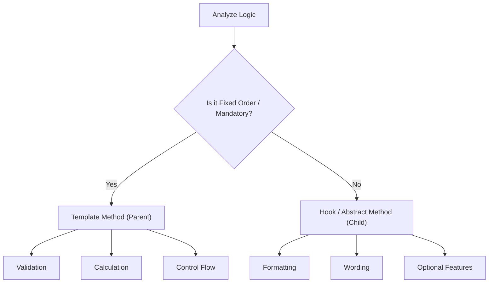

# 第83章：Template Method ③ まとめ：手順の統一でバグが減る✅

## ねらい🎯

* 「手順の骨組み（共通）」を1か所に固定すると、抜け漏れバグが減る理由を説明できる🧠✨
* 「共通」と「差分」をテストで分けて、安心して改修できるようになる🧪💕

## 学ぶこと📌

* Template Methodの“効きどころ”＝**順番・必須処理・例外処理**がブレて事故る時😵‍💫
* 差分は **hook（差し替え点）** に閉じ込める🔒✨
* テストは **共通フローのテスト** と **差分のテスト** を分けると勝ち🏆

---

## 1) Template Methodが「バグを減らす」瞬間って？🧯

こんなバグ、見覚えない？😇💦

* ある画面だけ「検証（validate）」が抜けて、空データが通っちゃった🌀
* 合計計算の順序がズレて、税計算が二重になった／抜けた💸
* 例外処理やログ出力が、実装ごとにバラバラで追えない🕵️‍♀️

Template Methodはここを解決するよ👇

* **必ず通る手順**（検証→明細→合計→出力…）を **1本の流れ**に固定✅
* 違っていいのは **差分だけ**（見た目・フォーマット・出力形式）に限定🎀

---

## 2) “共通”と“差分”の切り分けチェックリスト✅📝

## 共通にしていいもの（Template側）🧱

* 必須の前処理（validate、正規化）
* 合計・集計の計算
* 手順の順番（ヘッダー→明細→合計→フッター）
* 例外の扱い方（投げる／Resultで返す、どっちでも「統一」）

## 差分にすべきもの（hook側）🎨

* 出力形式（テキスト、Markdown、HTMLなど）
* 表示ルール（小数の丸め、日付フォーマット、文言）
* 追加表示（任意の注意書き、キャンペーン文）




---

## 3) 最終形のサンプル：レシート出力🧾✨

ポイントはこれ👇

* `render()` が **テンプレート（骨組み）** ✅
* `renderHeader` / `renderItem` / `renderTotal` が **差分（必須hook）** 🎨
* `renderFooter` は **任意hook（あってもなくてもOK）** 🍀

```ts
// receipt.ts
export type Money = number;

export type OrderItem = {
  name: string;
  unitPrice: Money;
  qty: number;
};

export type Order = {
  id: string;
  createdAt: Date;
  items: readonly OrderItem[];
};

export abstract class ReceiptRenderer {
  // ✅ Template Method（骨組み）
  public render(order: Order): string {
    this.validate(order);

    const lines: string[] = [];
    lines.push(this.renderHeader(order));

    for (const item of order.items) {
      lines.push(this.renderItem(item));
    }

    const total = this.total(order);
    lines.push(this.renderTotal(total));

    const footer = this.renderFooter(order, total);
    if (footer) lines.push(footer);

    return lines.join("\n");
  }

  // ✅ 共通の必須前処理（抜け漏れ防止）
  protected validate(order: Order): void {
    if (order.items.length === 0) {
      throw new Error("注文が空だよ🥲（itemsが0件）");
    }
  }

  // ✅ 共通の集計（ここが統一されるのが強い）
  protected total(order: Order): Money {
    return order.items.reduce((sum, it) => sum + it.unitPrice * it.qty, 0);
  }

  // ✅ ここが差分ポイント（必須hook）
  protected abstract renderHeader(order: Order): string;
  protected abstract renderItem(item: OrderItem): string;
  protected abstract renderTotal(total: Money): string;

  // ✅ 任意hook（必要な時だけ上書き）
  protected renderFooter(_order: Order, _total: Money): string | null {
    return null;
  }

  // ✅ 表示の共通ヘルパ（標準APIでOK）
  protected money(amount: Money): string {
    return new Intl.NumberFormat("ja-JP", {
      style: "currency",
      currency: "JPY",
      maximumFractionDigits: 0,
    }).format(amount);
  }
}

export class PlainTextReceiptRenderer extends ReceiptRenderer {
  protected renderHeader(order: Order): string {
    const date = order.createdAt.toISOString().slice(0, 10);
    return `🧾 レシート #${order.id}（${date}）`;
  }

  protected renderItem(item: OrderItem): string {
    const lineTotal = item.unitPrice * item.qty;
    return `- ${item.name} ×${item.qty} ＝ ${this.money(lineTotal)}`;
  }

  protected renderTotal(total: Money): string {
    return `合計：${this.money(total)}`;
  }

  protected renderFooter(): string {
    return "また来てね☺️☕";
  }
}

export class MarkdownReceiptRenderer extends ReceiptRenderer {
  protected renderHeader(order: Order): string {
    return `# 🧾 レシート #${order.id}`;
  }

  protected renderItem(item: OrderItem): string {
    const lineTotal = item.unitPrice * item.qty;
    return `- **${item.name}** ×${item.qty}：${this.money(lineTotal)}`;
  }

  protected renderTotal(total: Money): string {
    return `---\n**合計：${this.money(total)}**`;
  }
}
```

---

## 4) テスト戦略：共通フロー🧪＋差分🎨 を分ける！

## ✅ 共通フローのテスト（Templateが守るべきこと）🛡️

* 空注文は必ず失敗する（validateが抜けない）
* 合計は常に同じロジックで計算される（rendererが変わっても金額は同じ）

## ✅ 差分のテスト（Rendererごとの表現）🖼️

* Markdownなら `#` が入る
* プレーンテキストなら「また来てね」が入る

“同じテストを複数実装に当てる”のが気持ちいいよ〜！🥰

```ts
// receipt.test.ts
import { describe, it, expect } from "vitest";
import {
  PlainTextReceiptRenderer,
  MarkdownReceiptRenderer,
  type Order,
} from "./receipt";

const baseOrder: Order = {
  id: "A001",
  createdAt: new Date("2026-02-05T10:00:00Z"),
  items: [
    { name: "カフェラテ", unitPrice: 520, qty: 1 },
    { name: "クッキー", unitPrice: 180, qty: 2 },
  ],
};

describe.each([
  ["plain", new PlainTextReceiptRenderer()],
  ["markdown", new MarkdownReceiptRenderer()],
] as const)("共通フロー（%s）", (_name, renderer) => {
  it("空注文は必ず失敗する🥲", () => {
    const empty: Order = { ...baseOrder, items: [] };
    expect(() => renderer.render(empty)).toThrow();
  });

  it("合計が正しい💰", () => {
    const out = renderer.render(baseOrder);
    // 520 + 180*2 = 880
    expect(out).toContain("880");
  });
});

describe("差分テスト🎨", () => {
  it("Markdownは見出しが入る📌", () => {
    const r = new MarkdownReceiptRenderer();
    expect(r.render(baseOrder)).toContain("# 🧾");
  });

  it("PlainTextはフッターが入る☕", () => {
    const r = new PlainTextReceiptRenderer();
    expect(r.render(baseOrder)).toContain("また来てね");
  });
});
```

---

## 5) よくある落とし穴＆回避💡😵‍💫

* **差分が増えすぎる**（hookが10個とか）
  → その時点で「Template Methodで頑張りすぎ」かも！
  差分が“選択肢として増える”なら、Strategyに寄せた方がスッキリしやすい⚙️✨

* **hookの中で勝手に順番を変えたくなる**
  → “差分は見た目だけ”に寄せるのが安全🎀
  計算や検証はTemplate側へ戻す✅

* **共通処理をrenderer側に寄せてしまう**（合計を各rendererで計算し始める）
  → 統一したいものほどTemplate側に置く！🧱✨（バグが減る理由そのもの）

---

## 6) AIプロンプト例🤖💬（そのままコピペOK）

```text
Template Methodの設計レビューをして。
- Template側（共通手順）に入れるべき処理と、hook側（差分）に入れるべき処理を仕分けして
- hookが増えすぎていないか、責務が重くなっていないかもチェックして
- 最後に「共通フローのテスト」と「差分テスト」を分けたVitestのテスト案を出して
題材：レシート出力（validate→明細→合計→フッター）
```

---

## 7) ハンズオン🛠️（5〜15分）🎀

1. `MarkdownReceiptRenderer` に「購入点数（itemsの合計qty）」を **合計の上に** 表示してみよう🧾
2. でも計算は **renderer側に書かないで**、Template側に “共通計算” として生やしてみてね🧠✨
3. テストは👇を追加！

   * 全rendererで「点数」が一致する（共通のテストに入れる）✅
   * Markdownだけ装飾がある（差分テストに入れる）🎨

---

## 8) 2026メモ🗓️✨（周辺ツールの“いま”）

* TypeScriptの公式リリースノートでは **TypeScript 5.9** が案内されていて、`import defer` などの更新が入ってるよ📦✨ ([Microsoft for Developers][1])
* Node.js は **v24（Active LTS）** が継続中で、v25 は Current という位置づけだよ🟢🟡 ([nodejs.org][2])
* テストは Vitest もよく使われていて、**Vitest 4.0** のアナウンスが出てるよ🧪⚡ ([vitest.dev][3])

[1]: https://devblogs.microsoft.com/typescript/announcing-typescript-5-9/?utm_source=chatgpt.com "Announcing TypeScript 5.9"
[2]: https://nodejs.org/en/about/previous-releases?utm_source=chatgpt.com "Node.js Releases"
[3]: https://vitest.dev/blog/vitest-4?utm_source=chatgpt.com "Vitest 4.0 is out!"
