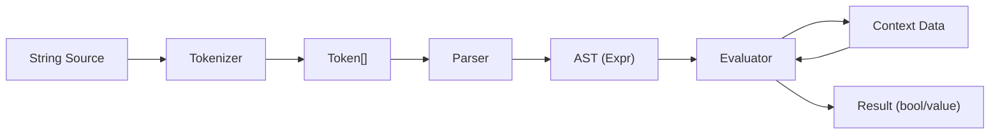

# 第84章：Interpreter ① “小さな言語”を解釈したい（発展）🧠

## ねらい🎯

「文字列で書かれたルール（条件式）」を、**トークン化 → 構文木（AST） → 評価**の流れで安全に動かせるようになるよ📦🔍

---

## 1) Interpreterってなに？🍡💡


**ざっくり言うと…**
「`"total >= 1000 and drink == 'latte'"` みたいな“文字列ルール”を、プログラムが読んで実行できるようにする仕組み」だよ🧾➡️🤖

* 文字列をそのまま `eval()` しない（危険⚠️）
* 代わりに、ちゃんと **自分で解釈（interpret）** する
* GoFのInterpreterは「小さな言語（DSL）を作る」時の考え方🧠✨

---

## 2) いつ使う？いつ使わない？🧭😺


## 使うと気持ちいい場面✅

* ルールを **設定ファイルやDB** に保存して、後から変更したい📄🔁
* 管理画面で「条件式」を入力してフィルタ・割引・通知条件を変えたい🧁📣
* “ユーザー入力”を **安全に** 処理したい（eval禁止！）🚫🔥

## 使わない方がいい場面❌

* ルールがコード内に固定でOK（関数やStrategyで十分）🧩
* ただの `if` 数個で済む（小さく保つのが正義）🧼✨
* 式が巨大＆高度（まず既存DSLや既存パーサを検討）🧰💨

---

## 3) 今日つくるミニ言語（DSL）☕🧾


「カフェ注文」に対して、こんな条件式を使えるようにするよ🍰✨

例👇

* `total >= 1000 and drink == "latte"`
* `not isMember or total < 500`
* `(size == "L" or size == "XL") and total >= 800`

扱う要素はシンプルにするね🙂🌸

* 変数（例：`total`, `drink`, `size`, `isMember`）
* リテラル（数値 / 文字列 / true/false）
* 演算子（比較：`== != > >= < <=`、論理：`and or not`、括弧）

---

## 4) 全体の流れ（超大事）🧩🛣️

```
文字列（ルール）
   ↓ tokenize（字句解析）
トークン列
   ↓ parse（構文解析）
AST（構文木）
   ↓ evaluate（評価）
true / false
```




この3段階ができたら、もうInterpreter入門クリアだよ🥳🎉

---

## 5) ハンズオン：最小のInterpreterを実装しよう🛠️💖

## 5-1) Result型（成功/失敗を戻り値で）🧯✨

例外を投げっぱなしにせず、**失敗を“値”として扱う**やつだよ（前の章の考え方と同じ）🙂📦

```ts
// dsl.ts
export type Result<T, E> =
  | { ok: true; value: T }
  | { ok: false; error: E };

const ok = <T>(value: T): Result<T, never> => ({ ok: true, value });
const err = <E>(error: E): Result<never, E> => ({ ok: false, error });
```

---

## 6) 実装：tokenize → parse → evaluate を1ファイルで作るよ🧠🧁

## 6-1) トークン定義✂️🧩

```ts
// dsl.ts
export type Token =
  | { kind: "number"; value: number; pos: number }
  | { kind: "string"; value: string; pos: number }
  | { kind: "bool"; value: boolean; pos: number }
  | { kind: "ident"; value: string; pos: number }
  | { kind: "op"; value: "==" | "!=" | ">=" | "<=" | ">" | "<"; pos: number }
  | { kind: "kw"; value: "and" | "or" | "not"; pos: number }
  | { kind: "lparen"; pos: number }
  | { kind: "rparen"; pos: number }
  | { kind: "eof"; pos: number };

export type DslError =
  | { type: "LexError"; message: string; pos: number }
  | { type: "ParseError"; message: string; pos: number }
  | { type: "EvalError"; message: string; pos?: number };
```

---

## 6-2) 字句解析（tokenize）✂️🔍


**文字列を“意味のある部品”に分解**するよ！

```ts
// dsl.ts
export function tokenize(input: string): Result<Token[], DslError> {
  const tokens: Token[] = [];
  let i = 0;

  const isAlpha = (c: string) => /[A-Za-z_]/.test(c);
  const isAlnum = (c: string) => /[A-Za-z0-9_]/.test(c);
  const isDigit = (c: string) => /[0-9]/.test(c);

  const peek = () => input[i] ?? "";
  const next = () => input[i++] ?? "";

  while (i < input.length) {
    const c = peek();

    // whitespace
    if (/\s/.test(c)) {
      i++;
      continue;
    }

    // parens
    if (c === "(") {
      tokens.push({ kind: "lparen", pos: i });
      i++;
      continue;
    }
    if (c === ")") {
      tokens.push({ kind: "rparen", pos: i });
      i++;
      continue;
    }

    // operators (2 chars first)
    const two = input.slice(i, i + 2);
    if (two === "==" || two === "!=" || two === ">=" || two === "<=") {
      tokens.push({ kind: "op", value: two, pos: i });
      i += 2;
      continue;
    }
    if (c === ">" || c === "<") {
      tokens.push({ kind: "op", value: c, pos: i });
      i++;
      continue;
    }

    // number
    if (isDigit(c)) {
      const start = i;
      let s = "";
      while (isDigit(peek())) s += next();
      // （学習用に小数は省略。必要ならここで '.' 対応）
      tokens.push({ kind: "number", value: Number(s), pos: start });
      continue;
    }

    // string literal: "..." or '...'
    if (c === `"` || c === `'`) {
      const quote = next(); // consume quote
      const start = i - 1;
      let s = "";
      while (i < input.length && peek() !== quote) {
        const ch = next();
        // 超ミニ対応：\" や \' を許可
        if (ch === "\\" && i < input.length) {
          const escaped = next();
          s += escaped;
          continue;
        }
        s += ch;
      }
      if (peek() !== quote) {
        return err({ type: "LexError", message: "文字列が閉じてないよ🥲", pos: start });
      }
      next(); // closing quote
      tokens.push({ kind: "string", value: s, pos: start });
      continue;
    }

    // identifier / keyword / boolean
    if (isAlpha(c)) {
      const start = i;
      let s = "";
      while (isAlnum(peek())) s += next();
      const lower = s.toLowerCase();

      if (lower === "and" || lower === "or" || lower === "not") {
        tokens.push({ kind: "kw", value: lower, pos: start });
        continue;
      }
      if (lower === "true" || lower === "false") {
        tokens.push({ kind: "bool", value: lower === "true", pos: start });
        continue;
      }

      tokens.push({ kind: "ident", value: s, pos: start });
      continue;
    }

    return err({ type: "LexError", message: `知らない文字があるよ: '${c}' 🥲`, pos: i });
  }

  tokens.push({ kind: "eof", pos: input.length });
  return ok(tokens);
}
```

---

## 6-3) 構文木（AST）🧱🌳


「式の構造」をデータで表すよ！

```ts
// dsl.ts
type CompareOp = "==" | "!=" | ">=" | "<=" | ">" | "<";
type LogicOp = "and" | "or";

export type Expr =
  | { kind: "num"; value: number; pos: number }
  | { kind: "str"; value: string; pos: number }
  | { kind: "bool"; value: boolean; pos: number }
  | { kind: "var"; name: string; pos: number }
  | { kind: "unary"; op: "not"; expr: Expr; pos: number }
  | { kind: "binary"; op: LogicOp; left: Expr; right: Expr; pos: number }
  | { kind: "compare"; op: CompareOp; left: Expr; right: Expr; pos: number };
```

---

## 6-4) パーサ（parse）🍳📐


**優先順位**を守るために、こう分けるよ👇（これがコツ！）

* `not` が一番強い
* 次に 比較（`>=` とか）
* 次に `and`
* 最後に `or`

```ts
// dsl.ts
export function parse(tokens: Token[]): Result<Expr, DslError> {
  let idx = 0;
  const cur = () => tokens[idx]!;
  const eat = () => tokens[idx++]!;

  const expect = (kind: Token["kind"]): Result<Token, DslError> => {
    const t = cur();
    if (t.kind !== kind) {
      return err({
        type: "ParseError",
        message: `ここに ${kind} が来てほしいのに、${t.kind} が来ちゃった🥲`,
        pos: t.pos,
      });
    }
    return ok(eat());
  };

  const parsePrimary = (): Result<Expr, DslError> => {
    const t = cur();

    if (t.kind === "number") {
      eat();
      return ok({ kind: "num", value: t.value, pos: t.pos });
    }
    if (t.kind === "string") {
      eat();
      return ok({ kind: "str", value: t.value, pos: t.pos });
    }
    if (t.kind === "bool") {
      eat();
      return ok({ kind: "bool", value: t.value, pos: t.pos });
    }
    if (t.kind === "ident") {
      eat();
      return ok({ kind: "var", name: t.value, pos: t.pos });
    }
    if (t.kind === "lparen") {
      eat();
      const e = parseOr();
      if (!e.ok) return e;
      const rp = expect("rparen");
      if (!rp.ok) return rp;
      return e;
    }

    return err({ type: "ParseError", message: "式が必要だよ🥲", pos: t.pos });
  };

  const parseCompare = (): Result<Expr, DslError> => {
    const left = parsePrimary();
    if (!left.ok) return left;

    const t = cur();
    if (t.kind === "op") {
      eat();
      const right = parsePrimary();
      if (!right.ok) return right;
      return ok({ kind: "compare", op: t.value, left: left.value, right: right.value, pos: t.pos });
    }

    return left;
  };

  const parseNot = (): Result<Expr, DslError> => {
    const t = cur();
    if (t.kind === "kw" && t.value === "not") {
      eat();
      const inner = parseNot();
      if (!inner.ok) return inner;
      return ok({ kind: "unary", op: "not", expr: inner.value, pos: t.pos });
    }
    return parseCompare();
  };

  const parseAnd = (): Result<Expr, DslError> => {
    let left = parseNot();
    if (!left.ok) return left;

    while (true) {
      const t = cur();
      if (t.kind === "kw" && t.value === "and") {
        eat();
        const right = parseNot();
        if (!right.ok) return right;
        left = ok({ kind: "binary", op: "and", left: left.value, right: right.value, pos: t.pos });
        continue;
      }
      break;
    }

    return left;
  };

  const parseOr = (): Result<Expr, DslError> => {
    let left = parseAnd();
    if (!left.ok) return left;

    while (true) {
      const t = cur();
      if (t.kind === "kw" && t.value === "or") {
        eat();
        const right = parseAnd();
        if (!right.ok) return right;
        left = ok({ kind: "binary", op: "or", left: left.value, right: right.value, pos: t.pos });
        continue;
      }
      break;
    }

    return left;
  };

  const expr = parseOr();
  if (!expr.ok) return expr;

  const end = cur();
  if (end.kind !== "eof") {
    return err({ type: "ParseError", message: "式の後ろに余計なものがあるよ🥲", pos: end.pos });
  }

  return expr;
}
```

---

## 6-5) 評価（evaluate）🔎✅


ASTをたどって `true/false` を出すよ！

```ts
// dsl.ts
type Value = number | string | boolean;

const isValue = (v: unknown): v is Value =>
  typeof v === "number" || typeof v === "string" || typeof v === "boolean";

export function evaluate(expr: Expr, ctx: Record<string, unknown>): Result<Value, DslError> {
  const ev = (e: Expr): Result<Value, DslError> => {
    switch (e.kind) {
      case "num":
      case "str":
      case "bool":
        return ok(e.value);

      case "var": {
        const v = ctx[e.name];
        if (!isValue(v)) {
          return err({ type: "EvalError", message: `変数 '${e.name}' が見つからない/型が違うよ🥲`, pos: e.pos });
        }
        return ok(v);
      }

      case "unary": {
        const r = ev(e.expr);
        if (!r.ok) return r;
        if (typeof r.value !== "boolean") {
          return err({ type: "EvalError", message: "`not` は true/false にしか使えないよ🥲", pos: e.pos });
        }
        return ok(!r.value);
      }

      case "binary": {
        const l = ev(e.left);
        if (!l.ok) return l;
        const r = ev(e.right);
        if (!r.ok) return r;
        if (typeof l.value !== "boolean" || typeof r.value !== "boolean") {
          return err({ type: "EvalError", message: "`and/or` は true/false 同士だけだよ🥲", pos: e.pos });
        }
        return ok(e.op === "and" ? (l.value && r.value) : (l.value || r.value));
      }

      case "compare": {
        const l = ev(e.left);
        if (!l.ok) return l;
        const r = ev(e.right);
        if (!r.ok) return r;

        const lv = l.value;
        const rv = r.value;

        // 学習用：同じ型同士だけ比較OKにする（事故が減る✨）
        if (typeof lv !== typeof rv) {
          return err({ type: "EvalError", message: "比較は同じ型同士だけにしてね🥲", pos: e.pos });
        }

        const cmp = (a: any, b: any) => {
          switch (e.op) {
            case "==": return a === b;
            case "!=": return a !== b;
            case ">=": return a >= b;
            case "<=": return a <= b;
            case ">":  return a > b;
            case "<":  return a < b;
          }
        };

        return ok(cmp(lv, rv));
      }
    }
  };

  return ev(expr);
}

export function runCondition(source: string, ctx: Record<string, unknown>): Result<boolean, DslError> {
  const t = tokenize(source);
  if (!t.ok) return t;

  const p = parse(t.value);
  if (!p.ok) return p;

  const v = evaluate(p.value, ctx);
  if (!v.ok) return v;

  if (typeof v.value !== "boolean") {
    return err({ type: "EvalError", message: "最終結果は true/false になってほしいよ🥲" });
  }
  return ok(v.value);
}
```

---

## 7) ちょこっと動かしてみよう☕🧪

```ts
import { runCondition } from "./dsl";

const order = {
  total: 1200,
  drink: "latte",
  size: "L",
  isMember: true,
};

console.log(runCondition(`total >= 1000 and drink == "latte"`, order));
console.log(runCondition(`not isMember or total < 500`, order));
console.log(runCondition(`(size == "L" or size == "XL") and total >= 800`, order));
```

---

## 8) テスト（最低限でOK）🧪🌸

テストは **“境界”と“失敗”が命**だよ💘
（ちなみに最近のVitestは v4 系の情報が出てるよ。）

```ts
// dsl.test.ts
import { describe, it, expect } from "vitest";
import { runCondition } from "./dsl";

describe("mini interpreter", () => {
  const ctx = { total: 1200, drink: "latte", size: "L", isMember: true };

  it("and/or/compare", () => {
    const r = runCondition(`total >= 1000 and drink == "latte"`, ctx);
    expect(r.ok).toBe(true);
    if (r.ok) expect(r.value).toBe(true);
  });

  it("not has higher precedence", () => {
    const r = runCondition(`not isMember or total < 500`, ctx);
    expect(r.ok).toBe(true);
    if (r.ok) expect(r.value).toBe(false);
  });

  it("parentheses", () => {
    const r = runCondition(`(size == "M" or size == "L") and total >= 800`, ctx);
    expect(r.ok).toBe(true);
    if (r.ok) expect(r.value).toBe(true);
  });

  it("unknown var => error", () => {
    const r = runCondition(`unknown == 1`, ctx);
    expect(r.ok).toBe(false);
  });

  it("broken syntax => error", () => {
    const r = runCondition(`total >=`, ctx);
    expect(r.ok).toBe(false);
  });
});
```

---

## 9) つまずきポイント集😵‍💫🧷

## 優先順位がバグ源No.1👑💥

* `not` > 比較 > `and` > `or` を守る
* 括弧 `()` をテストする

## エラー位置（pos）があると神👼✨

* 「どこがダメ？」が一発で分かる
* 管理画面入力とかだと超重要📋

## “できること”を増やしすぎない🐣

* まずは **安全・最小**
* `+ - * /` や関数呼び出しは次章以降でOK😺

---

## 10) AIに手伝ってもらうプロンプト例🤖💬

```text
次のミニDSLに「数値の四則演算」と「優先順位（* / が + - より強い）」を追加したい。
既存の tokenize / parse / evaluate の構造は崩さず、差分パッチ形式で提案して。
- 独自クラス乱立は禁止（判別Unionと関数で）
- 無効入力は Result で返す
- テストケースも追加して
```

```text
このDSLの「分かりやすいエラーメッセージ」を改善したい。
入力文字列と pos を使って、^ で位置を示す表示例も作って。
```

---

## 11) 実務メモ：既存の道具もある🧰✨（でも注意！）

## 既存DSLの例📌

* **JSONata**：JSON向けのクエリ＆変換言語で、式や関数が豊富だよ🧠📦 ([JSONata][1])
  しかも **AWS Step Functions** でJSONataが使える機能が案内されてるよ（実務での採用例として分かりやすい！）

* **jsep**：JavaScriptの“式”だけをASTにパースしてくれる系（parse専用）🔎🌳 ([ericsmekens.github.io][2])

## セキュリティ注意⚠️🔥

文字列を評価するライブラリは、**入力が外部由来**だと危険が出やすいよ…！
たとえば `expr-eval` はプロトタイプ汚染系の問題から任意コード実行につながりうる、という注意喚起が出てるよ🧨([jvn.jp][3])

だからこの章みたいに👇が基本方針💖

* ✅ できることを絞ったミニDSL
* ✅ 自分でtokenize/parse/evaluate（または信頼できる仕組み）
* ❌ `eval()` は使わない

---

## 12) まとめ✅🎉

* Interpreterは「文字列ルールを安全に動かす」ための考え方🧠✨
* 基本は **tokenize → parse(AST) → evaluate** の3段階🛣️
* TypeScriptだと **判別Union＋関数**でスッキリ書けるよ🧩
* 実務は既存DSLも強いけど、**安全性と範囲の制限が最優先**だよ⚠️💘

[1]: https://jsonata.org/?utm_source=chatgpt.com "JSONata"
[2]: https://ericsmekens.github.io/jsep/?utm_source=chatgpt.com "jsep: JavaScript Expression Parser"
[3]: https://jvn.jp/vu/JVNVU95007707/?utm_source=chatgpt.com "JVNVU#95007707: JavaScriptライブラリexpr-evalおよび ..."
