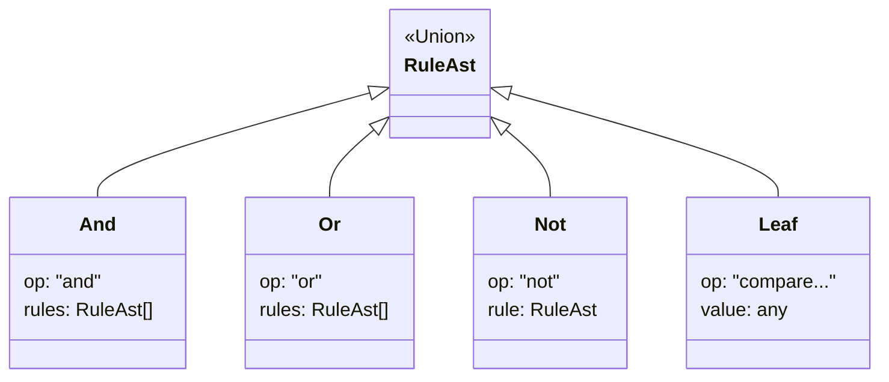

# 第85章：Interpreter ② TSで現実的に：まずは“関数合成”で代替も検討⚙️

## ねらい🎯

* 「Interpreterを採用すべき状況」と「採用しない方がいい状況」を見分けられるようになる🧠✨
* TypeScriptらしい代替（関数合成🧩）で、**同じ目的をもっと安全＆簡単に**達成できるのを体験する🙌
* それでも必要なら、**超小さい“文字列式”Interpreter**を最小コストで作れるようになる🔍

## 学ぶこと📌

* ✅ 代替案：関数合成（= “コードで書く小さなDSL”）
* ✅ 代替案：文字列ではなく「JSON（構文木）」を受け取る（安全寄り）
* ✅ 本当に必要なときだけ：文字列式を token→parse→evaluate する（最小 Interpreter）
* ✅ 危険な `eval` / `new Function` を避ける理由🔐

---

## 2026年2月時点の“最新”ツール感🧰✨

* TypeScript の配布ページ／npm では「最新は 5.9 系」と案内されているよ📦（npm の `typescript` 最新は 5.9.3）。([TypeScript][1])
* その一方で、公式の進捗として **TypeScript 6.0 は 5.9→7.0 の橋渡し**、さらに **7.0 はネイティブ移行（Project Corsa）**が進行中…という流れがはっきりしてるよ🚄([Microsoft for Developers][2])
* Node は 24 系が LTS 入りしていて、25 系も出ている（つまり周辺ツールの進化も速い）⚡([nodejs.org][3])
* テストは、現場だと **Vitest** が強い定番枠（4.0 のアナウンスも出てる）🧪([Vitest][4])

  * Node には `node:test`（組み込みテスト）もあるけど、機能の一部に experimental 表記があるので、開発体験重視なら Vitest がラクなこと多め🙆‍♀️([nodejs.org][5])

---

## まず結論：Interpreter は「外部入力」を解釈する時だけ強い💡

## Interpreter が“いらない”ことが多いケース🙅‍♀️

* ルール（条件式）が **開発者がコードで管理できる**（PR でレビューできる）✍️
* 型安全・補完・リファクタが大事（＝TSの強みを活かしたい）🧷
* セキュリティ上「ユーザーの文字列を実行」なんて怖い😱

➡️ この場合は **関数合成** がほぼ勝ち🏆

## Interpreter を検討する“必要がある”ケース✅

* ルールが **DB/設定ファイル/管理画面**から入ってくる（= 外部入力）🗄️
* 非エンジニアが条件を編集したい（例：キャンペーン条件）🛍️
* 式を保存・共有して、あとで読み直したい（監査ログなど）📜

➡️ この場合は Interpreter 寄り（でも **文字列式が必須とは限らない**！）

---

## 代替案①：関数合成で「小さな言語」を作る🧩✨（最推し）

イメージは「条件を **関数（Predicate）** として組み立てる」感じだよ😊

## ✅ ハンズオン：割引ルールを“関数”で組み立てる☕💸


```ts
// 例：カフェ注文の評価に使うコンテキスト
type MemberRank = "guest" | "silver" | "gold";

type OrderCtx = {
  totalYen: number;
  itemCount: number;
  memberRank: MemberRank;
  hour: number; // 0-23
};

// Predicate（条件関数）
type Rule = (ctx: OrderCtx) => boolean;

// 合成（これが “関数版の Interpreter/DSL” っぽい味）
const allOf =
  (...rules: Rule[]): Rule =>
  (ctx) =>
    rules.every((r) => r(ctx));

const anyOf =
  (...rules: Rule[]): Rule =>
  (ctx) =>
    rules.some((r) => r(ctx));

const not =
  (rule: Rule): Rule =>
  (ctx) =>
    !rule(ctx);

// 原子的なルール（パーツ）🧱
const totalGte =
  (minYen: number): Rule =>
  (ctx) =>
    ctx.totalYen >= minYen;

const memberIs =
  (rank: MemberRank): Rule =>
  (ctx) =>
    ctx.memberRank === rank;

const hourBetween =
  (start: number, end: number): Rule =>
  (ctx) =>
    ctx.hour >= start && ctx.hour < end;

// ルールを組み立てる🎀
const goldHappyHour = allOf(memberIs("gold"), hourBetween(15, 17));
const bigOrderOrGold = anyOf(totalGte(2000), memberIs("gold"));
const notLateNight = not(hourBetween(22, 24));

// 最終ルール例：
// 「(ゴールド会員のハッピーアワー) OR (2000円以上 or ゴールド)」かつ「深夜は除外」
const finalDiscountRule = allOf(anyOf(goldHappyHour, bigOrderOrGold), notLateNight);

// 使う側は超シンプル🎉
export function shouldDiscount(ctx: OrderCtx): boolean {
  return finalDiscountRule(ctx);
}
```




## いいところ😍

* TypeScript の型・補完・リネームが全部効く✨
* テストが超ラク（純粋関数ならなお良い）🧪
* 文字列を parse しない＝バグも攻撃面も減る🔐

## ありがちな悩み💭 → 解決策

* 「ルールを増やすと散らかる」→ **Map に登録**して “辞書化”🗂️
* 「管理画面で編集したい」→ 次の代替案②へ（文字列じゃなくて良い）

---

## 代替案②：文字列をやめて「JSON（構文木）」で受け取る🧱📦（安全寄り）

「管理画面で条件を保存したい」なら、**“人間が読む文字列式”より JSON の方が安全**なこと多いよ🙆‍♀️
（＝tokenize/parse が要らない！）

## ✅ 例：JSON でルールを表す（小さく）


```ts
type MemberRank = "guest" | "silver" | "gold";

type OrderCtx = {
  totalYen: number;
  itemCount: number;
  memberRank: MemberRank;
  hour: number;
};

type RuleAst =
  | { op: "and"; rules: RuleAst[] }
  | { op: "or"; rules: RuleAst[] }
  | { op: "not"; rule: RuleAst }
  | { op: "totalGte"; value: number }
  | { op: "memberIs"; value: MemberRank }
  | { op: "hourBetween"; start: number; end: number };

export function evalAst(ast: RuleAst, ctx: OrderCtx): boolean {
  switch (ast.op) {
    case "and":
      return ast.rules.every((r) => evalAst(r, ctx));
    case "or":
      return ast.rules.some((r) => evalAst(r, ctx));
    case "not":
      return !evalAst(ast.rule, ctx);
    case "totalGte":
      return ctx.totalYen >= ast.value;
    case "memberIs":
      return ctx.memberRank === ast.value;
    case "hourBetween":
      return ctx.hour >= ast.start && ctx.hour < ast.end;
    default: {
      const _exhaustive: never = ast;
      return _exhaustive;
    }
  }
}
```

## ここがポイント🎯

* JSONなら「括弧の対応」とか「演算子の優先順位」とかの地獄が減る😇
* DB 保存・監査ログ・差分比較がやりやすい📜
* “外部入力”なので、**受け取り時の検証**（型チェック）だけは必須✅

---

## それでも必要なら：最小の“文字列式”Interpreter を作る🔍🧠


ここからが GoF Interpreter っぽい本題！
ただし **最小のサブセット**で止めるのが超大事だよ🛑✨

## 目標：このくらいの式だけ扱う🎈

* `totalYen >= 2000 AND memberRank == "gold"`
* `hour >= 15 AND hour < 17`
* `(memberRank == "gold" OR totalYen >= 2000) AND NOT (hour >= 22)`

> 重要：`eval` / `new Function` は使わない❌（入力が外部ならなおさら）

---

## ✅ ハンズオン：tokenize → parse → evaluate（超ミニ）

## 1) Result 型（失敗を安全に返す）🧯

```ts
export type Result<T> =
  | { ok: true; value: T }
  | { ok: false; error: string };

export const ok = <T>(value: T): Result<T> => ({ ok: true, value });
export const err = <T = never>(error: string): Result<T> => ({ ok: false, error });
```

## 2) Tokenize（字句解析）🧩

```ts
type Token =
  | { kind: "number"; value: number }
  | { kind: "string"; value: string }
  | { kind: "ident"; value: string }
  | { kind: "kw"; value: "AND" | "OR" | "NOT" }
  | { kind: "op"; value: "==" | "!=" | ">=" | "<=" | ">" | "<" }
  | { kind: "paren"; value: "(" | ")" };

const isSpace = (c: string) => /\s/.test(c);
const isDigit = (c: string) => /[0-9]/.test(c);
const isIdentStart = (c: string) => /[A-Za-z_]/.test(c);
const isIdent = (c: string) => /[A-Za-z0-9_]/.test(c);

export function tokenize(input: string): Result<Token[]> {
  const tokens: Token[] = [];
  let i = 0;

  const peek = () => input[i] ?? "";
  const next = () => input[i++] ?? "";

  while (i < input.length) {
    const c = peek();
    if (isSpace(c)) {
      i++;
      continue;
    }

    // parentheses
    if (c === "(" || c === ")") {
      tokens.push({ kind: "paren", value: c });
      i++;
      continue;
    }

    // operators (2-char first)
    const two = input.slice(i, i + 2);
    if (two === "==" || two === "!=" || two === ">=" || two === "<=") {
      tokens.push({ kind: "op", value: two });
      i += 2;
      continue;
    }
    if (c === ">" || c === "<") {
      tokens.push({ kind: "op", value: c });
      i++;
      continue;
    }

    // number
    if (isDigit(c)) {
      let s = "";
      while (isDigit(peek())) s += next();
      tokens.push({ kind: "number", value: Number(s) });
      continue;
    }

    // string "..." or '...'
    if (c === `"` || c === `'`) {
      const quote = next();
      let s = "";
      while (i < input.length && peek() !== quote) {
        const ch = next();
        if (ch === "\\" && i < input.length) {
          // very small escape support: \" or \'
          s += next();
        } else {
          s += ch;
        }
      }
      if (peek() !== quote) return err(`文字列が閉じてないよ: ${i}`);
      next(); // closing quote
      tokens.push({ kind: "string", value: s });
      continue;
    }

    // identifier / keyword
    if (isIdentStart(c)) {
      let s = "";
      while (isIdent(peek())) s += next();
      const upper = s.toUpperCase();
      if (upper === "AND" || upper === "OR" || upper === "NOT") {
        tokens.push({ kind: "kw", value: upper });
      } else {
        tokens.push({ kind: "ident", value: s });
      }
      continue;
    }

    return err(`解釈できない文字があるよ: '${c}' (位置 ${i})`);
  }

  return ok(tokens);
}
```

## 3) Parse（構文解析）→ AST（判別Union）🌳

「優先順位」だけ最低限：`NOT` > `AND` > `OR`
比較は `ident op literal` の形だけにしてシンプルにするよ🙂

```ts
type ValueExpr =
  | { kind: "v_number"; value: number }
  | { kind: "v_string"; value: string }
  | { kind: "v_ident"; value: string };

type CompOp = "==" | "!=" | ">=" | "<=" | ">" | "<";

type Expr =
  | { kind: "or"; left: Expr; right: Expr }
  | { kind: "and"; left: Expr; right: Expr }
  | { kind: "not"; expr: Expr }
  | { kind: "cmp"; op: CompOp; left: ValueExpr; right: ValueExpr };

class Cursor {
  constructor(public tokens: Token[], public pos = 0) {}
  peek(): Token | undefined {
    return this.tokens[this.pos];
  }
  next(): Token | undefined {
    return this.tokens[this.pos++];
  }
  expect<K extends Token["kind"]>(kind: K, msg: string): Result<Extract<Token, { kind: K }>> {
    const t = this.peek();
    if (!t || t.kind !== kind) return err(msg);
    this.pos++;
    return ok(t as Extract<Token, { kind: K }>);
  }
}

const parseValue = (cur: Cursor): Result<ValueExpr> => {
  const t = cur.peek();
  if (!t) return err("値が必要だよ（式が途中で終わってる）");

  if (t.kind === "number") {
    cur.next();
    return ok({ kind: "v_number", value: t.value });
  }
  if (t.kind === "string") {
    cur.next();
    return ok({ kind: "v_string", value: t.value });
  }
  if (t.kind === "ident") {
    cur.next();
    return ok({ kind: "v_ident", value: t.value });
  }
  return err("値（number/string/ident）が必要だよ");
};

const parsePrimary = (cur: Cursor): Result<Expr> => {
  const t = cur.peek();
  if (t?.kind === "paren" && t.value === "(") {
    cur.next();
    const e = parseOr(cur);
    if (!e.ok) return e;
    const close = cur.expect("paren", "閉じカッコ ')' が必要だよ");
    if (!close.ok) return close;
    if (close.value.value !== ")") return err("閉じカッコ ')' が必要だよ");
    return ok(e.value);
  }

  // comparison: value op value
  const left = parseValue(cur);
  if (!left.ok) return left;

  const opTok = cur.peek();
  if (!opTok || opTok.kind !== "op") return err("比較演算子（==, >= など）が必要だよ");
  cur.next();

  const right = parseValue(cur);
  if (!right.ok) return right;

  return ok({ kind: "cmp", op: opTok.value, left: left.value, right: right.value });
};

const parseNot = (cur: Cursor): Result<Expr> => {
  const t = cur.peek();
  if (t?.kind === "kw" && t.value === "NOT") {
    cur.next();
    const inner = parseNot(cur);
    if (!inner.ok) return inner;
    return ok({ kind: "not", expr: inner.value });
  }
  return parsePrimary(cur);
};

const parseAnd = (cur: Cursor): Result<Expr> => {
  let left = parseNot(cur);
  if (!left.ok) return left;

  while (true) {
    const t = cur.peek();
    if (t?.kind === "kw" && t.value === "AND") {
      cur.next();
      const right = parseNot(cur);
      if (!right.ok) return right;
      left = ok({ kind: "and", left: left.value, right: right.value });
      continue;
    }
    break;
  }
  return left;
};

const parseOr = (cur: Cursor): Result<Expr> => {
  let left = parseAnd(cur);
  if (!left.ok) return left;

  while (true) {
    const t = cur.peek();
    if (t?.kind === "kw" && t.value === "OR") {
      cur.next();
      const right = parseAnd(cur);
      if (!right.ok) return right;
      left = ok({ kind: "or", left: left.value, right: right.value });
      continue;
    }
    break;
  }
  return left;
};

export function parseExpression(tokens: Token[]): Result<Expr> {
  const cur = new Cursor(tokens);
  const expr = parseOr(cur);
  if (!expr.ok) return expr;

  if (cur.peek()) return err("式の後ろに余計なトークンがあるよ");
  return expr;
}
```

> `class Cursor` は「パターン用のオレオレクラス」じゃなくて、**配列を読み進めるための最小ユーティリティ**として使ってるよ（これくらいなら現場でも普通にあり）😊

## 4) Evaluate（評価）🧮


ここが Interpreter の “解釈” パート✨
**識別子（ident）はホワイトリストで許可**するのが大事だよ🔐

```ts
type MemberRank = "guest" | "silver" | "gold";

export type OrderCtx = {
  totalYen: number;
  itemCount: number;
  memberRank: MemberRank;
  hour: number;
};

type Value = number | string;

const resolveValue = (v: ValueExpr, ctx: OrderCtx): Result<Value> => {
  switch (v.kind) {
    case "v_number":
      return ok(v.value);
    case "v_string":
      return ok(v.value);
    case "v_ident": {
      // ✅ 許可リスト（ここが安全性の要）
      switch (v.value) {
        case "totalYen":
          return ok(ctx.totalYen);
        case "itemCount":
          return ok(ctx.itemCount);
        case "memberRank":
          return ok(ctx.memberRank);
        case "hour":
          return ok(ctx.hour);
        default:
          return err(`未知の識別子だよ: ${v.value}`);
      }
    }
    default: {
      const _exhaustive: never = v;
      return _exhaustive;
    }
  }
};

const cmp = (op: CompOp, a: Value, b: Value): Result<boolean> => {
  const aNum = typeof a === "number";
  const bNum = typeof b === "number";
  const aStr = typeof a === "string";
  const bStr = typeof b === "string";

  if (aNum && bNum) {
    switch (op) {
      case "==": return ok(a === b);
      case "!=": return ok(a !== b);
      case ">=": return ok(a >= b);
      case "<=": return ok(a <= b);
      case ">":  return ok(a > b);
      case "<":  return ok(a < b);
    }
  }

  // 文字列は == / != のみ許可（雑に > とか許すと事故りがち）
  if (aStr && bStr) {
    if (op === "==") return ok(a === b);
    if (op === "!=") return ok(a !== b);
    return err(`文字列で '${op}' は使えないよ（== / != だけ）`);
  }

  return err("型が合わない比較だよ（number同士 or string同士にしてね）");
};

export function evaluate(expr: Expr, ctx: OrderCtx): Result<boolean> {
  switch (expr.kind) {
    case "or": {
      const l = evaluate(expr.left, ctx);
      if (!l.ok) return l;
      if (l.value) return ok(true); // short-circuit
      return evaluate(expr.right, ctx);
    }
    case "and": {
      const l = evaluate(expr.left, ctx);
      if (!l.ok) return l;
      if (!l.value) return ok(false); // short-circuit
      return evaluate(expr.right, ctx);
    }
    case "not": {
      const v = evaluate(expr.expr, ctx);
      return v.ok ? ok(!v.value) : v;
    }
    case "cmp": {
      const a = resolveValue(expr.left, ctx);
      if (!a.ok) return a;
      const b = resolveValue(expr.right, ctx);
      if (!b.ok) return b;
      return cmp(expr.op, a.value, b.value);
    }
    default: {
      const _exhaustive: never = expr;
      return _exhaustive;
    }
  }
}
```

## 5) まとめて使う関数（ワンショット）🎁

```ts
export function evalExpression(input: string, ctx: OrderCtx): Result<boolean> {
  const t = tokenize(input);
  if (!t.ok) return t;

  const p = parseExpression(t.value);
  if (!p.ok) return p;

  return evaluate(p.value, ctx);
}
```

---

## テスト（Vitest）🧪✨

Vitest はブログで 4.0 アナウンスが出てて、TS と相性も良い定番だよ🫶([Vitest][4])

```ts
import { describe, it, expect } from "vitest";
import { evalExpression } from "./expr";
import type { OrderCtx } from "./expr";

const ctx: OrderCtx = {
  totalYen: 2500,
  itemCount: 3,
  memberRank: "gold",
  hour: 16,
};

describe("mini interpreter", () => {
  it("basic AND/OR", () => {
    const r = evalExpression(`totalYen >= 2000 AND memberRank == "gold"`, ctx);
    expect(r.ok).toBe(true);
    if (r.ok) expect(r.value).toBe(true);
  });

  it("parentheses + NOT", () => {
    const r = evalExpression(`(memberRank == "silver" OR totalYen >= 2000) AND NOT (hour >= 22)`, ctx);
    expect(r.ok).toBe(true);
    if (r.ok) expect(r.value).toBe(true);
  });

  it("unknown identifier should fail", () => {
    const r = evalExpression(`unknown == 1`, ctx);
    expect(r.ok).toBe(false);
  });

  it("string compare only == !=", () => {
    const r = evalExpression(`memberRank >= "gold"`, ctx);
    expect(r.ok).toBe(false);
  });
});
```

---

## 比較まとめ：どれを選ぶ？🧭💖

* **関数合成（最推し）🧩**

  * ルールがコード管理できるなら、まずこれでOK✨
* **JSON（構文木）📦**

  * “外部入力”だけど、安全にしたい・保存したい・監査したいなら強い💪
* **文字列式 Interpreter 🧠**

  * 「人が式を手で書く必要がある」時だけ。
  * その代わり **テスト量＆入力検証＆安全設計**が増える😇

---

## ハンズオン課題🛠️🎀

1. `memberRank == "gold" OR memberRank == "silver"` を追加して動かしてみよ🐣
2. 識別子に `dayOfWeek` を追加して、`dayOfWeek == "Sat"` を評価できるようにしてみよ📅
3. エラーメッセージに “入力のどこで” 失敗したか（位置）を出してみよ🔍
4. テストを最低5本追加（境界：`hour == 0`, `hour == 23`, `totalYen == 1999/2000`）🧪✨

---

## AIプロンプト例🤖💬

```text
TypeScriptで「条件式」を扱いたいです。
やりたいこと：カフェ注文(OrderCtx)に対して割引条件を評価する
方針候補：1) 関数合成（PredicateをallOf/anyOf/notで合成） 2) 文字列式Interpreter
要望：
- まず関数合成案を優先して、実装とテスト例を出して
- 「外部入力が必要な場合」に限って、最小のInterpreter案も出して
- eval/new Functionは禁止
- 識別子はホワイトリスト方式で
- 出力：設計（責務/リスク）→最小コード→テスト案→落とし穴
```

---

## つまずき回避💡


* `eval` は封印❌（一瞬ラクでも、後で事故りやすい）😱
* 文字列式をやるなら、**機能を増やしすぎない**（まず AND/OR/NOT + 比較だけ）🧸
* “識別子→値” は **ホワイトリスト**にする（何でも取れると危険）🔐
* 仕様が曖昧だと地獄：

  * 大文字小文字どうする？
  * 空白は？
  * 文字列のクォートは？
  * そのへんは最初に決める📌

---

[1]: https://www.typescriptlang.org/download/?utm_source=chatgpt.com "How to set up TypeScript"
[2]: https://devblogs.microsoft.com/typescript/progress-on-typescript-7-december-2025/?utm_source=chatgpt.com "Progress on TypeScript 7 - December 2025"
[3]: https://nodejs.org/en/about/previous-releases?utm_source=chatgpt.com "Node.js Releases"
[4]: https://vitest.dev/blog/vitest-4?utm_source=chatgpt.com "Vitest 4.0 is out!"
[5]: https://nodejs.org/api/test.html?utm_source=chatgpt.com "Test runner | Node.js v25.6.0 Documentation"
