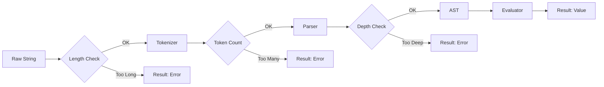

# 第86章：Interpreter ③ まとめ：安全性とテストが命🧪

## ねらい🎯

* 「式（文字列）」を扱う＝**外部入力を実行する**のと同じくらい危ない😱…を体感する
* **安全に失敗**できる（落ちない・壊れない）Interpreterの作り方がわかる✅
* テストで「安心して運用できる」状態にする🧪✨

---

## 1) Interpreterで一番大事な“危険ポイント”⚠️


## 🔥 これだけはNG：`eval()` / `new Function()` で式を実行

* 便利そうに見えて、**攻撃コード混入**・**情報漏えい**・**サーバー負荷爆発**の入口になりがち💣
* Interpreterは「自分が許可した文法だけ」通すのが基本ルール🧠✨

## ✅ 安全な方針（この章の結論）

* 入力を **(1) 字句解析（トークン化）→ (2) 構文解析（AST化）→ (3) 評価** の3段階に分ける
* どの段階でも **“Resultで返す（例外で落とさない）”** を徹底🧯
* **ガードレール**（長さ制限・深さ制限・トークン数制限）を付ける🧱




---

## 2) ミニDSL題材：割引ルール式（Boolean式）☕🧾

「注文合計 `total`」「個数 `itemsCount`」「会員 `member`」に対して、
次みたいな式を評価して **trueなら割引適用**にするイメージ🎁

例🍓

* `total >= 1000 && member == 'gold'`
* `itemsCount >= 3 || member == 'silver'`
* `!(member == 'none') && total > 500`

---

## 3) “安全性”のチェックリスト✅🧯

## 入力バリデーション（入口）🚪


* 入力長を制限（例：2000文字まで）✂️
* トークン数を制限（例：500個まで）🧱
* 括弧の深さを制限（例：50段まで）🕳️

## エラー設計（失敗の仕方）💬

* **ParseError（文法エラー）** と **EvalError（評価エラー）** を分ける
* 位置（pos）を持たせると、UIで「どこがダメ？」が出せて親切💞

## 実行面の安全（運用）🛡️

* 依存の更新（特にNode系）はセキュリティリリースを追う📦
  Nodeは 2026-01-13 に 20/22/24/25 系へセキュリティリリースが出ています（例：24.13.0）🧯([nodejs.org][1])
  どの系がLTSかの確認は公式のリリース表が確実です📌([nodejs.org][2])

---

## 4) 最小実装（トークン→AST→評価）🧩✨

> ポイント：**クラス大量**じゃなくて、TSらしく **判別Union＋関数**でいくよ🙆‍♀️

```ts
// interpreter-safe.ts
// ミニDSL：Boolean式（&&, ||, !, 比較, 括弧）を安全に評価する

// ---------- Result ----------
export type Ok<T> = { ok: true; value: T };
export type Err<E> = { ok: false; error: E };
export type Result<T, E> = Ok<T> | Err<E>;
export const ok = <T>(value: T): Ok<T> => ({ ok: true, value });
export const err = <E>(error: E): Err<E> => ({ ok: false, error });

// ---------- Errors ----------
export type ParseError = { kind: "ParseError"; message: string; pos: number };
export type EvalError = { kind: "EvalError"; message: string; pos?: number };
export type AnyError = ParseError | EvalError;

// ---------- Context ----------
export type Member = "none" | "silver" | "gold";
export type RuleContext = {
  total: number;
  itemsCount: number;
  member: Member;
};

// ---------- Guard rails ----------
const MAX_INPUT_LEN = 2000;
const MAX_TOKENS = 500;
const MAX_DEPTH = 50;

// ---------- Tokenizer ----------
type TokenKind = "number" | "string" | "ident" | "op" | "paren" | "eof";
type Token = { kind: TokenKind; text: string; pos: number };

const OPS = ["&&", "||", "==", "!=", ">=", "<=", ">", "<", "!"] as const;
type Op = (typeof OPS)[number];

function tokenize(input: string): Result<Token[], ParseError> {
  if (input.length > MAX_INPUT_LEN) {
    return err({ kind: "ParseError", message: "式が長すぎます", pos: 0 });
  }

  const tokens: Token[] = [];
  let i = 0;

  const push = (kind: TokenKind, text: string, pos: number) => {
    tokens.push({ kind, text, pos });
    if (tokens.length > MAX_TOKENS) {
      throw new Error("__TOO_MANY_TOKENS__"); // 内部用（外へはResultで返す）
    }
  };

  try {
    while (i < input.length) {
      const c = input[i];

      // whitespace
      if (/\s/.test(c)) {
        i++;
        continue;
      }

      // parens
      if (c === "(" || c === ")") {
        push("paren", c, i);
        i++;
        continue;
      }

      // string: '...'
      if (c === "'") {
        const start = i;
        i++; // skip opening '
        let s = "";
        while (i < input.length && input[i] !== "'") {
          // 超簡易：エスケープは今回は扱わない（必要ならここを拡張）
          s += input[i];
          i++;
        }
        if (i >= input.length) {
          return err({ kind: "ParseError", message: "文字列が閉じていません", pos: start });
        }
        i++; // skip closing '
        push("string", s, start);
        continue;
      }

      // number
      if (/[0-9]/.test(c)) {
        const start = i;
        let n = "";
        while (i < input.length && /[0-9]/.test(input[i])) {
          n += input[i];
          i++;
        }
        push("number", n, start);
        continue;
      }

      // operators (longer first)
      const op = OPS.find((x) => input.startsWith(x, i));
      if (op) {
        push("op", op, i);
        i += op.length;
        continue;
      }

      // ident / keywords
      if (/[A-Za-z_]/.test(c)) {
        const start = i;
        let id = "";
        while (i < input.length && /[A-Za-z0-9_]/.test(input[i])) {
          id += input[i];
          i++;
        }
        push("ident", id, start);
        continue;
      }

      return err({ kind: "ParseError", message: `不明な文字: ${c}`, pos: i });
    }

    tokens.push({ kind: "eof", text: "", pos: input.length });
    return ok(tokens);
  } catch (e) {
    if (e instanceof Error && e.message === "__TOO_MANY_TOKENS__") {
      return err({ kind: "ParseError", message: "式が複雑すぎます（トークン数オーバー）", pos: 0 });
    }
    throw e;
  }
}

// ---------- AST ----------
type Expr =
  | { type: "Lit"; value: number | string | boolean; pos: number }
  | { type: "Var"; name: string; pos: number }
  | { type: "Not"; expr: Expr; pos: number }
  | { type: "Binary"; op: Op; left: Expr; right: Expr; pos: number };

// ---------- Parser (recursive descent) ----------
class Parser {
  private idx = 0;
  private depth = 0;
  constructor(private tokens: Token[]) {}

  private cur(): Token {
    return this.tokens[this.idx];
  }
  private eat(kind?: TokenKind, text?: string): Result<Token, ParseError> {
    const t = this.cur();
    if (kind && t.kind !== kind) {
      return err({ kind: "ParseError", message: `期待: ${kind}`, pos: t.pos });
    }
    if (text && t.text !== text) {
      return err({ kind: "ParseError", message: `期待: '${text}'`, pos: t.pos });
    }
    this.idx++;
    return ok(t);
  }

  parse(): Result<Expr, ParseError> {
    const r = this.parseOr();
    if (!r.ok) return r;
    const end = this.cur();
    if (end.kind !== "eof") {
      return err({ kind: "ParseError", message: "式の後ろに余計なトークンがあります", pos: end.pos });
    }
    return r;
  }

  // or := and ( "||" and )*
  private parseOr(): Result<Expr, ParseError> {
    let leftR = this.parseAnd();
    if (!leftR.ok) return leftR;

    while (this.cur().kind === "op" && this.cur().text === "||") {
      const opTok = this.cur();
      this.idx++;
      const rightR = this.parseAnd();
      if (!rightR.ok) return rightR;
      leftR = ok({ type: "Binary", op: "||", left: leftR.value, right: rightR.value, pos: opTok.pos });
    }
    return leftR;
  }

  // and := comp ( "&&" comp )*
  private parseAnd(): Result<Expr, ParseError> {
    let leftR = this.parseComp();
    if (!leftR.ok) return leftR;

    while (this.cur().kind === "op" && this.cur().text === "&&") {
      const opTok = this.cur();
      this.idx++;
      const rightR = this.parseComp();
      if (!rightR.ok) return rightR;
      leftR = ok({ type: "Binary", op: "&&", left: leftR.value, right: rightR.value, pos: opTok.pos });
    }
    return leftR;
  }

  // comp := unary ( (== != >= <= > <) unary )?
  private parseComp(): Result<Expr, ParseError> {
    const leftR = this.parseUnary();
    if (!leftR.ok) return leftR;

    const t = this.cur();
    if (t.kind === "op" && ["==", "!=", ">=", "<=", ">", "<"].includes(t.text)) {
      this.idx++;
      const rightR = this.parseUnary();
      if (!rightR.ok) return rightR;
      return ok({ type: "Binary", op: t.text as Op, left: leftR.value, right: rightR.value, pos: t.pos });
    }

    return leftR;
  }

  // unary := "!" unary | primary
  private parseUnary(): Result<Expr, ParseError> {
    const t = this.cur();
    if (t.kind === "op" && t.text === "!") {
      this.idx++;
      const innerR = this.parseUnary();
      if (!innerR.ok) return innerR;
      return ok({ type: "Not", expr: innerR.value, pos: t.pos });
    }
    return this.parsePrimary();
  }

  // primary := number | string | true/false | ident | "(" or ")"
  private parsePrimary(): Result<Expr, ParseError> {
    const t = this.cur();

    if (t.kind === "number") {
      this.idx++;
      return ok({ type: "Lit", value: Number(t.text), pos: t.pos });
    }
    if (t.kind === "string") {
      this.idx++;
      return ok({ type: "Lit", value: t.text, pos: t.pos });
    }
    if (t.kind === "ident") {
      this.idx++;
      if (t.text === "true") return ok({ type: "Lit", value: true, pos: t.pos });
      if (t.text === "false") return ok({ type: "Lit", value: false, pos: t.pos });
      return ok({ type: "Var", name: t.text, pos: t.pos });
    }

    if (t.kind === "paren" && t.text === "(") {
      this.depth++;
      if (this.depth > MAX_DEPTH) {
        return err({ kind: "ParseError", message: "括弧が深すぎます（ネスト制限）", pos: t.pos });
      }

      this.idx++; // (
      const innerR = this.parseOr();
      if (!innerR.ok) return innerR;

      const closeR = this.eat("paren", ")");
      if (!closeR.ok) return closeR;

      this.depth--;
      return innerR;
    }

    return err({ kind: "ParseError", message: "ここに式が来るはずでした", pos: t.pos });
  }
}

function parse(tokens: Token[]): Result<Expr, ParseError> {
  return new Parser(tokens).parse();
}

// ---------- Evaluator ----------
type Value = number | string | boolean;

function evalExpr(expr: Expr, ctx: RuleContext): Result<Value, EvalError> {
  switch (expr.type) {
    case "Lit":
      return ok(expr.value);
    case "Var": {
      if (expr.name === "total") return ok(ctx.total);
      if (expr.name === "itemsCount") return ok(ctx.itemsCount);
      if (expr.name === "member") return ok(ctx.member);
      return err({ kind: "EvalError", message: `未定義の変数: ${expr.name}`, pos: expr.pos });
    }
    case "Not": {
      const vR = evalExpr(expr.expr, ctx);
      if (!vR.ok) return vR;
      if (typeof vR.value !== "boolean") {
        return err({ kind: "EvalError", message: "! は boolean にだけ使えます", pos: expr.pos });
      }
      return ok(!vR.value);
    }
    case "Binary": {
      const lR = evalExpr(expr.left, ctx);
      if (!lR.ok) return lR;
      const rR = evalExpr(expr.right, ctx);
      if (!rR.ok) return rR;

      const op = expr.op;

      // boolean ops
      if (op === "&&" || op === "||") {
        if (typeof lR.value !== "boolean" || typeof rR.value !== "boolean") {
          return err({ kind: "EvalError", message: "&& / || は boolean 同士で使います", pos: expr.pos });
        }
        return ok(op === "&&" ? lR.value && rR.value : lR.value || rR.value);
      }

      // comparisons
      if (["==", "!="].includes(op)) {
        return ok(op === "==" ? lR.value === rR.value : lR.value !== rR.value);
      }

      // order comparisons: number only
      if (typeof lR.value !== "number" || typeof rR.value !== "number") {
        return err({ kind: "EvalError", message: "大小比較（>, >=, <, <=）は number 同士で使います", pos: expr.pos });
      }
      switch (op) {
        case ">":
          return ok(lR.value > rR.value);
        case ">=":
          return ok(lR.value >= rR.value);
        case "<":
          return ok(lR.value < rR.value);
        case "<=":
          return ok(lR.value <= rR.value);
      }

      return err({ kind: "EvalError", message: `未対応の演算子: ${op}`, pos: expr.pos });
    }
  }
}

// ---------- Public API ----------
export function compileRule(input: string): Result<(ctx: RuleContext) => Result<boolean, EvalError>, ParseError> {
  const tokR = tokenize(input);
  if (!tokR.ok) return tokR;

  const astR = parse(tokR.value);
  if (!astR.ok) return astR;

  const ast = astR.value;
  return ok((ctx) => {
    const vR = evalExpr(ast, ctx);
    if (!vR.ok) return vR;
    if (typeof vR.value !== "boolean") {
      return err({ kind: "EvalError", message: "式の結果が boolean ではありません" });
    }
    return ok(vR.value);
  });
}

// UI向け：エラーを見やすく整形（posがあると神👼）
export function formatError(input: string, e: AnyError): string {
  const pos = e.pos ?? 0;
  const caret = " ".repeat(Math.max(0, pos)) + "^";
  return `${e.kind}: ${e.message}\n${input}\n${caret}`;
}
```

## ここが“安全っぽい”ポイントだよ💡

* **長さ/トークン/深さ**の制限で、変な入力の「負荷攻撃」を受けにくくする🧱
* 失敗は全部 `Result` で返すので、アプリが落ちにくい🧯
* エラーに `pos` を入れて、ユーザー向けメッセージが作れる💞

> ちなみに TypeScript は npm だと 5.9.3 が “Latest” 表示（2026年2月時点の確認）なので、最近のTS機能前提でも困りにくいよ📌([npm][3])

---

## 5) テストが“命”な理由🧪💓


Interpreterって、

* 分岐が多い（文法・優先順位・型）
* 「変な入力」が必ず来る（ユーザー、ログ、外部設定…）
  ので、**テスト無し＝地雷原**💥

テストは大きく3種類に分けると超ラク✨

1. **正常系**（動いてほしい式）
2. **文法エラー系**（ParseError）
3. **評価エラー系**（EvalError：型違い・変数未定義など）

---

## 6) テスト例（Vitest）🧁🧪


Vitestは TypeScript と相性がよく、Jest互換の書き味で使いやすいよ〜✨([Vitest][4])

```ts
// interpreter-safe.test.ts
import { describe, it, expect } from "vitest";
import { compileRule, formatError, type RuleContext } from "./interpreter-safe";

const ctx: RuleContext = { total: 1200, itemsCount: 2, member: "gold" };

describe("compileRule", () => {
  it("正常系: trueになる", () => {
    const r = compileRule("total >= 1000 && member == 'gold'");
    expect(r.ok).toBe(true);
    if (!r.ok) return;

    const run = r.value(ctx);
    expect(run.ok).toBe(true);
    if (run.ok) expect(run.value).toBe(true);
  });

  it("正常系: 優先順位（&& が || より先）", () => {
    const r = compileRule("false || true && false");
    expect(r.ok).toBe(true);
    if (!r.ok) return;

    const run = r.value({ total: 0, itemsCount: 0, member: "none" });
    expect(run.ok).toBe(true);
    if (run.ok) expect(run.value).toBe(false); // false || (true && false)
  });

  it("正常系: 括弧で優先順位変更", () => {
    const r = compileRule("(false || true) && false");
    expect(r.ok).toBe(true);
    if (!r.ok) return;

    const run = r.value({ total: 0, itemsCount: 0, member: "none" });
    expect(run.ok).toBe(true);
    if (run.ok) expect(run.value).toBe(false);
  });

  it("文法エラー: 文字列が閉じてない", () => {
    const r = compileRule("member == 'gold");
    expect(r.ok).toBe(false);
    if (!r.ok) {
      expect(r.error.kind).toBe("ParseError");
      expect(formatError("member == 'gold", r.error)).toContain("^");
    }
  });

  it("評価エラー: 未定義変数", () => {
    const r = compileRule("unknown == 1");
    expect(r.ok).toBe(true);
    if (!r.ok) return;

    const run = r.value(ctx);
    expect(run.ok).toBe(false);
    if (!run.ok) expect(run.error.kind).toBe("EvalError");
  });

  it("評価エラー: 大小比較の型違い", () => {
    const r = compileRule("member > 1");
    expect(r.ok).toBe(true);
    if (!r.ok) return;

    const run = r.value(ctx);
    expect(run.ok).toBe(false);
  });

  it("落ちないこと: 変な入力でもthrowしない（簡易fuzz）", () => {
    for (let i = 0; i < 100; i++) {
      const weird = Math.random().toString(36).repeat(5);
      const r = compileRule(weird);
      // okでもngでもOK。大事なのは“例外で落ちない”こと
      expect(typeof r.ok).toBe("boolean");
    }
  });
});
```

## ✅ テストで押さえる“現実ライン”📝

* まずは **10〜20ケース**でOK（増やしすぎると続かない🥺）
* 「優先順位」「括弧」「型違い」「未定義変数」「入力上限」を入れると強い💪
* fuzz（雑なランダム）で「落ちない」を保証すると安心感が爆上がり✨

---

## 7) つまずき回避💡（あるある集）

* **「エラー時にthrowしちゃう」**
  → UIやサーバーが落ちやすくなるので、まず `Result` 固定が安全🧯
* **「文法を増やしすぎる」**
  → DSLは“必要最小限”が正義👑（欲張ると無限に増える😇）
* **「テストはあとで…」**
  → Interpreterは“あとで”が事故るタイプ。最初から一緒に🧪

---

## 8) AIプロンプト例🤖💬

```text
次のTypeScriptの小さなInterpreter（Boolean式）に対して、
- 現実的なテストケースを15個
- うち5個は「文法エラー」
- うち5個は「評価エラー（型違い/未定義変数など）」
- 残りは正常系（優先順位・括弧も含む）
という条件で、Vitestのテストコード案を出して。
```

---

## まとめ✅🎉


* Interpreterは「小さな言語」を扱うぶん、**安全性の責任が全部こっちに来る**😱
* だからこそ
  ✅ **許可した文法だけ**通す（トークン→AST→評価）
  ✅ **落ちない（Result）**
  ✅ **ガードレール**（長さ/深さ/トークン）
  ✅ **テストで守る**
  この4点セットが最強🛡️✨

おつかれさま〜！これができると、設定ファイルのルール式とか、検索条件DSLとか、現場でめっちゃ強いよ💪💖

[1]: https://nodejs.org/en/blog/vulnerability/december-2025-security-releases?utm_source=chatgpt.com "Tuesday, January 13, 2026 Security Releases"
[2]: https://nodejs.org/en/about/previous-releases?utm_source=chatgpt.com "Node.js Releases"
[3]: https://www.npmjs.com/package/typescript?utm_source=chatgpt.com "typescript"
[4]: https://vitest.dev/?utm_source=chatgpt.com "Vitest | Next Generation testing framework"
