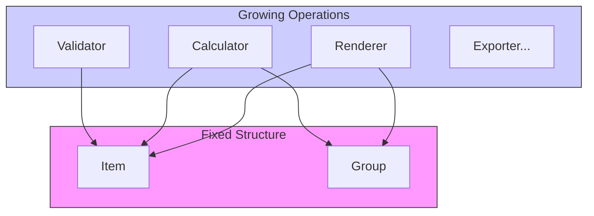

# 第87章：Visitor ① 構造は固定、処理をどんどん追加したい（発展）🧳

## ねらい🎯

* 「データの形（構造）はあまり変わらないのに、やりたい処理だけ増えていく…😵‍💫」って状況を説明できる
* Visitorの狙い＝**構造と処理を分けて、処理追加をラクにする**をつかむ🧠✨
* TypeScriptだと「教科書どおりのVisitor」が重くなりがちな理由もわかる（次章の“TS流”につながるよ）😊

---

## 今日のストーリー☕🌳

カフェの「メニュー」を木構造で持ってるとするよ〜🌳🍰

* カテゴリ（ドリンク / フード）
* その中に商品（カフェラテ / チーズケーキ）
* さらに「季節限定セット」みたいに、グループの中にグループが入ることもある

ここに、やりたい処理が増えていく👇

* 表示用の文字列を作りたい🖨️
* 合計金額を出したい💰
* バリデーションしたい（値段がマイナスはダメ！など）✅
* さらに将来…「アレルギー情報一覧」「CSV出力」「検索インデックス作成」…📦📈

---

## まず困りごと：同じ `switch` が増殖する😵‍💫

TypeScriptで木構造を **判別Union** にすると、だいたいこうなるよね👇（判別Union自体はめちゃ良い！） ([typescriptbook.jp][1])

```ts
type MenuNode =
  | { kind: "item"; name: string; price: number }
  | { kind: "group"; name: string; children: MenuNode[] };

function render(node: MenuNode): string {
  switch (node.kind) {
    case "item":
      return `🍰 ${node.name} (${node.price}円)`;
    case "group":
      return `📁 ${node.name}\n` + node.children.map(render).join("\n");
  }
}

function totalPrice(node: MenuNode): number {
  switch (node.kind) {
    case "item":
      return node.price;
    case "group":
      return node.children.reduce((sum, c) => sum + totalPrice(c), 0);
  }
}

function validate(node: MenuNode): string[] {
  switch (node.kind) {
    case "item":
      return node.price < 0 ? ["price must be >= 0"] : [];
    case "group":
      return node.children.flatMap(validate);
  }
}
```

見ての通り…

* **構造の分岐（`switch (node.kind)`）が処理ごとに何度も出てくる**😵
* ノード種類（`kind`）が増えたら、**全部の処理で修正が必要**💥
* 「どの処理がどの種類に対応してるか」の把握も大変になる😵‍💫

---

## Visitorって何？（超ざっくり）🧳

Visitorの考え方はこれ👇

* **構造（データの種類）は固定**（あまり増えない）
* でも **やりたい処理（アルゴリズム）は増える**
* だから、処理追加のたびに構造側をいじるより、**処理を外に逃がして増やしたい**✨




一般的な説明でも、Visitorは「オブジェクト構造を変えずに、新しい操作（振る舞い）を追加したい」時に使う…って言われるやつだよ💡 ([GeeksforGeeks][2])

### GoFの“教科書版”Visitorはダブルディスパッチ🧠

GoFのVisitorは、ざっくり言うと

* 要素側が `accept(visitor)` を持つ
* visitor側が `visitXxx(element)` を持つ
* 実行時に「要素の型 × visitorの型」で呼び先が決まる（ダブルディスパッチ）
  って仕組みで動くよ〜💡 ([refactoring.guru][3])

ただし TypeScript だとここが悩ましい👇

* クラスや `accept` メソッドが増えがち
* 「Visitorのための形」を作る感じになりやすい（＝重くなる）😵‍💫

なのでこの教材では、次章（第88章）で **TSらしいVisitor（判別Union＋関数）** に寄せていくよ🧠✨

---

## Visitorが向くとき✅ / 向かないとき❌

### 向くとき✅（Visitorの勝ち筋🏆）

* ノード種類（構造）が **ほぼ固定**（増えても年に1回とか）
* 代わりに、やりたい処理が **どんどん増える**（表示・集計・出力・検証…）📈
* 同じ構造に対して複数の処理を“セット”で増やしていく世界

例：

* 構文木（AST）に対する「評価」「整形」「型チェック」
* メニュー木に対する「表示」「合計」「検索用index」
* 画面UIツリーに対する「描画」「アクセシビリティ検査」「ログ出力」

### 向かないとき❌（Visitorがしんどい😇）

* 構造の種類（ノード）が **よく増える／変わる**

  * ノードが増えるたびに、既存のVisitor全部の修正が必要になりがち💥
* 「処理は少ないのに種類だけ増える」タイプ

  * これは逆方向なので、Visitorは相性悪め😵‍💫

---

## TypeScriptで“網羅漏れ”を防ぐ武器🛡️✨

Visitorで一番怖いのは「対応漏れ」だよね😱
TypeScriptには、それを潰す定番があるよ！

### 1) `never` を使った網羅チェック（exhaustiveness checking）✅

`switch` が網羅できてないときにコンパイルで気づけるやつ！
公式ドキュメントでも `never` を使った網羅チェックが紹介されてるよ🧠 ([TypeScript][4])

```ts
function assertNever(x: never): never {
  throw new Error("Unexpected object: " + x);
}
```

（この `assertNever` は「最後に残る型が `never` になってるか？」を見るための形だよ💡）

### 2) `satisfies` で「全部のケースを持ってる？」を検査✅

Visitorを“関数の集合”として作るとき、`satisfies` が超便利！✨
「型に合ってるかだけ検査して、推論はそのまま残す」って公式にもあるよ🧠 ([TypeScript][5])

次章で、これを使って「`kind` の分だけ visitor関数が揃ってるか」をチェックしていくよ〜😊

---

## ハンズオン🛠️：switch増殖を体験して、Visitor欲を作ろう😵‍💫➡️✨

### お題🌳

`MenuNode`（item / group）に対して、次の処理を“あとから”足す👇

1. `render`（表示）🖨️
2. `totalPrice`（合計）💰
3. `validate`（検証）✅
4. `toSearchKeywords`（検索キーワード抽出）🔎 ←これを追加！

### やってみてメモすること📝

* `switch (node.kind)` が何個になった？😵
* ノード種類が1つ増えたら（例：`kind: "set"`）どこを直す？💥
* 「処理を足すたびに、同じ分岐を書いてる」感覚ある？😇

この“しんどさ”が、Visitorの出番のサインだよ📣✨

---

## Visitorの発想にするとどう嬉しい？🎁✨（この章の結論）

Visitorでやりたいことは、超シンプル👇

* 構造（MenuNode）はなるべくそのまま🌳
* 処理（render/total/validate/…）を「訪問者」としてまとめる🧳
* 新しい処理を足す時は、**“訪問者を1個追加するだけ”** に寄せる✨

つまり…

* **構造は固定** → いじらない
* **処理が増える** → Visitor（処理のまとまり）を増やす

次章（第88章）で、この考え方を **判別Union＋関数** で“軽量Visitor”にしていくよ🧠✨

---

## AIプロンプト例🤖💬（コピペOK）

```txt
次のTypeScriptコードは判別Unionで木構造を扱っています。
処理（render/total/validate）が増えてswitchが重複してきました。

- 「構造は固定、処理が増える」状況としてVisitorが向くか評価して
- VisitorをTypeScriptらしく（判別Union＋関数の集合）で設計する場合の方針を出して
- 網羅漏れを防ぐために never / satisfies をどう使うかも提案して
（クラスを増やしすぎないで）
```

---

## つまずき回避💡（あるある😇）

* **「Visitorを入れる＝必ずクラスが増える」ではない**🙅‍♀️

  * TSでは“関数の集合”としてやるのが現実的なことが多いよ（次章）
* **構造が増える世界だとVisitorはつらい**😵

  * ノード追加＝全Visitor更新になりやすい
* **処理が増えたら“粒度”を揃える**🧩

  * Visitorが「何を返すのか（string / number / string[]）」がバラバラだと管理が難しくなる
  * 目的ごとにVisitorを分けるのはOKだよ😊

---

## ミニクイズ📝✨（理解チェック）

### Q1️⃣

「ノード種類はほぼ固定。でも“表示/集計/出力/検証”みたいな処理が増え続ける」
このとき、Visitorの方向はアリ？ナシ？🤔

### Q2️⃣

「ノード種類が毎週増える。処理は2つだけ」
このとき、Visitorは向く？向かない？🤔

### こたえ✅

* **A1️⃣：アリ！** ✅（構造固定 × 処理増加 ＝ Visitorの得意パターン🧳）
* **A2️⃣：向かない！** ❌（構造変更が多いと、Visitorの更新コストが爆上がり😇）

---

## まとめ🎉

* Visitorは **「構造は固定、処理が増える」** 世界で強い🧳✨ ([GeeksforGeeks][2])
* GoFの教科書版は **ダブルディスパッチ（accept/visit）** が基本🧠 ([refactoring.guru][3])
* TypeScriptでは重くなりがちなので、次章で **判別Union＋関数** の軽量Visitorへ🧠✨
* 網羅漏れ対策は `never` と `satisfies` が頼れる🛡️ ([TypeScript][4])

（原典の考え方としては Design Patterns: Elements of Reusable Object-Oriented Software にあるVisitorの狙いを、TypeScript流に軽く持ち込むイメージだよ📘✨）

[1]: https://typescriptbook.jp/reference/values-types-variables/discriminated-union?utm_source=chatgpt.com "判別可能なユニオン型 (discriminated union)"
[2]: https://www.geeksforgeeks.org/system-design/visitor-pattern-javascript-design-patterns/?utm_source=chatgpt.com "Visitor Pattern | JavaScript Design Patterns"
[3]: https://refactoring.guru/design-patterns/visitor-double-dispatch?utm_source=chatgpt.com "Visitor and Double Dispatch"
[4]: https://www.typescriptlang.org/docs/handbook/2/narrowing.html?utm_source=chatgpt.com "Documentation - Narrowing"
[5]: https://www.typescriptlang.org/docs/handbook/release-notes/typescript-4-9.html?utm_source=chatgpt.com "Documentation - TypeScript 4.9"
